<!-- markdownlint-capture -->
<!-- markdownlint-disable -->

# Code Metrics

This file is dynamically maintained by a bot, *please do not* edit this by hand. It represents various [code metrics](https://aka.ms/dotnet/code-metrics), such as cyclomatic complexity, maintainability index, and so on.

<div id='testware-samples-api'></div>

## TestWare.Samples.API :heavy_check_mark:

The *TestWare.Samples.API.csproj* project file contains:

- 9 namespaces.
- 27 named types.
- 581 total lines of source code.
- Approximately 166 lines of executable code.
- The highest cyclomatic complexity is 2 :heavy_check_mark:.

<details>
<summary>
  <strong id="testware-samples-api-resources-age">
    TestWare.Samples.API.Resources.Age :heavy_check_mark:
  </strong>
</summary>
<br>

The `TestWare.Samples.API.Resources.Age` namespace contains 3 named types.

- 3 named types.
- 30 total lines of source code.
- Approximately 6 lines of executable code.
- The highest cyclomatic complexity is 1 :heavy_check_mark:.

<details>
<summary>
  <strong id="ageresource">
    AgeResource :heavy_check_mark:
  </strong>
</summary>
<br>

- The `AgeResource` contains 3 members.
- 17 total lines of source code.
- Approximately 6 lines of executable code.
- The highest cyclomatic complexity is 1 :heavy_check_mark:.

| Member kind | Line number | Maintainability index | Cyclomatic complexity | Depth of inheritance | Class coupling | Lines of source / executable code |
| :-: | :-: | :-: | :-: | :-: | :-: | :-: |
| Field | <a href='https://github.com/ERNI-Academy/net6-automation-testware/blob/main/samples/TestWare.Samples.API/Resources/Age/AgeResource.cs#L10' title='string AgeResource._resourceName'>10</a> | 93 | 0 :heavy_check_mark: | 0 | 0 | 1 / 1 |
| Method | <a href='https://github.com/ERNI-Academy/net6-automation-testware/blob/main/samples/TestWare.Samples.API/Resources/Age/AgeResource.cs#L12' title='AgeResource.AgeResource(IApiClient client)'>12</a> | 96 | 1 :heavy_check_mark: | 0 | 2 | 4 / 1 |
| Method | <a href='https://github.com/ERNI-Academy/net6-automation-testware/blob/main/samples/TestWare.Samples.API/Resources/Age/AgeResource.cs#L17' title='RestResponse<AgeResponse> AgeResource.GuessAge(string name)'>17</a> | 77 | 1 :heavy_check_mark: | 0 | 4 | 7 / 4 |

<a href="#AgeResource-class-diagram">:link: to `AgeResource` class diagram</a>

<a href="#testware-samples-api-resources-age">:top: back to TestWare.Samples.API.Resources.Age</a>

</details>

<details>
<summary>
  <strong id="ageresponse">
    AgeResponse :heavy_check_mark:
  </strong>
</summary>
<br>

- The `AgeResponse` contains 4 members.
- 1 total lines of source code.
- Approximately 0 lines of executable code.
- The highest cyclomatic complexity is 1 :heavy_check_mark:.

| Member kind | Line number | Maintainability index | Cyclomatic complexity | Depth of inheritance | Class coupling | Lines of source / executable code |
| :-: | :-: | :-: | :-: | :-: | :-: | :-: |
| Method | <a href='https://github.com/ERNI-Academy/net6-automation-testware/blob/main/samples/TestWare.Samples.API/Resources/Age/AgeResponse.cs#L3' title='AgeResponse.AgeResponse(string name, int age, int count)'>3</a> | 100 | 1 :heavy_check_mark: | 0 | 0 | 1 / 0 |
| Property | <a href='https://github.com/ERNI-Academy/net6-automation-testware/blob/main/samples/TestWare.Samples.API/Resources/Age/AgeResponse.cs#L3' title='int AgeResponse.age'>3</a> | 100 | 0 :heavy_check_mark: | 0 | 0 | 1 / 0 |
| Property | <a href='https://github.com/ERNI-Academy/net6-automation-testware/blob/main/samples/TestWare.Samples.API/Resources/Age/AgeResponse.cs#L3' title='int AgeResponse.count'>3</a> | 100 | 0 :heavy_check_mark: | 0 | 0 | 1 / 0 |
| Property | <a href='https://github.com/ERNI-Academy/net6-automation-testware/blob/main/samples/TestWare.Samples.API/Resources/Age/AgeResponse.cs#L3' title='string AgeResponse.name'>3</a> | 100 | 0 :heavy_check_mark: | 0 | 0 | 1 / 0 |

<a href="#AgeResponse-class-diagram">:link: to `AgeResponse` class diagram</a>

<a href="#testware-samples-api-resources-age">:top: back to TestWare.Samples.API.Resources.Age</a>

</details>

<details>
<summary>
  <strong id="iageresource">
    IAgeResource :heavy_check_mark:
  </strong>
</summary>
<br>

- The `IAgeResource` contains 1 members.
- 4 total lines of source code.
- Approximately 0 lines of executable code.
- The highest cyclomatic complexity is 1 :heavy_check_mark:.

| Member kind | Line number | Maintainability index | Cyclomatic complexity | Depth of inheritance | Class coupling | Lines of source / executable code |
| :-: | :-: | :-: | :-: | :-: | :-: | :-: |
| Method | <a href='https://github.com/ERNI-Academy/net6-automation-testware/blob/main/samples/TestWare.Samples.API/Resources/Age/IAgeResource.cs#L8' title='RestResponse<AgeResponse> IAgeResource.GuessAge(string name)'>8</a> | 100 | 1 :heavy_check_mark: | 0 | 2 | 1 / 0 |

<a href="#IAgeResource-class-diagram">:link: to `IAgeResource` class diagram</a>

<a href="#testware-samples-api-resources-age">:top: back to TestWare.Samples.API.Resources.Age</a>

</details>

</details>

<details>
<summary>
  <strong id="testware-samples-api">
    TestWare.Samples.API :heavy_check_mark:
  </strong>
</summary>
<br>

The `TestWare.Samples.API` namespace contains 3 named types.

- 3 named types.
- 149 total lines of source code.
- Approximately 45 lines of executable code.
- The highest cyclomatic complexity is 2 :heavy_check_mark:.

<details>
<summary>
  <strong id="hook">
    Hook :heavy_check_mark:
  </strong>
</summary>
<br>

- The `Hook` contains 14 members.
- 99 total lines of source code.
- Approximately 37 lines of executable code.
- The highest cyclomatic complexity is 2 :heavy_check_mark:.

| Member kind | Line number | Maintainability index | Cyclomatic complexity | Depth of inheritance | Class coupling | Lines of source / executable code |
| :-: | :-: | :-: | :-: | :-: | :-: | :-: |
| Field | <a href='https://github.com/ERNI-Academy/net6-automation-testware/blob/main/samples/TestWare.Samples.API/Hook.cs#L10' title='LifeCycle Hook._lifeCycle'>10</a> | 93 | 0 :heavy_check_mark: | 0 | 1 | 1 / 1 |
| Field | <a href='https://github.com/ERNI-Academy/net6-automation-testware/blob/main/samples/TestWare.Samples.API/Hook.cs#L9' title='int Hook._stepCounter'>9</a> | 100 | 0 :heavy_check_mark: | 0 | 0 | 1 / 0 |
| Field | <a href='https://github.com/ERNI-Academy/net6-automation-testware/blob/main/samples/TestWare.Samples.API/Hook.cs#L8' title='TestContext Hook._testContext'>8</a> | 100 | 0 :heavy_check_mark: | 0 | 1 | 1 / 0 |
| Field | <a href='https://github.com/ERNI-Academy/net6-automation-testware/blob/main/samples/TestWare.Samples.API/Hook.cs#L11' title='ExtentReport Hook._testReport'>11</a> | 100 | 0 :heavy_check_mark: | 0 | 1 | 1 / 0 |
| Method | <a href='https://github.com/ERNI-Academy/net6-automation-testware/blob/main/samples/TestWare.Samples.API/Hook.cs#L13' title='Hook.Hook(TestContext testContext)'>13</a> | 96 | 1 :heavy_check_mark: | 0 | 1 | 4 / 1 |
| Method | <a href='https://github.com/ERNI-Academy/net6-automation-testware/blob/main/samples/TestWare.Samples.API/Hook.cs#L29' title='void Hook.AfterFeature(FeatureContext featureContext)'>29</a> | 100 | 1 :heavy_check_mark: | 0 | 4 | 5 / 1 |
| Method | <a href='https://github.com/ERNI-Academy/net6-automation-testware/blob/main/samples/TestWare.Samples.API/Hook.cs#L52' title='void Hook.AfterScenario()'>52</a> | 86 | 1 :heavy_check_mark: | 0 | 5 | 6 / 2 |
| Method | <a href='https://github.com/ERNI-Academy/net6-automation-testware/blob/main/samples/TestWare.Samples.API/Hook.cs#L85' title='void Hook.AfterStep(ScenarioContext scenarioContext)'>85</a> | 74 | 2 :heavy_check_mark: | 0 | 7 | 12 / 5 |
| Method | <a href='https://github.com/ERNI-Academy/net6-automation-testware/blob/main/samples/TestWare.Samples.API/Hook.cs#L66' title='void Hook.AfterTestRun()'>66</a> | 89 | 1 :heavy_check_mark: | 0 | 4 | 6 / 2 |
| Method | <a href='https://github.com/ERNI-Academy/net6-automation-testware/blob/main/samples/TestWare.Samples.API/Hook.cs#L19' title='void Hook.BeforeFeature(FeatureContext featureContext)'>19</a> | 76 | 1 :heavy_check_mark: | 0 | 5 | 9 / 4 |
| Method | <a href='https://github.com/ERNI-Academy/net6-automation-testware/blob/main/samples/TestWare.Samples.API/Hook.cs#L35' title='void Hook.BeforeScenario(FeatureContext featureContext, ScenarioContext scenarioContext)'>35</a> | 63 | 2 :heavy_check_mark: | 0 | 8 | 16 / 10 |
| Method | <a href='https://github.com/ERNI-Academy/net6-automation-testware/blob/main/samples/TestWare.Samples.API/Hook.cs#L73' title='void Hook.BeforeStep(ScenarioContext scenarioContext)'>73</a> | 70 | 1 :heavy_check_mark: | 0 | 5 | 11 / 6 |
| Method | <a href='https://github.com/ERNI-Academy/net6-automation-testware/blob/main/samples/TestWare.Samples.API/Hook.cs#L59' title='void Hook.BeforeTestRun()'>59</a> | 87 | 1 :heavy_check_mark: | 0 | 4 | 6 / 2 |
| Method | <a href='https://github.com/ERNI-Academy/net6-automation-testware/blob/main/samples/TestWare.Samples.API/Hook.cs#L97' title='List<string> Hook.GetTags(FeatureContext featureContext, ScenarioContext scenarioContext)'>97</a> | 82 | 1 :heavy_check_mark: | 0 | 4 | 6 / 3 |

<a href="#Hook-class-diagram">:link: to `Hook` class diagram</a>

<a href="#testware-samples-api">:top: back to TestWare.Samples.API</a>

</details>

<details>
<summary>
  <strong id="lastresponse">
    LastResponse :heavy_check_mark:
  </strong>
</summary>
<br>

- The `LastResponse` contains 3 members.
- 14 total lines of source code.
- Approximately 3 lines of executable code.
- The highest cyclomatic complexity is 1 :heavy_check_mark:.

| Member kind | Line number | Maintainability index | Cyclomatic complexity | Depth of inheritance | Class coupling | Lines of source / executable code |
| :-: | :-: | :-: | :-: | :-: | :-: | :-: |
| Field | <a href='https://github.com/ERNI-Academy/net6-automation-testware/blob/main/samples/TestWare.Samples.API/LastResponse.cs#L12' title='Dictionary<Type, object> LastResponse._lastResponseDict'>12</a> | 93 | 0 :heavy_check_mark: | 0 | 2 | 1 / 1 |
| Method | <a href='https://github.com/ERNI-Academy/net6-automation-testware/blob/main/samples/TestWare.Samples.API/LastResponse.cs#L14' title='void LastResponse.AddResponse<T>(RestResponse<T> response)'>14</a> | 95 | 1 :heavy_check_mark: | 0 | 5 | 4 / 1 |
| Method | <a href='https://github.com/ERNI-Academy/net6-automation-testware/blob/main/samples/TestWare.Samples.API/LastResponse.cs#L19' title='RestResponse<T> LastResponse.GetResponse<T>()'>19</a> | 100 | 1 :heavy_check_mark: | 0 | 5 | 4 / 1 |

<a href="#LastResponse-class-diagram">:link: to `LastResponse` class diagram</a>

<a href="#testware-samples-api">:top: back to TestWare.Samples.API</a>

</details>

<details>
<summary>
  <strong id="lifecycle">
    LifeCycle :heavy_check_mark:
  </strong>
</summary>
<br>

- The `LifeCycle` contains 3 members.
- 27 total lines of source code.
- Approximately 5 lines of executable code.
- The highest cyclomatic complexity is 1 :heavy_check_mark:.

| Member kind | Line number | Maintainability index | Cyclomatic complexity | Depth of inheritance | Class coupling | Lines of source / executable code |
| :-: | :-: | :-: | :-: | :-: | :-: | :-: |
| Method | <a href='https://github.com/ERNI-Academy/net6-automation-testware/blob/main/samples/TestWare.Samples.API/LifeCycle.cs#L31' title='TestConfiguration LifeCycle.GetConfiguration()'>31</a> | 100 | 1 :heavy_check_mark: | 0 | 2 | 4 / 1 |
| Method | <a href='https://github.com/ERNI-Academy/net6-automation-testware/blob/main/samples/TestWare.Samples.API/LifeCycle.cs#L11' title='IEnumerable<Assembly> LifeCycle.GetTestWareComponentAssemblies()'>11</a> | 93 | 1 :heavy_check_mark: | 0 | 4 | 9 / 2 |
| Method | <a href='https://github.com/ERNI-Academy/net6-automation-testware/blob/main/samples/TestWare.Samples.API/LifeCycle.cs#L21' title='IEnumerable<IEngineManager> LifeCycle.GetTestWareEngines()'>21</a> | 93 | 1 :heavy_check_mark: | 0 | 3 | 9 / 2 |

<a href="#LifeCycle-class-diagram">:link: to `LifeCycle` class diagram</a>

<a href="#testware-samples-api">:top: back to TestWare.Samples.API</a>

</details>

</details>

<details>
<summary>
  <strong id="testware-samples-api-resources-derive">
    TestWare.Samples.API.Resources.Derive :heavy_check_mark:
  </strong>
</summary>
<br>

The `TestWare.Samples.API.Resources.Derive` namespace contains 3 named types.

- 3 named types.
- 30 total lines of source code.
- Approximately 6 lines of executable code.
- The highest cyclomatic complexity is 1 :heavy_check_mark:.

<details>
<summary>
  <strong id="deriveresource">
    DeriveResource :heavy_check_mark:
  </strong>
</summary>
<br>

- The `DeriveResource` contains 3 members.
- 17 total lines of source code.
- Approximately 6 lines of executable code.
- The highest cyclomatic complexity is 1 :heavy_check_mark:.

| Member kind | Line number | Maintainability index | Cyclomatic complexity | Depth of inheritance | Class coupling | Lines of source / executable code |
| :-: | :-: | :-: | :-: | :-: | :-: | :-: |
| Field | <a href='https://github.com/ERNI-Academy/net6-automation-testware/blob/main/samples/TestWare.Samples.API/Resources/Derive/DeriveResource.cs#L10' title='string DeriveResource._resourceName'>10</a> | 93 | 0 :heavy_check_mark: | 0 | 0 | 1 / 1 |
| Method | <a href='https://github.com/ERNI-Academy/net6-automation-testware/blob/main/samples/TestWare.Samples.API/Resources/Derive/DeriveResource.cs#L12' title='DeriveResource.DeriveResource(IApiClient client)'>12</a> | 96 | 1 :heavy_check_mark: | 0 | 2 | 4 / 1 |
| Method | <a href='https://github.com/ERNI-Academy/net6-automation-testware/blob/main/samples/TestWare.Samples.API/Resources/Derive/DeriveResource.cs#L17' title='RestResponse<DeriveResponse> DeriveResource.Derive(string formula)'>17</a> | 77 | 1 :heavy_check_mark: | 0 | 4 | 7 / 4 |

<a href="#DeriveResource-class-diagram">:link: to `DeriveResource` class diagram</a>

<a href="#testware-samples-api-resources-derive">:top: back to TestWare.Samples.API.Resources.Derive</a>

</details>

<details>
<summary>
  <strong id="deriveresponse">
    DeriveResponse :heavy_check_mark:
  </strong>
</summary>
<br>

- The `DeriveResponse` contains 4 members.
- 1 total lines of source code.
- Approximately 0 lines of executable code.
- The highest cyclomatic complexity is 1 :heavy_check_mark:.

| Member kind | Line number | Maintainability index | Cyclomatic complexity | Depth of inheritance | Class coupling | Lines of source / executable code |
| :-: | :-: | :-: | :-: | :-: | :-: | :-: |
| Method | <a href='https://github.com/ERNI-Academy/net6-automation-testware/blob/main/samples/TestWare.Samples.API/Resources/Derive/DeriveResponse.cs#L3' title='DeriveResponse.DeriveResponse(string operation, string expression, string result)'>3</a> | 100 | 1 :heavy_check_mark: | 0 | 0 | 1 / 0 |
| Property | <a href='https://github.com/ERNI-Academy/net6-automation-testware/blob/main/samples/TestWare.Samples.API/Resources/Derive/DeriveResponse.cs#L3' title='string DeriveResponse.expression'>3</a> | 100 | 0 :heavy_check_mark: | 0 | 0 | 1 / 0 |
| Property | <a href='https://github.com/ERNI-Academy/net6-automation-testware/blob/main/samples/TestWare.Samples.API/Resources/Derive/DeriveResponse.cs#L3' title='string DeriveResponse.operation'>3</a> | 100 | 0 :heavy_check_mark: | 0 | 0 | 1 / 0 |
| Property | <a href='https://github.com/ERNI-Academy/net6-automation-testware/blob/main/samples/TestWare.Samples.API/Resources/Derive/DeriveResponse.cs#L3' title='string DeriveResponse.result'>3</a> | 100 | 0 :heavy_check_mark: | 0 | 0 | 1 / 0 |

<a href="#DeriveResponse-class-diagram">:link: to `DeriveResponse` class diagram</a>

<a href="#testware-samples-api-resources-derive">:top: back to TestWare.Samples.API.Resources.Derive</a>

</details>

<details>
<summary>
  <strong id="ideriveresource">
    IDeriveResource :heavy_check_mark:
  </strong>
</summary>
<br>

- The `IDeriveResource` contains 1 members.
- 4 total lines of source code.
- Approximately 0 lines of executable code.
- The highest cyclomatic complexity is 1 :heavy_check_mark:.

| Member kind | Line number | Maintainability index | Cyclomatic complexity | Depth of inheritance | Class coupling | Lines of source / executable code |
| :-: | :-: | :-: | :-: | :-: | :-: | :-: |
| Method | <a href='https://github.com/ERNI-Academy/net6-automation-testware/blob/main/samples/TestWare.Samples.API/Resources/Derive/IDeriveResource.cs#L8' title='RestResponse<DeriveResponse> IDeriveResource.Derive(string formula)'>8</a> | 100 | 1 :heavy_check_mark: | 0 | 2 | 1 / 0 |

<a href="#IDeriveResource-class-diagram">:link: to `IDeriveResource` class diagram</a>

<a href="#testware-samples-api-resources-derive">:top: back to TestWare.Samples.API.Resources.Derive</a>

</details>

</details>

<details>
<summary>
  <strong id="testware-samples-api-resources-factor">
    TestWare.Samples.API.Resources.Factor :heavy_check_mark:
  </strong>
</summary>
<br>

The `TestWare.Samples.API.Resources.Factor` namespace contains 3 named types.

- 3 named types.
- 31 total lines of source code.
- Approximately 6 lines of executable code.
- The highest cyclomatic complexity is 1 :heavy_check_mark:.

<details>
<summary>
  <strong id="factorresource">
    FactorResource :heavy_check_mark:
  </strong>
</summary>
<br>

- The `FactorResource` contains 3 members.
- 17 total lines of source code.
- Approximately 6 lines of executable code.
- The highest cyclomatic complexity is 1 :heavy_check_mark:.

| Member kind | Line number | Maintainability index | Cyclomatic complexity | Depth of inheritance | Class coupling | Lines of source / executable code |
| :-: | :-: | :-: | :-: | :-: | :-: | :-: |
| Field | <a href='https://github.com/ERNI-Academy/net6-automation-testware/blob/main/samples/TestWare.Samples.API/Resources/Factor/FactorResource.cs#L11' title='string FactorResource._resourceName'>11</a> | 93 | 0 :heavy_check_mark: | 0 | 0 | 1 / 1 |
| Method | <a href='https://github.com/ERNI-Academy/net6-automation-testware/blob/main/samples/TestWare.Samples.API/Resources/Factor/FactorResource.cs#L13' title='FactorResource.FactorResource(IApiClient client)'>13</a> | 96 | 1 :heavy_check_mark: | 0 | 2 | 4 / 1 |
| Method | <a href='https://github.com/ERNI-Academy/net6-automation-testware/blob/main/samples/TestWare.Samples.API/Resources/Factor/FactorResource.cs#L18' title='RestResponse<FactorResponse> FactorResource.Factor(string formula)'>18</a> | 77 | 1 :heavy_check_mark: | 0 | 4 | 7 / 4 |

<a href="#FactorResource-class-diagram">:link: to `FactorResource` class diagram</a>

<a href="#testware-samples-api-resources-factor">:top: back to TestWare.Samples.API.Resources.Factor</a>

</details>

<details>
<summary>
  <strong id="factorresponse">
    FactorResponse :heavy_check_mark:
  </strong>
</summary>
<br>

- The `FactorResponse` contains 4 members.
- 1 total lines of source code.
- Approximately 0 lines of executable code.
- The highest cyclomatic complexity is 1 :heavy_check_mark:.

| Member kind | Line number | Maintainability index | Cyclomatic complexity | Depth of inheritance | Class coupling | Lines of source / executable code |
| :-: | :-: | :-: | :-: | :-: | :-: | :-: |
| Method | <a href='https://github.com/ERNI-Academy/net6-automation-testware/blob/main/samples/TestWare.Samples.API/Resources/Factor/FactorResponse.cs#L9' title='FactorResponse.FactorResponse(string operation, string expression, string result)'>9</a> | 100 | 1 :heavy_check_mark: | 0 | 0 | 1 / 0 |
| Property | <a href='https://github.com/ERNI-Academy/net6-automation-testware/blob/main/samples/TestWare.Samples.API/Resources/Factor/FactorResponse.cs#L9' title='string FactorResponse.expression'>9</a> | 100 | 0 :heavy_check_mark: | 0 | 0 | 1 / 0 |
| Property | <a href='https://github.com/ERNI-Academy/net6-automation-testware/blob/main/samples/TestWare.Samples.API/Resources/Factor/FactorResponse.cs#L9' title='string FactorResponse.operation'>9</a> | 100 | 0 :heavy_check_mark: | 0 | 0 | 1 / 0 |
| Property | <a href='https://github.com/ERNI-Academy/net6-automation-testware/blob/main/samples/TestWare.Samples.API/Resources/Factor/FactorResponse.cs#L9' title='string FactorResponse.result'>9</a> | 100 | 0 :heavy_check_mark: | 0 | 0 | 1 / 0 |

<a href="#FactorResponse-class-diagram">:link: to `FactorResponse` class diagram</a>

<a href="#testware-samples-api-resources-factor">:top: back to TestWare.Samples.API.Resources.Factor</a>

</details>

<details>
<summary>
  <strong id="ifactorresource">
    IFactorResource :heavy_check_mark:
  </strong>
</summary>
<br>

- The `IFactorResource` contains 1 members.
- 4 total lines of source code.
- Approximately 0 lines of executable code.
- The highest cyclomatic complexity is 1 :heavy_check_mark:.

| Member kind | Line number | Maintainability index | Cyclomatic complexity | Depth of inheritance | Class coupling | Lines of source / executable code |
| :-: | :-: | :-: | :-: | :-: | :-: | :-: |
| Method | <a href='https://github.com/ERNI-Academy/net6-automation-testware/blob/main/samples/TestWare.Samples.API/Resources/Factor/IFactorResource.cs#L13' title='RestResponse<FactorResponse> IFactorResource.Factor(string formula)'>13</a> | 100 | 1 :heavy_check_mark: | 0 | 2 | 1 / 0 |

<a href="#IFactorResource-class-diagram">:link: to `IFactorResource` class diagram</a>

<a href="#testware-samples-api-resources-factor">:top: back to TestWare.Samples.API.Resources.Factor</a>

</details>

</details>

<details>
<summary>
  <strong id="testware-samples-api-resources-integrate">
    TestWare.Samples.API.Resources.Integrate :heavy_check_mark:
  </strong>
</summary>
<br>

The `TestWare.Samples.API.Resources.Integrate` namespace contains 3 named types.

- 3 named types.
- 31 total lines of source code.
- Approximately 6 lines of executable code.
- The highest cyclomatic complexity is 1 :heavy_check_mark:.

<details>
<summary>
  <strong id="iintegrateresource">
    IIntegrateResource :heavy_check_mark:
  </strong>
</summary>
<br>

- The `IIntegrateResource` contains 1 members.
- 4 total lines of source code.
- Approximately 0 lines of executable code.
- The highest cyclomatic complexity is 1 :heavy_check_mark:.

| Member kind | Line number | Maintainability index | Cyclomatic complexity | Depth of inheritance | Class coupling | Lines of source / executable code |
| :-: | :-: | :-: | :-: | :-: | :-: | :-: |
| Method | <a href='https://github.com/ERNI-Academy/net6-automation-testware/blob/main/samples/TestWare.Samples.API/Resources/Integrate/IIntegrateResource.cs#L13' title='RestResponse<IntegrateResponse> IIntegrateResource.Integrate(string formula)'>13</a> | 100 | 1 :heavy_check_mark: | 0 | 2 | 1 / 0 |

<a href="#IIntegrateResource-class-diagram">:link: to `IIntegrateResource` class diagram</a>

<a href="#testware-samples-api-resources-integrate">:top: back to TestWare.Samples.API.Resources.Integrate</a>

</details>

<details>
<summary>
  <strong id="integrateresource">
    IntegrateResource :heavy_check_mark:
  </strong>
</summary>
<br>

- The `IntegrateResource` contains 3 members.
- 17 total lines of source code.
- Approximately 6 lines of executable code.
- The highest cyclomatic complexity is 1 :heavy_check_mark:.

| Member kind | Line number | Maintainability index | Cyclomatic complexity | Depth of inheritance | Class coupling | Lines of source / executable code |
| :-: | :-: | :-: | :-: | :-: | :-: | :-: |
| Field | <a href='https://github.com/ERNI-Academy/net6-automation-testware/blob/main/samples/TestWare.Samples.API/Resources/Integrate/IntegrateResource.cs#L16' title='string IntegrateResource._resourceName'>16</a> | 93 | 0 :heavy_check_mark: | 0 | 0 | 1 / 1 |
| Method | <a href='https://github.com/ERNI-Academy/net6-automation-testware/blob/main/samples/TestWare.Samples.API/Resources/Integrate/IntegrateResource.cs#L18' title='IntegrateResource.IntegrateResource(IApiClient client)'>18</a> | 96 | 1 :heavy_check_mark: | 0 | 2 | 4 / 1 |
| Method | <a href='https://github.com/ERNI-Academy/net6-automation-testware/blob/main/samples/TestWare.Samples.API/Resources/Integrate/IntegrateResource.cs#L23' title='RestResponse<IntegrateResponse> IntegrateResource.Integrate(string formula)'>23</a> | 77 | 1 :heavy_check_mark: | 0 | 4 | 7 / 4 |

<a href="#IntegrateResource-class-diagram">:link: to `IntegrateResource` class diagram</a>

<a href="#testware-samples-api-resources-integrate">:top: back to TestWare.Samples.API.Resources.Integrate</a>

</details>

<details>
<summary>
  <strong id="integrateresponse">
    IntegrateResponse :heavy_check_mark:
  </strong>
</summary>
<br>

- The `IntegrateResponse` contains 4 members.
- 1 total lines of source code.
- Approximately 0 lines of executable code.
- The highest cyclomatic complexity is 1 :heavy_check_mark:.

| Member kind | Line number | Maintainability index | Cyclomatic complexity | Depth of inheritance | Class coupling | Lines of source / executable code |
| :-: | :-: | :-: | :-: | :-: | :-: | :-: |
| Method | <a href='https://github.com/ERNI-Academy/net6-automation-testware/blob/main/samples/TestWare.Samples.API/Resources/Integrate/IntegrateResponse.cs#L9' title='IntegrateResponse.IntegrateResponse(string operation, string expression, string result)'>9</a> | 100 | 1 :heavy_check_mark: | 0 | 0 | 1 / 0 |
| Property | <a href='https://github.com/ERNI-Academy/net6-automation-testware/blob/main/samples/TestWare.Samples.API/Resources/Integrate/IntegrateResponse.cs#L9' title='string IntegrateResponse.expression'>9</a> | 100 | 0 :heavy_check_mark: | 0 | 0 | 1 / 0 |
| Property | <a href='https://github.com/ERNI-Academy/net6-automation-testware/blob/main/samples/TestWare.Samples.API/Resources/Integrate/IntegrateResponse.cs#L9' title='string IntegrateResponse.operation'>9</a> | 100 | 0 :heavy_check_mark: | 0 | 0 | 1 / 0 |
| Property | <a href='https://github.com/ERNI-Academy/net6-automation-testware/blob/main/samples/TestWare.Samples.API/Resources/Integrate/IntegrateResponse.cs#L9' title='string IntegrateResponse.result'>9</a> | 100 | 0 :heavy_check_mark: | 0 | 0 | 1 / 0 |

<a href="#IntegrateResponse-class-diagram">:link: to `IntegrateResponse` class diagram</a>

<a href="#testware-samples-api-resources-integrate">:top: back to TestWare.Samples.API.Resources.Integrate</a>

</details>

</details>

<details>
<summary>
  <strong id="testware-samples-api-resources-simplify">
    TestWare.Samples.API.Resources.Simplify :heavy_check_mark:
  </strong>
</summary>
<br>

The `TestWare.Samples.API.Resources.Simplify` namespace contains 3 named types.

- 3 named types.
- 31 total lines of source code.
- Approximately 6 lines of executable code.
- The highest cyclomatic complexity is 1 :heavy_check_mark:.

<details>
<summary>
  <strong id="isimplifyresource">
    ISimplifyResource :heavy_check_mark:
  </strong>
</summary>
<br>

- The `ISimplifyResource` contains 1 members.
- 4 total lines of source code.
- Approximately 0 lines of executable code.
- The highest cyclomatic complexity is 1 :heavy_check_mark:.

| Member kind | Line number | Maintainability index | Cyclomatic complexity | Depth of inheritance | Class coupling | Lines of source / executable code |
| :-: | :-: | :-: | :-: | :-: | :-: | :-: |
| Method | <a href='https://github.com/ERNI-Academy/net6-automation-testware/blob/main/samples/TestWare.Samples.API/Resources/Simplify/ISimplifyResource.cs#L13' title='RestResponse<SimplifyResponse> ISimplifyResource.Simplify(string formula)'>13</a> | 100 | 1 :heavy_check_mark: | 0 | 2 | 1 / 0 |

<a href="#ISimplifyResource-class-diagram">:link: to `ISimplifyResource` class diagram</a>

<a href="#testware-samples-api-resources-simplify">:top: back to TestWare.Samples.API.Resources.Simplify</a>

</details>

<details>
<summary>
  <strong id="simplifyresource">
    SimplifyResource :heavy_check_mark:
  </strong>
</summary>
<br>

- The `SimplifyResource` contains 3 members.
- 17 total lines of source code.
- Approximately 6 lines of executable code.
- The highest cyclomatic complexity is 1 :heavy_check_mark:.

| Member kind | Line number | Maintainability index | Cyclomatic complexity | Depth of inheritance | Class coupling | Lines of source / executable code |
| :-: | :-: | :-: | :-: | :-: | :-: | :-: |
| Field | <a href='https://github.com/ERNI-Academy/net6-automation-testware/blob/main/samples/TestWare.Samples.API/Resources/Simplify/SimplifyResource.cs#L10' title='string SimplifyResource._resourceName'>10</a> | 93 | 0 :heavy_check_mark: | 0 | 0 | 1 / 1 |
| Method | <a href='https://github.com/ERNI-Academy/net6-automation-testware/blob/main/samples/TestWare.Samples.API/Resources/Simplify/SimplifyResource.cs#L12' title='SimplifyResource.SimplifyResource(IApiClient client)'>12</a> | 96 | 1 :heavy_check_mark: | 0 | 2 | 4 / 1 |
| Method | <a href='https://github.com/ERNI-Academy/net6-automation-testware/blob/main/samples/TestWare.Samples.API/Resources/Simplify/SimplifyResource.cs#L17' title='RestResponse<SimplifyResponse> SimplifyResource.Simplify(string formula)'>17</a> | 77 | 1 :heavy_check_mark: | 0 | 4 | 7 / 4 |

<a href="#SimplifyResource-class-diagram">:link: to `SimplifyResource` class diagram</a>

<a href="#testware-samples-api-resources-simplify">:top: back to TestWare.Samples.API.Resources.Simplify</a>

</details>

<details>
<summary>
  <strong id="simplifyresponse">
    SimplifyResponse :heavy_check_mark:
  </strong>
</summary>
<br>

- The `SimplifyResponse` contains 4 members.
- 1 total lines of source code.
- Approximately 0 lines of executable code.
- The highest cyclomatic complexity is 1 :heavy_check_mark:.

| Member kind | Line number | Maintainability index | Cyclomatic complexity | Depth of inheritance | Class coupling | Lines of source / executable code |
| :-: | :-: | :-: | :-: | :-: | :-: | :-: |
| Method | <a href='https://github.com/ERNI-Academy/net6-automation-testware/blob/main/samples/TestWare.Samples.API/Resources/Simplify/SimplifyResponse.cs#L9' title='SimplifyResponse.SimplifyResponse(string operation, string expression, string result)'>9</a> | 100 | 1 :heavy_check_mark: | 0 | 0 | 1 / 0 |
| Property | <a href='https://github.com/ERNI-Academy/net6-automation-testware/blob/main/samples/TestWare.Samples.API/Resources/Simplify/SimplifyResponse.cs#L9' title='string SimplifyResponse.expression'>9</a> | 100 | 0 :heavy_check_mark: | 0 | 0 | 1 / 0 |
| Property | <a href='https://github.com/ERNI-Academy/net6-automation-testware/blob/main/samples/TestWare.Samples.API/Resources/Simplify/SimplifyResponse.cs#L9' title='string SimplifyResponse.operation'>9</a> | 100 | 0 :heavy_check_mark: | 0 | 0 | 1 / 0 |
| Property | <a href='https://github.com/ERNI-Academy/net6-automation-testware/blob/main/samples/TestWare.Samples.API/Resources/Simplify/SimplifyResponse.cs#L9' title='string SimplifyResponse.result'>9</a> | 100 | 0 :heavy_check_mark: | 0 | 0 | 1 / 0 |

<a href="#SimplifyResponse-class-diagram">:link: to `SimplifyResponse` class diagram</a>

<a href="#testware-samples-api-resources-simplify">:top: back to TestWare.Samples.API.Resources.Simplify</a>

</details>

</details>

<details>
<summary>
  <strong id="testware-samples-api-resources-sine">
    TestWare.Samples.API.Resources.Sine :heavy_check_mark:
  </strong>
</summary>
<br>

The `TestWare.Samples.API.Resources.Sine` namespace contains 3 named types.

- 3 named types.
- 30 total lines of source code.
- Approximately 6 lines of executable code.
- The highest cyclomatic complexity is 1 :heavy_check_mark:.

<details>
<summary>
  <strong id="isineresource">
    ISineResource :heavy_check_mark:
  </strong>
</summary>
<br>

- The `ISineResource` contains 1 members.
- 4 total lines of source code.
- Approximately 0 lines of executable code.
- The highest cyclomatic complexity is 1 :heavy_check_mark:.

| Member kind | Line number | Maintainability index | Cyclomatic complexity | Depth of inheritance | Class coupling | Lines of source / executable code |
| :-: | :-: | :-: | :-: | :-: | :-: | :-: |
| Method | <a href='https://github.com/ERNI-Academy/net6-automation-testware/blob/main/samples/TestWare.Samples.API/Resources/Sine/ISineResource.cs#L13' title='RestResponse<SineResponse> ISineResource.Sine(string operation)'>13</a> | 100 | 1 :heavy_check_mark: | 0 | 2 | 1 / 0 |

<a href="#ISineResource-class-diagram">:link: to `ISineResource` class diagram</a>

<a href="#testware-samples-api-resources-sine">:top: back to TestWare.Samples.API.Resources.Sine</a>

</details>

<details>
<summary>
  <strong id="sineresource">
    SineResource :heavy_check_mark:
  </strong>
</summary>
<br>

- The `SineResource` contains 3 members.
- 16 total lines of source code.
- Approximately 6 lines of executable code.
- The highest cyclomatic complexity is 1 :heavy_check_mark:.

| Member kind | Line number | Maintainability index | Cyclomatic complexity | Depth of inheritance | Class coupling | Lines of source / executable code |
| :-: | :-: | :-: | :-: | :-: | :-: | :-: |
| Field | <a href='https://github.com/ERNI-Academy/net6-automation-testware/blob/main/samples/TestWare.Samples.API/Resources/Sine/SineResource.cs#L15' title='string SineResource._resourceName'>15</a> | 93 | 0 :heavy_check_mark: | 0 | 0 | 1 / 1 |
| Method | <a href='https://github.com/ERNI-Academy/net6-automation-testware/blob/main/samples/TestWare.Samples.API/Resources/Sine/SineResource.cs#L17' title='SineResource.SineResource(IApiClient client)'>17</a> | 96 | 1 :heavy_check_mark: | 0 | 2 | 4 / 1 |
| Method | <a href='https://github.com/ERNI-Academy/net6-automation-testware/blob/main/samples/TestWare.Samples.API/Resources/Sine/SineResource.cs#L21' title='RestResponse<SineResponse> SineResource.Sine(string operation)'>21</a> | 77 | 1 :heavy_check_mark: | 0 | 4 | 7 / 4 |

<a href="#SineResource-class-diagram">:link: to `SineResource` class diagram</a>

<a href="#testware-samples-api-resources-sine">:top: back to TestWare.Samples.API.Resources.Sine</a>

</details>

<details>
<summary>
  <strong id="sineresponse">
    SineResponse :heavy_check_mark:
  </strong>
</summary>
<br>

- The `SineResponse` contains 5 members.
- 1 total lines of source code.
- Approximately 0 lines of executable code.
- The highest cyclomatic complexity is 1 :heavy_check_mark:.

| Member kind | Line number | Maintainability index | Cyclomatic complexity | Depth of inheritance | Class coupling | Lines of source / executable code |
| :-: | :-: | :-: | :-: | :-: | :-: | :-: |
| Method | <a href='https://github.com/ERNI-Academy/net6-automation-testware/blob/main/samples/TestWare.Samples.API/Resources/Sine/SineResponse.cs#L9' title='SineResponse.SineResponse(string operation, string expression, string result, string error)'>9</a> | 100 | 1 :heavy_check_mark: | 0 | 0 | 1 / 0 |
| Property | <a href='https://github.com/ERNI-Academy/net6-automation-testware/blob/main/samples/TestWare.Samples.API/Resources/Sine/SineResponse.cs#L9' title='string SineResponse.error'>9</a> | 100 | 0 :heavy_check_mark: | 0 | 0 | 1 / 0 |
| Property | <a href='https://github.com/ERNI-Academy/net6-automation-testware/blob/main/samples/TestWare.Samples.API/Resources/Sine/SineResponse.cs#L9' title='string SineResponse.expression'>9</a> | 100 | 0 :heavy_check_mark: | 0 | 0 | 1 / 0 |
| Property | <a href='https://github.com/ERNI-Academy/net6-automation-testware/blob/main/samples/TestWare.Samples.API/Resources/Sine/SineResponse.cs#L9' title='string SineResponse.operation'>9</a> | 100 | 0 :heavy_check_mark: | 0 | 0 | 1 / 0 |
| Property | <a href='https://github.com/ERNI-Academy/net6-automation-testware/blob/main/samples/TestWare.Samples.API/Resources/Sine/SineResponse.cs#L9' title='string SineResponse.result'>9</a> | 100 | 0 :heavy_check_mark: | 0 | 0 | 1 / 0 |

<a href="#SineResponse-class-diagram">:link: to `SineResponse` class diagram</a>

<a href="#testware-samples-api-resources-sine">:top: back to TestWare.Samples.API.Resources.Sine</a>

</details>

</details>

<details>
<summary>
  <strong id="testware-samples-api-stepdefinitions">
    TestWare.Samples.API.StepDefinitions :heavy_check_mark:
  </strong>
</summary>
<br>

The `TestWare.Samples.API.StepDefinitions` namespace contains 3 named types.

- 3 named types.
- 220 total lines of source code.
- Approximately 80 lines of executable code.
- The highest cyclomatic complexity is 1 :heavy_check_mark:.

<details>
<summary>
  <strong id="agesteps">
    AgeSteps :heavy_check_mark:
  </strong>
</summary>
<br>

- The `AgeSteps` contains 6 members.
- 36 total lines of source code.
- Approximately 13 lines of executable code.
- The highest cyclomatic complexity is 1 :heavy_check_mark:.

| Member kind | Line number | Maintainability index | Cyclomatic complexity | Depth of inheritance | Class coupling | Lines of source / executable code |
| :-: | :-: | :-: | :-: | :-: | :-: | :-: |
| Field | <a href='https://github.com/ERNI-Academy/net6-automation-testware/blob/main/samples/TestWare.Samples.API/StepDefinitions/AgeSteps.cs#L12' title='IAgeResource AgeSteps._ageResource'>12</a> | 100 | 0 :heavy_check_mark: | 0 | 1 | 1 / 0 |
| Field | <a href='https://github.com/ERNI-Academy/net6-automation-testware/blob/main/samples/TestWare.Samples.API/StepDefinitions/AgeSteps.cs#L11' title='LastResponse AgeSteps._lastResponse'>11</a> | 100 | 0 :heavy_check_mark: | 0 | 1 | 1 / 0 |
| Method | <a href='https://github.com/ERNI-Academy/net6-automation-testware/blob/main/samples/TestWare.Samples.API/StepDefinitions/AgeSteps.cs#L14' title='AgeSteps.AgeSteps(LastResponse lastResponse)'>14</a> | 85 | 1 :heavy_check_mark: | 0 | 3 | 5 / 2 |
| Method | <a href='https://github.com/ERNI-Academy/net6-automation-testware/blob/main/samples/TestWare.Samples.API/StepDefinitions/AgeSteps.cs#L21' title='void AgeSteps.GivenACalculatedAgeForName(string name)'>21</a> | 79 | 1 :heavy_check_mark: | 0 | 5 | 6 / 3 |
| Method | <a href='https://github.com/ERNI-Academy/net6-automation-testware/blob/main/samples/TestWare.Samples.API/StepDefinitions/AgeSteps.cs#L36' title='void AgeSteps.ThenAgeAndExpresionShouldBeTheSame()'>36</a> | 76 | 1 :heavy_check_mark: | 0 | 6 | 7 / 4 |
| Method | <a href='https://github.com/ERNI-Academy/net6-automation-testware/blob/main/samples/TestWare.Samples.API/StepDefinitions/AgeSteps.cs#L28' title='void AgeSteps.WhenTheFormulaIsSimplifiedOn(string formula, string api)'>28</a> | 77 | 1 :heavy_check_mark: | 0 | 3 | 7 / 4 |

<a href="#AgeSteps-class-diagram">:link: to `AgeSteps` class diagram</a>

<a href="#testware-samples-api-stepdefinitions">:top: back to TestWare.Samples.API.StepDefinitions</a>

</details>

<details>
<summary>
  <strong id="apicodesteps">
    ApiCodeSteps :heavy_check_mark:
  </strong>
</summary>
<br>

- The `ApiCodeSteps` contains 9 members.
- 60 total lines of source code.
- Approximately 21 lines of executable code.
- The highest cyclomatic complexity is 1 :heavy_check_mark:.

| Member kind | Line number | Maintainability index | Cyclomatic complexity | Depth of inheritance | Class coupling | Lines of source / executable code |
| :-: | :-: | :-: | :-: | :-: | :-: | :-: |
| Field | <a href='https://github.com/ERNI-Academy/net6-automation-testware/blob/main/samples/TestWare.Samples.API/StepDefinitions/ApiCodeSteps.cs#L15' title='LastResponse ApiCodeSteps._lastResponse'>15</a> | 100 | 0 :heavy_check_mark: | 0 | 1 | 1 / 0 |
| Method | <a href='https://github.com/ERNI-Academy/net6-automation-testware/blob/main/samples/TestWare.Samples.API/StepDefinitions/ApiCodeSteps.cs#L17' title='ApiCodeSteps.ApiCodeSteps(LastResponse lastResponse)'>17</a> | 96 | 1 :heavy_check_mark: | 0 | 1 | 4 / 1 |
| Method | <a href='https://github.com/ERNI-Academy/net6-automation-testware/blob/main/samples/TestWare.Samples.API/StepDefinitions/ApiCodeSteps.cs#L37' title='void ApiCodeSteps.ThenDeriveResponseStatusShouldBe(int code)'>37</a> | 80 | 1 :heavy_check_mark: | 0 | 4 | 6 / 3 |
| Method | <a href='https://github.com/ERNI-Academy/net6-automation-testware/blob/main/samples/TestWare.Samples.API/StepDefinitions/ApiCodeSteps.cs#L30' title='void ApiCodeSteps.ThenFactorResponseStatusShouldBe(int code)'>30</a> | 80 | 1 :heavy_check_mark: | 0 | 4 | 6 / 3 |
| Method | <a href='https://github.com/ERNI-Academy/net6-automation-testware/blob/main/samples/TestWare.Samples.API/StepDefinitions/ApiCodeSteps.cs#L45' title='void ApiCodeSteps.ThenIntegrateResponseStatusShouldBe(int code)'>45</a> | 80 | 1 :heavy_check_mark: | 0 | 4 | 6 / 3 |
| Method | <a href='https://github.com/ERNI-Academy/net6-automation-testware/blob/main/samples/TestWare.Samples.API/StepDefinitions/ApiCodeSteps.cs#L52' title='void ApiCodeSteps.ThenSineResponseStatusShouldBe(int code)'>52</a> | 80 | 1 :heavy_check_mark: | 0 | 4 | 6 / 3 |
| Method | <a href='https://github.com/ERNI-Academy/net6-automation-testware/blob/main/samples/TestWare.Samples.API/StepDefinitions/ApiCodeSteps.cs#L23' title='void ApiCodeSteps.ThenTheSimplifiedResponseStatusCodeIs(int code)'>23</a> | 80 | 1 :heavy_check_mark: | 0 | 4 | 6 / 3 |
| Method | <a href='https://github.com/ERNI-Academy/net6-automation-testware/blob/main/samples/TestWare.Samples.API/StepDefinitions/ApiCodeSteps.cs#L59' title='void ApiCodeSteps.ThenUnexpectedResponseStatusShouldBe(int code)'>59</a> | 80 | 1 :heavy_check_mark: | 0 | 4 | 6 / 3 |
| Method | <a href='https://github.com/ERNI-Academy/net6-automation-testware/blob/main/samples/TestWare.Samples.API/StepDefinitions/ApiCodeSteps.cs#L66' title='void ApiCodeSteps.ValidateReturnCode(RestResponse response, int expectedCode)'>66</a> | 86 | 1 :heavy_check_mark: | 0 | 2 | 5 / 2 |

<a href="#ApiCodeSteps-class-diagram">:link: to `ApiCodeSteps` class diagram</a>

<a href="#testware-samples-api-stepdefinitions">:top: back to TestWare.Samples.API.StepDefinitions</a>

</details>

<details>
<summary>
  <strong id="calculationsteps">
    CalculationSteps :heavy_check_mark:
  </strong>
</summary>
<br>

- The `CalculationSteps` contains 21 members.
- 115 total lines of source code.
- Approximately 46 lines of executable code.
- The highest cyclomatic complexity is 1 :heavy_check_mark:.

| Member kind | Line number | Maintainability index | Cyclomatic complexity | Depth of inheritance | Class coupling | Lines of source / executable code |
| :-: | :-: | :-: | :-: | :-: | :-: | :-: |
| Field | <a href='https://github.com/ERNI-Academy/net6-automation-testware/blob/main/samples/TestWare.Samples.API/StepDefinitions/CalculationSteps.cs#L16' title='IDeriveResource CalculationSteps._deriveResource'>16</a> | 100 | 0 :heavy_check_mark: | 0 | 1 | 1 / 0 |
| Field | <a href='https://github.com/ERNI-Academy/net6-automation-testware/blob/main/samples/TestWare.Samples.API/StepDefinitions/CalculationSteps.cs#L15' title='IFactorResource CalculationSteps._factorResource'>15</a> | 100 | 0 :heavy_check_mark: | 0 | 1 | 1 / 0 |
| Field | <a href='https://github.com/ERNI-Academy/net6-automation-testware/blob/main/samples/TestWare.Samples.API/StepDefinitions/CalculationSteps.cs#L17' title='IIntegrateResource CalculationSteps._integrateResource'>17</a> | 100 | 0 :heavy_check_mark: | 0 | 1 | 1 / 0 |
| Field | <a href='https://github.com/ERNI-Academy/net6-automation-testware/blob/main/samples/TestWare.Samples.API/StepDefinitions/CalculationSteps.cs#L20' title='LastResponse CalculationSteps._lastResponse'>20</a> | 100 | 0 :heavy_check_mark: | 0 | 1 | 1 / 0 |
| Field | <a href='https://github.com/ERNI-Academy/net6-automation-testware/blob/main/samples/TestWare.Samples.API/StepDefinitions/CalculationSteps.cs#L14' title='ISimplifyResource CalculationSteps._simplifyResource'>14</a> | 100 | 0 :heavy_check_mark: | 0 | 1 | 1 / 0 |
| Field | <a href='https://github.com/ERNI-Academy/net6-automation-testware/blob/main/samples/TestWare.Samples.API/StepDefinitions/CalculationSteps.cs#L18' title='ISineResource CalculationSteps._sineResource'>18</a> | 100 | 0 :heavy_check_mark: | 0 | 1 | 1 / 0 |
| Field | <a href='https://github.com/ERNI-Academy/net6-automation-testware/blob/main/samples/TestWare.Samples.API/StepDefinitions/CalculationSteps.cs#L19' title='IUnkownResource CalculationSteps._unkownResource'>19</a> | 100 | 0 :heavy_check_mark: | 0 | 1 | 1 / 0 |
| Method | <a href='https://github.com/ERNI-Academy/net6-automation-testware/blob/main/samples/TestWare.Samples.API/StepDefinitions/CalculationSteps.cs#L24' title='CalculationSteps.CalculationSteps(LastResponse lastResponse)'>24</a> | 69 | 1 :heavy_check_mark: | 0 | 8 | 10 / 7 |
| Method | <a href='https://github.com/ERNI-Academy/net6-automation-testware/blob/main/samples/TestWare.Samples.API/StepDefinitions/CalculationSteps.cs#L70' title='void CalculationSteps.ThenDeriveResponseResultIs(string result)'>70</a> | 80 | 1 :heavy_check_mark: | 0 | 5 | 6 / 3 |
| Method | <a href='https://github.com/ERNI-Academy/net6-automation-testware/blob/main/samples/TestWare.Samples.API/StepDefinitions/CalculationSteps.cs#L56' title='void CalculationSteps.ThenFactorResponseResultIs(string result)'>56</a> | 80 | 1 :heavy_check_mark: | 0 | 5 | 6 / 3 |
| Method | <a href='https://github.com/ERNI-Academy/net6-automation-testware/blob/main/samples/TestWare.Samples.API/StepDefinitions/CalculationSteps.cs#L84' title='void CalculationSteps.ThenIntegrateResponseResultIs(string result)'>84</a> | 80 | 1 :heavy_check_mark: | 0 | 5 | 6 / 3 |
| Method | <a href='https://github.com/ERNI-Academy/net6-automation-testware/blob/main/samples/TestWare.Samples.API/StepDefinitions/CalculationSteps.cs#L105' title='void CalculationSteps.ThenSineResponseErrorIs(string error)'>105</a> | 80 | 1 :heavy_check_mark: | 0 | 5 | 6 / 3 |
| Method | <a href='https://github.com/ERNI-Academy/net6-automation-testware/blob/main/samples/TestWare.Samples.API/StepDefinitions/CalculationSteps.cs#L98' title='void CalculationSteps.ThenSineResponseResultIs(string result)'>98</a> | 80 | 1 :heavy_check_mark: | 0 | 5 | 6 / 3 |
| Method | <a href='https://github.com/ERNI-Academy/net6-automation-testware/blob/main/samples/TestWare.Samples.API/StepDefinitions/CalculationSteps.cs#L43' title='void CalculationSteps.ThenTheExpectedResultIs(string result)'>43</a> | 80 | 1 :heavy_check_mark: | 0 | 5 | 6 / 3 |
| Method | <a href='https://github.com/ERNI-Academy/net6-automation-testware/blob/main/samples/TestWare.Samples.API/StepDefinitions/CalculationSteps.cs#L119' title='void CalculationSteps.ThenUnexpectedResponseErrorIs(string error)'>119</a> | 80 | 1 :heavy_check_mark: | 0 | 5 | 6 / 3 |
| Method | <a href='https://github.com/ERNI-Academy/net6-automation-testware/blob/main/samples/TestWare.Samples.API/StepDefinitions/CalculationSteps.cs#L63' title='void CalculationSteps.WhenTheFormilaIsDerived(string formula)'>63</a> | 79 | 1 :heavy_check_mark: | 0 | 5 | 6 / 3 |
| Method | <a href='https://github.com/ERNI-Academy/net6-automation-testware/blob/main/samples/TestWare.Samples.API/StepDefinitions/CalculationSteps.cs#L50' title='void CalculationSteps.WhenTheFormilaIsFactorized(string formula)'>50</a> | 79 | 1 :heavy_check_mark: | 0 | 5 | 6 / 3 |
| Method | <a href='https://github.com/ERNI-Academy/net6-automation-testware/blob/main/samples/TestWare.Samples.API/StepDefinitions/CalculationSteps.cs#L77' title='void CalculationSteps.WhenTheFormilaIsIntegrated(string formula)'>77</a> | 79 | 1 :heavy_check_mark: | 0 | 5 | 6 / 3 |
| Method | <a href='https://github.com/ERNI-Academy/net6-automation-testware/blob/main/samples/TestWare.Samples.API/StepDefinitions/CalculationSteps.cs#L36' title='void CalculationSteps.WhenTheFormulaIsSimplified(string formula)'>36</a> | 79 | 1 :heavy_check_mark: | 0 | 5 | 6 / 3 |
| Method | <a href='https://github.com/ERNI-Academy/net6-automation-testware/blob/main/samples/TestWare.Samples.API/StepDefinitions/CalculationSteps.cs#L91' title='void CalculationSteps.WhenTheOperationSineIsInvokedWith(string operation)'>91</a> | 79 | 1 :heavy_check_mark: | 0 | 5 | 6 / 3 |
| Method | <a href='https://github.com/ERNI-Academy/net6-automation-testware/blob/main/samples/TestWare.Samples.API/StepDefinitions/CalculationSteps.cs#L112' title='void CalculationSteps.WhenUnexistendEndpointIsCalled()'>112</a> | 80 | 1 :heavy_check_mark: | 0 | 5 | 6 / 3 |

<a href="#CalculationSteps-class-diagram">:link: to `CalculationSteps` class diagram</a>

<a href="#testware-samples-api-stepdefinitions">:top: back to TestWare.Samples.API.StepDefinitions</a>

</details>

</details>

<details>
<summary>
  <strong id="testware-samples-api-resources-unkown">
    TestWare.Samples.API.Resources.Unkown :heavy_check_mark:
  </strong>
</summary>
<br>

The `TestWare.Samples.API.Resources.Unkown` namespace contains 3 named types.

- 3 named types.
- 29 total lines of source code.
- Approximately 5 lines of executable code.
- The highest cyclomatic complexity is 1 :heavy_check_mark:.

<details>
<summary>
  <strong id="iunkownresource">
    IUnkownResource :heavy_check_mark:
  </strong>
</summary>
<br>

- The `IUnkownResource` contains 1 members.
- 4 total lines of source code.
- Approximately 0 lines of executable code.
- The highest cyclomatic complexity is 1 :heavy_check_mark:.

| Member kind | Line number | Maintainability index | Cyclomatic complexity | Depth of inheritance | Class coupling | Lines of source / executable code |
| :-: | :-: | :-: | :-: | :-: | :-: | :-: |
| Method | <a href='https://github.com/ERNI-Academy/net6-automation-testware/blob/main/samples/TestWare.Samples.API/Resources/Unkown/IUnkownResource.cs#L13' title='RestResponse<UnkownResponse> IUnkownResource.Operate()'>13</a> | 100 | 1 :heavy_check_mark: | 0 | 2 | 1 / 0 |

<a href="#IUnkownResource-class-diagram">:link: to `IUnkownResource` class diagram</a>

<a href="#testware-samples-api-resources-unkown">:top: back to TestWare.Samples.API.Resources.Unkown</a>

</details>

<details>
<summary>
  <strong id="unkownresource">
    UnkownResource :heavy_check_mark:
  </strong>
</summary>
<br>

- The `UnkownResource` contains 3 members.
- 15 total lines of source code.
- Approximately 5 lines of executable code.
- The highest cyclomatic complexity is 1 :heavy_check_mark:.

| Member kind | Line number | Maintainability index | Cyclomatic complexity | Depth of inheritance | Class coupling | Lines of source / executable code |
| :-: | :-: | :-: | :-: | :-: | :-: | :-: |
| Field | <a href='https://github.com/ERNI-Academy/net6-automation-testware/blob/main/samples/TestWare.Samples.API/Resources/Unkown/UnkownResource.cs#L15' title='string UnkownResource._resourceName'>15</a> | 93 | 0 :heavy_check_mark: | 0 | 0 | 1 / 1 |
| Method | <a href='https://github.com/ERNI-Academy/net6-automation-testware/blob/main/samples/TestWare.Samples.API/Resources/Unkown/UnkownResource.cs#L17' title='UnkownResource.UnkownResource(IApiClient client)'>17</a> | 96 | 1 :heavy_check_mark: | 0 | 2 | 4 / 1 |
| Method | <a href='https://github.com/ERNI-Academy/net6-automation-testware/blob/main/samples/TestWare.Samples.API/Resources/Unkown/UnkownResource.cs#L21' title='RestResponse<UnkownResponse> UnkownResource.Operate()'>21</a> | 83 | 1 :heavy_check_mark: | 0 | 4 | 6 / 3 |

<a href="#UnkownResource-class-diagram">:link: to `UnkownResource` class diagram</a>

<a href="#testware-samples-api-resources-unkown">:top: back to TestWare.Samples.API.Resources.Unkown</a>

</details>

<details>
<summary>
  <strong id="unkownresponse">
    UnkownResponse :heavy_check_mark:
  </strong>
</summary>
<br>

- The `UnkownResponse` contains 2 members.
- 1 total lines of source code.
- Approximately 0 lines of executable code.
- The highest cyclomatic complexity is 1 :heavy_check_mark:.

| Member kind | Line number | Maintainability index | Cyclomatic complexity | Depth of inheritance | Class coupling | Lines of source / executable code |
| :-: | :-: | :-: | :-: | :-: | :-: | :-: |
| Method | <a href='https://github.com/ERNI-Academy/net6-automation-testware/blob/main/samples/TestWare.Samples.API/Resources/Unkown/UnkownResponse.cs#L9' title='UnkownResponse.UnkownResponse(string error)'>9</a> | 100 | 1 :heavy_check_mark: | 0 | 0 | 1 / 0 |
| Property | <a href='https://github.com/ERNI-Academy/net6-automation-testware/blob/main/samples/TestWare.Samples.API/Resources/Unkown/UnkownResponse.cs#L9' title='string UnkownResponse.error'>9</a> | 100 | 0 :heavy_check_mark: | 0 | 0 | 1 / 0 |

<a href="#UnkownResponse-class-diagram">:link: to `UnkownResponse` class diagram</a>

<a href="#testware-samples-api-resources-unkown">:top: back to TestWare.Samples.API.Resources.Unkown</a>

</details>

</details>

<a href="#testware-samples-api">:top: back to TestWare.Samples.API</a>

<div id='testware-samples-appium-mobile'></div>

## TestWare.Samples.Appium.Mobile :heavy_check_mark:

The *TestWare.Samples.Appium.Mobile.csproj* project file contains:

- 6 namespaces.
- 13 named types.
- 474 total lines of source code.
- Approximately 144 lines of executable code.
- The highest cyclomatic complexity is 3 :heavy_check_mark:.

<details>
<summary>
  <strong id="testware-samples-appium-mobile-pom-cart">
    TestWare.Samples.Appium.Mobile.POM.Cart :heavy_check_mark:
  </strong>
</summary>
<br>

The `TestWare.Samples.Appium.Mobile.POM.Cart` namespace contains 2 named types.

- 2 named types.
- 85 total lines of source code.
- Approximately 27 lines of executable code.
- The highest cyclomatic complexity is 2 :heavy_check_mark:.

<details>
<summary>
  <strong id="cartpage">
    CartPage :heavy_check_mark:
  </strong>
</summary>
<br>

- The `CartPage` contains 13 members.
- 70 total lines of source code.
- Approximately 27 lines of executable code.
- The highest cyclomatic complexity is 2 :heavy_check_mark:.

| Member kind | Line number | Maintainability index | Cyclomatic complexity | Depth of inheritance | Class coupling | Lines of source / executable code |
| :-: | :-: | :-: | :-: | :-: | :-: | :-: |
| Method | <a href='https://github.com/ERNI-Academy/net6-automation-testware/blob/main/samples/TestWare.Samples.Appium.Mobile/POM/Cart/CartPage.cs#L30' title='CartPage.CartPage(IAppiumDriver driver)'>30</a> | 100 | 1 :heavy_check_mark: | 0 | 2 | 6 / 0 |
| Property | <a href='https://github.com/ERNI-Academy/net6-automation-testware/blob/main/samples/TestWare.Samples.Appium.Mobile/POM/Cart/CartPage.cs#L17' title='IList<IWebElement> CartPage.CartItemList'>17</a> | 100 | 2 :heavy_check_mark: | 0 | 4 | 2 / 2 |
| Method | <a href='https://github.com/ERNI-Academy/net6-automation-testware/blob/main/samples/TestWare.Samples.Appium.Mobile/POM/Cart/CartPage.cs#L62' title='void CartPage.CheckItemDoesNotExistAtCart(string productName)'>62</a> | 78 | 1 :heavy_check_mark: | 0 | 3 | 10 / 4 |
| Method | <a href='https://github.com/ERNI-Academy/net6-automation-testware/blob/main/samples/TestWare.Samples.Appium.Mobile/POM/Cart/CartPage.cs#L51' title='void CartPage.CheckItemExistsAtCart(string productName)'>51</a> | 78 | 1 :heavy_check_mark: | 0 | 3 | 10 / 4 |
| Method | <a href='https://github.com/ERNI-Academy/net6-automation-testware/blob/main/samples/TestWare.Samples.Appium.Mobile/POM/Cart/CartPage.cs#L37' title='void CartPage.ClickContinueShoppingButton()'>37</a> | 100 | 1 :heavy_check_mark: | 0 | 2 | 2 / 1 |
| Property | <a href='https://github.com/ERNI-Academy/net6-automation-testware/blob/main/samples/TestWare.Samples.Appium.Mobile/POM/Cart/CartPage.cs#L26' title='IWebElement CartPage.ContinueShoppingButton'>26</a> | 100 | 2 :heavy_check_mark: | 0 | 3 | 2 / 2 |
| Property | <a href='https://github.com/ERNI-Academy/net6-automation-testware/blob/main/samples/TestWare.Samples.Appium.Mobile/POM/Cart/CartPage.cs#L23' title='IWebElement CartPage.DeleteItemButton'>23</a> | 100 | 2 :heavy_check_mark: | 0 | 3 | 2 / 2 |
| Method | <a href='https://github.com/ERNI-Academy/net6-automation-testware/blob/main/samples/TestWare.Samples.Appium.Mobile/POM/Cart/CartPage.cs#L73' title='int CartPage.GetCartItemIndex(string productName)'>73</a> | 81 | 1 :heavy_check_mark: | 0 | 3 | 5 / 3 |
| Method | <a href='https://github.com/ERNI-Academy/net6-automation-testware/blob/main/samples/TestWare.Samples.Appium.Mobile/POM/Cart/CartPage.cs#L34' title='void CartPage.OpenCart()'>34</a> | 100 | 1 :heavy_check_mark: | 0 | 2 | 2 / 1 |
| Property | <a href='https://github.com/ERNI-Academy/net6-automation-testware/blob/main/samples/TestWare.Samples.Appium.Mobile/POM/Cart/CartPage.cs#L14' title='IWebElement CartPage.OpenCartIcon'>14</a> | 100 | 2 :heavy_check_mark: | 0 | 3 | 4 / 2 |
| Property | <a href='https://github.com/ERNI-Academy/net6-automation-testware/blob/main/samples/TestWare.Samples.Appium.Mobile/POM/Cart/CartPage.cs#L20' title='IList<IWebElement> CartPage.RemoveItemButtonList'>20</a> | 100 | 2 :heavy_check_mark: | 0 | 4 | 2 / 2 |
| Method | <a href='https://github.com/ERNI-Academy/net6-automation-testware/blob/main/samples/TestWare.Samples.Appium.Mobile/POM/Cart/CartPage.cs#L40' title='void CartPage.RemoveItemFromCartByButton(string productName)'>40</a> | 94 | 1 :heavy_check_mark: | 0 | 3 | 2 / 1 |
| Method | <a href='https://github.com/ERNI-Academy/net6-automation-testware/blob/main/samples/TestWare.Samples.Appium.Mobile/POM/Cart/CartPage.cs#L43' title='void CartPage.RemoveItemFromCartByDragging(string productName)'>43</a> | 80 | 1 :heavy_check_mark: | 0 | 3 | 7 / 3 |

<a href="#CartPage-class-diagram">:link: to `CartPage` class diagram</a>

<a href="#testware-samples-appium-mobile-pom-cart">:top: back to TestWare.Samples.Appium.Mobile.POM.Cart</a>

</details>

<details>
<summary>
  <strong id="icartpage">
    ICartPage :heavy_check_mark:
  </strong>
</summary>
<br>

- The `ICartPage` contains 6 members.
- 9 total lines of source code.
- Approximately 0 lines of executable code.
- The highest cyclomatic complexity is 1 :heavy_check_mark:.

| Member kind | Line number | Maintainability index | Cyclomatic complexity | Depth of inheritance | Class coupling | Lines of source / executable code |
| :-: | :-: | :-: | :-: | :-: | :-: | :-: |
| Method | <a href='https://github.com/ERNI-Academy/net6-automation-testware/blob/main/samples/TestWare.Samples.Appium.Mobile/POM/Cart/ICartPage.cs#L12' title='void ICartPage.CheckItemDoesNotExistAtCart(string productName)'>12</a> | 100 | 1 :heavy_check_mark: | 0 | 0 | 1 / 0 |
| Method | <a href='https://github.com/ERNI-Academy/net6-automation-testware/blob/main/samples/TestWare.Samples.Appium.Mobile/POM/Cart/ICartPage.cs#L11' title='void ICartPage.CheckItemExistsAtCart(string productName)'>11</a> | 100 | 1 :heavy_check_mark: | 0 | 0 | 1 / 0 |
| Method | <a href='https://github.com/ERNI-Academy/net6-automation-testware/blob/main/samples/TestWare.Samples.Appium.Mobile/POM/Cart/ICartPage.cs#L8' title='void ICartPage.ClickContinueShoppingButton()'>8</a> | 100 | 1 :heavy_check_mark: | 0 | 0 | 1 / 0 |
| Method | <a href='https://github.com/ERNI-Academy/net6-automation-testware/blob/main/samples/TestWare.Samples.Appium.Mobile/POM/Cart/ICartPage.cs#L7' title='void ICartPage.OpenCart()'>7</a> | 100 | 1 :heavy_check_mark: | 0 | 0 | 1 / 0 |
| Method | <a href='https://github.com/ERNI-Academy/net6-automation-testware/blob/main/samples/TestWare.Samples.Appium.Mobile/POM/Cart/ICartPage.cs#L9' title='void ICartPage.RemoveItemFromCartByButton(string productName)'>9</a> | 100 | 1 :heavy_check_mark: | 0 | 0 | 1 / 0 |
| Method | <a href='https://github.com/ERNI-Academy/net6-automation-testware/blob/main/samples/TestWare.Samples.Appium.Mobile/POM/Cart/ICartPage.cs#L10' title='void ICartPage.RemoveItemFromCartByDragging(string productName)'>10</a> | 100 | 1 :heavy_check_mark: | 0 | 0 | 1 / 0 |

<a href="#ICartPage-class-diagram">:link: to `ICartPage` class diagram</a>

<a href="#testware-samples-appium-mobile-pom-cart">:top: back to TestWare.Samples.Appium.Mobile.POM.Cart</a>

</details>

</details>

<details>
<summary>
  <strong id="testware-samples-appium-mobile-pom-login">
    TestWare.Samples.Appium.Mobile.POM.Login :heavy_check_mark:
  </strong>
</summary>
<br>

The `TestWare.Samples.Appium.Mobile.POM.Login` namespace contains 2 named types.

- 2 named types.
- 38 total lines of source code.
- Approximately 9 lines of executable code.
- The highest cyclomatic complexity is 2 :heavy_check_mark:.

<details>
<summary>
  <strong id="iloginpage">
    ILoginPage :heavy_check_mark:
  </strong>
</summary>
<br>

- The `ILoginPage` contains 3 members.
- 6 total lines of source code.
- Approximately 0 lines of executable code.
- The highest cyclomatic complexity is 1 :heavy_check_mark:.

| Member kind | Line number | Maintainability index | Cyclomatic complexity | Depth of inheritance | Class coupling | Lines of source / executable code |
| :-: | :-: | :-: | :-: | :-: | :-: | :-: |
| Method | <a href='https://github.com/ERNI-Academy/net6-automation-testware/blob/main/samples/TestWare.Samples.Appium.Mobile/POM/Login/ILoginPage.cs#L9' title='void ILoginPage.ClickLoginButton()'>9</a> | 100 | 1 :heavy_check_mark: | 0 | 0 | 1 / 0 |
| Method | <a href='https://github.com/ERNI-Academy/net6-automation-testware/blob/main/samples/TestWare.Samples.Appium.Mobile/POM/Login/ILoginPage.cs#L8' title='void ILoginPage.SendPassword(string password)'>8</a> | 100 | 1 :heavy_check_mark: | 0 | 0 | 1 / 0 |
| Method | <a href='https://github.com/ERNI-Academy/net6-automation-testware/blob/main/samples/TestWare.Samples.Appium.Mobile/POM/Login/ILoginPage.cs#L7' title='void ILoginPage.SendUsername(string userName)'>7</a> | 100 | 1 :heavy_check_mark: | 0 | 0 | 1 / 0 |

<a href="#ILoginPage-class-diagram">:link: to `ILoginPage` class diagram</a>

<a href="#testware-samples-appium-mobile-pom-login">:top: back to TestWare.Samples.Appium.Mobile.POM.Login</a>

</details>

<details>
<summary>
  <strong id="loginpage">
    LoginPage :heavy_check_mark:
  </strong>
</summary>
<br>

- The `LoginPage` contains 7 members.
- 26 total lines of source code.
- Approximately 9 lines of executable code.
- The highest cyclomatic complexity is 2 :heavy_check_mark:.

| Member kind | Line number | Maintainability index | Cyclomatic complexity | Depth of inheritance | Class coupling | Lines of source / executable code |
| :-: | :-: | :-: | :-: | :-: | :-: | :-: |
| Method | <a href='https://github.com/ERNI-Academy/net6-automation-testware/blob/main/samples/TestWare.Samples.Appium.Mobile/POM/Login/LoginPage.cs#L21' title='LoginPage.LoginPage(IAppiumDriver driver)'>21</a> | 100 | 1 :heavy_check_mark: | 0 | 2 | 5 / 0 |
| Method | <a href='https://github.com/ERNI-Academy/net6-automation-testware/blob/main/samples/TestWare.Samples.Appium.Mobile/POM/Login/LoginPage.cs#L31' title='void LoginPage.ClickLoginButton()'>31</a> | 100 | 1 :heavy_check_mark: | 0 | 2 | 2 / 1 |
| Property | <a href='https://github.com/ERNI-Academy/net6-automation-testware/blob/main/samples/TestWare.Samples.Appium.Mobile/POM/Login/LoginPage.cs#L18' title='IWebElement LoginPage.LoginButton'>18</a> | 100 | 2 :heavy_check_mark: | 0 | 3 | 2 / 2 |
| Property | <a href='https://github.com/ERNI-Academy/net6-automation-testware/blob/main/samples/TestWare.Samples.Appium.Mobile/POM/Login/LoginPage.cs#L15' title='IWebElement LoginPage.PasswordTextBox'>15</a> | 100 | 2 :heavy_check_mark: | 0 | 3 | 2 / 2 |
| Method | <a href='https://github.com/ERNI-Academy/net6-automation-testware/blob/main/samples/TestWare.Samples.Appium.Mobile/POM/Login/LoginPage.cs#L28' title='void LoginPage.SendPassword(string password)'>28</a> | 97 | 1 :heavy_check_mark: | 0 | 2 | 2 / 1 |
| Method | <a href='https://github.com/ERNI-Academy/net6-automation-testware/blob/main/samples/TestWare.Samples.Appium.Mobile/POM/Login/LoginPage.cs#L25' title='void LoginPage.SendUsername(string userName)'>25</a> | 97 | 1 :heavy_check_mark: | 0 | 2 | 2 / 1 |
| Property | <a href='https://github.com/ERNI-Academy/net6-automation-testware/blob/main/samples/TestWare.Samples.Appium.Mobile/POM/Login/LoginPage.cs#L12' title='IWebElement LoginPage.UsernameTextBox'>12</a> | 100 | 2 :heavy_check_mark: | 0 | 3 | 3 / 2 |

<a href="#LoginPage-class-diagram">:link: to `LoginPage` class diagram</a>

<a href="#testware-samples-appium-mobile-pom-login">:top: back to TestWare.Samples.Appium.Mobile.POM.Login</a>

</details>

</details>

<details>
<summary>
  <strong id="testware-samples-appium-mobile-pom-menu">
    TestWare.Samples.Appium.Mobile.POM.Menu :heavy_check_mark:
  </strong>
</summary>
<br>

The `TestWare.Samples.Appium.Mobile.POM.Menu` namespace contains 2 named types.

- 2 named types.
- 42 total lines of source code.
- Approximately 8 lines of executable code.
- The highest cyclomatic complexity is 2 :heavy_check_mark:.

<details>
<summary>
  <strong id="imenupage">
    IMenuPage :heavy_check_mark:
  </strong>
</summary>
<br>

- The `IMenuPage` contains 3 members.
- 8 total lines of source code.
- Approximately 0 lines of executable code.
- The highest cyclomatic complexity is 1 :heavy_check_mark:.

| Member kind | Line number | Maintainability index | Cyclomatic complexity | Depth of inheritance | Class coupling | Lines of source / executable code |
| :-: | :-: | :-: | :-: | :-: | :-: | :-: |
| Method | <a href='https://github.com/ERNI-Academy/net6-automation-testware/blob/main/samples/TestWare.Samples.Appium.Mobile/POM/Menu/IMenuPage.cs#L7' title='void IMenuPage.CheckMenuIsVisible()'>7</a> | 100 | 1 :heavy_check_mark: | 0 | 0 | 1 / 0 |
| Method | <a href='https://github.com/ERNI-Academy/net6-automation-testware/blob/main/samples/TestWare.Samples.Appium.Mobile/POM/Menu/IMenuPage.cs#L11' title='void IMenuPage.ClickLogoutButton()'>11</a> | 100 | 1 :heavy_check_mark: | 0 | 0 | 1 / 0 |
| Method | <a href='https://github.com/ERNI-Academy/net6-automation-testware/blob/main/samples/TestWare.Samples.Appium.Mobile/POM/Menu/IMenuPage.cs#L9' title='void IMenuPage.OpenMenu()'>9</a> | 100 | 1 :heavy_check_mark: | 0 | 0 | 1 / 0 |

<a href="#IMenuPage-class-diagram">:link: to `IMenuPage` class diagram</a>

<a href="#testware-samples-appium-mobile-pom-menu">:top: back to TestWare.Samples.Appium.Mobile.POM.Menu</a>

</details>

<details>
<summary>
  <strong id="menupage">
    MenuPage :heavy_check_mark:
  </strong>
</summary>
<br>

- The `MenuPage` contains 6 members.
- 28 total lines of source code.
- Approximately 8 lines of executable code.
- The highest cyclomatic complexity is 2 :heavy_check_mark:.

| Member kind | Line number | Maintainability index | Cyclomatic complexity | Depth of inheritance | Class coupling | Lines of source / executable code |
| :-: | :-: | :-: | :-: | :-: | :-: | :-: |
| Method | <a href='https://github.com/ERNI-Academy/net6-automation-testware/blob/main/samples/TestWare.Samples.Appium.Mobile/POM/Menu/MenuPage.cs#L20' title='MenuPage.MenuPage(IAppiumDriver driver)'>20</a> | 100 | 1 :heavy_check_mark: | 0 | 2 | 5 / 0 |
| Method | <a href='https://github.com/ERNI-Academy/net6-automation-testware/blob/main/samples/TestWare.Samples.Appium.Mobile/POM/Menu/MenuPage.cs#L24' title='void MenuPage.CheckMenuIsVisible()'>24</a> | 93 | 1 :heavy_check_mark: | 0 | 2 | 5 / 2 |
| Method | <a href='https://github.com/ERNI-Academy/net6-automation-testware/blob/main/samples/TestWare.Samples.Appium.Mobile/POM/Menu/MenuPage.cs#L33' title='void MenuPage.ClickLogoutButton()'>33</a> | 100 | 1 :heavy_check_mark: | 0 | 2 | 2 / 1 |
| Property | <a href='https://github.com/ERNI-Academy/net6-automation-testware/blob/main/samples/TestWare.Samples.Appium.Mobile/POM/Menu/MenuPage.cs#L16' title='IWebElement MenuPage.LogoutButton'>16</a> | 100 | 2 :heavy_check_mark: | 0 | 3 | 2 / 2 |
| Method | <a href='https://github.com/ERNI-Academy/net6-automation-testware/blob/main/samples/TestWare.Samples.Appium.Mobile/POM/Menu/MenuPage.cs#L30' title='void MenuPage.OpenMenu()'>30</a> | 100 | 1 :heavy_check_mark: | 0 | 2 | 2 / 1 |
| Property | <a href='https://github.com/ERNI-Academy/net6-automation-testware/blob/main/samples/TestWare.Samples.Appium.Mobile/POM/Menu/MenuPage.cs#L13' title='IWebElement MenuPage.OpenMenuIcon'>13</a> | 100 | 2 :heavy_check_mark: | 0 | 3 | 4 / 2 |

<a href="#MenuPage-class-diagram">:link: to `MenuPage` class diagram</a>

<a href="#testware-samples-appium-mobile-pom-menu">:top: back to TestWare.Samples.Appium.Mobile.POM.Menu</a>

</details>

</details>

<details>
<summary>
  <strong id="testware-samples-appium-mobile">
    TestWare.Samples.Appium.Mobile :heavy_check_mark:
  </strong>
</summary>
<br>

The `TestWare.Samples.Appium.Mobile` namespace contains 2 named types.

- 2 named types.
- 132 total lines of source code.
- Approximately 42 lines of executable code.
- The highest cyclomatic complexity is 2 :heavy_check_mark:.

<details>
<summary>
  <strong id="hook">
    Hook :heavy_check_mark:
  </strong>
</summary>
<br>

- The `Hook` contains 14 members.
- 99 total lines of source code.
- Approximately 37 lines of executable code.
- The highest cyclomatic complexity is 2 :heavy_check_mark:.

| Member kind | Line number | Maintainability index | Cyclomatic complexity | Depth of inheritance | Class coupling | Lines of source / executable code |
| :-: | :-: | :-: | :-: | :-: | :-: | :-: |
| Field | <a href='https://github.com/ERNI-Academy/net6-automation-testware/blob/main/samples/TestWare.Samples.Appium.Mobile/Hook.cs#L10' title='LifeCycle Hook._lifeCycle'>10</a> | 93 | 0 :heavy_check_mark: | 0 | 1 | 1 / 1 |
| Field | <a href='https://github.com/ERNI-Academy/net6-automation-testware/blob/main/samples/TestWare.Samples.Appium.Mobile/Hook.cs#L9' title='int Hook._stepCounter'>9</a> | 100 | 0 :heavy_check_mark: | 0 | 0 | 1 / 0 |
| Field | <a href='https://github.com/ERNI-Academy/net6-automation-testware/blob/main/samples/TestWare.Samples.Appium.Mobile/Hook.cs#L8' title='TestContext Hook._testContext'>8</a> | 100 | 0 :heavy_check_mark: | 0 | 1 | 1 / 0 |
| Field | <a href='https://github.com/ERNI-Academy/net6-automation-testware/blob/main/samples/TestWare.Samples.Appium.Mobile/Hook.cs#L11' title='ExtentReport Hook._testReport'>11</a> | 100 | 0 :heavy_check_mark: | 0 | 1 | 1 / 0 |
| Method | <a href='https://github.com/ERNI-Academy/net6-automation-testware/blob/main/samples/TestWare.Samples.Appium.Mobile/Hook.cs#L13' title='Hook.Hook(TestContext testContext)'>13</a> | 96 | 1 :heavy_check_mark: | 0 | 1 | 4 / 1 |
| Method | <a href='https://github.com/ERNI-Academy/net6-automation-testware/blob/main/samples/TestWare.Samples.Appium.Mobile/Hook.cs#L29' title='void Hook.AfterFeature(FeatureContext featureContext)'>29</a> | 100 | 1 :heavy_check_mark: | 0 | 4 | 5 / 1 |
| Method | <a href='https://github.com/ERNI-Academy/net6-automation-testware/blob/main/samples/TestWare.Samples.Appium.Mobile/Hook.cs#L52' title='void Hook.AfterScenario()'>52</a> | 86 | 1 :heavy_check_mark: | 0 | 5 | 6 / 2 |
| Method | <a href='https://github.com/ERNI-Academy/net6-automation-testware/blob/main/samples/TestWare.Samples.Appium.Mobile/Hook.cs#L85' title='void Hook.AfterStep(ScenarioContext scenarioContext)'>85</a> | 74 | 2 :heavy_check_mark: | 0 | 7 | 12 / 5 |
| Method | <a href='https://github.com/ERNI-Academy/net6-automation-testware/blob/main/samples/TestWare.Samples.Appium.Mobile/Hook.cs#L66' title='void Hook.AfterTestRun()'>66</a> | 89 | 1 :heavy_check_mark: | 0 | 4 | 6 / 2 |
| Method | <a href='https://github.com/ERNI-Academy/net6-automation-testware/blob/main/samples/TestWare.Samples.Appium.Mobile/Hook.cs#L19' title='void Hook.BeforeFeature(FeatureContext featureContext)'>19</a> | 76 | 1 :heavy_check_mark: | 0 | 5 | 9 / 4 |
| Method | <a href='https://github.com/ERNI-Academy/net6-automation-testware/blob/main/samples/TestWare.Samples.Appium.Mobile/Hook.cs#L35' title='void Hook.BeforeScenario(FeatureContext featureContext, ScenarioContext scenarioContext)'>35</a> | 63 | 2 :heavy_check_mark: | 0 | 8 | 16 / 10 |
| Method | <a href='https://github.com/ERNI-Academy/net6-automation-testware/blob/main/samples/TestWare.Samples.Appium.Mobile/Hook.cs#L73' title='void Hook.BeforeStep(ScenarioContext scenarioContext)'>73</a> | 70 | 1 :heavy_check_mark: | 0 | 5 | 11 / 6 |
| Method | <a href='https://github.com/ERNI-Academy/net6-automation-testware/blob/main/samples/TestWare.Samples.Appium.Mobile/Hook.cs#L59' title='void Hook.BeforeTestRun()'>59</a> | 87 | 1 :heavy_check_mark: | 0 | 4 | 6 / 2 |
| Method | <a href='https://github.com/ERNI-Academy/net6-automation-testware/blob/main/samples/TestWare.Samples.Appium.Mobile/Hook.cs#L97' title='List<string> Hook.GetTags(FeatureContext featureContext, ScenarioContext scenarioContext)'>97</a> | 82 | 1 :heavy_check_mark: | 0 | 4 | 6 / 3 |

<a href="#Hook-class-diagram">:link: to `Hook` class diagram</a>

<a href="#testware-samples-appium-mobile">:top: back to TestWare.Samples.Appium.Mobile</a>

</details>

<details>
<summary>
  <strong id="lifecycle">
    LifeCycle :heavy_check_mark:
  </strong>
</summary>
<br>

- The `LifeCycle` contains 3 members.
- 27 total lines of source code.
- Approximately 5 lines of executable code.
- The highest cyclomatic complexity is 1 :heavy_check_mark:.

| Member kind | Line number | Maintainability index | Cyclomatic complexity | Depth of inheritance | Class coupling | Lines of source / executable code |
| :-: | :-: | :-: | :-: | :-: | :-: | :-: |
| Method | <a href='https://github.com/ERNI-Academy/net6-automation-testware/blob/main/samples/TestWare.Samples.Appium.Mobile/LifeCycle.cs#L31' title='TestConfiguration LifeCycle.GetConfiguration()'>31</a> | 100 | 1 :heavy_check_mark: | 0 | 2 | 4 / 1 |
| Method | <a href='https://github.com/ERNI-Academy/net6-automation-testware/blob/main/samples/TestWare.Samples.Appium.Mobile/LifeCycle.cs#L11' title='IEnumerable<Assembly> LifeCycle.GetTestWareComponentAssemblies()'>11</a> | 93 | 1 :heavy_check_mark: | 0 | 4 | 9 / 2 |
| Method | <a href='https://github.com/ERNI-Academy/net6-automation-testware/blob/main/samples/TestWare.Samples.Appium.Mobile/LifeCycle.cs#L21' title='IEnumerable<IEngineManager> LifeCycle.GetTestWareEngines()'>21</a> | 93 | 1 :heavy_check_mark: | 0 | 3 | 9 / 2 |

<a href="#LifeCycle-class-diagram">:link: to `LifeCycle` class diagram</a>

<a href="#testware-samples-appium-mobile">:top: back to TestWare.Samples.Appium.Mobile</a>

</details>

</details>

<details>
<summary>
  <strong id="testware-samples-appium-mobile-pom-product">
    TestWare.Samples.Appium.Mobile.POM.Product :heavy_check_mark:
  </strong>
</summary>
<br>

The `TestWare.Samples.Appium.Mobile.POM.Product` namespace contains 2 named types.

- 2 named types.
- 57 total lines of source code.
- Approximately 17 lines of executable code.
- The highest cyclomatic complexity is 2 :heavy_check_mark:.

<details>
<summary>
  <strong id="iproductpage">
    IProductPage :heavy_check_mark:
  </strong>
</summary>
<br>

- The `IProductPage` contains 3 members.
- 6 total lines of source code.
- Approximately 0 lines of executable code.
- The highest cyclomatic complexity is 1 :heavy_check_mark:.

| Member kind | Line number | Maintainability index | Cyclomatic complexity | Depth of inheritance | Class coupling | Lines of source / executable code |
| :-: | :-: | :-: | :-: | :-: | :-: | :-: |
| Method | <a href='https://github.com/ERNI-Academy/net6-automation-testware/blob/main/samples/TestWare.Samples.Appium.Mobile/POM/Product/IProductPage.cs#L8' title='void IProductPage.AddProductToCartByButton(string productName)'>8</a> | 100 | 1 :heavy_check_mark: | 0 | 0 | 1 / 0 |
| Method | <a href='https://github.com/ERNI-Academy/net6-automation-testware/blob/main/samples/TestWare.Samples.Appium.Mobile/POM/Product/IProductPage.cs#L9' title='void IProductPage.AddProductToCartByDragging(string productName)'>9</a> | 100 | 1 :heavy_check_mark: | 0 | 0 | 1 / 0 |
| Method | <a href='https://github.com/ERNI-Academy/net6-automation-testware/blob/main/samples/TestWare.Samples.Appium.Mobile/POM/Product/IProductPage.cs#L7' title='void IProductPage.ClickViewToggle()'>7</a> | 100 | 1 :heavy_check_mark: | 0 | 0 | 1 / 0 |

<a href="#IProductPage-class-diagram">:link: to `IProductPage` class diagram</a>

<a href="#testware-samples-appium-mobile-pom-product">:top: back to TestWare.Samples.Appium.Mobile.POM.Product</a>

</details>

<details>
<summary>
  <strong id="productpage">
    ProductPage :heavy_check_mark:
  </strong>
</summary>
<br>

- The `ProductPage` contains 8 members.
- 45 total lines of source code.
- Approximately 17 lines of executable code.
- The highest cyclomatic complexity is 2 :heavy_check_mark:.

| Member kind | Line number | Maintainability index | Cyclomatic complexity | Depth of inheritance | Class coupling | Lines of source / executable code |
| :-: | :-: | :-: | :-: | :-: | :-: | :-: |
| Method | <a href='https://github.com/ERNI-Academy/net6-automation-testware/blob/main/samples/TestWare.Samples.Appium.Mobile/POM/Product/ProductPage.cs#L24' title='ProductPage.ProductPage(IAppiumDriver driver)'>24</a> | 100 | 1 :heavy_check_mark: | 0 | 2 | 5 / 0 |
| Method | <a href='https://github.com/ERNI-Academy/net6-automation-testware/blob/main/samples/TestWare.Samples.Appium.Mobile/POM/Product/ProductPage.cs#L42' title='void ProductPage.AddProductToCartByButton(string productName)'>42</a> | 94 | 1 :heavy_check_mark: | 0 | 3 | 2 / 1 |
| Method | <a href='https://github.com/ERNI-Academy/net6-automation-testware/blob/main/samples/TestWare.Samples.Appium.Mobile/POM/Product/ProductPage.cs#L45' title='void ProductPage.AddProductToCartByDragging(string productName)'>45</a> | 92 | 1 :heavy_check_mark: | 0 | 3 | 2 / 1 |
| Property | <a href='https://github.com/ERNI-Academy/net6-automation-testware/blob/main/samples/TestWare.Samples.Appium.Mobile/POM/Product/ProductPage.cs#L18' title='IList<IWebElement> ProductPage.AddToCartButtonList'>18</a> | 100 | 2 :heavy_check_mark: | 0 | 4 | 2 / 2 |
| Method | <a href='https://github.com/ERNI-Academy/net6-automation-testware/blob/main/samples/TestWare.Samples.Appium.Mobile/POM/Product/ProductPage.cs#L28' title='void ProductPage.ClickViewToggle()'>28</a> | 73 | 1 :heavy_check_mark: | 0 | 3 | 13 / 5 |
| Property | <a href='https://github.com/ERNI-Academy/net6-automation-testware/blob/main/samples/TestWare.Samples.Appium.Mobile/POM/Product/ProductPage.cs#L21' title='IList<IWebElement> ProductPage.DragToCartButtonList'>21</a> | 100 | 2 :heavy_check_mark: | 0 | 4 | 2 / 2 |
| Method | <a href='https://github.com/ERNI-Academy/net6-automation-testware/blob/main/samples/TestWare.Samples.Appium.Mobile/POM/Product/ProductPage.cs#L48' title='int ProductPage.GetProductListIndex(string productName)'>48</a> | 77 | 1 :heavy_check_mark: | 0 | 1 | 6 / 4 |
| Property | <a href='https://github.com/ERNI-Academy/net6-automation-testware/blob/main/samples/TestWare.Samples.Appium.Mobile/POM/Product/ProductPage.cs#L15' title='IWebElement ProductPage.ViewToggle'>15</a> | 100 | 2 :heavy_check_mark: | 0 | 3 | 4 / 2 |

<a href="#ProductPage-class-diagram">:link: to `ProductPage` class diagram</a>

<a href="#testware-samples-appium-mobile-pom-product">:top: back to TestWare.Samples.Appium.Mobile.POM.Product</a>

</details>

</details>

<details>
<summary>
  <strong id="testware-samples-appium-mobile-stepdefinitions">
    TestWare.Samples.Appium.Mobile.StepDefinitions :heavy_check_mark:
  </strong>
</summary>
<br>

The `TestWare.Samples.Appium.Mobile.StepDefinitions` namespace contains 3 named types.

- 3 named types.
- 120 total lines of source code.
- Approximately 41 lines of executable code.
- The highest cyclomatic complexity is 3 :heavy_check_mark:.

<details>
<summary>
  <strong id="cartsteps">
    CartSteps :heavy_check_mark:
  </strong>
</summary>
<br>

- The `CartSteps` contains 7 members.
- 46 total lines of source code.
- Approximately 17 lines of executable code.
- The highest cyclomatic complexity is 2 :heavy_check_mark:.

| Member kind | Line number | Maintainability index | Cyclomatic complexity | Depth of inheritance | Class coupling | Lines of source / executable code |
| :-: | :-: | :-: | :-: | :-: | :-: | :-: |
| Method | <a href='https://github.com/ERNI-Academy/net6-automation-testware/blob/main/samples/TestWare.Samples.Appium.Mobile/StepDefinitions/CartSteps.cs#L11' title='CartSteps.CartSteps()'>11</a> | 100 | 1 :heavy_check_mark: | 0 | 2 | 4 / 1 |
| Field | <a href='https://github.com/ERNI-Academy/net6-automation-testware/blob/main/samples/TestWare.Samples.Appium.Mobile/StepDefinitions/CartSteps.cs#L9' title='ICartPage CartSteps.cartPage'>9</a> | 100 | 0 :heavy_check_mark: | 0 | 1 | 1 / 0 |
| Method | <a href='https://github.com/ERNI-Academy/net6-automation-testware/blob/main/samples/TestWare.Samples.Appium.Mobile/StepDefinitions/CartSteps.cs#L24' title='void CartSteps.ThenCartContainsProduct(string productName)'>24</a> | 80 | 2 :heavy_check_mark: | 0 | 5 | 6 / 3 |
| Method | <a href='https://github.com/ERNI-Academy/net6-automation-testware/blob/main/samples/TestWare.Samples.Appium.Mobile/StepDefinitions/CartSteps.cs#L31' title='void CartSteps.ThenCartDoesNotContainProduct(string productName)'>31</a> | 80 | 2 :heavy_check_mark: | 0 | 5 | 6 / 3 |
| Method | <a href='https://github.com/ERNI-Academy/net6-automation-testware/blob/main/samples/TestWare.Samples.Appium.Mobile/StepDefinitions/CartSteps.cs#L40' title='void CartSteps.UserOpensCart()'>40</a> | 81 | 1 :heavy_check_mark: | 0 | 4 | 7 / 4 |
| Method | <a href='https://github.com/ERNI-Academy/net6-automation-testware/blob/main/samples/TestWare.Samples.Appium.Mobile/StepDefinitions/CartSteps.cs#L17' title='void CartSteps.WhenTheUserRemovesProductFromCartByDragging(string productName)'>17</a> | 80 | 2 :heavy_check_mark: | 0 | 5 | 6 / 3 |
| Method | <a href='https://github.com/ERNI-Academy/net6-automation-testware/blob/main/samples/TestWare.Samples.Appium.Mobile/StepDefinitions/CartSteps.cs#L46' title='void CartSteps.WhenTheUserRemovesProductFromCartClickingAddButton(string productName)'>46</a> | 80 | 2 :heavy_check_mark: | 0 | 5 | 6 / 3 |

<a href="#CartSteps-class-diagram">:link: to `CartSteps` class diagram</a>

<a href="#testware-samples-appium-mobile-stepdefinitions">:top: back to TestWare.Samples.Appium.Mobile.StepDefinitions</a>

</details>

<details>
<summary>
  <strong id="loginsteps">
    LoginSteps :heavy_check_mark:
  </strong>
</summary>
<br>

- The `LoginSteps` contains 5 members.
- 33 total lines of source code.
- Approximately 13 lines of executable code.
- The highest cyclomatic complexity is 3 :heavy_check_mark:.

| Member kind | Line number | Maintainability index | Cyclomatic complexity | Depth of inheritance | Class coupling | Lines of source / executable code |
| :-: | :-: | :-: | :-: | :-: | :-: | :-: |
| Method | <a href='https://github.com/ERNI-Academy/net6-automation-testware/blob/main/samples/TestWare.Samples.Appium.Mobile/StepDefinitions/LoginSteps.cs#L13' title='LoginSteps.LoginSteps()'>13</a> | 88 | 1 :heavy_check_mark: | 0 | 3 | 5 / 2 |
| Method | <a href='https://github.com/ERNI-Academy/net6-automation-testware/blob/main/samples/TestWare.Samples.Appium.Mobile/StepDefinitions/LoginSteps.cs#L22' title='void LoginSteps.LoginOnSwagLabs(string username, string password)'>22</a> | 69 | 3 :heavy_check_mark: | 0 | 6 | 11 / 7 |
| Field | <a href='https://github.com/ERNI-Academy/net6-automation-testware/blob/main/samples/TestWare.Samples.Appium.Mobile/StepDefinitions/LoginSteps.cs#L10' title='ILoginPage LoginSteps.loginPage'>10</a> | 100 | 0 :heavy_check_mark: | 0 | 1 | 1 / 0 |
| Field | <a href='https://github.com/ERNI-Academy/net6-automation-testware/blob/main/samples/TestWare.Samples.Appium.Mobile/StepDefinitions/LoginSteps.cs#L11' title='IMenuPage LoginSteps.menuPage'>11</a> | 100 | 0 :heavy_check_mark: | 0 | 1 | 1 / 0 |
| Method | <a href='https://github.com/ERNI-Academy/net6-automation-testware/blob/main/samples/TestWare.Samples.Appium.Mobile/StepDefinitions/LoginSteps.cs#L35' title='void LoginSteps.UserCanLogin()'>35</a> | 81 | 1 :heavy_check_mark: | 0 | 4 | 7 / 4 |

<a href="#LoginSteps-class-diagram">:link: to `LoginSteps` class diagram</a>

<a href="#testware-samples-appium-mobile-stepdefinitions">:top: back to TestWare.Samples.Appium.Mobile.StepDefinitions</a>

</details>

<details>
<summary>
  <strong id="productsteps">
    ProductSteps :heavy_check_mark:
  </strong>
</summary>
<br>

- The `ProductSteps` contains 5 members.
- 32 total lines of source code.
- Approximately 11 lines of executable code.
- The highest cyclomatic complexity is 2 :heavy_check_mark:.

| Member kind | Line number | Maintainability index | Cyclomatic complexity | Depth of inheritance | Class coupling | Lines of source / executable code |
| :-: | :-: | :-: | :-: | :-: | :-: | :-: |
| Method | <a href='https://github.com/ERNI-Academy/net6-automation-testware/blob/main/samples/TestWare.Samples.Appium.Mobile/StepDefinitions/ProductSteps.cs#L11' title='ProductSteps.ProductSteps()'>11</a> | 100 | 1 :heavy_check_mark: | 0 | 2 | 4 / 1 |
| Method | <a href='https://github.com/ERNI-Academy/net6-automation-testware/blob/main/samples/TestWare.Samples.Appium.Mobile/StepDefinitions/ProductSteps.cs#L19' title='void ProductSteps.GivenTheUserClickOnToggleView_Products()'>19</a> | 81 | 1 :heavy_check_mark: | 0 | 4 | 7 / 4 |
| Field | <a href='https://github.com/ERNI-Academy/net6-automation-testware/blob/main/samples/TestWare.Samples.Appium.Mobile/StepDefinitions/ProductSteps.cs#L9' title='IProductPage ProductSteps.productPage'>9</a> | 100 | 0 :heavy_check_mark: | 0 | 1 | 1 / 0 |
| Method | <a href='https://github.com/ERNI-Academy/net6-automation-testware/blob/main/samples/TestWare.Samples.Appium.Mobile/StepDefinitions/ProductSteps.cs#L32' title='void ProductSteps.WhenTheUserAddProductToCartByDragging(string productName)'>32</a> | 80 | 2 :heavy_check_mark: | 0 | 5 | 6 / 3 |
| Method | <a href='https://github.com/ERNI-Academy/net6-automation-testware/blob/main/samples/TestWare.Samples.Appium.Mobile/StepDefinitions/ProductSteps.cs#L25' title='void ProductSteps.WhenTheUserAddProductToCartClickingAddButton(string productName)'>25</a> | 80 | 2 :heavy_check_mark: | 0 | 5 | 6 / 3 |

<a href="#ProductSteps-class-diagram">:link: to `ProductSteps` class diagram</a>

<a href="#testware-samples-appium-mobile-stepdefinitions">:top: back to TestWare.Samples.Appium.Mobile.StepDefinitions</a>

</details>

</details>

<a href="#testware-samples-appium-mobile">:top: back to TestWare.Samples.Appium.Mobile</a>

<div id='testware-samples-selenium-web'></div>

## TestWare.Samples.Selenium.Web :heavy_check_mark:

The *TestWare.Samples.Selenium.Web.csproj* project file contains:

- 9 namespaces.
- 19 named types.
- 611 total lines of source code.
- Approximately 169 lines of executable code.
- The highest cyclomatic complexity is 2 :heavy_check_mark:.

<details>
<summary>
  <strong id="testware-samples-selenium-web-pom-stinto-chat">
    TestWare.Samples.Selenium.Web.POM.Stinto.Chat :heavy_check_mark:
  </strong>
</summary>
<br>

The `TestWare.Samples.Selenium.Web.POM.Stinto.Chat` namespace contains 2 named types.

- 2 named types.
- 38 total lines of source code.
- Approximately 10 lines of executable code.
- The highest cyclomatic complexity is 2 :heavy_check_mark:.

<details>
<summary>
  <strong id="chatpage">
    ChatPage :heavy_check_mark:
  </strong>
</summary>
<br>

- The `ChatPage` contains 5 members.
- 27 total lines of source code.
- Approximately 10 lines of executable code.
- The highest cyclomatic complexity is 2 :heavy_check_mark:.

| Member kind | Line number | Maintainability index | Cyclomatic complexity | Depth of inheritance | Class coupling | Lines of source / executable code |
| :-: | :-: | :-: | :-: | :-: | :-: | :-: |
| Method | <a href='https://github.com/ERNI-Academy/net6-automation-testware/blob/main/samples/TestWare.Samples.Selenium.Web/POM/Stinto/Chat/ChatPage.cs#L17' title='ChatPage.ChatPage(IBrowserDriver driver)'>17</a> | 100 | 1 :heavy_check_mark: | 0 | 2 | 3 / 0 |
| Property | <a href='https://github.com/ERNI-Academy/net6-automation-testware/blob/main/samples/TestWare.Samples.Selenium.Web/POM/Stinto/Chat/ChatPage.cs#L12' title='IList<IWebElement> ChatPage.ChatMessages'>12</a> | 100 | 2 :heavy_check_mark: | 0 | 4 | 2 / 2 |
| Method | <a href='https://github.com/ERNI-Academy/net6-automation-testware/blob/main/samples/TestWare.Samples.Selenium.Web/POM/Stinto/Chat/ChatPage.cs#L21' title='void ChatPage.CheckMessage(string userId, string message)'>21</a> | 74 | 1 :heavy_check_mark: | 0 | 3 | 11 / 5 |
| Method | <a href='https://github.com/ERNI-Academy/net6-automation-testware/blob/main/samples/TestWare.Samples.Selenium.Web/POM/Stinto/Chat/ChatPage.cs#L33' title='void ChatPage.SendMessage(string message)'>33</a> | 94 | 1 :heavy_check_mark: | 0 | 2 | 2 / 1 |
| Property | <a href='https://github.com/ERNI-Academy/net6-automation-testware/blob/main/samples/TestWare.Samples.Selenium.Web/POM/Stinto/Chat/ChatPage.cs#L15' title='IWebElement ChatPage.SendMessageInput'>15</a> | 100 | 2 :heavy_check_mark: | 0 | 3 | 2 / 2 |

<a href="#ChatPage-class-diagram">:link: to `ChatPage` class diagram</a>

<a href="#testware-samples-selenium-web-pom-stinto-chat">:top: back to TestWare.Samples.Selenium.Web.POM.Stinto.Chat</a>

</details>

<details>
<summary>
  <strong id="ichatpage">
    IChatPage :heavy_check_mark:
  </strong>
</summary>
<br>

- The `IChatPage` contains 2 members.
- 5 total lines of source code.
- Approximately 0 lines of executable code.
- The highest cyclomatic complexity is 1 :heavy_check_mark:.

| Member kind | Line number | Maintainability index | Cyclomatic complexity | Depth of inheritance | Class coupling | Lines of source / executable code |
| :-: | :-: | :-: | :-: | :-: | :-: | :-: |
| Method | <a href='https://github.com/ERNI-Academy/net6-automation-testware/blob/main/samples/TestWare.Samples.Selenium.Web/POM/Stinto/Chat/IChatPage.cs#L7' title='void IChatPage.CheckMessage(string userId, string message)'>7</a> | 100 | 1 :heavy_check_mark: | 0 | 0 | 1 / 0 |
| Method | <a href='https://github.com/ERNI-Academy/net6-automation-testware/blob/main/samples/TestWare.Samples.Selenium.Web/POM/Stinto/Chat/IChatPage.cs#L8' title='void IChatPage.SendMessage(string message)'>8</a> | 100 | 1 :heavy_check_mark: | 0 | 0 | 1 / 0 |

<a href="#IChatPage-class-diagram">:link: to `IChatPage` class diagram</a>

<a href="#testware-samples-selenium-web-pom-stinto-chat">:top: back to TestWare.Samples.Selenium.Web.POM.Stinto.Chat</a>

</details>

</details>

<details>
<summary>
  <strong id="testware-samples-selenium-web-pom-stinto-createchat">
    TestWare.Samples.Selenium.Web.POM.Stinto.CreateChat :heavy_check_mark:
  </strong>
</summary>
<br>

The `TestWare.Samples.Selenium.Web.POM.Stinto.CreateChat` namespace contains 2 named types.

- 2 named types.
- 40 total lines of source code.
- Approximately 10 lines of executable code.
- The highest cyclomatic complexity is 2 :heavy_check_mark:.

<details>
<summary>
  <strong id="createchatpage">
    CreateChatPage :heavy_check_mark:
  </strong>
</summary>
<br>

- The `CreateChatPage` contains 8 members.
- 27 total lines of source code.
- Approximately 10 lines of executable code.
- The highest cyclomatic complexity is 2 :heavy_check_mark:.

| Member kind | Line number | Maintainability index | Cyclomatic complexity | Depth of inheritance | Class coupling | Lines of source / executable code |
| :-: | :-: | :-: | :-: | :-: | :-: | :-: |
| Method | <a href='https://github.com/ERNI-Academy/net6-automation-testware/blob/main/samples/TestWare.Samples.Selenium.Web/POM/Stinto/CreateChat/CreateChatPage.cs#L19' title='CreateChatPage.CreateChatPage(IBrowserDriver driver)'>19</a> | 100 | 1 :heavy_check_mark: | 0 | 2 | 3 / 0 |
| Method | <a href='https://github.com/ERNI-Academy/net6-automation-testware/blob/main/samples/TestWare.Samples.Selenium.Web/POM/Stinto/CreateChat/CreateChatPage.cs#L26' title='void CreateChatPage.AcceptTermsOfUse()'>26</a> | 100 | 1 :heavy_check_mark: | 0 | 2 | 2 / 1 |
| Method | <a href='https://github.com/ERNI-Academy/net6-automation-testware/blob/main/samples/TestWare.Samples.Selenium.Web/POM/Stinto/CreateChat/CreateChatPage.cs#L29' title='void CreateChatPage.ClickSubmitButton()'>29</a> | 100 | 1 :heavy_check_mark: | 0 | 2 | 2 / 1 |
| Method | <a href='https://github.com/ERNI-Academy/net6-automation-testware/blob/main/samples/TestWare.Samples.Selenium.Web/POM/Stinto/CreateChat/CreateChatPage.cs#L32' title='string CreateChatPage.GetChatUrl()'>32</a> | 100 | 1 :heavy_check_mark: | 0 | 1 | 2 / 1 |
| Property | <a href='https://github.com/ERNI-Academy/net6-automation-testware/blob/main/samples/TestWare.Samples.Selenium.Web/POM/Stinto/CreateChat/CreateChatPage.cs#L14' title='IWebElement CreateChatPage.LoginTermsOfUseCheckbox'>14</a> | 100 | 2 :heavy_check_mark: | 0 | 3 | 2 / 2 |
| Method | <a href='https://github.com/ERNI-Academy/net6-automation-testware/blob/main/samples/TestWare.Samples.Selenium.Web/POM/Stinto/CreateChat/CreateChatPage.cs#L23' title='void CreateChatPage.SetUserId(string userId)'>23</a> | 97 | 1 :heavy_check_mark: | 0 | 2 | 2 / 1 |
| Property | <a href='https://github.com/ERNI-Academy/net6-automation-testware/blob/main/samples/TestWare.Samples.Selenium.Web/POM/Stinto/CreateChat/CreateChatPage.cs#L17' title='IWebElement CreateChatPage.SubmitButton'>17</a> | 100 | 2 :heavy_check_mark: | 0 | 3 | 2 / 2 |
| Property | <a href='https://github.com/ERNI-Academy/net6-automation-testware/blob/main/samples/TestWare.Samples.Selenium.Web/POM/Stinto/CreateChat/CreateChatPage.cs#L11' title='IWebElement CreateChatPage.UserIdInput'>11</a> | 100 | 2 :heavy_check_mark: | 0 | 3 | 2 / 2 |

<a href="#CreateChatPage-class-diagram">:link: to `CreateChatPage` class diagram</a>

<a href="#testware-samples-selenium-web-pom-stinto-createchat">:top: back to TestWare.Samples.Selenium.Web.POM.Stinto.CreateChat</a>

</details>

<details>
<summary>
  <strong id="icreatechatpage">
    ICreateChatPage :heavy_check_mark:
  </strong>
</summary>
<br>

- The `ICreateChatPage` contains 4 members.
- 7 total lines of source code.
- Approximately 0 lines of executable code.
- The highest cyclomatic complexity is 1 :heavy_check_mark:.

| Member kind | Line number | Maintainability index | Cyclomatic complexity | Depth of inheritance | Class coupling | Lines of source / executable code |
| :-: | :-: | :-: | :-: | :-: | :-: | :-: |
| Method | <a href='https://github.com/ERNI-Academy/net6-automation-testware/blob/main/samples/TestWare.Samples.Selenium.Web/POM/Stinto/CreateChat/ICreateChatPage.cs#L8' title='void ICreateChatPage.AcceptTermsOfUse()'>8</a> | 100 | 1 :heavy_check_mark: | 0 | 0 | 1 / 0 |
| Method | <a href='https://github.com/ERNI-Academy/net6-automation-testware/blob/main/samples/TestWare.Samples.Selenium.Web/POM/Stinto/CreateChat/ICreateChatPage.cs#L9' title='void ICreateChatPage.ClickSubmitButton()'>9</a> | 100 | 1 :heavy_check_mark: | 0 | 0 | 1 / 0 |
| Method | <a href='https://github.com/ERNI-Academy/net6-automation-testware/blob/main/samples/TestWare.Samples.Selenium.Web/POM/Stinto/CreateChat/ICreateChatPage.cs#L10' title='string ICreateChatPage.GetChatUrl()'>10</a> | 100 | 1 :heavy_check_mark: | 0 | 0 | 1 / 0 |
| Method | <a href='https://github.com/ERNI-Academy/net6-automation-testware/blob/main/samples/TestWare.Samples.Selenium.Web/POM/Stinto/CreateChat/ICreateChatPage.cs#L7' title='void ICreateChatPage.SetUserId(string userId)'>7</a> | 100 | 1 :heavy_check_mark: | 0 | 0 | 1 / 0 |

<a href="#ICreateChatPage-class-diagram">:link: to `ICreateChatPage` class diagram</a>

<a href="#testware-samples-selenium-web-pom-stinto-createchat">:top: back to TestWare.Samples.Selenium.Web.POM.Stinto.CreateChat</a>

</details>

</details>

<details>
<summary>
  <strong id="testware-samples-selenium-web-pom-inventory">
    TestWare.Samples.Selenium.Web.POM.Inventory :heavy_check_mark:
  </strong>
</summary>
<br>

The `TestWare.Samples.Selenium.Web.POM.Inventory` namespace contains 2 named types.

- 2 named types.
- 29 total lines of source code.
- Approximately 3 lines of executable code.
- The highest cyclomatic complexity is 1 :heavy_check_mark:.

<details>
<summary>
  <strong id="iinventorypage">
    IInventoryPage :heavy_check_mark:
  </strong>
</summary>
<br>

- The `IInventoryPage` contains 1 members.
- 4 total lines of source code.
- Approximately 0 lines of executable code.
- The highest cyclomatic complexity is 1 :heavy_check_mark:.

| Member kind | Line number | Maintainability index | Cyclomatic complexity | Depth of inheritance | Class coupling | Lines of source / executable code |
| :-: | :-: | :-: | :-: | :-: | :-: | :-: |
| Method | <a href='https://github.com/ERNI-Academy/net6-automation-testware/blob/main/samples/TestWare.Samples.Selenium.Web/POM/SwagLabs/Inventory/IInventoryPage.cs#L7' title='void IInventoryPage.CheckUserIsAtInventory()'>7</a> | 100 | 1 :heavy_check_mark: | 0 | 0 | 1 / 0 |

<a href="#IInventoryPage-class-diagram">:link: to `IInventoryPage` class diagram</a>

<a href="#testware-samples-selenium-web-pom-inventory">:top: back to TestWare.Samples.Selenium.Web.POM.Inventory</a>

</details>

<details>
<summary>
  <strong id="inventorypage">
    InventoryPage :heavy_check_mark:
  </strong>
</summary>
<br>

- The `InventoryPage` contains 3 members.
- 19 total lines of source code.
- Approximately 3 lines of executable code.
- The highest cyclomatic complexity is 1 :heavy_check_mark:.

| Member kind | Line number | Maintainability index | Cyclomatic complexity | Depth of inheritance | Class coupling | Lines of source / executable code |
| :-: | :-: | :-: | :-: | :-: | :-: | :-: |
| Method | <a href='https://github.com/ERNI-Academy/net6-automation-testware/blob/main/samples/TestWare.Samples.Selenium.Web/POM/SwagLabs/Inventory/InventoryPage.cs#L12' title='InventoryPage.InventoryPage(IBrowserDriver driver)'>12</a> | 100 | 1 :heavy_check_mark: | 0 | 2 | 3 / 0 |
| Method | <a href='https://github.com/ERNI-Academy/net6-automation-testware/blob/main/samples/TestWare.Samples.Selenium.Web/POM/SwagLabs/Inventory/InventoryPage.cs#L17' title='void InventoryPage.CheckUserIsAtInventory()'>17</a> | 93 | 1 :heavy_check_mark: | 0 | 1 | 9 / 2 |
| Field | <a href='https://github.com/ERNI-Academy/net6-automation-testware/blob/main/samples/TestWare.Samples.Selenium.Web/POM/SwagLabs/Inventory/InventoryPage.cs#L10' title='string InventoryPage.InventoryUrl'>10</a> | 93 | 0 :heavy_check_mark: | 0 | 0 | 1 / 1 |

<a href="#InventoryPage-class-diagram">:link: to `InventoryPage` class diagram</a>

<a href="#testware-samples-selenium-web-pom-inventory">:top: back to TestWare.Samples.Selenium.Web.POM.Inventory</a>

</details>

</details>

<details>
<summary>
  <strong id="testware-samples-selenium-web-pom-login">
    TestWare.Samples.Selenium.Web.POM.Login :heavy_check_mark:
  </strong>
</summary>
<br>

The `TestWare.Samples.Selenium.Web.POM.Login` namespace contains 2 named types.

- 2 named types.
- 79 total lines of source code.
- Approximately 15 lines of executable code.
- The highest cyclomatic complexity is 2 :heavy_check_mark:.

<details>
<summary>
  <strong id="iloginpage">
    ILoginPage :heavy_check_mark:
  </strong>
</summary>
<br>

- The `ILoginPage` contains 4 members.
- 27 total lines of source code.
- Approximately 0 lines of executable code.
- The highest cyclomatic complexity is 1 :heavy_check_mark:.

| Member kind | Line number | Maintainability index | Cyclomatic complexity | Depth of inheritance | Class coupling | Lines of source / executable code |
| :-: | :-: | :-: | :-: | :-: | :-: | :-: |
| Method | <a href='https://github.com/ERNI-Academy/net6-automation-testware/blob/main/samples/TestWare.Samples.Selenium.Web/POM/SwagLabs/Login/ILoginPage.cs#L30' title='void ILoginPage.CheckUserIsAtLoginpage()'>30</a> | 100 | 1 :heavy_check_mark: | 0 | 0 | 4 / 0 |
| Method | <a href='https://github.com/ERNI-Academy/net6-automation-testware/blob/main/samples/TestWare.Samples.Selenium.Web/POM/SwagLabs/Login/ILoginPage.cs#L25' title='void ILoginPage.ClickLoginButton()'>25</a> | 100 | 1 :heavy_check_mark: | 0 | 0 | 4 / 0 |
| Method | <a href='https://github.com/ERNI-Academy/net6-automation-testware/blob/main/samples/TestWare.Samples.Selenium.Web/POM/SwagLabs/Login/ILoginPage.cs#L14' title='void ILoginPage.EnterUserName(string name)'>14</a> | 100 | 1 :heavy_check_mark: | 0 | 0 | 5 / 0 |
| Method | <a href='https://github.com/ERNI-Academy/net6-automation-testware/blob/main/samples/TestWare.Samples.Selenium.Web/POM/SwagLabs/Login/ILoginPage.cs#L20' title='void ILoginPage.EnterUserPassword(string password)'>20</a> | 100 | 1 :heavy_check_mark: | 0 | 0 | 5 / 0 |

<a href="#ILoginPage-class-diagram">:link: to `ILoginPage` class diagram</a>

<a href="#testware-samples-selenium-web-pom-login">:top: back to TestWare.Samples.Selenium.Web.POM.Login</a>

</details>

<details>
<summary>
  <strong id="loginpage">
    LoginPage :heavy_check_mark:
  </strong>
</summary>
<br>

- The `LoginPage` contains 10 members.
- 46 total lines of source code.
- Approximately 15 lines of executable code.
- The highest cyclomatic complexity is 2 :heavy_check_mark:.

| Member kind | Line number | Maintainability index | Cyclomatic complexity | Depth of inheritance | Class coupling | Lines of source / executable code |
| :-: | :-: | :-: | :-: | :-: | :-: | :-: |
| Method | <a href='https://github.com/ERNI-Academy/net6-automation-testware/blob/main/samples/TestWare.Samples.Selenium.Web/POM/SwagLabs/Login/LoginPage.cs#L22' title='LoginPage.LoginPage(IBrowserDriver driver)'>22</a> | 89 | 1 :heavy_check_mark: | 0 | 2 | 5 / 2 |
| Method | <a href='https://github.com/ERNI-Academy/net6-automation-testware/blob/main/samples/TestWare.Samples.Selenium.Web/POM/SwagLabs/Login/LoginPage.cs#L46' title='void LoginPage.CheckUserIsAtLoginpage()'>46</a> | 93 | 1 :heavy_check_mark: | 0 | 1 | 9 / 2 |
| Method | <a href='https://github.com/ERNI-Academy/net6-automation-testware/blob/main/samples/TestWare.Samples.Selenium.Web/POM/SwagLabs/Login/LoginPage.cs#L42' title='void LoginPage.ClickLoginButton()'>42</a> | 100 | 1 :heavy_check_mark: | 0 | 2 | 4 / 1 |
| Method | <a href='https://github.com/ERNI-Academy/net6-automation-testware/blob/main/samples/TestWare.Samples.Selenium.Web/POM/SwagLabs/Login/LoginPage.cs#L33' title='void LoginPage.ConfirmLogoutPopup()'>33</a> | 100 | 1 :heavy_check_mark: | 0 | 1 | 3 / 1 |
| Method | <a href='https://github.com/ERNI-Academy/net6-automation-testware/blob/main/samples/TestWare.Samples.Selenium.Web/POM/SwagLabs/Login/LoginPage.cs#L29' title='void LoginPage.EnterUserName(string name)'>29</a> | 97 | 1 :heavy_check_mark: | 0 | 2 | 3 / 1 |
| Method | <a href='https://github.com/ERNI-Academy/net6-automation-testware/blob/main/samples/TestWare.Samples.Selenium.Web/POM/SwagLabs/Login/LoginPage.cs#L37' title='void LoginPage.EnterUserPassword(string password)'>37</a> | 97 | 1 :heavy_check_mark: | 0 | 2 | 3 / 1 |
| Property | <a href='https://github.com/ERNI-Academy/net6-automation-testware/blob/main/samples/TestWare.Samples.Selenium.Web/POM/SwagLabs/Login/LoginPage.cs#L20' title='IWebElement LoginPage.LoginButton'>20</a> | 100 | 2 :heavy_check_mark: | 0 | 3 | 2 / 2 |
| Field | <a href='https://github.com/ERNI-Academy/net6-automation-testware/blob/main/samples/TestWare.Samples.Selenium.Web/POM/SwagLabs/Login/LoginPage.cs#L11' title='string LoginPage.LoginUrl'>11</a> | 93 | 0 :heavy_check_mark: | 0 | 0 | 1 / 1 |
| Property | <a href='https://github.com/ERNI-Academy/net6-automation-testware/blob/main/samples/TestWare.Samples.Selenium.Web/POM/SwagLabs/Login/LoginPage.cs#L14' title='IWebElement LoginPage.UserIdTextBox'>14</a> | 100 | 2 :heavy_check_mark: | 0 | 3 | 2 / 2 |
| Property | <a href='https://github.com/ERNI-Academy/net6-automation-testware/blob/main/samples/TestWare.Samples.Selenium.Web/POM/SwagLabs/Login/LoginPage.cs#L17' title='IWebElement LoginPage.UserPasswordTextBox'>17</a> | 100 | 2 :heavy_check_mark: | 0 | 3 | 2 / 2 |

<a href="#LoginPage-class-diagram">:link: to `LoginPage` class diagram</a>

<a href="#testware-samples-selenium-web-pom-login">:top: back to TestWare.Samples.Selenium.Web.POM.Login</a>

</details>

</details>

<details>
<summary>
  <strong id="testware-samples-selenium-web-pom-menu">
    TestWare.Samples.Selenium.Web.POM.Menu :heavy_check_mark:
  </strong>
</summary>
<br>

The `TestWare.Samples.Selenium.Web.POM.Menu` namespace contains 2 named types.

- 2 named types.
- 38 total lines of source code.
- Approximately 6 lines of executable code.
- The highest cyclomatic complexity is 2 :heavy_check_mark:.

<details>
<summary>
  <strong id="imenupage">
    IMenuPage :heavy_check_mark:
  </strong>
</summary>
<br>

- The `IMenuPage` contains 2 members.
- 9 total lines of source code.
- Approximately 0 lines of executable code.
- The highest cyclomatic complexity is 1 :heavy_check_mark:.

| Member kind | Line number | Maintainability index | Cyclomatic complexity | Depth of inheritance | Class coupling | Lines of source / executable code |
| :-: | :-: | :-: | :-: | :-: | :-: | :-: |
| Method | <a href='https://github.com/ERNI-Academy/net6-automation-testware/blob/main/samples/TestWare.Samples.Selenium.Web/POM/SwagLabs/Menu/IMenuPage.cs#L11' title='void IMenuPage.ClickLogoutButton()'>11</a> | 100 | 1 :heavy_check_mark: | 0 | 0 | 1 / 0 |
| Method | <a href='https://github.com/ERNI-Academy/net6-automation-testware/blob/main/samples/TestWare.Samples.Selenium.Web/POM/SwagLabs/Menu/IMenuPage.cs#L12' title='void IMenuPage.ClickOpenMenuButton()'>12</a> | 100 | 1 :heavy_check_mark: | 0 | 0 | 1 / 0 |

<a href="#IMenuPage-class-diagram">:link: to `IMenuPage` class diagram</a>

<a href="#testware-samples-selenium-web-pom-menu">:top: back to TestWare.Samples.Selenium.Web.POM.Menu</a>

</details>

<details>
<summary>
  <strong id="menupage">
    MenuPage :heavy_check_mark:
  </strong>
</summary>
<br>

- The `MenuPage` contains 5 members.
- 23 total lines of source code.
- Approximately 6 lines of executable code.
- The highest cyclomatic complexity is 2 :heavy_check_mark:.

| Member kind | Line number | Maintainability index | Cyclomatic complexity | Depth of inheritance | Class coupling | Lines of source / executable code |
| :-: | :-: | :-: | :-: | :-: | :-: | :-: |
| Method | <a href='https://github.com/ERNI-Academy/net6-automation-testware/blob/main/samples/TestWare.Samples.Selenium.Web/POM/SwagLabs/Menu/MenuPage.cs#L20' title='MenuPage.MenuPage(IBrowserDriver driver)'>20</a> | 100 | 1 :heavy_check_mark: | 0 | 2 | 4 / 0 |
| Method | <a href='https://github.com/ERNI-Academy/net6-automation-testware/blob/main/samples/TestWare.Samples.Selenium.Web/POM/SwagLabs/Menu/MenuPage.cs#L28' title='void MenuPage.ClickLogoutButton()'>28</a> | 100 | 1 :heavy_check_mark: | 0 | 2 | 2 / 1 |
| Method | <a href='https://github.com/ERNI-Academy/net6-automation-testware/blob/main/samples/TestWare.Samples.Selenium.Web/POM/SwagLabs/Menu/MenuPage.cs#L25' title='void MenuPage.ClickOpenMenuButton()'>25</a> | 100 | 1 :heavy_check_mark: | 0 | 2 | 2 / 1 |
| Property | <a href='https://github.com/ERNI-Academy/net6-automation-testware/blob/main/samples/TestWare.Samples.Selenium.Web/POM/SwagLabs/Menu/MenuPage.cs#L18' title='IWebElement MenuPage.LogoutButton'>18</a> | 100 | 2 :heavy_check_mark: | 0 | 3 | 2 / 2 |
| Property | <a href='https://github.com/ERNI-Academy/net6-automation-testware/blob/main/samples/TestWare.Samples.Selenium.Web/POM/SwagLabs/Menu/MenuPage.cs#L15' title='IWebElement MenuPage.OpenMenuButton'>15</a> | 100 | 2 :heavy_check_mark: | 0 | 3 | 2 / 2 |

<a href="#MenuPage-class-diagram">:link: to `MenuPage` class diagram</a>

<a href="#testware-samples-selenium-web-pom-menu">:top: back to TestWare.Samples.Selenium.Web.POM.Menu</a>

</details>

</details>

<details>
<summary>
  <strong id="testware-samples-selenium-web-stepdefinitions">
    TestWare.Samples.Selenium.Web.StepDefinitions :heavy_check_mark:
  </strong>
</summary>
<br>

The `TestWare.Samples.Selenium.Web.StepDefinitions` namespace contains 4 named types.

- 4 named types.
- 159 total lines of source code.
- Approximately 45 lines of executable code.
- The highest cyclomatic complexity is 1 :heavy_check_mark:.

<details>
<summary>
  <strong id="inventorysteps">
    InventorySteps :heavy_check_mark:
  </strong>
</summary>
<br>

- The `InventorySteps` contains 3 members.
- 20 total lines of source code.
- Approximately 3 lines of executable code.
- The highest cyclomatic complexity is 1 :heavy_check_mark:.

| Member kind | Line number | Maintainability index | Cyclomatic complexity | Depth of inheritance | Class coupling | Lines of source / executable code |
| :-: | :-: | :-: | :-: | :-: | :-: | :-: |
| Method | <a href='https://github.com/ERNI-Academy/net6-automation-testware/blob/main/samples/TestWare.Samples.Selenium.Web/StepDefinitions/SwagLabs/InventorySteps.cs#L15' title='InventorySteps.InventorySteps()'>15</a> | 100 | 1 :heavy_check_mark: | 0 | 2 | 4 / 1 |
| Field | <a href='https://github.com/ERNI-Academy/net6-automation-testware/blob/main/samples/TestWare.Samples.Selenium.Web/StepDefinitions/SwagLabs/InventorySteps.cs#L13' title='IInventoryPage InventorySteps.inventoryPage'>13</a> | 100 | 0 :heavy_check_mark: | 0 | 1 | 1 / 0 |
| Method | <a href='https://github.com/ERNI-Academy/net6-automation-testware/blob/main/samples/TestWare.Samples.Selenium.Web/StepDefinitions/SwagLabs/InventorySteps.cs#L21' title='void InventorySteps.ThenTheUserCanLogin()'>21</a> | 89 | 1 :heavy_check_mark: | 0 | 2 | 5 / 2 |

<a href="#InventorySteps-class-diagram">:link: to `InventorySteps` class diagram</a>

<a href="#testware-samples-selenium-web-stepdefinitions">:top: back to TestWare.Samples.Selenium.Web.StepDefinitions</a>

</details>

<details>
<summary>
  <strong id="loginsteps">
    LoginSteps :heavy_check_mark:
  </strong>
</summary>
<br>

- The `LoginSteps` contains 7 members.
- 48 total lines of source code.
- Approximately 14 lines of executable code.
- The highest cyclomatic complexity is 1 :heavy_check_mark:.

| Member kind | Line number | Maintainability index | Cyclomatic complexity | Depth of inheritance | Class coupling | Lines of source / executable code |
| :-: | :-: | :-: | :-: | :-: | :-: | :-: |
| Method | <a href='https://github.com/ERNI-Academy/net6-automation-testware/blob/main/samples/TestWare.Samples.Selenium.Web/StepDefinitions/SwagLabs/LoginSteps.cs#L15' title='LoginSteps.LoginSteps()'>15</a> | 100 | 1 :heavy_check_mark: | 0 | 2 | 4 / 1 |
| Method | <a href='https://github.com/ERNI-Academy/net6-automation-testware/blob/main/samples/TestWare.Samples.Selenium.Web/StepDefinitions/SwagLabs/LoginSteps.cs#L21' title='void LoginSteps.GivenTheUserEntersUsername(string userName)'>21</a> | 87 | 1 :heavy_check_mark: | 0 | 2 | 5 / 2 |
| Method | <a href='https://github.com/ERNI-Academy/net6-automation-testware/blob/main/samples/TestWare.Samples.Selenium.Web/StepDefinitions/SwagLabs/LoginSteps.cs#L27' title='void LoginSteps.GivenTheUserEntersValidPassword(string password)'>27</a> | 87 | 1 :heavy_check_mark: | 0 | 2 | 5 / 2 |
| Method | <a href='https://github.com/ERNI-Academy/net6-automation-testware/blob/main/samples/TestWare.Samples.Selenium.Web/StepDefinitions/SwagLabs/LoginSteps.cs#L33' title='void LoginSteps.GivenUserIsLogedWithIntoSwagLabs(string userName, string password)'>33</a> | 80 | 1 :heavy_check_mark: | 0 | 1 | 7 / 4 |
| Field | <a href='https://github.com/ERNI-Academy/net6-automation-testware/blob/main/samples/TestWare.Samples.Selenium.Web/StepDefinitions/SwagLabs/LoginSteps.cs#L13' title='ILoginPage LoginSteps.loginPage'>13</a> | 100 | 0 :heavy_check_mark: | 0 | 1 | 1 / 0 |
| Method | <a href='https://github.com/ERNI-Academy/net6-automation-testware/blob/main/samples/TestWare.Samples.Selenium.Web/StepDefinitions/SwagLabs/LoginSteps.cs#L49' title='void LoginSteps.UserIsAtLoginPage()'>49</a> | 89 | 1 :heavy_check_mark: | 0 | 2 | 5 / 2 |
| Method | <a href='https://github.com/ERNI-Academy/net6-automation-testware/blob/main/samples/TestWare.Samples.Selenium.Web/StepDefinitions/SwagLabs/LoginSteps.cs#L43' title='void LoginSteps.WhenTheUserClicksSubmit()'>43</a> | 85 | 1 :heavy_check_mark: | 0 | 3 | 6 / 3 |

<a href="#LoginSteps-class-diagram">:link: to `LoginSteps` class diagram</a>

<a href="#testware-samples-selenium-web-stepdefinitions">:top: back to TestWare.Samples.Selenium.Web.StepDefinitions</a>

</details>

<details>
<summary>
  <strong id="menusteps">
    MenuSteps :heavy_check_mark:
  </strong>
</summary>
<br>

- The `MenuSteps` contains 3 members.
- 21 total lines of source code.
- Approximately 4 lines of executable code.
- The highest cyclomatic complexity is 1 :heavy_check_mark:.

| Member kind | Line number | Maintainability index | Cyclomatic complexity | Depth of inheritance | Class coupling | Lines of source / executable code |
| :-: | :-: | :-: | :-: | :-: | :-: | :-: |
| Method | <a href='https://github.com/ERNI-Academy/net6-automation-testware/blob/main/samples/TestWare.Samples.Selenium.Web/StepDefinitions/SwagLabs/MenuSteps.cs#L15' title='MenuSteps.MenuSteps()'>15</a> | 100 | 1 :heavy_check_mark: | 0 | 2 | 4 / 1 |
| Field | <a href='https://github.com/ERNI-Academy/net6-automation-testware/blob/main/samples/TestWare.Samples.Selenium.Web/StepDefinitions/SwagLabs/MenuSteps.cs#L13' title='IMenuPage MenuSteps.menuPage'>13</a> | 100 | 0 :heavy_check_mark: | 0 | 1 | 1 / 0 |
| Method | <a href='https://github.com/ERNI-Academy/net6-automation-testware/blob/main/samples/TestWare.Samples.Selenium.Web/StepDefinitions/SwagLabs/MenuSteps.cs#L21' title='void MenuSteps.WhenTheUserClicksLogoutButton()'>21</a> | 84 | 1 :heavy_check_mark: | 0 | 2 | 6 / 3 |

<a href="#MenuSteps-class-diagram">:link: to `MenuSteps` class diagram</a>

<a href="#testware-samples-selenium-web-stepdefinitions">:top: back to TestWare.Samples.Selenium.Web.StepDefinitions</a>

</details>

<details>
<summary>
  <strong id="multiplepagesteps">
    MultiplePageSteps :heavy_check_mark:
  </strong>
</summary>
<br>

- The `MultiplePageSteps` contains 9 members.
- 58 total lines of source code.
- Approximately 24 lines of executable code.
- The highest cyclomatic complexity is 1 :heavy_check_mark:.

| Member kind | Line number | Maintainability index | Cyclomatic complexity | Depth of inheritance | Class coupling | Lines of source / executable code |
| :-: | :-: | :-: | :-: | :-: | :-: | :-: |
| Method | <a href='https://github.com/ERNI-Academy/net6-automation-testware/blob/main/samples/TestWare.Samples.Selenium.Web/StepDefinitions/SwagLabs/MultiplePageSteps.cs#L18' title='MultiplePageSteps.MultiplePageSteps(FeatureContext featureContext, ScenarioContext scenarioContext)'>18</a> | 79 | 1 :heavy_check_mark: | 0 | 6 | 6 / 3 |
| Method | <a href='https://github.com/ERNI-Academy/net6-automation-testware/blob/main/samples/TestWare.Samples.Selenium.Web/StepDefinitions/SwagLabs/MultiplePageSteps.cs#L26' title='void MultiplePageSteps.GivenTheUserEntersUsernameOnAll(string userName)'>26</a> | 82 | 1 :heavy_check_mark: | 0 | 4 | 5 / 3 |
| Method | <a href='https://github.com/ERNI-Academy/net6-automation-testware/blob/main/samples/TestWare.Samples.Selenium.Web/StepDefinitions/SwagLabs/MultiplePageSteps.cs#L32' title='void MultiplePageSteps.GivenTheUserEntersValidPasswordOnAll(string password)'>32</a> | 82 | 1 :heavy_check_mark: | 0 | 4 | 5 / 3 |
| Field | <a href='https://github.com/ERNI-Academy/net6-automation-testware/blob/main/samples/TestWare.Samples.Selenium.Web/StepDefinitions/SwagLabs/MultiplePageSteps.cs#L16' title='IEnumerable<IInventoryPage> MultiplePageSteps.inventoryPages'>16</a> | 100 | 0 :heavy_check_mark: | 0 | 2 | 1 / 0 |
| Field | <a href='https://github.com/ERNI-Academy/net6-automation-testware/blob/main/samples/TestWare.Samples.Selenium.Web/StepDefinitions/SwagLabs/MultiplePageSteps.cs#L15' title='IEnumerable<ILoginPage> MultiplePageSteps.loginPages'>15</a> | 100 | 0 :heavy_check_mark: | 0 | 2 | 1 / 0 |
| Method | <a href='https://github.com/ERNI-Academy/net6-automation-testware/blob/main/samples/TestWare.Samples.Selenium.Web/StepDefinitions/SwagLabs/MultiplePageSteps.cs#L46' title='void MultiplePageSteps.ThenTheUserCanLoginOnAll()'>46</a> | 80 | 1 :heavy_check_mark: | 0 | 5 | 6 / 4 |
| Method | <a href='https://github.com/ERNI-Academy/net6-automation-testware/blob/main/samples/TestWare.Samples.Selenium.Web/StepDefinitions/SwagLabs/MultiplePageSteps.cs#L60' title='void MultiplePageSteps.ThenTheUserIsAtLoginPageOn(string browser)'>60</a> | 83 | 1 :heavy_check_mark: | 0 | 2 | 6 / 3 |
| Method | <a href='https://github.com/ERNI-Academy/net6-automation-testware/blob/main/samples/TestWare.Samples.Selenium.Web/StepDefinitions/SwagLabs/MultiplePageSteps.cs#L52' title='void MultiplePageSteps.WhenTheUserClicksLogoutButtonOn(string browser)'>52</a> | 80 | 1 :heavy_check_mark: | 0 | 2 | 7 / 4 |
| Method | <a href='https://github.com/ERNI-Academy/net6-automation-testware/blob/main/samples/TestWare.Samples.Selenium.Web/StepDefinitions/SwagLabs/MultiplePageSteps.cs#L39' title='void MultiplePageSteps.WhenTheUserClicksSubmitOnAll()'>39</a> | 80 | 1 :heavy_check_mark: | 0 | 5 | 6 / 4 |

<a href="#MultiplePageSteps-class-diagram">:link: to `MultiplePageSteps` class diagram</a>

<a href="#testware-samples-selenium-web-stepdefinitions">:top: back to TestWare.Samples.Selenium.Web.StepDefinitions</a>

</details>

</details>

<details>
<summary>
  <strong id="testware-samples-selenium-web-pom-stinto">
    TestWare.Samples.Selenium.Web.POM.Stinto :heavy_check_mark:
  </strong>
</summary>
<br>

The `TestWare.Samples.Selenium.Web.POM.Stinto` namespace contains 2 named types.

- 2 named types.
- 33 total lines of source code.
- Approximately 8 lines of executable code.
- The highest cyclomatic complexity is 2 :heavy_check_mark:.

<details>
<summary>
  <strong id="homepage">
    HomePage :heavy_check_mark:
  </strong>
</summary>
<br>

- The `HomePage` contains 5 members.
- 22 total lines of source code.
- Approximately 8 lines of executable code.
- The highest cyclomatic complexity is 2 :heavy_check_mark:.

| Member kind | Line number | Maintainability index | Cyclomatic complexity | Depth of inheritance | Class coupling | Lines of source / executable code |
| :-: | :-: | :-: | :-: | :-: | :-: | :-: |
| Method | <a href='https://github.com/ERNI-Academy/net6-automation-testware/blob/main/samples/TestWare.Samples.Selenium.Web/POM/Stinto/Home/HomePage.cs#L15' title='HomePage.HomePage(IBrowserDriver driver)'>15</a> | 89 | 1 :heavy_check_mark: | 0 | 2 | 5 / 2 |
| Method | <a href='https://github.com/ERNI-Academy/net6-automation-testware/blob/main/samples/TestWare.Samples.Selenium.Web/POM/Stinto/Home/HomePage.cs#L21' title='void HomePage.ClickCreateChat()'>21</a> | 100 | 1 :heavy_check_mark: | 0 | 2 | 2 / 1 |
| Property | <a href='https://github.com/ERNI-Academy/net6-automation-testware/blob/main/samples/TestWare.Samples.Selenium.Web/POM/Stinto/Home/HomePage.cs#L13' title='IWebElement HomePage.CreateChatButton'>13</a> | 100 | 2 :heavy_check_mark: | 0 | 3 | 2 / 2 |
| Field | <a href='https://github.com/ERNI-Academy/net6-automation-testware/blob/main/samples/TestWare.Samples.Selenium.Web/POM/Stinto/Home/HomePage.cs#L10' title='string HomePage.HomeUrl'>10</a> | 93 | 0 :heavy_check_mark: | 0 | 0 | 1 / 1 |
| Method | <a href='https://github.com/ERNI-Academy/net6-automation-testware/blob/main/samples/TestWare.Samples.Selenium.Web/POM/Stinto/Home/HomePage.cs#L24' title='void HomePage.NavigateTo(string url)'>24</a> | 93 | 1 :heavy_check_mark: | 0 | 1 | 5 / 2 |

<a href="#HomePage-class-diagram">:link: to `HomePage` class diagram</a>

<a href="#testware-samples-selenium-web-pom-stinto">:top: back to TestWare.Samples.Selenium.Web.POM.Stinto</a>

</details>

<details>
<summary>
  <strong id="ihomepage">
    IHomePage :heavy_check_mark:
  </strong>
</summary>
<br>

- The `IHomePage` contains 2 members.
- 5 total lines of source code.
- Approximately 0 lines of executable code.
- The highest cyclomatic complexity is 1 :heavy_check_mark:.

| Member kind | Line number | Maintainability index | Cyclomatic complexity | Depth of inheritance | Class coupling | Lines of source / executable code |
| :-: | :-: | :-: | :-: | :-: | :-: | :-: |
| Method | <a href='https://github.com/ERNI-Academy/net6-automation-testware/blob/main/samples/TestWare.Samples.Selenium.Web/POM/Stinto/Home/IHomePage.cs#L7' title='void IHomePage.ClickCreateChat()'>7</a> | 100 | 1 :heavy_check_mark: | 0 | 0 | 1 / 0 |
| Method | <a href='https://github.com/ERNI-Academy/net6-automation-testware/blob/main/samples/TestWare.Samples.Selenium.Web/POM/Stinto/Home/IHomePage.cs#L8' title='void IHomePage.NavigateTo(string url)'>8</a> | 100 | 1 :heavy_check_mark: | 0 | 0 | 1 / 0 |

<a href="#IHomePage-class-diagram">:link: to `IHomePage` class diagram</a>

<a href="#testware-samples-selenium-web-pom-stinto">:top: back to TestWare.Samples.Selenium.Web.POM.Stinto</a>

</details>

</details>

<details>
<summary>
  <strong id="testware-samples-selenium-web-stepdefinitions-stinto">
    TestWare.Samples.Selenium.Web.StepDefinitions.Stinto :heavy_check_mark:
  </strong>
</summary>
<br>

The `TestWare.Samples.Selenium.Web.StepDefinitions.Stinto` namespace contains 1 named types.

- 1 named types.
- 63 total lines of source code.
- Approximately 30 lines of executable code.
- The highest cyclomatic complexity is 1 :heavy_check_mark:.

<details>
<summary>
  <strong id="chatsteps">
    ChatSteps :heavy_check_mark:
  </strong>
</summary>
<br>

- The `ChatSteps` contains 8 members.
- 60 total lines of source code.
- Approximately 30 lines of executable code.
- The highest cyclomatic complexity is 1 :heavy_check_mark:.

| Member kind | Line number | Maintainability index | Cyclomatic complexity | Depth of inheritance | Class coupling | Lines of source / executable code |
| :-: | :-: | :-: | :-: | :-: | :-: | :-: |
| Method | <a href='https://github.com/ERNI-Academy/net6-automation-testware/blob/main/samples/TestWare.Samples.Selenium.Web/StepDefinitions/Stinto/ChatSteps.cs#L14' title='ChatSteps.ChatSteps(FeatureContext featureContext, ScenarioContext scenarioContext)'>14</a> | 79 | 1 :heavy_check_mark: | 0 | 6 | 6 / 3 |
| Field | <a href='https://github.com/ERNI-Academy/net6-automation-testware/blob/main/samples/TestWare.Samples.Selenium.Web/StepDefinitions/Stinto/ChatSteps.cs#L12' title='IEnumerable<IChatPage> ChatSteps.chatPages'>12</a> | 100 | 0 :heavy_check_mark: | 0 | 2 | 1 / 0 |
| Field | <a href='https://github.com/ERNI-Academy/net6-automation-testware/blob/main/samples/TestWare.Samples.Selenium.Web/StepDefinitions/Stinto/ChatSteps.cs#L11' title='IEnumerable<ICreateChatPage> ChatSteps.createChatPages'>11</a> | 100 | 0 :heavy_check_mark: | 0 | 2 | 1 / 0 |
| Method | <a href='https://github.com/ERNI-Academy/net6-automation-testware/blob/main/samples/TestWare.Samples.Selenium.Web/StepDefinitions/Stinto/ChatSteps.cs#L22' title='void ChatSteps.GivenTheCreatesANewChatSessionOn(string user, string browser)'>22</a> | 71 | 1 :heavy_check_mark: | 0 | 2 | 11 / 7 |
| Method | <a href='https://github.com/ERNI-Academy/net6-automation-testware/blob/main/samples/TestWare.Samples.Selenium.Web/StepDefinitions/Stinto/ChatSteps.cs#L49' title='void ChatSteps.ThenTheMessageFromAppearsOn(string message, string fromUser, string browser)'>49</a> | 81 | 1 :heavy_check_mark: | 0 | 2 | 6 / 3 |
| Method | <a href='https://github.com/ERNI-Academy/net6-automation-testware/blob/main/samples/TestWare.Samples.Selenium.Web/StepDefinitions/Stinto/ChatSteps.cs#L56' title='void ChatSteps.ThenTheMessageFromAppearsOnAllBrowsers(string message, string userFrom)'>56</a> | 81 | 1 :heavy_check_mark: | 0 | 4 | 5 / 3 |
| Method | <a href='https://github.com/ERNI-Academy/net6-automation-testware/blob/main/samples/TestWare.Samples.Selenium.Web/StepDefinitions/Stinto/ChatSteps.cs#L34' title='void ChatSteps.WhenTheJoinsChatSessionOn(string user, string browser)'>34</a> | 65 | 1 :heavy_check_mark: | 0 | 5 | 14 / 11 |
| Method | <a href='https://github.com/ERNI-Academy/net6-automation-testware/blob/main/samples/TestWare.Samples.Selenium.Web/StepDefinitions/Stinto/ChatSteps.cs#L62' title='void ChatSteps.WhenTheUserSendsMessageOn(string message, string browser)'>62</a> | 82 | 1 :heavy_check_mark: | 0 | 2 | 6 / 3 |

<a href="#ChatSteps-class-diagram">:link: to `ChatSteps` class diagram</a>

<a href="#testware-samples-selenium-web-stepdefinitions-stinto">:top: back to TestWare.Samples.Selenium.Web.StepDefinitions.Stinto</a>

</details>

</details>

<details>
<summary>
  <strong id="testware-samples-selenium-web">
    TestWare.Samples.Selenium.Web :heavy_check_mark:
  </strong>
</summary>
<br>

The `TestWare.Samples.Selenium.Web` namespace contains 2 named types.

- 2 named types.
- 132 total lines of source code.
- Approximately 42 lines of executable code.
- The highest cyclomatic complexity is 2 :heavy_check_mark:.

<details>
<summary>
  <strong id="hook">
    Hook :heavy_check_mark:
  </strong>
</summary>
<br>

- The `Hook` contains 14 members.
- 99 total lines of source code.
- Approximately 37 lines of executable code.
- The highest cyclomatic complexity is 2 :heavy_check_mark:.

| Member kind | Line number | Maintainability index | Cyclomatic complexity | Depth of inheritance | Class coupling | Lines of source / executable code |
| :-: | :-: | :-: | :-: | :-: | :-: | :-: |
| Field | <a href='https://github.com/ERNI-Academy/net6-automation-testware/blob/main/samples/TestWare.Samples.Selenium.Web/Hook.cs#L10' title='LifeCycle Hook._lifeCycle'>10</a> | 93 | 0 :heavy_check_mark: | 0 | 1 | 1 / 1 |
| Field | <a href='https://github.com/ERNI-Academy/net6-automation-testware/blob/main/samples/TestWare.Samples.Selenium.Web/Hook.cs#L9' title='int Hook._stepCounter'>9</a> | 100 | 0 :heavy_check_mark: | 0 | 0 | 1 / 0 |
| Field | <a href='https://github.com/ERNI-Academy/net6-automation-testware/blob/main/samples/TestWare.Samples.Selenium.Web/Hook.cs#L8' title='TestContext Hook._testContext'>8</a> | 100 | 0 :heavy_check_mark: | 0 | 1 | 1 / 0 |
| Field | <a href='https://github.com/ERNI-Academy/net6-automation-testware/blob/main/samples/TestWare.Samples.Selenium.Web/Hook.cs#L11' title='ExtentReport Hook._testReport'>11</a> | 100 | 0 :heavy_check_mark: | 0 | 1 | 1 / 0 |
| Method | <a href='https://github.com/ERNI-Academy/net6-automation-testware/blob/main/samples/TestWare.Samples.Selenium.Web/Hook.cs#L13' title='Hook.Hook(TestContext testContext)'>13</a> | 96 | 1 :heavy_check_mark: | 0 | 1 | 4 / 1 |
| Method | <a href='https://github.com/ERNI-Academy/net6-automation-testware/blob/main/samples/TestWare.Samples.Selenium.Web/Hook.cs#L29' title='void Hook.AfterFeature(FeatureContext featureContext)'>29</a> | 100 | 1 :heavy_check_mark: | 0 | 4 | 5 / 1 |
| Method | <a href='https://github.com/ERNI-Academy/net6-automation-testware/blob/main/samples/TestWare.Samples.Selenium.Web/Hook.cs#L52' title='void Hook.AfterScenario()'>52</a> | 86 | 1 :heavy_check_mark: | 0 | 5 | 6 / 2 |
| Method | <a href='https://github.com/ERNI-Academy/net6-automation-testware/blob/main/samples/TestWare.Samples.Selenium.Web/Hook.cs#L85' title='void Hook.AfterStep(ScenarioContext scenarioContext)'>85</a> | 74 | 2 :heavy_check_mark: | 0 | 7 | 12 / 5 |
| Method | <a href='https://github.com/ERNI-Academy/net6-automation-testware/blob/main/samples/TestWare.Samples.Selenium.Web/Hook.cs#L66' title='void Hook.AfterTestRun()'>66</a> | 89 | 1 :heavy_check_mark: | 0 | 4 | 6 / 2 |
| Method | <a href='https://github.com/ERNI-Academy/net6-automation-testware/blob/main/samples/TestWare.Samples.Selenium.Web/Hook.cs#L19' title='void Hook.BeforeFeature(FeatureContext featureContext)'>19</a> | 76 | 1 :heavy_check_mark: | 0 | 5 | 9 / 4 |
| Method | <a href='https://github.com/ERNI-Academy/net6-automation-testware/blob/main/samples/TestWare.Samples.Selenium.Web/Hook.cs#L35' title='void Hook.BeforeScenario(FeatureContext featureContext, ScenarioContext scenarioContext)'>35</a> | 63 | 2 :heavy_check_mark: | 0 | 8 | 16 / 10 |
| Method | <a href='https://github.com/ERNI-Academy/net6-automation-testware/blob/main/samples/TestWare.Samples.Selenium.Web/Hook.cs#L73' title='void Hook.BeforeStep(ScenarioContext scenarioContext)'>73</a> | 70 | 1 :heavy_check_mark: | 0 | 5 | 11 / 6 |
| Method | <a href='https://github.com/ERNI-Academy/net6-automation-testware/blob/main/samples/TestWare.Samples.Selenium.Web/Hook.cs#L59' title='void Hook.BeforeTestRun()'>59</a> | 87 | 1 :heavy_check_mark: | 0 | 4 | 6 / 2 |
| Method | <a href='https://github.com/ERNI-Academy/net6-automation-testware/blob/main/samples/TestWare.Samples.Selenium.Web/Hook.cs#L97' title='List<string> Hook.GetTags(FeatureContext featureContext, ScenarioContext scenarioContext)'>97</a> | 82 | 1 :heavy_check_mark: | 0 | 4 | 6 / 3 |

<a href="#Hook-class-diagram">:link: to `Hook` class diagram</a>

<a href="#testware-samples-selenium-web">:top: back to TestWare.Samples.Selenium.Web</a>

</details>

<details>
<summary>
  <strong id="lifecycle">
    LifeCycle :heavy_check_mark:
  </strong>
</summary>
<br>

- The `LifeCycle` contains 3 members.
- 27 total lines of source code.
- Approximately 5 lines of executable code.
- The highest cyclomatic complexity is 1 :heavy_check_mark:.

| Member kind | Line number | Maintainability index | Cyclomatic complexity | Depth of inheritance | Class coupling | Lines of source / executable code |
| :-: | :-: | :-: | :-: | :-: | :-: | :-: |
| Method | <a href='https://github.com/ERNI-Academy/net6-automation-testware/blob/main/samples/TestWare.Samples.Selenium.Web/LifeCycle.cs#L31' title='TestConfiguration LifeCycle.GetConfiguration()'>31</a> | 100 | 1 :heavy_check_mark: | 0 | 2 | 4 / 1 |
| Method | <a href='https://github.com/ERNI-Academy/net6-automation-testware/blob/main/samples/TestWare.Samples.Selenium.Web/LifeCycle.cs#L11' title='IEnumerable<Assembly> LifeCycle.GetTestWareComponentAssemblies()'>11</a> | 93 | 1 :heavy_check_mark: | 0 | 4 | 9 / 2 |
| Method | <a href='https://github.com/ERNI-Academy/net6-automation-testware/blob/main/samples/TestWare.Samples.Selenium.Web/LifeCycle.cs#L21' title='IEnumerable<IEngineManager> LifeCycle.GetTestWareEngines()'>21</a> | 93 | 1 :heavy_check_mark: | 0 | 3 | 9 / 2 |

<a href="#LifeCycle-class-diagram">:link: to `LifeCycle` class diagram</a>

<a href="#testware-samples-selenium-web">:top: back to TestWare.Samples.Selenium.Web</a>

</details>

</details>

<a href="#testware-samples-selenium-web">:top: back to TestWare.Samples.Selenium.Web</a>

<div id='testware-samples-winappdriver-desktop'></div>

## TestWare.Samples.WinAppDriver.Desktop :heavy_check_mark:

The *TestWare.Samples.WinAppDriver.Desktop.csproj* project file contains:

- 4 namespaces.
- 8 named types.
- 348 total lines of source code.
- Approximately 94 lines of executable code.
- The highest cyclomatic complexity is 6 :heavy_check_mark:.

<details>
<summary>
  <strong id="testware-samples-winappdriver-desktop">
    TestWare.Samples.WinAppDriver.Desktop :heavy_check_mark:
  </strong>
</summary>
<br>

The `TestWare.Samples.WinAppDriver.Desktop` namespace contains 2 named types.

- 2 named types.
- 132 total lines of source code.
- Approximately 42 lines of executable code.
- The highest cyclomatic complexity is 2 :heavy_check_mark:.

<details>
<summary>
  <strong id="hook">
    Hook :heavy_check_mark:
  </strong>
</summary>
<br>

- The `Hook` contains 14 members.
- 99 total lines of source code.
- Approximately 37 lines of executable code.
- The highest cyclomatic complexity is 2 :heavy_check_mark:.

| Member kind | Line number | Maintainability index | Cyclomatic complexity | Depth of inheritance | Class coupling | Lines of source / executable code |
| :-: | :-: | :-: | :-: | :-: | :-: | :-: |
| Field | <a href='https://github.com/ERNI-Academy/net6-automation-testware/blob/main/samples/TestWare.Samples.WinAppDriver/Hook.cs#L10' title='LifeCycle Hook._lifeCycle'>10</a> | 93 | 0 :heavy_check_mark: | 0 | 1 | 1 / 1 |
| Field | <a href='https://github.com/ERNI-Academy/net6-automation-testware/blob/main/samples/TestWare.Samples.WinAppDriver/Hook.cs#L9' title='int Hook._stepCounter'>9</a> | 100 | 0 :heavy_check_mark: | 0 | 0 | 1 / 0 |
| Field | <a href='https://github.com/ERNI-Academy/net6-automation-testware/blob/main/samples/TestWare.Samples.WinAppDriver/Hook.cs#L8' title='TestContext Hook._testContext'>8</a> | 100 | 0 :heavy_check_mark: | 0 | 1 | 1 / 0 |
| Field | <a href='https://github.com/ERNI-Academy/net6-automation-testware/blob/main/samples/TestWare.Samples.WinAppDriver/Hook.cs#L11' title='ExtentReport Hook._testReport'>11</a> | 100 | 0 :heavy_check_mark: | 0 | 1 | 1 / 0 |
| Method | <a href='https://github.com/ERNI-Academy/net6-automation-testware/blob/main/samples/TestWare.Samples.WinAppDriver/Hook.cs#L13' title='Hook.Hook(TestContext testContext)'>13</a> | 96 | 1 :heavy_check_mark: | 0 | 1 | 4 / 1 |
| Method | <a href='https://github.com/ERNI-Academy/net6-automation-testware/blob/main/samples/TestWare.Samples.WinAppDriver/Hook.cs#L29' title='void Hook.AfterFeature(FeatureContext featureContext)'>29</a> | 100 | 1 :heavy_check_mark: | 0 | 4 | 5 / 1 |
| Method | <a href='https://github.com/ERNI-Academy/net6-automation-testware/blob/main/samples/TestWare.Samples.WinAppDriver/Hook.cs#L52' title='void Hook.AfterScenario()'>52</a> | 86 | 1 :heavy_check_mark: | 0 | 5 | 6 / 2 |
| Method | <a href='https://github.com/ERNI-Academy/net6-automation-testware/blob/main/samples/TestWare.Samples.WinAppDriver/Hook.cs#L85' title='void Hook.AfterStep(ScenarioContext scenarioContext)'>85</a> | 74 | 2 :heavy_check_mark: | 0 | 7 | 12 / 5 |
| Method | <a href='https://github.com/ERNI-Academy/net6-automation-testware/blob/main/samples/TestWare.Samples.WinAppDriver/Hook.cs#L66' title='void Hook.AfterTestRun()'>66</a> | 89 | 1 :heavy_check_mark: | 0 | 4 | 6 / 2 |
| Method | <a href='https://github.com/ERNI-Academy/net6-automation-testware/blob/main/samples/TestWare.Samples.WinAppDriver/Hook.cs#L19' title='void Hook.BeforeFeature(FeatureContext featureContext)'>19</a> | 76 | 1 :heavy_check_mark: | 0 | 5 | 9 / 4 |
| Method | <a href='https://github.com/ERNI-Academy/net6-automation-testware/blob/main/samples/TestWare.Samples.WinAppDriver/Hook.cs#L35' title='void Hook.BeforeScenario(FeatureContext featureContext, ScenarioContext scenarioContext)'>35</a> | 63 | 2 :heavy_check_mark: | 0 | 8 | 16 / 10 |
| Method | <a href='https://github.com/ERNI-Academy/net6-automation-testware/blob/main/samples/TestWare.Samples.WinAppDriver/Hook.cs#L73' title='void Hook.BeforeStep(ScenarioContext scenarioContext)'>73</a> | 70 | 1 :heavy_check_mark: | 0 | 5 | 11 / 6 |
| Method | <a href='https://github.com/ERNI-Academy/net6-automation-testware/blob/main/samples/TestWare.Samples.WinAppDriver/Hook.cs#L59' title='void Hook.BeforeTestRun()'>59</a> | 87 | 1 :heavy_check_mark: | 0 | 4 | 6 / 2 |
| Method | <a href='https://github.com/ERNI-Academy/net6-automation-testware/blob/main/samples/TestWare.Samples.WinAppDriver/Hook.cs#L97' title='List<string> Hook.GetTags(FeatureContext featureContext, ScenarioContext scenarioContext)'>97</a> | 82 | 1 :heavy_check_mark: | 0 | 4 | 6 / 3 |

<a href="#Hook-class-diagram">:link: to `Hook` class diagram</a>

<a href="#testware-samples-winappdriver-desktop">:top: back to TestWare.Samples.WinAppDriver.Desktop</a>

</details>

<details>
<summary>
  <strong id="lifecycle">
    LifeCycle :heavy_check_mark:
  </strong>
</summary>
<br>

- The `LifeCycle` contains 3 members.
- 27 total lines of source code.
- Approximately 5 lines of executable code.
- The highest cyclomatic complexity is 1 :heavy_check_mark:.

| Member kind | Line number | Maintainability index | Cyclomatic complexity | Depth of inheritance | Class coupling | Lines of source / executable code |
| :-: | :-: | :-: | :-: | :-: | :-: | :-: |
| Method | <a href='https://github.com/ERNI-Academy/net6-automation-testware/blob/main/samples/TestWare.Samples.WinAppDriver/LifeCycle.cs#L31' title='TestConfiguration LifeCycle.GetConfiguration()'>31</a> | 100 | 1 :heavy_check_mark: | 0 | 2 | 4 / 1 |
| Method | <a href='https://github.com/ERNI-Academy/net6-automation-testware/blob/main/samples/TestWare.Samples.WinAppDriver/LifeCycle.cs#L11' title='IEnumerable<Assembly> LifeCycle.GetTestWareComponentAssemblies()'>11</a> | 93 | 1 :heavy_check_mark: | 0 | 4 | 9 / 2 |
| Method | <a href='https://github.com/ERNI-Academy/net6-automation-testware/blob/main/samples/TestWare.Samples.WinAppDriver/LifeCycle.cs#L21' title='IEnumerable<IEngineManager> LifeCycle.GetTestWareEngines()'>21</a> | 93 | 1 :heavy_check_mark: | 0 | 3 | 9 / 2 |

<a href="#LifeCycle-class-diagram">:link: to `LifeCycle` class diagram</a>

<a href="#testware-samples-winappdriver-desktop">:top: back to TestWare.Samples.WinAppDriver.Desktop</a>

</details>

</details>

<details>
<summary>
  <strong id="testware-samples-winappdriver-desktop-pom-notepad">
    TestWare.Samples.WinAppDriver.Desktop.POM.Notepad :heavy_check_mark:
  </strong>
</summary>
<br>

The `TestWare.Samples.WinAppDriver.Desktop.POM.Notepad` namespace contains 2 named types.

- 2 named types.
- 41 total lines of source code.
- Approximately 6 lines of executable code.
- The highest cyclomatic complexity is 2 :heavy_check_mark:.

<details>
<summary>
  <strong id="inotepadpage">
    INotepadPage :heavy_check_mark:
  </strong>
</summary>
<br>

- The `INotepadPage` contains 3 members.
- 8 total lines of source code.
- Approximately 0 lines of executable code.
- The highest cyclomatic complexity is 1 :heavy_check_mark:.

| Member kind | Line number | Maintainability index | Cyclomatic complexity | Depth of inheritance | Class coupling | Lines of source / executable code |
| :-: | :-: | :-: | :-: | :-: | :-: | :-: |
| Method | <a href='https://github.com/ERNI-Academy/net6-automation-testware/blob/main/samples/TestWare.Samples.WinAppDriver/POM/Notepad/INotepadPage.cs#L9' title='void INotepadPage.CheckText(string textToVerify)'>9</a> | 100 | 1 :heavy_check_mark: | 0 | 0 | 1 / 0 |
| Method | <a href='https://github.com/ERNI-Academy/net6-automation-testware/blob/main/samples/TestWare.Samples.WinAppDriver/POM/Notepad/INotepadPage.cs#L11' title='void INotepadPage.DeleteCharacters(int charsToDelete)'>11</a> | 100 | 1 :heavy_check_mark: | 0 | 0 | 1 / 0 |
| Method | <a href='https://github.com/ERNI-Academy/net6-automation-testware/blob/main/samples/TestWare.Samples.WinAppDriver/POM/Notepad/INotepadPage.cs#L7' title='void INotepadPage.WriteText(string textToWrite)'>7</a> | 100 | 1 :heavy_check_mark: | 0 | 0 | 1 / 0 |

<a href="#INotepadPage-class-diagram">:link: to `INotepadPage` class diagram</a>

<a href="#testware-samples-winappdriver-desktop-pom-notepad">:top: back to TestWare.Samples.WinAppDriver.Desktop.POM.Notepad</a>

</details>

<details>
<summary>
  <strong id="notepadpage">
    NotepadPage :heavy_check_mark:
  </strong>
</summary>
<br>

- The `NotepadPage` contains 5 members.
- 27 total lines of source code.
- Approximately 6 lines of executable code.
- The highest cyclomatic complexity is 2 :heavy_check_mark:.

| Member kind | Line number | Maintainability index | Cyclomatic complexity | Depth of inheritance | Class coupling | Lines of source / executable code |
| :-: | :-: | :-: | :-: | :-: | :-: | :-: |
| Method | <a href='https://github.com/ERNI-Academy/net6-automation-testware/blob/main/samples/TestWare.Samples.WinAppDriver/POM/Notepad/NotepadPage.cs#L13' title='NotepadPage.NotepadPage(IWindowsDriver driver)'>13</a> | 100 | 1 :heavy_check_mark: | 0 | 2 | 3 / 0 |
| Method | <a href='https://github.com/ERNI-Academy/net6-automation-testware/blob/main/samples/TestWare.Samples.WinAppDriver/POM/Notepad/NotepadPage.cs#L17' title='void NotepadPage.CheckText(string textToVerify)'>17</a> | 97 | 1 :heavy_check_mark: | 0 | 2 | 4 / 1 |
| Method | <a href='https://github.com/ERNI-Academy/net6-automation-testware/blob/main/samples/TestWare.Samples.WinAppDriver/POM/Notepad/NotepadPage.cs#L22' title='void NotepadPage.DeleteCharacters(int charsToDelete)'>22</a> | 84 | 2 :heavy_check_mark: | 0 | 2 | 7 / 2 |
| Property | <a href='https://github.com/ERNI-Academy/net6-automation-testware/blob/main/samples/TestWare.Samples.WinAppDriver/POM/Notepad/NotepadPage.cs#L11' title='IWebElement NotepadPage.TextField'>11</a> | 100 | 2 :heavy_check_mark: | 0 | 3 | 2 / 2 |
| Method | <a href='https://github.com/ERNI-Academy/net6-automation-testware/blob/main/samples/TestWare.Samples.WinAppDriver/POM/Notepad/NotepadPage.cs#L30' title='void NotepadPage.WriteText(string textToWrite)'>30</a> | 97 | 1 :heavy_check_mark: | 0 | 2 | 4 / 1 |

<a href="#NotepadPage-class-diagram">:link: to `NotepadPage` class diagram</a>

<a href="#testware-samples-winappdriver-desktop-pom-notepad">:top: back to TestWare.Samples.WinAppDriver.Desktop.POM.Notepad</a>

</details>

</details>

<details>
<summary>
  <strong id="testware-samples-winappdriver-desktop-pom">
    TestWare.Samples.WinAppDriver.Desktop.POM :heavy_check_mark:
  </strong>
</summary>
<br>

The `TestWare.Samples.WinAppDriver.Desktop.POM` namespace contains 2 named types.

- 2 named types.
- 79 total lines of source code.
- Approximately 20 lines of executable code.
- The highest cyclomatic complexity is 2 :heavy_check_mark:.

<details>
<summary>
  <strong id="calculatorpage">
    CalculatorPage :heavy_check_mark:
  </strong>
</summary>
<br>

- The `CalculatorPage` contains 14 members.
- 59 total lines of source code.
- Approximately 20 lines of executable code.
- The highest cyclomatic complexity is 2 :heavy_check_mark:.

| Member kind | Line number | Maintainability index | Cyclomatic complexity | Depth of inheritance | Class coupling | Lines of source / executable code |
| :-: | :-: | :-: | :-: | :-: | :-: | :-: |
| Method | <a href='https://github.com/ERNI-Academy/net6-automation-testware/blob/main/samples/TestWare.Samples.WinAppDriver/POM/Calculator/CalculatorPage.cs#L36' title='CalculatorPage.CalculatorPage(IWindowsDriver driver)'>36</a> | 100 | 1 :heavy_check_mark: | 0 | 2 | 5 / 0 |
| Property | <a href='https://github.com/ERNI-Academy/net6-automation-testware/blob/main/samples/TestWare.Samples.WinAppDriver/POM/Calculator/CalculatorPage.cs#L21' title='IWebElement CalculatorPage.AdditionButton'>21</a> | 100 | 2 :heavy_check_mark: | 0 | 3 | 2 / 2 |
| Method | <a href='https://github.com/ERNI-Academy/net6-automation-testware/blob/main/samples/TestWare.Samples.WinAppDriver/POM/Calculator/CalculatorPage.cs#L63' title='void CalculatorPage.CheckResultIs(string expectedResult)'>63</a> | 97 | 1 :heavy_check_mark: | 0 | 2 | 4 / 1 |
| Method | <a href='https://github.com/ERNI-Academy/net6-automation-testware/blob/main/samples/TestWare.Samples.WinAppDriver/POM/Calculator/CalculatorPage.cs#L43' title='void CalculatorPage.ClickAddButton()'>43</a> | 100 | 1 :heavy_check_mark: | 0 | 2 | 2 / 1 |
| Method | <a href='https://github.com/ERNI-Academy/net6-automation-testware/blob/main/samples/TestWare.Samples.WinAppDriver/POM/Calculator/CalculatorPage.cs#L52' title='void CalculatorPage.ClickDivideButton()'>52</a> | 100 | 1 :heavy_check_mark: | 0 | 2 | 2 / 1 |
| Method | <a href='https://github.com/ERNI-Academy/net6-automation-testware/blob/main/samples/TestWare.Samples.WinAppDriver/POM/Calculator/CalculatorPage.cs#L40' title='void CalculatorPage.ClickEqualsButton()'>40</a> | 100 | 1 :heavy_check_mark: | 0 | 2 | 2 / 1 |
| Method | <a href='https://github.com/ERNI-Academy/net6-automation-testware/blob/main/samples/TestWare.Samples.WinAppDriver/POM/Calculator/CalculatorPage.cs#L46' title='void CalculatorPage.ClickMinusButton()'>46</a> | 100 | 1 :heavy_check_mark: | 0 | 2 | 2 / 1 |
| Method | <a href='https://github.com/ERNI-Academy/net6-automation-testware/blob/main/samples/TestWare.Samples.WinAppDriver/POM/Calculator/CalculatorPage.cs#L49' title='void CalculatorPage.ClickMultiplyButton()'>49</a> | 100 | 1 :heavy_check_mark: | 0 | 2 | 2 / 1 |
| Method | <a href='https://github.com/ERNI-Academy/net6-automation-testware/blob/main/samples/TestWare.Samples.WinAppDriver/POM/Calculator/CalculatorPage.cs#L55' title='void CalculatorPage.ClickNumberButton(string number)'>55</a> | 91 | 2 :heavy_check_mark: | 0 | 2 | 7 / 2 |
| Property | <a href='https://github.com/ERNI-Academy/net6-automation-testware/blob/main/samples/TestWare.Samples.WinAppDriver/POM/Calculator/CalculatorPage.cs#L30' title='IWebElement CalculatorPage.DivideButton'>30</a> | 100 | 2 :heavy_check_mark: | 0 | 3 | 2 / 2 |
| Property | <a href='https://github.com/ERNI-Academy/net6-automation-testware/blob/main/samples/TestWare.Samples.WinAppDriver/POM/Calculator/CalculatorPage.cs#L18' title='IWebElement CalculatorPage.EqualsButton'>18</a> | 100 | 2 :heavy_check_mark: | 0 | 3 | 4 / 2 |
| Property | <a href='https://github.com/ERNI-Academy/net6-automation-testware/blob/main/samples/TestWare.Samples.WinAppDriver/POM/Calculator/CalculatorPage.cs#L24' title='IWebElement CalculatorPage.MinusButton'>24</a> | 100 | 2 :heavy_check_mark: | 0 | 3 | 2 / 2 |
| Property | <a href='https://github.com/ERNI-Academy/net6-automation-testware/blob/main/samples/TestWare.Samples.WinAppDriver/POM/Calculator/CalculatorPage.cs#L27' title='IWebElement CalculatorPage.MultiplyButton'>27</a> | 100 | 2 :heavy_check_mark: | 0 | 3 | 2 / 2 |
| Property | <a href='https://github.com/ERNI-Academy/net6-automation-testware/blob/main/samples/TestWare.Samples.WinAppDriver/POM/Calculator/CalculatorPage.cs#L33' title='IWebElement CalculatorPage.ResultTextField'>33</a> | 100 | 2 :heavy_check_mark: | 0 | 3 | 2 / 2 |

<a href="#CalculatorPage-class-diagram">:link: to `CalculatorPage` class diagram</a>

<a href="#testware-samples-winappdriver-desktop-pom">:top: back to TestWare.Samples.WinAppDriver.Desktop.POM</a>

</details>

<details>
<summary>
  <strong id="icalculatorpage">
    ICalculatorPage :heavy_check_mark:
  </strong>
</summary>
<br>

- The `ICalculatorPage` contains 7 members.
- 14 total lines of source code.
- Approximately 0 lines of executable code.
- The highest cyclomatic complexity is 1 :heavy_check_mark:.

| Member kind | Line number | Maintainability index | Cyclomatic complexity | Depth of inheritance | Class coupling | Lines of source / executable code |
| :-: | :-: | :-: | :-: | :-: | :-: | :-: |
| Method | <a href='https://github.com/ERNI-Academy/net6-automation-testware/blob/main/samples/TestWare.Samples.WinAppDriver/POM/Calculator/ICalculatorPage.cs#L17' title='void ICalculatorPage.CheckResultIs(string expectedResult)'>17</a> | 100 | 1 :heavy_check_mark: | 0 | 0 | 1 / 0 |
| Method | <a href='https://github.com/ERNI-Academy/net6-automation-testware/blob/main/samples/TestWare.Samples.WinAppDriver/POM/Calculator/ICalculatorPage.cs#L12' title='void ICalculatorPage.ClickAddButton()'>12</a> | 100 | 1 :heavy_check_mark: | 0 | 0 | 1 / 0 |
| Method | <a href='https://github.com/ERNI-Academy/net6-automation-testware/blob/main/samples/TestWare.Samples.WinAppDriver/POM/Calculator/ICalculatorPage.cs#L15' title='void ICalculatorPage.ClickDivideButton()'>15</a> | 100 | 1 :heavy_check_mark: | 0 | 0 | 1 / 0 |
| Method | <a href='https://github.com/ERNI-Academy/net6-automation-testware/blob/main/samples/TestWare.Samples.WinAppDriver/POM/Calculator/ICalculatorPage.cs#L11' title='void ICalculatorPage.ClickEqualsButton()'>11</a> | 100 | 1 :heavy_check_mark: | 0 | 0 | 1 / 0 |
| Method | <a href='https://github.com/ERNI-Academy/net6-automation-testware/blob/main/samples/TestWare.Samples.WinAppDriver/POM/Calculator/ICalculatorPage.cs#L13' title='void ICalculatorPage.ClickMinusButton()'>13</a> | 100 | 1 :heavy_check_mark: | 0 | 0 | 1 / 0 |
| Method | <a href='https://github.com/ERNI-Academy/net6-automation-testware/blob/main/samples/TestWare.Samples.WinAppDriver/POM/Calculator/ICalculatorPage.cs#L14' title='void ICalculatorPage.ClickMultiplyButton()'>14</a> | 100 | 1 :heavy_check_mark: | 0 | 0 | 1 / 0 |
| Method | <a href='https://github.com/ERNI-Academy/net6-automation-testware/blob/main/samples/TestWare.Samples.WinAppDriver/POM/Calculator/ICalculatorPage.cs#L16' title='void ICalculatorPage.ClickNumberButton(string number)'>16</a> | 100 | 1 :heavy_check_mark: | 0 | 0 | 1 / 0 |

<a href="#ICalculatorPage-class-diagram">:link: to `ICalculatorPage` class diagram</a>

<a href="#testware-samples-winappdriver-desktop-pom">:top: back to TestWare.Samples.WinAppDriver.Desktop.POM</a>

</details>

</details>

<details>
<summary>
  <strong id="testware-samples-winappdriver-desktop-stepdefinitions">
    TestWare.Samples.WinAppDriver.Desktop.StepDefinitions :heavy_check_mark:
  </strong>
</summary>
<br>

The `TestWare.Samples.WinAppDriver.Desktop.StepDefinitions` namespace contains 2 named types.

- 2 named types.
- 96 total lines of source code.
- Approximately 26 lines of executable code.
- The highest cyclomatic complexity is 6 :heavy_check_mark:.

<details>
<summary>
  <strong id="calculatorsteps">
    CalculatorSteps :heavy_check_mark:
  </strong>
</summary>
<br>

- The `CalculatorSteps` contains 6 members.
- 60 total lines of source code.
- Approximately 17 lines of executable code.
- The highest cyclomatic complexity is 6 :heavy_check_mark:.

| Member kind | Line number | Maintainability index | Cyclomatic complexity | Depth of inheritance | Class coupling | Lines of source / executable code |
| :-: | :-: | :-: | :-: | :-: | :-: | :-: |
| Method | <a href='https://github.com/ERNI-Academy/net6-automation-testware/blob/main/samples/TestWare.Samples.WinAppDriver/StepDefinitions/CalculatorSteps.cs#L11' title='CalculatorSteps.CalculatorSteps()'>11</a> | 100 | 1 :heavy_check_mark: | 0 | 2 | 4 / 1 |
| Field | <a href='https://github.com/ERNI-Academy/net6-automation-testware/blob/main/samples/TestWare.Samples.WinAppDriver/StepDefinitions/CalculatorSteps.cs#L9' title='ICalculatorPage CalculatorSteps.calculatorPage'>9</a> | 100 | 0 :heavy_check_mark: | 0 | 1 | 1 / 0 |
| Method | <a href='https://github.com/ERNI-Academy/net6-automation-testware/blob/main/samples/TestWare.Samples.WinAppDriver/StepDefinitions/CalculatorSteps.cs#L53' title='void CalculatorSteps.ClickEqualsButton()'>53</a> | 89 | 1 :heavy_check_mark: | 0 | 2 | 5 / 2 |
| Method | <a href='https://github.com/ERNI-Academy/net6-automation-testware/blob/main/samples/TestWare.Samples.WinAppDriver/StepDefinitions/CalculatorSteps.cs#L19' title='void CalculatorSteps.SelectNumber(string number)'>19</a> | 74 | 2 :heavy_check_mark: | 0 | 7 | 9 / 5 |
| Method | <a href='https://github.com/ERNI-Academy/net6-automation-testware/blob/main/samples/TestWare.Samples.WinAppDriver/StepDefinitions/CalculatorSteps.cs#L29' title='void CalculatorSteps.SelectOperation(string operationType)'>29</a> | 68 | 6 :heavy_check_mark: | 0 | 8 | 25 / 6 |
| Method | <a href='https://github.com/ERNI-Academy/net6-automation-testware/blob/main/samples/TestWare.Samples.WinAppDriver/StepDefinitions/CalculatorSteps.cs#L59' title='void CalculatorSteps.ThenTheResultShouldBe(string result)'>59</a> | 80 | 2 :heavy_check_mark: | 0 | 5 | 7 / 3 |

<a href="#CalculatorSteps-class-diagram">:link: to `CalculatorSteps` class diagram</a>

<a href="#testware-samples-winappdriver-desktop-stepdefinitions">:top: back to TestWare.Samples.WinAppDriver.Desktop.StepDefinitions</a>

</details>

<details>
<summary>
  <strong id="notepadsteps">
    NotepadSteps :heavy_check_mark:
  </strong>
</summary>
<br>

- The `NotepadSteps` contains 5 members.
- 30 total lines of source code.
- Approximately 9 lines of executable code.
- The highest cyclomatic complexity is 2 :heavy_check_mark:.

| Member kind | Line number | Maintainability index | Cyclomatic complexity | Depth of inheritance | Class coupling | Lines of source / executable code |
| :-: | :-: | :-: | :-: | :-: | :-: | :-: |
| Field | <a href='https://github.com/ERNI-Academy/net6-automation-testware/blob/main/samples/TestWare.Samples.WinAppDriver/StepDefinitions/NotepadSteps.cs#L9' title='INotepadPage NotepadSteps._notepadPage'>9</a> | 100 | 0 :heavy_check_mark: | 0 | 1 | 1 / 0 |
| Method | <a href='https://github.com/ERNI-Academy/net6-automation-testware/blob/main/samples/TestWare.Samples.WinAppDriver/StepDefinitions/NotepadSteps.cs#L11' title='NotepadSteps.NotepadSteps()'>11</a> | 100 | 1 :heavy_check_mark: | 0 | 2 | 4 / 1 |
| Method | <a href='https://github.com/ERNI-Academy/net6-automation-testware/blob/main/samples/TestWare.Samples.WinAppDriver/StepDefinitions/NotepadSteps.cs#L17' title='void NotepadSteps.GivenUserWrites(string textToWrite)'>17</a> | 80 | 2 :heavy_check_mark: | 0 | 5 | 6 / 3 |
| Method | <a href='https://github.com/ERNI-Academy/net6-automation-testware/blob/main/samples/TestWare.Samples.WinAppDriver/StepDefinitions/NotepadSteps.cs#L30' title='void NotepadSteps.ThenFileTextIs(string testToVerify)'>30</a> | 80 | 2 :heavy_check_mark: | 0 | 5 | 6 / 3 |
| Method | <a href='https://github.com/ERNI-Academy/net6-automation-testware/blob/main/samples/TestWare.Samples.WinAppDriver/StepDefinitions/NotepadSteps.cs#L24' title='void NotepadSteps.WhenUserDeletesCharacters(int charsToDelete)'>24</a> | 87 | 1 :heavy_check_mark: | 0 | 2 | 5 / 2 |

<a href="#NotepadSteps-class-diagram">:link: to `NotepadSteps` class diagram</a>

<a href="#testware-samples-winappdriver-desktop-stepdefinitions">:top: back to TestWare.Samples.WinAppDriver.Desktop.StepDefinitions</a>

</details>

</details>

<a href="#testware-samples-winappdriver-desktop">:top: back to TestWare.Samples.WinAppDriver.Desktop</a>

<div id='testware-core'></div>

## TestWare.Core :heavy_check_mark:

The *TestWare.Core.csproj* project file contains:

- 5 namespaces.
- 13 named types.
- 611 total lines of source code.
- Approximately 207 lines of executable code.
- The highest cyclomatic complexity is 6 :heavy_check_mark:.

<details>
<summary>
  <strong id="testware-core-automationentities">
    TestWare.Core.AutomationEntities :heavy_check_mark:
  </strong>
</summary>
<br>

The `TestWare.Core.AutomationEntities` namespace contains 2 named types.

- 2 named types.
- 139 total lines of source code.
- Approximately 50 lines of executable code.
- The highest cyclomatic complexity is 2 :heavy_check_mark:.

<details>
<summary>
  <strong id="automationsummary">
    AutomationSummary :heavy_check_mark:
  </strong>
</summary>
<br>

- The `AutomationSummary` contains 14 members.
- 89 total lines of source code.
- Approximately 38 lines of executable code.
- The highest cyclomatic complexity is 1 :heavy_check_mark:.

| Member kind | Line number | Maintainability index | Cyclomatic complexity | Depth of inheritance | Class coupling | Lines of source / executable code |
| :-: | :-: | :-: | :-: | :-: | :-: | :-: |
| Field | <a href='https://github.com/ERNI-Academy/net6-automation-testware/blob/main/src/Core/TestWare.Core/AutomationEntities/AutomationSummary.cs#L5' title='ExecutableItem AutomationSummary._testRun'>5</a> | 100 | 0 :heavy_check_mark: | 0 | 1 | 1 / 0 |
| Method | <a href='https://github.com/ERNI-Academy/net6-automation-testware/blob/main/src/Core/TestWare.Core/AutomationEntities/AutomationSummary.cs#L8' title='AutomationSummary.AutomationSummary(string id)'>8</a> | 85 | 1 :heavy_check_mark: | 0 | 1 | 5 / 2 |
| Method | <a href='https://github.com/ERNI-Academy/net6-automation-testware/blob/main/src/Core/TestWare.Core/AutomationEntities/AutomationSummary.cs#L75' title='string AutomationSummary.BuildStepPath()'>75</a> | 71 | 1 :heavy_check_mark: | 0 | 2 | 8 / 5 |
| Method | <a href='https://github.com/ERNI-Academy/net6-automation-testware/blob/main/src/Core/TestWare.Core/AutomationEntities/AutomationSummary.cs#L30' title='string AutomationSummary.BuildSuitePath()'>30</a> | 78 | 1 :heavy_check_mark: | 0 | 2 | 7 / 3 |
| Method | <a href='https://github.com/ERNI-Academy/net6-automation-testware/blob/main/src/Core/TestWare.Core/AutomationEntities/AutomationSummary.cs#L51' title='string AutomationSummary.BuildTestPath()'>51</a> | 74 | 1 :heavy_check_mark: | 0 | 2 | 8 / 4 |
| Method | <a href='https://github.com/ERNI-Academy/net6-automation-testware/blob/main/src/Core/TestWare.Core/AutomationEntities/AutomationSummary.cs#L83' title='string AutomationSummary.GetCurrentStepId()'>83</a> | 75 | 1 :heavy_check_mark: | 0 | 1 | 7 / 4 |
| Method | <a href='https://github.com/ERNI-Academy/net6-automation-testware/blob/main/src/Core/TestWare.Core/AutomationEntities/AutomationSummary.cs#L37' title='void AutomationSummary.StartTestCase(string id)'>37</a> | 79 | 1 :heavy_check_mark: | 0 | 1 | 6 / 3 |
| Method | <a href='https://github.com/ERNI-Academy/net6-automation-testware/blob/main/src/Core/TestWare.Core/AutomationEntities/AutomationSummary.cs#L59' title='void AutomationSummary.StartTestStep(string id)'>59</a> | 75 | 1 :heavy_check_mark: | 0 | 1 | 7 / 4 |
| Method | <a href='https://github.com/ERNI-Academy/net6-automation-testware/blob/main/src/Core/TestWare.Core/AutomationEntities/AutomationSummary.cs#L18' title='void AutomationSummary.StartTestSuite(string id)'>18</a> | 85 | 1 :heavy_check_mark: | 0 | 1 | 5 / 2 |
| Method | <a href='https://github.com/ERNI-Academy/net6-automation-testware/blob/main/src/Core/TestWare.Core/AutomationEntities/AutomationSummary.cs#L14' title='void AutomationSummary.StopExecution()'>14</a> | 100 | 1 :heavy_check_mark: | 0 | 1 | 4 / 1 |
| Method | <a href='https://github.com/ERNI-Academy/net6-automation-testware/blob/main/src/Core/TestWare.Core/AutomationEntities/AutomationSummary.cs#L44' title='void AutomationSummary.StopTestCase()'>44</a> | 80 | 1 :heavy_check_mark: | 0 | 1 | 6 / 3 |
| Method | <a href='https://github.com/ERNI-Academy/net6-automation-testware/blob/main/src/Core/TestWare.Core/AutomationEntities/AutomationSummary.cs#L67' title='void AutomationSummary.StopTestStep()'>67</a> | 75 | 1 :heavy_check_mark: | 0 | 1 | 7 / 4 |
| Method | <a href='https://github.com/ERNI-Academy/net6-automation-testware/blob/main/src/Core/TestWare.Core/AutomationEntities/AutomationSummary.cs#L24' title='void AutomationSummary.StopTestSuite()'>24</a> | 86 | 1 :heavy_check_mark: | 0 | 1 | 5 / 2 |
| Property | <a href='https://github.com/ERNI-Academy/net6-automation-testware/blob/main/src/Core/TestWare.Core/AutomationEntities/AutomationSummary.cs#L6' title='ExecutableItem AutomationSummary.TestRun'>6</a> | 100 | 1 :heavy_check_mark: | 0 | 1 | 1 / 1 |

<a href="#AutomationSummary-class-diagram">:link: to `AutomationSummary` class diagram</a>

<a href="#testware-core-automationentities">:top: back to TestWare.Core.AutomationEntities</a>

</details>

<details>
<summary>
  <strong id="executableitem">
    ExecutableItem :heavy_check_mark:
  </strong>
</summary>
<br>

- The `ExecutableItem` contains 10 members.
- 46 total lines of source code.
- Approximately 12 lines of executable code.
- The highest cyclomatic complexity is 2 :heavy_check_mark:.

| Member kind | Line number | Maintainability index | Cyclomatic complexity | Depth of inheritance | Class coupling | Lines of source / executable code |
| :-: | :-: | :-: | :-: | :-: | :-: | :-: |
| Field | <a href='https://github.com/ERNI-Academy/net6-automation-testware/blob/main/src/Core/TestWare.Core/AutomationEntities/ExecutableItem.cs#L7' title='string ExecutableItem._currentKey'>7</a> | 100 | 0 :heavy_check_mark: | 0 | 0 | 1 / 0 |
| Field | <a href='https://github.com/ERNI-Academy/net6-automation-testware/blob/main/src/Core/TestWare.Core/AutomationEntities/ExecutableItem.cs#L6' title='string ExecutableItem._defaultKey'>6</a> | 93 | 0 :heavy_check_mark: | 0 | 0 | 1 / 1 |
| Field | <a href='https://github.com/ERNI-Academy/net6-automation-testware/blob/main/src/Core/TestWare.Core/AutomationEntities/ExecutableItem.cs#L5' title='string ExecutableItem._id'>5</a> | 100 | 0 :heavy_check_mark: | 0 | 0 | 1 / 0 |
| Field | <a href='https://github.com/ERNI-Academy/net6-automation-testware/blob/main/src/Core/TestWare.Core/AutomationEntities/ExecutableItem.cs#L8' title='Dictionary<string, ExecutableItem> ExecutableItem._subItems'>8</a> | 100 | 0 :heavy_check_mark: | 0 | 1 | 1 / 0 |
| Method | <a href='https://github.com/ERNI-Academy/net6-automation-testware/blob/main/src/Core/TestWare.Core/AutomationEntities/ExecutableItem.cs#L11' title='ExecutableItem.ExecutableItem(string id)'>11</a> | 86 | 1 :heavy_check_mark: | 0 | 2 | 5 / 2 |
| Method | <a href='https://github.com/ERNI-Academy/net6-automation-testware/blob/main/src/Core/TestWare.Core/AutomationEntities/ExecutableItem.cs#L27' title='ExecutableItem ExecutableItem.AddItem(string id)'>27</a> | 76 | 1 :heavy_check_mark: | 0 | 2 | 7 / 4 |
| Method | <a href='https://github.com/ERNI-Academy/net6-automation-testware/blob/main/src/Core/TestWare.Core/AutomationEntities/ExecutableItem.cs#L35' title='ExecutableItem ExecutableItem.GetCurrentItem()'>35</a> | 75 | 2 :heavy_check_mark: | 0 | 2 | 13 / 4 |
| Property | <a href='https://github.com/ERNI-Academy/net6-automation-testware/blob/main/src/Core/TestWare.Core/AutomationEntities/ExecutableItem.cs#L9' title='string ExecutableItem.Id'>9</a> | 100 | 1 :heavy_check_mark: | 0 | 0 | 1 / 1 |
| Method | <a href='https://github.com/ERNI-Academy/net6-automation-testware/blob/main/src/Core/TestWare.Core/AutomationEntities/ExecutableItem.cs#L17' title='void ExecutableItem.StartExecution()'>17</a> | 100 | 1 :heavy_check_mark: | 0 | 0 | 4 / 0 |
| Method | <a href='https://github.com/ERNI-Academy/net6-automation-testware/blob/main/src/Core/TestWare.Core/AutomationEntities/ExecutableItem.cs#L22' title='void ExecutableItem.StopExecution()'>22</a> | 100 | 1 :heavy_check_mark: | 0 | 0 | 4 / 0 |

<a href="#ExecutableItem-class-diagram">:link: to `ExecutableItem` class diagram</a>

<a href="#testware-core-automationentities">:top: back to TestWare.Core.AutomationEntities</a>

</details>

</details>

<details>
<summary>
  <strong id="testware-core-configuration">
    TestWare.Core.Configuration :heavy_check_mark:
  </strong>
</summary>
<br>

The `TestWare.Core.Configuration` namespace contains 4 named types.

- 4 named types.
- 63 total lines of source code.
- Approximately 15 lines of executable code.
- The highest cyclomatic complexity is 3 :heavy_check_mark:.

<details>
<summary>
  <strong id="configuration">
    Configuration :heavy_check_mark:
  </strong>
</summary>
<br>

- The `Configuration` contains 2 members.
- 5 total lines of source code.
- Approximately 0 lines of executable code.
- The highest cyclomatic complexity is 2 :heavy_check_mark:.

| Member kind | Line number | Maintainability index | Cyclomatic complexity | Depth of inheritance | Class coupling | Lines of source / executable code |
| :-: | :-: | :-: | :-: | :-: | :-: | :-: |
| Property | <a href='https://github.com/ERNI-Academy/net6-automation-testware/blob/main/src/Core/TestWare.Core/Configuration/Configuration.cs#L10' title='IEnumerable<JsonObject> Configuration.Capabilities'>10</a> | 100 | 2 :heavy_check_mark: | 0 | 2 | 1 / 0 |
| Property | <a href='https://github.com/ERNI-Academy/net6-automation-testware/blob/main/src/Core/TestWare.Core/Configuration/Configuration.cs#L9' title='string Configuration.Tag'>9</a> | 100 | 2 :heavy_check_mark: | 0 | 0 | 1 / 0 |

<a href="#Configuration-class-diagram">:link: to `Configuration` class diagram</a>

<a href="#testware-core-configuration">:top: back to TestWare.Core.Configuration</a>

</details>

<details>
<summary>
  <strong id="configurationmanager">
    ConfigurationManager :heavy_check_mark:
  </strong>
</summary>
<br>

- The `ConfigurationManager` contains 3 members.
- 30 total lines of source code.
- Approximately 12 lines of executable code.
- The highest cyclomatic complexity is 3 :heavy_check_mark:.

| Member kind | Line number | Maintainability index | Cyclomatic complexity | Depth of inheritance | Class coupling | Lines of source / executable code |
| :-: | :-: | :-: | :-: | :-: | :-: | :-: |
| Method | <a href='https://github.com/ERNI-Academy/net6-automation-testware/blob/main/src/Core/TestWare.Core/Configuration/ConfigurationManager.cs#L24' title='IEnumerable<T> ConfigurationManager.GetCapabilities<T>(TestConfiguration testConfiguration, string configName)'>24</a> | 68 | 3 :heavy_check_mark: | 0 | 6 | 10 / 7 |
| Method | <a href='https://github.com/ERNI-Academy/net6-automation-testware/blob/main/src/Core/TestWare.Core/Configuration/ConfigurationManager.cs#L14' title='TEnum ConfigurationManager.GetValidConfiguration<TEnum>(IEnumerable<string> tags)'>14</a> | 81 | 3 :heavy_check_mark: | 0 | 3 | 9 / 3 |
| Method | <a href='https://github.com/ERNI-Academy/net6-automation-testware/blob/main/src/Core/TestWare.Core/Configuration/ConfigurationManager.cs#L7' title='TestConfiguration ConfigurationManager.ReadConfigurationFile(string filePath)'>7</a> | 88 | 1 :heavy_check_mark: | 0 | 2 | 5 / 2 |

<a href="#ConfigurationManager-class-diagram">:link: to `ConfigurationManager` class diagram</a>

<a href="#testware-core-configuration">:top: back to TestWare.Core.Configuration</a>

</details>

<details>
<summary>
  <strong id="dependencyinfo">
    DependencyInfo :heavy_check_mark:
  </strong>
</summary>
<br>

- The `DependencyInfo` contains 4 members.
- 13 total lines of source code.
- Approximately 3 lines of executable code.
- The highest cyclomatic complexity is 2 :heavy_check_mark:.

| Member kind | Line number | Maintainability index | Cyclomatic complexity | Depth of inheritance | Class coupling | Lines of source / executable code |
| :-: | :-: | :-: | :-: | :-: | :-: | :-: |
| Method | <a href='https://github.com/ERNI-Academy/net6-automation-testware/blob/main/src/Core/TestWare.Core/Configuration/DependencyInfo.cs#L9' title='DependencyInfo.DependencyInfo(string name, object instance, Type instanceType)'>9</a> | 79 | 1 :heavy_check_mark: | 0 | 1 | 6 / 3 |
| Property | <a href='https://github.com/ERNI-Academy/net6-automation-testware/blob/main/src/Core/TestWare.Core/Configuration/DependencyInfo.cs#L5' title='object DependencyInfo.Instance'>5</a> | 100 | 2 :heavy_check_mark: | 0 | 0 | 1 / 0 |
| Property | <a href='https://github.com/ERNI-Academy/net6-automation-testware/blob/main/src/Core/TestWare.Core/Configuration/DependencyInfo.cs#L6' title='Type DependencyInfo.InstanceType'>6</a> | 100 | 2 :heavy_check_mark: | 0 | 1 | 1 / 0 |
| Property | <a href='https://github.com/ERNI-Academy/net6-automation-testware/blob/main/src/Core/TestWare.Core/Configuration/DependencyInfo.cs#L7' title='string DependencyInfo.Name'>7</a> | 100 | 2 :heavy_check_mark: | 0 | 0 | 1 / 0 |

<a href="#DependencyInfo-class-diagram">:link: to `DependencyInfo` class diagram</a>

<a href="#testware-core-configuration">:top: back to TestWare.Core.Configuration</a>

</details>

<details>
<summary>
  <strong id="testconfiguration">
    TestConfiguration :heavy_check_mark:
  </strong>
</summary>
<br>

- The `TestConfiguration` contains 2 members.
- 5 total lines of source code.
- Approximately 0 lines of executable code.
- The highest cyclomatic complexity is 2 :heavy_check_mark:.

| Member kind | Line number | Maintainability index | Cyclomatic complexity | Depth of inheritance | Class coupling | Lines of source / executable code |
| :-: | :-: | :-: | :-: | :-: | :-: | :-: |
| Property | <a href='https://github.com/ERNI-Academy/net6-automation-testware/blob/main/src/Core/TestWare.Core/Configuration/TestConfiguration.cs#L7' title='IEnumerable<Configuration> TestConfiguration.Configurations'>7</a> | 100 | 2 :heavy_check_mark: | 0 | 2 | 1 / 0 |
| Property | <a href='https://github.com/ERNI-Academy/net6-automation-testware/blob/main/src/Core/TestWare.Core/Configuration/TestConfiguration.cs#L8' title='string TestConfiguration.TestResultPath'>8</a> | 100 | 2 :heavy_check_mark: | 0 | 0 | 1 / 0 |

<a href="#TestConfiguration-class-diagram">:link: to `TestConfiguration` class diagram</a>

<a href="#testware-core-configuration">:top: back to TestWare.Core.Configuration</a>

</details>

</details>

<details>
<summary>
  <strong id="testware-core">
    TestWare.Core :heavy_check_mark:
  </strong>
</summary>
<br>

The `TestWare.Core` namespace contains 3 named types.

- 3 named types.
- 292 total lines of source code.
- Approximately 106 lines of executable code.
- The highest cyclomatic complexity is 5 :heavy_check_mark:.

<details>
<summary>
  <strong id="automationlifecyclebase">
    AutomationLifeCycleBase :heavy_check_mark:
  </strong>
</summary>
<br>

- The `AutomationLifeCycleBase` contains 24 members.
- 143 total lines of source code.
- Approximately 56 lines of executable code.
- The highest cyclomatic complexity is 2 :heavy_check_mark:.

| Member kind | Line number | Maintainability index | Cyclomatic complexity | Depth of inheritance | Class coupling | Lines of source / executable code |
| :-: | :-: | :-: | :-: | :-: | :-: | :-: |
| Field | <a href='https://github.com/ERNI-Academy/net6-automation-testware/blob/main/src/Core/TestWare.Core/AutomationLifeCycleBase.cs#L13' title='TestConfiguration AutomationLifeCycleBase._configuration'>13</a> | 100 | 0 :heavy_check_mark: | 0 | 1 | 1 / 0 |
| Field | <a href='https://github.com/ERNI-Academy/net6-automation-testware/blob/main/src/Core/TestWare.Core/AutomationLifeCycleBase.cs#L12' title='AutomationSummary AutomationLifeCycleBase._summary'>12</a> | 100 | 0 :heavy_check_mark: | 0 | 1 | 1 / 0 |
| Method | <a href='https://github.com/ERNI-Academy/net6-automation-testware/blob/main/src/Core/TestWare.Core/AutomationLifeCycleBase.cs#L46' title='void AutomationLifeCycleBase.BeginTestCase(string id, IEnumerable<string> tags)'>46</a> | 70 | 2 :heavy_check_mark: | 0 | 7 | 11 / 6 |
| Method | <a href='https://github.com/ERNI-Academy/net6-automation-testware/blob/main/src/Core/TestWare.Core/AutomationLifeCycleBase.cs#L23' title='void AutomationLifeCycleBase.BeginTestExecution(string id)'>23</a> | 69 | 1 :heavy_check_mark: | 0 | 6 | 9 / 6 |
| Method | <a href='https://github.com/ERNI-Academy/net6-automation-testware/blob/main/src/Core/TestWare.Core/AutomationLifeCycleBase.cs#L33' title='void AutomationLifeCycleBase.BeginTestExecution()'>33</a> | 88 | 1 :heavy_check_mark: | 0 | 1 | 5 / 2 |
| Method | <a href='https://github.com/ERNI-Academy/net6-automation-testware/blob/main/src/Core/TestWare.Core/AutomationLifeCycleBase.cs#L58' title='void AutomationLifeCycleBase.BeginTestStep(string id)'>58</a> | 85 | 1 :heavy_check_mark: | 0 | 1 | 5 / 2 |
| Method | <a href='https://github.com/ERNI-Academy/net6-automation-testware/blob/main/src/Core/TestWare.Core/AutomationLifeCycleBase.cs#L39' title='void AutomationLifeCycleBase.BeginTestSuite(string id)'>39</a> | 78 | 1 :heavy_check_mark: | 0 | 2 | 6 / 3 |
| Method | <a href='https://github.com/ERNI-Academy/net6-automation-testware/blob/main/src/Core/TestWare.Core/AutomationLifeCycleBase.cs#L98' title='void AutomationLifeCycleBase.CreateTestResultsDirectory(string path, string name)'>98</a> | 76 | 2 :heavy_check_mark: | 0 | 1 | 12 / 5 |
| Method | <a href='https://github.com/ERNI-Academy/net6-automation-testware/blob/main/src/Core/TestWare.Core/AutomationLifeCycleBase.cs#L78' title='void AutomationLifeCycleBase.EndTestCase()'>78</a> | 79 | 2 :heavy_check_mark: | 0 | 6 | 9 / 4 |
| Method | <a href='https://github.com/ERNI-Academy/net6-automation-testware/blob/main/src/Core/TestWare.Core/AutomationLifeCycleBase.cs#L93' title='void AutomationLifeCycleBase.EndTestExecution()'>93</a> | 100 | 1 :heavy_check_mark: | 0 | 1 | 4 / 1 |
| Method | <a href='https://github.com/ERNI-Academy/net6-automation-testware/blob/main/src/Core/TestWare.Core/AutomationLifeCycleBase.cs#L64' title='void AutomationLifeCycleBase.EndTestStep()'>64</a> | 67 | 2 :heavy_check_mark: | 0 | 6 | 13 / 7 |
| Method | <a href='https://github.com/ERNI-Academy/net6-automation-testware/blob/main/src/Core/TestWare.Core/AutomationLifeCycleBase.cs#L88' title='void AutomationLifeCycleBase.EndTestSuite()'>88</a> | 100 | 1 :heavy_check_mark: | 0 | 1 | 4 / 1 |
| Property | <a href='https://github.com/ERNI-Academy/net6-automation-testware/blob/main/src/Core/TestWare.Core/AutomationLifeCycleBase.cs#L14' title='IEnumerable<IEngineManager> AutomationLifeCycleBase.Engines'>14</a> | 100 | 2 :heavy_check_mark: | 0 | 2 | 1 / 0 |
| Method | <a href='https://github.com/ERNI-Academy/net6-automation-testware/blob/main/src/Core/TestWare.Core/AutomationLifeCycleBase.cs#L21' title='TestConfiguration AutomationLifeCycleBase.GetConfiguration()'>21</a> | 100 | 1 :heavy_check_mark: | 0 | 1 | 1 / 0 |
| Method | <a href='https://github.com/ERNI-Academy/net6-automation-testware/blob/main/src/Core/TestWare.Core/AutomationLifeCycleBase.cs#L131' title='string AutomationLifeCycleBase.GetCurrentResultsDirectory()'>131</a> | 91 | 1 :heavy_check_mark: | 0 | 2 | 4 / 1 |
| Method | <a href='https://github.com/ERNI-Academy/net6-automation-testware/blob/main/src/Core/TestWare.Core/AutomationLifeCycleBase.cs#L126' title='string AutomationLifeCycleBase.GetCurrentSuitetResultsDirectory()'>126</a> | 93 | 1 :heavy_check_mark: | 0 | 1 | 4 / 1 |
| Method | <a href='https://github.com/ERNI-Academy/net6-automation-testware/blob/main/src/Core/TestWare.Core/AutomationLifeCycleBase.cs#L111' title='string AutomationLifeCycleBase.GetCurrentTestResultsDirectory()'>111</a> | 93 | 1 :heavy_check_mark: | 0 | 1 | 4 / 1 |
| Method | <a href='https://github.com/ERNI-Academy/net6-automation-testware/blob/main/src/Core/TestWare.Core/AutomationLifeCycleBase.cs#L136' title='string AutomationLifeCycleBase.GetResultsDirectory(string relativePath)'>136</a> | 80 | 1 :heavy_check_mark: | 0 | 2 | 6 / 3 |
| Method | <a href='https://github.com/ERNI-Academy/net6-automation-testware/blob/main/src/Core/TestWare.Core/AutomationLifeCycleBase.cs#L115' title='IEnumerable<string> AutomationLifeCycleBase.GetStepEvidences()'>115</a> | 66 | 1 :heavy_check_mark: | 0 | 5 | 11 / 8 |
| Method | <a href='https://github.com/ERNI-Academy/net6-automation-testware/blob/main/src/Core/TestWare.Core/AutomationLifeCycleBase.cs#L19' title='IEnumerable<Assembly> AutomationLifeCycleBase.GetTestWareComponentAssemblies()'>19</a> | 100 | 1 :heavy_check_mark: | 0 | 2 | 1 / 0 |
| Method | <a href='https://github.com/ERNI-Academy/net6-automation-testware/blob/main/src/Core/TestWare.Core/AutomationLifeCycleBase.cs#L20' title='IEnumerable<IEngineManager> AutomationLifeCycleBase.GetTestWareEngines()'>20</a> | 100 | 1 :heavy_check_mark: | 0 | 2 | 1 / 0 |
| Method | <a href='https://github.com/ERNI-Academy/net6-automation-testware/blob/main/src/Core/TestWare.Core/AutomationLifeCycleBase.cs#L143' title='string AutomationLifeCycleBase.ResultPathValidation(string path)'>143</a> | 79 | 2 :heavy_check_mark: | 0 | 3 | 6 / 3 |
| Property | <a href='https://github.com/ERNI-Academy/net6-automation-testware/blob/main/src/Core/TestWare.Core/AutomationLifeCycleBase.cs#L16' title='AutomationSummary AutomationLifeCycleBase.Summary'>16</a> | 100 | 1 :heavy_check_mark: | 0 | 1 | 1 / 1 |
| Property | <a href='https://github.com/ERNI-Academy/net6-automation-testware/blob/main/src/Core/TestWare.Core/AutomationLifeCycleBase.cs#L15' title='TestConfiguration AutomationLifeCycleBase.TestConfiguration'>15</a> | 100 | 1 :heavy_check_mark: | 0 | 1 | 1 / 1 |

<a href="#AutomationLifeCycleBase-class-diagram">:link: to `AutomationLifeCycleBase` class diagram</a>

<a href="#testware-core">:top: back to TestWare.Core</a>

</details>

<details>
<summary>
  <strong id="containermanager">
    ContainerManager :heavy_check_mark:
  </strong>
</summary>
<br>

- The `ContainerManager` contains 16 members.
- 138 total lines of source code.
- Approximately 50 lines of executable code.
- The highest cyclomatic complexity is 5 :heavy_check_mark:.

| Member kind | Line number | Maintainability index | Cyclomatic complexity | Depth of inheritance | Class coupling | Lines of source / executable code |
| :-: | :-: | :-: | :-: | :-: | :-: | :-: |
| Field | <a href='https://github.com/ERNI-Academy/net6-automation-testware/blob/main/src/Core/TestWare.Core/ContainerManager.cs#L13' title='List<Assembly> ContainerManager._assemblies'>13</a> | 93 | 0 :heavy_check_mark: | 0 | 2 | 1 / 1 |
| Field | <a href='https://github.com/ERNI-Academy/net6-automation-testware/blob/main/src/Core/TestWare.Core/ContainerManager.cs#L12' title='ContainerBuilder ContainerManager._builder'>12</a> | 93 | 0 :heavy_check_mark: | 0 | 1 | 1 / 1 |
| Field | <a href='https://github.com/ERNI-Academy/net6-automation-testware/blob/main/src/Core/TestWare.Core/ContainerManager.cs#L14' title='List<DependencyInfo> ContainerManager._dependencies'>14</a> | 93 | 0 :heavy_check_mark: | 0 | 2 | 1 / 1 |
| Field | <a href='https://github.com/ERNI-Academy/net6-automation-testware/blob/main/src/Core/TestWare.Core/ContainerManager.cs#L15' title='Dictionary<string, ILifetimeScope> ContainerManager._scopes'>15</a> | 93 | 0 :heavy_check_mark: | 0 | 2 | 1 / 1 |
| Method | <a href='https://github.com/ERNI-Academy/net6-automation-testware/blob/main/src/Core/TestWare.Core/ContainerManager.cs#L118' title='void ContainerManager.BuildContainer()'>118</a> | 80 | 1 :heavy_check_mark: | 0 | 3 | 7 / 4 |
| Property | <a href='https://github.com/ERNI-Academy/net6-automation-testware/blob/main/src/Core/TestWare.Core/ContainerManager.cs#L11' title='IContainer ContainerManager.Container'>11</a> | 100 | 2 :heavy_check_mark: | 0 | 1 | 1 / 0 |
| Method | <a href='https://github.com/ERNI-Academy/net6-automation-testware/blob/main/src/Core/TestWare.Core/ContainerManager.cs#L126' title='void ContainerManager.DisposeContainer()'>126</a> | 75 | 2 :heavy_check_mark: | 0 | 7 | 10 / 5 |
| Method | <a href='https://github.com/ERNI-Academy/net6-automation-testware/blob/main/src/Core/TestWare.Core/ContainerManager.cs#L107' title='bool ContainerManager.ExistsType(Type type)'>107</a> | 86 | 1 :heavy_check_mark: | 0 | 4 | 4 / 2 |
| Method | <a href='https://github.com/ERNI-Academy/net6-automation-testware/blob/main/src/Core/TestWare.Core/ContainerManager.cs#L142' title='string ContainerManager.GetNameFromInstance<T>(T instance)'>142</a> | 87 | 1 :heavy_check_mark: | 0 | 3 | 4 / 2 |
| Method | <a href='https://github.com/ERNI-Academy/net6-automation-testware/blob/main/src/Core/TestWare.Core/ContainerManager.cs#L32' title='T ContainerManager.GetTestWareComponent<T>()'>32</a> | 94 | 2 :heavy_check_mark: | 0 | 4 | 11 / 1 |
| Method | <a href='https://github.com/ERNI-Academy/net6-automation-testware/blob/main/src/Core/TestWare.Core/ContainerManager.cs#L46' title='T ContainerManager.GetTestWareComponent<T>(string name)'>46</a> | 62 | 4 :heavy_check_mark: | 0 | 9 | 24 / 10 |
| Method | <a href='https://github.com/ERNI-Academy/net6-automation-testware/blob/main/src/Core/TestWare.Core/ContainerManager.cs#L70' title='IEnumerable<T> ContainerManager.GetTestWareComponents<T>(IEnumerable<string> names)'>70</a> | 68 | 3 :heavy_check_mark: | 0 | 4 | 29 / 8 |
| Method | <a href='https://github.com/ERNI-Academy/net6-automation-testware/blob/main/src/Core/TestWare.Core/ContainerManager.cs#L137' title='void ContainerManager.RegisterInstances()'>137</a> | 86 | 1 :heavy_check_mark: | 0 | 4 | 4 / 2 |
| Method | <a href='https://github.com/ERNI-Academy/net6-automation-testware/blob/main/src/Core/TestWare.Core/ContainerManager.cs#L17' title='void ContainerManager.RegisterTestwareComponents(IEnumerable<Assembly> assemblies)'>17</a> | 84 | 3 :heavy_check_mark: | 0 | 4 | 7 / 2 |
| Method | <a href='https://github.com/ERNI-Academy/net6-automation-testware/blob/main/src/Core/TestWare.Core/ContainerManager.cs#L92' title='void ContainerManager.RegisterTestwareComponents()'>92</a> | 63 | 5 :heavy_check_mark: | 0 | 5 | 15 / 10 |
| Method | <a href='https://github.com/ERNI-Academy/net6-automation-testware/blob/main/src/Core/TestWare.Core/ContainerManager.cs#L112' title='void ContainerManager.RegisterType<T>(string name, T instance)'>112</a> | 85 | 1 :heavy_check_mark: | 0 | 4 | 5 / 2 |

<a href="#ContainerManager-class-diagram">:link: to `ContainerManager` class diagram</a>

<a href="#testware-core">:top: back to TestWare.Core</a>

</details>

<details>
<summary>
  <strong id="enginemanagerbase">
    EngineManagerBase :question:
  </strong>
</summary>
<br>

- The `EngineManagerBase` contains 0 members.
- 3 total lines of source code.
- Approximately 0 lines of executable code.
- The highest cyclomatic complexity is 0 :question:.

| Member kind | Line number | Maintainability index | Cyclomatic complexity | Depth of inheritance | Class coupling | Lines of source / executable code |
| :-: | :-: | :-: | :-: | :-: | :-: | :-: |

<a href="#EngineManagerBase-class-diagram">:link: to `EngineManagerBase` class diagram</a>

<a href="#testware-core">:top: back to TestWare.Core</a>

</details>

</details>

<details>
<summary>
  <strong id="testware-core-interfaces">
    TestWare.Core.Interfaces :heavy_check_mark:
  </strong>
</summary>
<br>

The `TestWare.Core.Interfaces` namespace contains 3 named types.

- 3 named types.
- 28 total lines of source code.
- Approximately 0 lines of executable code.
- The highest cyclomatic complexity is 1 :heavy_check_mark:.

<details>
<summary>
  <strong id="iautomationlifecycle">
    IAutomationLifeCycle :heavy_check_mark:
  </strong>
</summary>
<br>

- The `IAutomationLifeCycle` contains 8 members.
- 12 total lines of source code.
- Approximately 0 lines of executable code.
- The highest cyclomatic complexity is 1 :heavy_check_mark:.

| Member kind | Line number | Maintainability index | Cyclomatic complexity | Depth of inheritance | Class coupling | Lines of source / executable code |
| :-: | :-: | :-: | :-: | :-: | :-: | :-: |
| Method | <a href='https://github.com/ERNI-Academy/net6-automation-testware/blob/main/src/Core/TestWare.Core/Interfaces/IAutomationLifeCycle.cs#L12' title='void IAutomationLifeCycle.BeginTestCase(string id, IEnumerable<string> tags)'>12</a> | 100 | 1 :heavy_check_mark: | 0 | 1 | 1 / 0 |
| Method | <a href='https://github.com/ERNI-Academy/net6-automation-testware/blob/main/src/Core/TestWare.Core/Interfaces/IAutomationLifeCycle.cs#L8' title='void IAutomationLifeCycle.BeginTestExecution(string id)'>8</a> | 100 | 1 :heavy_check_mark: | 0 | 0 | 1 / 0 |
| Method | <a href='https://github.com/ERNI-Academy/net6-automation-testware/blob/main/src/Core/TestWare.Core/Interfaces/IAutomationLifeCycle.cs#L14' title='void IAutomationLifeCycle.BeginTestStep(string id)'>14</a> | 100 | 1 :heavy_check_mark: | 0 | 0 | 1 / 0 |
| Method | <a href='https://github.com/ERNI-Academy/net6-automation-testware/blob/main/src/Core/TestWare.Core/Interfaces/IAutomationLifeCycle.cs#L10' title='void IAutomationLifeCycle.BeginTestSuite(string id)'>10</a> | 100 | 1 :heavy_check_mark: | 0 | 0 | 1 / 0 |
| Method | <a href='https://github.com/ERNI-Academy/net6-automation-testware/blob/main/src/Core/TestWare.Core/Interfaces/IAutomationLifeCycle.cs#L13' title='void IAutomationLifeCycle.EndTestCase()'>13</a> | 100 | 1 :heavy_check_mark: | 0 | 0 | 1 / 0 |
| Method | <a href='https://github.com/ERNI-Academy/net6-automation-testware/blob/main/src/Core/TestWare.Core/Interfaces/IAutomationLifeCycle.cs#L9' title='void IAutomationLifeCycle.EndTestExecution()'>9</a> | 100 | 1 :heavy_check_mark: | 0 | 0 | 1 / 0 |
| Method | <a href='https://github.com/ERNI-Academy/net6-automation-testware/blob/main/src/Core/TestWare.Core/Interfaces/IAutomationLifeCycle.cs#L15' title='void IAutomationLifeCycle.EndTestStep()'>15</a> | 100 | 1 :heavy_check_mark: | 0 | 0 | 1 / 0 |
| Method | <a href='https://github.com/ERNI-Academy/net6-automation-testware/blob/main/src/Core/TestWare.Core/Interfaces/IAutomationLifeCycle.cs#L11' title='void IAutomationLifeCycle.EndTestSuite()'>11</a> | 100 | 1 :heavy_check_mark: | 0 | 0 | 1 / 0 |

<a href="#IAutomationLifeCycle-class-diagram">:link: to `IAutomationLifeCycle` class diagram</a>

<a href="#testware-core-interfaces">:top: back to TestWare.Core.Interfaces</a>

</details>

<details>
<summary>
  <strong id="ienginemanager">
    IEngineManager :heavy_check_mark:
  </strong>
</summary>
<br>

- The `IEngineManager` contains 4 members.
- 7 total lines of source code.
- Approximately 0 lines of executable code.
- The highest cyclomatic complexity is 1 :heavy_check_mark:.

| Member kind | Line number | Maintainability index | Cyclomatic complexity | Depth of inheritance | Class coupling | Lines of source / executable code |
| :-: | :-: | :-: | :-: | :-: | :-: | :-: |
| Method | <a href='https://github.com/ERNI-Academy/net6-automation-testware/blob/main/src/Core/TestWare.Core/Interfaces/IEngineManager.cs#L10' title='string IEngineManager.CollectEvidence(string destinationPath, string evidenceName)'>10</a> | 100 | 1 :heavy_check_mark: | 0 | 0 | 1 / 0 |
| Method | <a href='https://github.com/ERNI-Academy/net6-automation-testware/blob/main/src/Core/TestWare.Core/Interfaces/IEngineManager.cs#L9' title='void IEngineManager.Destroy()'>9</a> | 100 | 1 :heavy_check_mark: | 0 | 0 | 1 / 0 |
| Method | <a href='https://github.com/ERNI-Academy/net6-automation-testware/blob/main/src/Core/TestWare.Core/Interfaces/IEngineManager.cs#L7' title='string IEngineManager.GetEngineName()'>7</a> | 100 | 1 :heavy_check_mark: | 0 | 0 | 1 / 0 |
| Method | <a href='https://github.com/ERNI-Academy/net6-automation-testware/blob/main/src/Core/TestWare.Core/Interfaces/IEngineManager.cs#L8' title='void IEngineManager.Initialize(IEnumerable<string> tags, TestConfiguration testConfiguration)'>8</a> | 100 | 1 :heavy_check_mark: | 0 | 2 | 1 / 0 |

<a href="#IEngineManager-class-diagram">:link: to `IEngineManager` class diagram</a>

<a href="#testware-core-interfaces">:top: back to TestWare.Core.Interfaces</a>

</details>

<details>
<summary>
  <strong id="itestwarecomponent">
    ITestWareComponent :question:
  </strong>
</summary>
<br>

- The `ITestWareComponent` contains 0 members.
- 1 total lines of source code.
- Approximately 0 lines of executable code.
- The highest cyclomatic complexity is 0 :question:.

| Member kind | Line number | Maintainability index | Cyclomatic complexity | Depth of inheritance | Class coupling | Lines of source / executable code |
| :-: | :-: | :-: | :-: | :-: | :-: | :-: |

<a href="#ITestWareComponent-class-diagram">:link: to `ITestWareComponent` class diagram</a>

<a href="#testware-core-interfaces">:top: back to TestWare.Core.Interfaces</a>

</details>

</details>

<details>
<summary>
  <strong id="testware-core-libraries">
    TestWare.Core.Libraries :heavy_check_mark:
  </strong>
</summary>
<br>

The `TestWare.Core.Libraries` namespace contains 1 named types.

- 1 named types.
- 89 total lines of source code.
- Approximately 36 lines of executable code.
- The highest cyclomatic complexity is 6 :heavy_check_mark:.

<details>
<summary>
  <strong id="retrypolicies">
    RetryPolicies :heavy_check_mark:
  </strong>
</summary>
<br>

- The `RetryPolicies` contains 7 members.
- 86 total lines of source code.
- Approximately 36 lines of executable code.
- The highest cyclomatic complexity is 6 :heavy_check_mark:.

| Member kind | Line number | Maintainability index | Cyclomatic complexity | Depth of inheritance | Class coupling | Lines of source / executable code |
| :-: | :-: | :-: | :-: | :-: | :-: | :-: |
| Method | <a href='https://github.com/ERNI-Academy/net6-automation-testware/blob/main/src/Core/TestWare.Core/Libraries/RetryPolicies.cs#L63' title='void RetryPolicies.ExecuteActionDuringPeriod(Action action, int periodInMinutes)'>63</a> | 61 | 4 :heavy_check_mark: | 0 | 5 | 29 / 13 |
| Method | <a href='https://github.com/ERNI-Academy/net6-automation-testware/blob/main/src/Core/TestWare.Core/Libraries/RetryPolicies.cs#L9' title='void RetryPolicies.ExecuteActionWithRetries(Action action)'>9</a> | 95 | 1 :heavy_check_mark: | 0 | 2 | 2 / 1 |
| Method | <a href='https://github.com/ERNI-Academy/net6-automation-testware/blob/main/src/Core/TestWare.Core/Libraries/RetryPolicies.cs#L12' title='void RetryPolicies.ExecuteActionWithRetries(Action action, int numberOfRetries)'>12</a> | 95 | 1 :heavy_check_mark: | 0 | 2 | 2 / 1 |
| Method | <a href='https://github.com/ERNI-Academy/net6-automation-testware/blob/main/src/Core/TestWare.Core/Libraries/RetryPolicies.cs#L15' title='void RetryPolicies.ExecuteActionWithRetries(Action action, int numberOfRetries, TimeSpan retryAttemp)'>15</a> | 79 | 1 :heavy_check_mark: | 0 | 3 | 10 / 4 |
| Method | <a href='https://github.com/ERNI-Academy/net6-automation-testware/blob/main/src/Core/TestWare.Core/Libraries/RetryPolicies.cs#L26' title='void RetryPolicies.ExecuteActionWithTimeout(Action action, int timeoutInMinutes)'>26</a> | 94 | 1 :heavy_check_mark: | 0 | 1 | 2 / 1 |
| Method | <a href='https://github.com/ERNI-Academy/net6-automation-testware/blob/main/src/Core/TestWare.Core/Libraries/RetryPolicies.cs#L29' title='void RetryPolicies.ExecuteActionWithTimeout(Action action, int timeoutInMinutes, Action actionIfException)'>29</a> | 93 | 1 :heavy_check_mark: | 0 | 1 | 2 / 1 |
| Method | <a href='https://github.com/ERNI-Academy/net6-automation-testware/blob/main/src/Core/TestWare.Core/Libraries/RetryPolicies.cs#L32' title='void RetryPolicies.ExecuteActionWithTimeout(Action action, int timeoutInMinutes, Action actionIfException, Action actionIfCatch)'>32</a> | 59 | 6 :heavy_check_mark: | 0 | 5 | 30 / 15 |

<a href="#RetryPolicies-class-diagram">:link: to `RetryPolicies` class diagram</a>

<a href="#testware-core-libraries">:top: back to TestWare.Core.Libraries</a>

</details>

</details>

<a href="#testware-core">:top: back to TestWare.Core</a>

<div id='testware-extentreport'></div>

## TestWare.ExtentReport :heavy_check_mark:

The *TestWare.ExtentReport.csproj* project file contains:

- 1 namespaces.
- 1 named types.
- 71 total lines of source code.
- Approximately 13 lines of executable code.
- The highest cyclomatic complexity is 6 :heavy_check_mark:.

<details>
<summary>
  <strong id="testware-reporting-extentreport">
    TestWare.Reporting.ExtentReport :heavy_check_mark:
  </strong>
</summary>
<br>

The `TestWare.Reporting.ExtentReport` namespace contains 1 named types.

- 1 named types.
- 71 total lines of source code.
- Approximately 13 lines of executable code.
- The highest cyclomatic complexity is 6 :heavy_check_mark:.

<details>
<summary>
  <strong id="extentreport">
    ExtentReport :heavy_check_mark:
  </strong>
</summary>
<br>

- The `ExtentReport` contains 12 members.
- 68 total lines of source code.
- Approximately 13 lines of executable code.
- The highest cyclomatic complexity is 6 :heavy_check_mark:.

| Member kind | Line number | Maintainability index | Cyclomatic complexity | Depth of inheritance | Class coupling | Lines of source / executable code |
| :-: | :-: | :-: | :-: | :-: | :-: | :-: |
| Field | <a href='https://github.com/ERNI-Academy/net6-automation-testware/blob/main/src/Core/TestWare.TestReport/ExtentReport.cs#L14' title='ExtentTest ExtentReport._extentFeature'>14</a> | 100 | 0 :heavy_check_mark: | 0 | 1 | 1 / 0 |
| Field | <a href='https://github.com/ERNI-Academy/net6-automation-testware/blob/main/src/Core/TestWare.TestReport/ExtentReport.cs#L11' title='ExtentReports ExtentReport._extentReport'>11</a> | 100 | 0 :heavy_check_mark: | 0 | 1 | 1 / 0 |
| Field | <a href='https://github.com/ERNI-Academy/net6-automation-testware/blob/main/src/Core/TestWare.TestReport/ExtentReport.cs#L12' title='ExtentTest ExtentReport._extentStep'>12</a> | 100 | 0 :heavy_check_mark: | 0 | 1 | 1 / 0 |
| Field | <a href='https://github.com/ERNI-Academy/net6-automation-testware/blob/main/src/Core/TestWare.TestReport/ExtentReport.cs#L13' title='ExtentTest ExtentReport._extentTest'>13</a> | 100 | 0 :heavy_check_mark: | 0 | 1 | 1 / 0 |
| Field | <a href='https://github.com/ERNI-Academy/net6-automation-testware/blob/main/src/Core/TestWare.TestReport/ExtentReport.cs#L10' title='ExtentHtmlReporter ExtentReport._htmlReporter'>10</a> | 100 | 0 :heavy_check_mark: | 0 | 1 | 1 / 0 |
| Method | <a href='https://github.com/ERNI-Academy/net6-automation-testware/blob/main/src/Core/TestWare.TestReport/ExtentReport.cs#L16' title='ExtentReport.ExtentReport(string reportFolderPath)'>16</a> | 79 | 1 :heavy_check_mark: | 0 | 3 | 6 / 3 |
| Method | <a href='https://github.com/ERNI-Academy/net6-automation-testware/blob/main/src/Core/TestWare.TestReport/ExtentReport.cs#L53' title='void ExtentReport.AddScreenshotToStep(string screenshotPath)'>53</a> | 97 | 1 :heavy_check_mark: | 0 | 2 | 4 / 1 |
| Method | <a href='https://github.com/ERNI-Academy/net6-automation-testware/blob/main/src/Core/TestWare.TestReport/ExtentReport.cs#L28' title='void ExtentReport.CreateFeature(string name, IEnumerable<string> tags)'>28</a> | 79 | 2 :heavy_check_mark: | 0 | 6 | 9 / 3 |
| Method | <a href='https://github.com/ERNI-Academy/net6-automation-testware/blob/main/src/Core/TestWare.TestReport/ExtentReport.cs#L48' title='void ExtentReport.CreateStep(string name, string description)'>48</a> | 92 | 1 :heavy_check_mark: | 0 | 3 | 4 / 1 |
| Method | <a href='https://github.com/ERNI-Academy/net6-automation-testware/blob/main/src/Core/TestWare.TestReport/ExtentReport.cs#L38' title='void ExtentReport.CreateTestCase(string name, string description, IEnumerable<string> tags)'>38</a> | 79 | 2 :heavy_check_mark: | 0 | 5 | 9 / 3 |
| Method | <a href='https://github.com/ERNI-Academy/net6-automation-testware/blob/main/src/Core/TestWare.TestReport/ExtentReport.cs#L23' title='void ExtentReport.CreateTestReportFile()'>23</a> | 100 | 1 :heavy_check_mark: | 0 | 2 | 4 / 1 |
| Method | <a href='https://github.com/ERNI-Academy/net6-automation-testware/blob/main/src/Core/TestWare.TestReport/ExtentReport.cs#L58' title='void ExtentReport.SetTestcaseOutcome(UnitTestOutcome testOutcome)'>58</a> | 89 | 6 :heavy_check_mark: | 0 | 3 | 17 / 1 |

<a href="#ExtentReport-class-diagram">:link: to `ExtentReport` class diagram</a>

<a href="#testware-reporting-extentreport">:top: back to TestWare.Reporting.ExtentReport</a>

</details>

</details>

<a href="#testware-extentreport">:top: back to TestWare.ExtentReport</a>

<div id='testware-engines-restsharp'></div>

## TestWare.Engines.Restsharp :heavy_check_mark:

The *TestWare.Engines.Restsharp.csproj* project file contains:

- 4 namespaces.
- 8 named types.
- 207 total lines of source code.
- Approximately 47 lines of executable code.
- The highest cyclomatic complexity is 3 :heavy_check_mark:.

<details>
<summary>
  <strong id="testware-engines-restsharp-configuration">
    TestWare.Engines.Restsharp.Configuration :heavy_check_mark:
  </strong>
</summary>
<br>

The `TestWare.Engines.Restsharp.Configuration` namespace contains 1 named types.

- 1 named types.
- 8 total lines of source code.
- Approximately 0 lines of executable code.
- The highest cyclomatic complexity is 2 :heavy_check_mark:.

<details>
<summary>
  <strong id="capabilities">
    Capabilities :heavy_check_mark:
  </strong>
</summary>
<br>

- The `Capabilities` contains 3 members.
- 6 total lines of source code.
- Approximately 0 lines of executable code.
- The highest cyclomatic complexity is 2 :heavy_check_mark:.

| Member kind | Line number | Maintainability index | Cyclomatic complexity | Depth of inheritance | Class coupling | Lines of source / executable code |
| :-: | :-: | :-: | :-: | :-: | :-: | :-: |
| Property | <a href='https://github.com/ERNI-Academy/net6-automation-testware/blob/main/src/Engines/TestWare.Engines.API/Configuration/Capabilities.cs#L6' title='string Capabilities.BaseUrl'>6</a> | 100 | 2 :heavy_check_mark: | 0 | 0 | 1 / 0 |
| Property | <a href='https://github.com/ERNI-Academy/net6-automation-testware/blob/main/src/Engines/TestWare.Engines.API/Configuration/Capabilities.cs#L5' title='string Capabilities.Name'>5</a> | 100 | 2 :heavy_check_mark: | 0 | 0 | 1 / 0 |
| Property | <a href='https://github.com/ERNI-Academy/net6-automation-testware/blob/main/src/Engines/TestWare.Engines.API/Configuration/Capabilities.cs#L7' title='int Capabilities.Timeout'>7</a> | 100 | 2 :heavy_check_mark: | 0 | 0 | 1 / 0 |

<a href="#Capabilities-class-diagram">:link: to `Capabilities` class diagram</a>

<a href="#testware-engines-restsharp-configuration">:top: back to TestWare.Engines.Restsharp.Configuration</a>

</details>

</details>

<details>
<summary>
  <strong id="testware-engines-restsharp-factory">
    TestWare.Engines.Restsharp.Factory :heavy_check_mark:
  </strong>
</summary>
<br>

The `TestWare.Engines.Restsharp.Factory` namespace contains 4 named types.

- 4 named types.
- 84 total lines of source code.
- Approximately 10 lines of executable code.
- The highest cyclomatic complexity is 1 :heavy_check_mark:.

<details>
<summary>
  <strong id="apiclient">
    ApiClient :heavy_check_mark:
  </strong>
</summary>
<br>

- The `ApiClient` contains 10 members.
- 44 total lines of source code.
- Approximately 5 lines of executable code.
- The highest cyclomatic complexity is 1 :heavy_check_mark:.

| Member kind | Line number | Maintainability index | Cyclomatic complexity | Depth of inheritance | Class coupling | Lines of source / executable code |
| :-: | :-: | :-: | :-: | :-: | :-: | :-: |
| Method | <a href='https://github.com/ERNI-Academy/net6-automation-testware/blob/main/src/Engines/TestWare.Engines.API/Factory/ApiClient.cs#L9' title='ApiClient.ApiClient()'>9</a> | 100 | 1 :heavy_check_mark: | 0 | 0 | 3 / 0 |
| Method | <a href='https://github.com/ERNI-Academy/net6-automation-testware/blob/main/src/Engines/TestWare.Engines.API/Factory/ApiClient.cs#L13' title='ApiClient.ApiClient(HttpMessageHandler handler)'>13</a> | 100 | 1 :heavy_check_mark: | 0 | 2 | 3 / 0 |
| Method | <a href='https://github.com/ERNI-Academy/net6-automation-testware/blob/main/src/Engines/TestWare.Engines.API/Factory/ApiClient.cs#L17' title='ApiClient.ApiClient(RestClientOptions options)'>17</a> | 100 | 1 :heavy_check_mark: | 0 | 2 | 3 / 0 |
| Method | <a href='https://github.com/ERNI-Academy/net6-automation-testware/blob/main/src/Engines/TestWare.Engines.API/Factory/ApiClient.cs#L21' title='ApiClient.ApiClient(Uri baseUrl)'>21</a> | 100 | 1 :heavy_check_mark: | 0 | 2 | 3 / 0 |
| Method | <a href='https://github.com/ERNI-Academy/net6-automation-testware/blob/main/src/Engines/TestWare.Engines.API/Factory/ApiClient.cs#L25' title='ApiClient.ApiClient(string baseUrl)'>25</a> | 100 | 1 :heavy_check_mark: | 0 | 1 | 3 / 0 |
| Method | <a href='https://github.com/ERNI-Academy/net6-automation-testware/blob/main/src/Engines/TestWare.Engines.API/Factory/ApiClient.cs#L29' title='ApiClient.ApiClient(HttpClient httpClient, RestClientOptions options = null)'>29</a> | 89 | 1 :heavy_check_mark: | 0 | 3 | 3 / 1 |
| Method | <a href='https://github.com/ERNI-Academy/net6-automation-testware/blob/main/src/Engines/TestWare.Engines.API/Factory/ApiClient.cs#L38' title='void ApiClient.ClearResponseQueue()'>38</a> | 100 | 1 :heavy_check_mark: | 0 | 3 | 4 / 1 |
| Method | <a href='https://github.com/ERNI-Academy/net6-automation-testware/blob/main/src/Engines/TestWare.Engines.API/Factory/ApiClient.cs#L33' title='void ApiClient.EnqueueResponse(RestResponse response)'>33</a> | 97 | 1 :heavy_check_mark: | 0 | 3 | 4 / 1 |
| Method | <a href='https://github.com/ERNI-Academy/net6-automation-testware/blob/main/src/Engines/TestWare.Engines.API/Factory/ApiClient.cs#L43' title='IEnumerable<RestResponse> ApiClient.GetRestResponses()'>43</a> | 100 | 1 :heavy_check_mark: | 0 | 4 | 4 / 1 |
| Field | <a href='https://github.com/ERNI-Academy/net6-automation-testware/blob/main/src/Engines/TestWare.Engines.API/Factory/ApiClient.cs#L7' title='Queue<RestResponse> ApiClient.responseQueue'>7</a> | 93 | 0 :heavy_check_mark: | 0 | 2 | 1 / 1 |

<a href="#ApiClient-class-diagram">:link: to `ApiClient` class diagram</a>

<a href="#testware-engines-restsharp-factory">:top: back to TestWare.Engines.Restsharp.Factory</a>

</details>

<details>
<summary>
  <strong id="clientfactory">
    ClientFactory :heavy_check_mark:
  </strong>
</summary>
<br>

- The `ClientFactory` contains 1 members.
- 15 total lines of source code.
- Approximately 3 lines of executable code.
- The highest cyclomatic complexity is 1 :heavy_check_mark:.

| Member kind | Line number | Maintainability index | Cyclomatic complexity | Depth of inheritance | Class coupling | Lines of source / executable code |
| :-: | :-: | :-: | :-: | :-: | :-: | :-: |
| Method | <a href='https://github.com/ERNI-Academy/net6-automation-testware/blob/main/src/Engines/TestWare.Engines.API/Factory/ClientFactory.cs#L8' title='IApiClient ClientFactory.Create(Capabilities capabilities)'>8</a> | 78 | 1 :heavy_check_mark: | 0 | 5 | 11 / 3 |

<a href="#ClientFactory-class-diagram">:link: to `ClientFactory` class diagram</a>

<a href="#testware-engines-restsharp-factory">:top: back to TestWare.Engines.Restsharp.Factory</a>

</details>

<details>
<summary>
  <strong id="configurationtags">
    ConfigurationTags :heavy_check_mark:
  </strong>
</summary>
<br>

- The `ConfigurationTags` contains 3 members.
- 6 total lines of source code.
- Approximately 2 lines of executable code.
- The highest cyclomatic complexity is 0 :heavy_check_mark:.

| Member kind | Line number | Maintainability index | Cyclomatic complexity | Depth of inheritance | Class coupling | Lines of source / executable code |
| :-: | :-: | :-: | :-: | :-: | :-: | :-: |
| Field | <a href='https://github.com/ERNI-Academy/net6-automation-testware/blob/main/src/Engines/TestWare.Engines.API/Factory/ConfigurationTags.cs#L7' title='ConfigurationTags.api'>7</a> | 93 | 0 :heavy_check_mark: | 0 | 0 | 1 / 1 |
| Field | <a href='https://github.com/ERNI-Academy/net6-automation-testware/blob/main/src/Engines/TestWare.Engines.API/Factory/ConfigurationTags.cs#L8' title='ConfigurationTags.multiapi'>8</a> | 93 | 0 :heavy_check_mark: | 0 | 0 | 1 / 1 |
| Field | <a href='https://github.com/ERNI-Academy/net6-automation-testware/blob/main/src/Engines/TestWare.Engines.API/Factory/ConfigurationTags.cs#L6' title='ConfigurationTags.none'>6</a> | 93 | 0 :heavy_check_mark: | 0 | 0 | 1 / 1 |

<a href="#ConfigurationTags-class-diagram">:link: to `ConfigurationTags` class diagram</a>

<a href="#testware-engines-restsharp-factory">:top: back to TestWare.Engines.Restsharp.Factory</a>

</details>

<details>
<summary>
  <strong id="iapiclient">
    IApiClient :heavy_check_mark:
  </strong>
</summary>
<br>

- The `IApiClient` contains 3 members.
- 7 total lines of source code.
- Approximately 0 lines of executable code.
- The highest cyclomatic complexity is 1 :heavy_check_mark:.

| Member kind | Line number | Maintainability index | Cyclomatic complexity | Depth of inheritance | Class coupling | Lines of source / executable code |
| :-: | :-: | :-: | :-: | :-: | :-: | :-: |
| Method | <a href='https://github.com/ERNI-Academy/net6-automation-testware/blob/main/src/Engines/TestWare.Engines.API/Factory/IApiClient.cs#L11' title='void IApiClient.ClearResponseQueue()'>11</a> | 100 | 1 :heavy_check_mark: | 0 | 0 | 1 / 0 |
| Method | <a href='https://github.com/ERNI-Academy/net6-automation-testware/blob/main/src/Engines/TestWare.Engines.API/Factory/IApiClient.cs#L9' title='void IApiClient.EnqueueResponse(RestResponse response)'>9</a> | 100 | 1 :heavy_check_mark: | 0 | 1 | 1 / 0 |
| Method | <a href='https://github.com/ERNI-Academy/net6-automation-testware/blob/main/src/Engines/TestWare.Engines.API/Factory/IApiClient.cs#L12' title='IEnumerable<RestResponse> IApiClient.GetRestResponses()'>12</a> | 100 | 1 :heavy_check_mark: | 0 | 2 | 1 / 0 |

<a href="#IApiClient-class-diagram">:link: to `IApiClient` class diagram</a>

<a href="#testware-engines-restsharp-factory">:top: back to TestWare.Engines.Restsharp.Factory</a>

</details>

</details>

<details>
<summary>
  <strong id="testware-engines-restsharp-resources">
    TestWare.Engines.Restsharp.Resources :heavy_check_mark:
  </strong>
</summary>
<br>

The `TestWare.Engines.Restsharp.Resources` namespace contains 2 named types.

- 2 named types.
- 37 total lines of source code.
- Approximately 8 lines of executable code.
- The highest cyclomatic complexity is 2 :heavy_check_mark:.

<details>
<summary>
  <strong id="apiresource">
    ApiResource :heavy_check_mark:
  </strong>
</summary>
<br>

- The `ApiResource` contains 2 members.
- 9 total lines of source code.
- Approximately 1 lines of executable code.
- The highest cyclomatic complexity is 2 :heavy_check_mark:.

| Member kind | Line number | Maintainability index | Cyclomatic complexity | Depth of inheritance | Class coupling | Lines of source / executable code |
| :-: | :-: | :-: | :-: | :-: | :-: | :-: |
| Method | <a href='https://github.com/ERNI-Academy/net6-automation-testware/blob/main/src/Engines/TestWare.Engines.API/Resources/ApiResource.cs#L15' title='ApiResource.ApiResource(IApiClient client)'>15</a> | 95 | 1 :heavy_check_mark: | 0 | 2 | 4 / 1 |
| Property | <a href='https://github.com/ERNI-Academy/net6-automation-testware/blob/main/src/Engines/TestWare.Engines.API/Resources/ApiResource.cs#L13' title='string ApiResource.ResourceName'>13</a> | 100 | 2 :heavy_check_mark: | 0 | 0 | 1 / 0 |

<a href="#ApiResource-class-diagram">:link: to `ApiResource` class diagram</a>

<a href="#testware-engines-restsharp-resources">:top: back to TestWare.Engines.Restsharp.Resources</a>

</details>

<details>
<summary>
  <strong id="resourcebase">
    ResourceBase :heavy_check_mark:
  </strong>
</summary>
<br>

- The `ResourceBase` contains 3 members.
- 22 total lines of source code.
- Approximately 7 lines of executable code.
- The highest cyclomatic complexity is 2 :heavy_check_mark:.

| Member kind | Line number | Maintainability index | Cyclomatic complexity | Depth of inheritance | Class coupling | Lines of source / executable code |
| :-: | :-: | :-: | :-: | :-: | :-: | :-: |
| Method | <a href='https://github.com/ERNI-Academy/net6-automation-testware/blob/main/src/Engines/TestWare.Engines.API/Resources/ResourceBase.cs#L11' title='ResourceBase.ResourceBase()'>11</a> | 100 | 1 :heavy_check_mark: | 0 | 0 | 3 / 0 |
| Property | <a href='https://github.com/ERNI-Academy/net6-automation-testware/blob/main/src/Engines/TestWare.Engines.API/Resources/ResourceBase.cs#L8' title='IApiClient ResourceBase.Client'>8</a> | 100 | 2 :heavy_check_mark: | 0 | 1 | 1 / 0 |
| Method | <a href='https://github.com/ERNI-Academy/net6-automation-testware/blob/main/src/Engines/TestWare.Engines.API/Resources/ResourceBase.cs#L15' title='RestResponse<T> ResourceBase.ExecuteRequest<T>(RestRequest request)'>15</a> | 68 | 2 :heavy_check_mark: | 0 | 8 | 12 / 7 |

<a href="#ResourceBase-class-diagram">:link: to `ResourceBase` class diagram</a>

<a href="#testware-engines-restsharp-resources">:top: back to TestWare.Engines.Restsharp.Resources</a>

</details>

</details>

<details>
<summary>
  <strong id="testware-engines-restsharp">
    TestWare.Engines.Restsharp :heavy_check_mark:
  </strong>
</summary>
<br>

The `TestWare.Engines.Restsharp` namespace contains 1 named types.

- 1 named types.
- 78 total lines of source code.
- Approximately 29 lines of executable code.
- The highest cyclomatic complexity is 3 :heavy_check_mark:.

<details>
<summary>
  <strong id="restsharpmanager">
    RestSharpManager :heavy_check_mark:
  </strong>
</summary>
<br>

- The `RestSharpManager` contains 7 members.
- 75 total lines of source code.
- Approximately 29 lines of executable code.
- The highest cyclomatic complexity is 3 :heavy_check_mark:.

| Member kind | Line number | Maintainability index | Cyclomatic complexity | Depth of inheritance | Class coupling | Lines of source / executable code |
| :-: | :-: | :-: | :-: | :-: | :-: | :-: |
| Field | <a href='https://github.com/ERNI-Academy/net6-automation-testware/blob/main/src/Engines/TestWare.Engines.API/ApiManager.cs#L14' title='string RestSharpManager._name'>14</a> | 93 | 0 :heavy_check_mark: | 0 | 0 | 1 / 1 |
| Method | <a href='https://github.com/ERNI-Academy/net6-automation-testware/blob/main/src/Engines/TestWare.Engines.API/ApiManager.cs#L64' title='string RestSharpManager.CollectEvidence(string destinationPath, string evidenceName)'>64</a> | 66 | 2 :heavy_check_mark: | 0 | 4 | 17 / 9 |
| Method | <a href='https://github.com/ERNI-Academy/net6-automation-testware/blob/main/src/Engines/TestWare.Engines.API/ApiManager.cs#L59' title='void RestSharpManager.Destroy()'>59</a> | 100 | 1 :heavy_check_mark: | 0 | 0 | 4 / 0 |
| Method | <a href='https://github.com/ERNI-Academy/net6-automation-testware/blob/main/src/Engines/TestWare.Engines.API/ApiManager.cs#L82' title='string RestSharpManager.GetEngineName()'>82</a> | 100 | 1 :heavy_check_mark: | 0 | 0 | 4 / 1 |
| Method | <a href='https://github.com/ERNI-Academy/net6-automation-testware/blob/main/src/Engines/TestWare.Engines.API/ApiManager.cs#L42' title='void RestSharpManager.Initialize(IEnumerable<string> tags, TestConfiguration testConfiguration)'>42</a> | 75 | 3 :heavy_check_mark: | 0 | 4 | 16 / 4 |
| Method | <a href='https://github.com/ERNI-Academy/net6-automation-testware/blob/main/src/Engines/TestWare.Engines.API/ApiManager.cs#L28' title='void RestSharpManager.RegisterMultiple(IEnumerable<string> tags, TestConfiguration testConfiguration)'>28</a> | 69 | 2 :heavy_check_mark: | 0 | 6 | 13 / 7 |
| Method | <a href='https://github.com/ERNI-Academy/net6-automation-testware/blob/main/src/Engines/TestWare.Engines.API/ApiManager.cs#L16' title='void RestSharpManager.RegisterSingle(IEnumerable<string> tags, TestConfiguration testConfiguration)'>16</a> | 69 | 2 :heavy_check_mark: | 0 | 5 | 11 / 7 |

<a href="#RestSharpManager-class-diagram">:link: to `RestSharpManager` class diagram</a>

<a href="#testware-engines-restsharp">:top: back to TestWare.Engines.Restsharp</a>

</details>

</details>

<a href="#testware-engines-restsharp">:top: back to TestWare.Engines.Restsharp</a>

<div id='testware-engines-appium'></div>

## TestWare.Engines.Appium :x:

The *TestWare.Engines.Appium.csproj* project file contains:

- 5 namespaces.
- 14 named types.
- 449 total lines of source code.
- Approximately 57 lines of executable code.
- The highest cyclomatic complexity is 14 :x:.

<details>
<summary>
  <strong id="testware-engines-appium">
    TestWare.Engines.Appium :heavy_check_mark:
  </strong>
</summary>
<br>

The `TestWare.Engines.Appium` namespace contains 1 named types.

- 1 named types.
- 74 total lines of source code.
- Approximately 22 lines of executable code.
- The highest cyclomatic complexity is 5 :heavy_check_mark:.

<details>
<summary>
  <strong id="appiummanager">
    AppiumManager :heavy_check_mark:
  </strong>
</summary>
<br>

- The `AppiumManager` contains 5 members.
- 72 total lines of source code.
- Approximately 22 lines of executable code.
- The highest cyclomatic complexity is 5 :heavy_check_mark:.

| Member kind | Line number | Maintainability index | Cyclomatic complexity | Depth of inheritance | Class coupling | Lines of source / executable code |
| :-: | :-: | :-: | :-: | :-: | :-: | :-: |
| Field | <a href='https://github.com/ERNI-Academy/net6-automation-testware/blob/main/src/Engines/TestWare.Engines.Appium/AppiumManager.cs#L16' title='string AppiumManager._name'>16</a> | 93 | 0 :heavy_check_mark: | 0 | 0 | 1 / 1 |
| Method | <a href='https://github.com/ERNI-Academy/net6-automation-testware/blob/main/src/Engines/TestWare.Engines.Appium/AppiumManager.cs#L58' title='string AppiumManager.CollectEvidence(string destinationPath, string evidenceName)'>58</a> | 70 | 1 :heavy_check_mark: | 0 | 3 | 22 / 7 |
| Method | <a href='https://github.com/ERNI-Academy/net6-automation-testware/blob/main/src/Engines/TestWare.Engines.Appium/AppiumManager.cs#L42' title='void AppiumManager.Destroy()'>42</a> | 78 | 1 :heavy_check_mark: | 0 | 3 | 15 / 5 |
| Method | <a href='https://github.com/ERNI-Academy/net6-automation-testware/blob/main/src/Engines/TestWare.Engines.Appium/AppiumManager.cs#L81' title='string AppiumManager.GetEngineName()'>81</a> | 100 | 1 :heavy_check_mark: | 0 | 0 | 4 / 1 |
| Method | <a href='https://github.com/ERNI-Academy/net6-automation-testware/blob/main/src/Engines/TestWare.Engines.Appium/AppiumManager.cs#L17' title='void AppiumManager.Initialize(IEnumerable<string> tags, TestConfiguration testConfiguration)'>17</a> | 64 | 5 :heavy_check_mark: | 0 | 8 | 24 / 8 |

<a href="#AppiumManager-class-diagram">:link: to `AppiumManager` class diagram</a>

<a href="#testware-engines-appium">:top: back to TestWare.Engines.Appium</a>

</details>

</details>

<details>
<summary>
  <strong id="testware-engines-appium-configuration">
    TestWare.Engines.Appium.Configuration :heavy_check_mark:
  </strong>
</summary>
<br>

The `TestWare.Engines.Appium.Configuration` namespace contains 2 named types.

- 2 named types.
- 33 total lines of source code.
- Approximately 2 lines of executable code.
- The highest cyclomatic complexity is 2 :heavy_check_mark:.

<details>
<summary>
  <strong id="capabilities">
    Capabilities :heavy_check_mark:
  </strong>
</summary>
<br>

- The `Capabilities` contains 10 members.
- 22 total lines of source code.
- Approximately 2 lines of executable code.
- The highest cyclomatic complexity is 2 :heavy_check_mark:.

| Member kind | Line number | Maintainability index | Cyclomatic complexity | Depth of inheritance | Class coupling | Lines of source / executable code |
| :-: | :-: | :-: | :-: | :-: | :-: | :-: |
| Property | <a href='https://github.com/ERNI-Academy/net6-automation-testware/blob/main/src/Engines/TestWare.Engines.Appium/Configuration/Capabilities.cs#L9' title='string Capabilities.ApkUrl'>9</a> | 100 | 2 :heavy_check_mark: | 0 | 0 | 1 / 0 |
| Property | <a href='https://github.com/ERNI-Academy/net6-automation-testware/blob/main/src/Engines/TestWare.Engines.Appium/Configuration/Capabilities.cs#L8' title='string Capabilities.AppiumUrl'>8</a> | 100 | 2 :heavy_check_mark: | 0 | 0 | 1 / 0 |
| Property | <a href='https://github.com/ERNI-Academy/net6-automation-testware/blob/main/src/Engines/TestWare.Engines.Appium/Configuration/Capabilities.cs#L10' title='string Capabilities.AppPath'>10</a> | 100 | 2 :heavy_check_mark: | 0 | 0 | 1 / 0 |
| Property | <a href='https://github.com/ERNI-Academy/net6-automation-testware/blob/main/src/Engines/TestWare.Engines.Appium/Configuration/Capabilities.cs#L13' title='int Capabilities.CommandTimeOutInMinutes'>13</a> | 100 | 2 :heavy_check_mark: | 0 | 0 | 1 / 0 |
| Property | <a href='https://github.com/ERNI-Academy/net6-automation-testware/blob/main/src/Engines/TestWare.Engines.Appium/Configuration/Capabilities.cs#L12' title='string Capabilities.DeviceName'>12</a> | 100 | 2 :heavy_check_mark: | 0 | 0 | 1 / 0 |
| Method | <a href='https://github.com/ERNI-Academy/net6-automation-testware/blob/main/src/Engines/TestWare.Engines.Appium/Configuration/Capabilities.cs#L22' title='SupportedPlatforms Capabilities.GetPlatform()'>22</a> | 96 | 1 :heavy_check_mark: | 0 | 2 | 4 / 1 |
| Property | <a href='https://github.com/ERNI-Academy/net6-automation-testware/blob/main/src/Engines/TestWare.Engines.Appium/Configuration/Capabilities.cs#L7' title='string Capabilities.Name'>7</a> | 100 | 2 :heavy_check_mark: | 0 | 0 | 1 / 0 |
| Property | <a href='https://github.com/ERNI-Academy/net6-automation-testware/blob/main/src/Engines/TestWare.Engines.Appium/Configuration/Capabilities.cs#L19' title='IEnumerable<CapabilityOption<object>> Capabilities.Options'>19</a> | 100 | 2 :heavy_check_mark: | 0 | 3 | 1 / 1 |
| Property | <a href='https://github.com/ERNI-Academy/net6-automation-testware/blob/main/src/Engines/TestWare.Engines.Appium/Configuration/Capabilities.cs#L15' title='string Capabilities.PlatformName'>15</a> | 100 | 2 :heavy_check_mark: | 0 | 0 | 1 / 0 |
| Property | <a href='https://github.com/ERNI-Academy/net6-automation-testware/blob/main/src/Engines/TestWare.Engines.Appium/Configuration/Capabilities.cs#L17' title='string Capabilities.PlatformVersion'>17</a> | 100 | 2 :heavy_check_mark: | 0 | 0 | 1 / 0 |

<a href="#Capabilities-class-diagram">:link: to `Capabilities` class diagram</a>

<a href="#testware-engines-appium-configuration">:top: back to TestWare.Engines.Appium.Configuration</a>

</details>

<details>
<summary>
  <strong id="capabilityoptiont">
    CapabilityOption&lt;T&gt; :heavy_check_mark:
  </strong>
</summary>
<br>

- The `CapabilityOption<T>` contains 2 members.
- 5 total lines of source code.
- Approximately 0 lines of executable code.
- The highest cyclomatic complexity is 2 :heavy_check_mark:.

| Member kind | Line number | Maintainability index | Cyclomatic complexity | Depth of inheritance | Class coupling | Lines of source / executable code |
| :-: | :-: | :-: | :-: | :-: | :-: | :-: |
| Property | <a href='https://github.com/ERNI-Academy/net6-automation-testware/blob/main/src/Engines/TestWare.Engines.Appium/Configuration/CapabilityOption.cs#L11' title='string CapabilityOption<T>.Name'>11</a> | 100 | 2 :heavy_check_mark: | 0 | 0 | 1 / 0 |
| Property | <a href='https://github.com/ERNI-Academy/net6-automation-testware/blob/main/src/Engines/TestWare.Engines.Appium/Configuration/CapabilityOption.cs#L12' title='T CapabilityOption<T>.Value'>12</a> | 100 | 2 :heavy_check_mark: | 0 | 0 | 1 / 0 |

<a href="#CapabilityOption&lt;T&gt;-class-diagram">:link: to `CapabilityOption&lt;T&gt;` class diagram</a>

<a href="#testware-engines-appium-configuration">:top: back to TestWare.Engines.Appium.Configuration</a>

</details>

</details>

<details>
<summary>
  <strong id="testware-engines-appium-extras">
    TestWare.Engines.Appium.Extras :x:
  </strong>
</summary>
<br>

The `TestWare.Engines.Appium.Extras` namespace contains 4 named types.

- 4 named types.
- 145 total lines of source code.
- Approximately 12 lines of executable code.
- The highest cyclomatic complexity is 14 :x:.

<details>
<summary>
  <strong id="byfactory">
    ByFactory :x:
  </strong>
</summary>
<br>

- The `ByFactory` contains 1 members.
- 59 total lines of source code.
- Approximately 7 lines of executable code.
- The highest cyclomatic complexity is 14 :x:.

| Member kind | Line number | Maintainability index | Cyclomatic complexity | Depth of inheritance | Class coupling | Lines of source / executable code |
| :-: | :-: | :-: | :-: | :-: | :-: | :-: |
| Method | <a href='https://github.com/ERNI-Academy/net6-automation-testware/blob/main/src/Engines/TestWare.Engines.Appium/Extras/ByFactory.cs#L19' title='By ByFactory.From(FindsByAttribute attribute)'>19</a> | 62 | 14 :x: | 0 | 10 | 53 / 7 |

<a href="#ByFactory-class-diagram">:link: to `ByFactory` class diagram</a>

<a href="#testware-engines-appium-extras">:top: back to TestWare.Engines.Appium.Extras</a>

</details>

<details>
<summary>
  <strong id="findsbyattribute">
    FindsByAttribute :heavy_check_mark:
  </strong>
</summary>
<br>

- The `FindsByAttribute` contains 2 members.
- 18 total lines of source code.
- Approximately 5 lines of executable code.
- The highest cyclomatic complexity is 2 :heavy_check_mark:.

| Member kind | Line number | Maintainability index | Cyclomatic complexity | Depth of inheritance | Class coupling | Lines of source / executable code |
| :-: | :-: | :-: | :-: | :-: | :-: | :-: |
| Property | <a href='https://github.com/ERNI-Academy/net6-automation-testware/blob/main/src/Engines/TestWare.Engines.Appium/Extras/FindsByAttribute.cs#L11' title='By FindsByAttribute.Finder'>11</a> | 82 | 2 :heavy_check_mark: | 0 | 3 | 12 / 3 |
| Property | <a href='https://github.com/ERNI-Academy/net6-automation-testware/blob/main/src/Engines/TestWare.Engines.Appium/Extras/FindsByAttribute.cs#L9' title='How FindsByAttribute.How'>9</a> | 100 | 2 :heavy_check_mark: | 0 | 2 | 2 / 2 |

<a href="#FindsByAttribute-class-diagram">:link: to `FindsByAttribute` class diagram</a>

<a href="#testware-engines-appium-extras">:top: back to TestWare.Engines.Appium.Extras</a>

</details>

<details>
<summary>
  <strong id="how">
    How :heavy_check_mark:
  </strong>
</summary>
<br>

- The `How` contains 10 members.
- 55 total lines of source code.
- Approximately 0 lines of executable code.
- The highest cyclomatic complexity is 0 :heavy_check_mark:.

| Member kind | Line number | Maintainability index | Cyclomatic complexity | Depth of inheritance | Class coupling | Lines of source / executable code |
| :-: | :-: | :-: | :-: | :-: | :-: | :-: |
| Field | <a href='https://github.com/ERNI-Academy/net6-automation-testware/blob/main/src/Engines/TestWare.Engines.Appium/Extras/How.cs#L56' title='How.AccessibilityId'>56</a> | 100 | 0 :heavy_check_mark: | 0 | 0 | 4 / 0 |
| Field | <a href='https://github.com/ERNI-Academy/net6-automation-testware/blob/main/src/Engines/TestWare.Engines.Appium/Extras/How.cs#L26' title='How.ClassName'>26</a> | 100 | 0 :heavy_check_mark: | 0 | 0 | 4 / 0 |
| Field | <a href='https://github.com/ERNI-Academy/net6-automation-testware/blob/main/src/Engines/TestWare.Engines.Appium/Extras/How.cs#L31' title='How.CssSelector'>31</a> | 100 | 0 :heavy_check_mark: | 0 | 0 | 4 / 0 |
| Field | <a href='https://github.com/ERNI-Academy/net6-automation-testware/blob/main/src/Engines/TestWare.Engines.Appium/Extras/How.cs#L51' title='How.Custom'>51</a> | 100 | 0 :heavy_check_mark: | 0 | 0 | 4 / 0 |
| Field | <a href='https://github.com/ERNI-Academy/net6-automation-testware/blob/main/src/Engines/TestWare.Engines.Appium/Extras/How.cs#L11' title='How.Id'>11</a> | 100 | 0 :heavy_check_mark: | 0 | 0 | 3 / 0 |
| Field | <a href='https://github.com/ERNI-Academy/net6-automation-testware/blob/main/src/Engines/TestWare.Engines.Appium/Extras/How.cs#L36' title='How.LinkText'>36</a> | 100 | 0 :heavy_check_mark: | 0 | 0 | 4 / 0 |
| Field | <a href='https://github.com/ERNI-Academy/net6-automation-testware/blob/main/src/Engines/TestWare.Engines.Appium/Extras/How.cs#L16' title='How.Name'>16</a> | 100 | 0 :heavy_check_mark: | 0 | 0 | 4 / 0 |
| Field | <a href='https://github.com/ERNI-Academy/net6-automation-testware/blob/main/src/Engines/TestWare.Engines.Appium/Extras/How.cs#L41' title='How.PartialLinkText'>41</a> | 100 | 0 :heavy_check_mark: | 0 | 0 | 4 / 0 |
| Field | <a href='https://github.com/ERNI-Academy/net6-automation-testware/blob/main/src/Engines/TestWare.Engines.Appium/Extras/How.cs#L21' title='How.TagName'>21</a> | 100 | 0 :heavy_check_mark: | 0 | 0 | 4 / 0 |
| Field | <a href='https://github.com/ERNI-Academy/net6-automation-testware/blob/main/src/Engines/TestWare.Engines.Appium/Extras/How.cs#L46' title='How.XPath'>46</a> | 100 | 0 :heavy_check_mark: | 0 | 0 | 4 / 0 |

<a href="#How-class-diagram">:link: to `How` class diagram</a>

<a href="#testware-engines-appium-extras">:top: back to TestWare.Engines.Appium.Extras</a>

</details>

<details>
<summary>
  <strong id="pagefactory">
    PageFactory :question:
  </strong>
</summary>
<br>

- The `PageFactory` contains 0 members.
- 3 total lines of source code.
- Approximately 0 lines of executable code.
- The highest cyclomatic complexity is 0 :question:.

| Member kind | Line number | Maintainability index | Cyclomatic complexity | Depth of inheritance | Class coupling | Lines of source / executable code |
| :-: | :-: | :-: | :-: | :-: | :-: | :-: |

<a href="#PageFactory-class-diagram">:link: to `PageFactory` class diagram</a>

<a href="#testware-engines-appium-extras">:top: back to TestWare.Engines.Appium.Extras</a>

</details>

</details>

<details>
<summary>
  <strong id="testware-engines-appium-factory">
    TestWare.Engines.Appium.Factory :heavy_check_mark:
  </strong>
</summary>
<br>

The `TestWare.Engines.Appium.Factory` namespace contains 6 named types.

- 6 named types.
- 157 total lines of source code.
- Approximately 14 lines of executable code.
- The highest cyclomatic complexity is 2 :heavy_check_mark:.

<details>
<summary>
  <strong id="androiddriver">
    AndroidDriver :heavy_check_mark:
  </strong>
</summary>
<br>

- The `AndroidDriver` contains 9 members.
- 38 total lines of source code.
- Approximately 0 lines of executable code.
- The highest cyclomatic complexity is 1 :heavy_check_mark:.

| Member kind | Line number | Maintainability index | Cyclomatic complexity | Depth of inheritance | Class coupling | Lines of source / executable code |
| :-: | :-: | :-: | :-: | :-: | :-: | :-: |
| Method | <a href='https://github.com/ERNI-Academy/net6-automation-testware/blob/main/src/Engines/TestWare.Engines.Appium/Factory/AndroidDriver.cs#L8' title='AndroidDriver.AndroidDriver(DriverOptions driverOptions)'>8</a> | 100 | 1 :heavy_check_mark: | 0 | 2 | 3 / 0 |
| Method | <a href='https://github.com/ERNI-Academy/net6-automation-testware/blob/main/src/Engines/TestWare.Engines.Appium/Factory/AndroidDriver.cs#L12' title='AndroidDriver.AndroidDriver(ICommandExecutor commandExecutor, DriverOptions driverOptions)'>12</a> | 98 | 1 :heavy_check_mark: | 0 | 3 | 3 / 0 |
| Method | <a href='https://github.com/ERNI-Academy/net6-automation-testware/blob/main/src/Engines/TestWare.Engines.Appium/Factory/AndroidDriver.cs#L16' title='AndroidDriver.AndroidDriver(DriverOptions driverOptions, TimeSpan commandTimeout)'>16</a> | 98 | 1 :heavy_check_mark: | 0 | 3 | 3 / 0 |
| Method | <a href='https://github.com/ERNI-Academy/net6-automation-testware/blob/main/src/Engines/TestWare.Engines.Appium/Factory/AndroidDriver.cs#L20' title='AndroidDriver.AndroidDriver(AppiumServiceBuilder builder, DriverOptions driverOptions)'>20</a> | 98 | 1 :heavy_check_mark: | 0 | 3 | 3 / 0 |
| Method | <a href='https://github.com/ERNI-Academy/net6-automation-testware/blob/main/src/Engines/TestWare.Engines.Appium/Factory/AndroidDriver.cs#L24' title='AndroidDriver.AndroidDriver(Uri remoteAddress, DriverOptions driverOptions)'>24</a> | 98 | 1 :heavy_check_mark: | 0 | 3 | 3 / 0 |
| Method | <a href='https://github.com/ERNI-Academy/net6-automation-testware/blob/main/src/Engines/TestWare.Engines.Appium/Factory/AndroidDriver.cs#L28' title='AndroidDriver.AndroidDriver(AppiumLocalService service, DriverOptions driverOptions)'>28</a> | 98 | 1 :heavy_check_mark: | 0 | 3 | 3 / 0 |
| Method | <a href='https://github.com/ERNI-Academy/net6-automation-testware/blob/main/src/Engines/TestWare.Engines.Appium/Factory/AndroidDriver.cs#L32' title='AndroidDriver.AndroidDriver(AppiumServiceBuilder builder, DriverOptions driverOptions, TimeSpan commandTimeout)'>32</a> | 95 | 1 :heavy_check_mark: | 0 | 4 | 3 / 0 |
| Method | <a href='https://github.com/ERNI-Academy/net6-automation-testware/blob/main/src/Engines/TestWare.Engines.Appium/Factory/AndroidDriver.cs#L36' title='AndroidDriver.AndroidDriver(Uri remoteAddress, DriverOptions driverOptions, TimeSpan commandTimeout)'>36</a> | 95 | 1 :heavy_check_mark: | 0 | 4 | 3 / 0 |
| Method | <a href='https://github.com/ERNI-Academy/net6-automation-testware/blob/main/src/Engines/TestWare.Engines.Appium/Factory/AndroidDriver.cs#L40' title='AndroidDriver.AndroidDriver(AppiumLocalService service, DriverOptions driverOptions, TimeSpan commandTimeout)'>40</a> | 95 | 1 :heavy_check_mark: | 0 | 4 | 3 / 0 |

<a href="#AndroidDriver-class-diagram">:link: to `AndroidDriver` class diagram</a>

<a href="#testware-engines-appium-factory">:top: back to TestWare.Engines.Appium.Factory</a>

</details>

<details>
<summary>
  <strong id="appiumdriverfactory">
    AppiumDriverFactory :heavy_check_mark:
  </strong>
</summary>
<br>

- The `AppiumDriverFactory` contains 3 members.
- 51 total lines of source code.
- Approximately 10 lines of executable code.
- The highest cyclomatic complexity is 2 :heavy_check_mark:.

| Member kind | Line number | Maintainability index | Cyclomatic complexity | Depth of inheritance | Class coupling | Lines of source / executable code |
| :-: | :-: | :-: | :-: | :-: | :-: | :-: |
| Method | <a href='https://github.com/ERNI-Academy/net6-automation-testware/blob/main/src/Engines/TestWare.Engines.Appium/Factory/AppiumDriverFactory.cs#L8' title='IAppiumDriver AppiumDriverFactory.Create(Capabilities capabilities)'>8</a> | 80 | 1 :heavy_check_mark: | 0 | 9 | 12 / 2 |
| Method | <a href='https://github.com/ERNI-Academy/net6-automation-testware/blob/main/src/Engines/TestWare.Engines.Appium/Factory/AppiumDriverFactory.cs#L21' title='AndroidDriver AppiumDriverFactory.CreateAndroidDriver(Capabilities capabilities)'>21</a> | 73 | 2 :heavy_check_mark: | 0 | 8 | 16 / 4 |
| Method | <a href='https://github.com/ERNI-Academy/net6-automation-testware/blob/main/src/Engines/TestWare.Engines.Appium/Factory/AppiumDriverFactory.cs#L38' title='IOSDriver AppiumDriverFactory.CreateIOSDriver(Capabilities capabilities)'>38</a> | 72 | 2 :heavy_check_mark: | 0 | 8 | 18 / 4 |

<a href="#AppiumDriverFactory-class-diagram">:link: to `AppiumDriverFactory` class diagram</a>

<a href="#testware-engines-appium-factory">:top: back to TestWare.Engines.Appium.Factory</a>

</details>

<details>
<summary>
  <strong id="configurationtags">
    ConfigurationTags :heavy_check_mark:
  </strong>
</summary>
<br>

- The `ConfigurationTags` contains 2 members.
- 5 total lines of source code.
- Approximately 2 lines of executable code.
- The highest cyclomatic complexity is 0 :heavy_check_mark:.

| Member kind | Line number | Maintainability index | Cyclomatic complexity | Depth of inheritance | Class coupling | Lines of source / executable code |
| :-: | :-: | :-: | :-: | :-: | :-: | :-: |
| Field | <a href='https://github.com/ERNI-Academy/net6-automation-testware/blob/main/src/Engines/TestWare.Engines.Appium/Factory/ConfigurationTags.cs#L12' title='ConfigurationTags.appiumdriver'>12</a> | 93 | 0 :heavy_check_mark: | 0 | 0 | 1 / 1 |
| Field | <a href='https://github.com/ERNI-Academy/net6-automation-testware/blob/main/src/Engines/TestWare.Engines.Appium/Factory/ConfigurationTags.cs#L11' title='ConfigurationTags.none'>11</a> | 93 | 0 :heavy_check_mark: | 0 | 0 | 1 / 1 |

<a href="#ConfigurationTags-class-diagram">:link: to `ConfigurationTags` class diagram</a>

<a href="#testware-engines-appium-factory">:top: back to TestWare.Engines.Appium.Factory</a>

</details>

<details>
<summary>
  <strong id="iappiumdriver">
    IAppiumDriver :question:
  </strong>
</summary>
<br>

- The `IAppiumDriver` contains 0 members.
- 3 total lines of source code.
- Approximately 0 lines of executable code.
- The highest cyclomatic complexity is 0 :question:.

| Member kind | Line number | Maintainability index | Cyclomatic complexity | Depth of inheritance | Class coupling | Lines of source / executable code |
| :-: | :-: | :-: | :-: | :-: | :-: | :-: |

<a href="#IAppiumDriver-class-diagram">:link: to `IAppiumDriver` class diagram</a>

<a href="#testware-engines-appium-factory">:top: back to TestWare.Engines.Appium.Factory</a>

</details>

<details>
<summary>
  <strong id="iosdriver">
    IOSDriver :heavy_check_mark:
  </strong>
</summary>
<br>

- The `IOSDriver` contains 9 members.
- 38 total lines of source code.
- Approximately 0 lines of executable code.
- The highest cyclomatic complexity is 1 :heavy_check_mark:.

| Member kind | Line number | Maintainability index | Cyclomatic complexity | Depth of inheritance | Class coupling | Lines of source / executable code |
| :-: | :-: | :-: | :-: | :-: | :-: | :-: |
| Method | <a href='https://github.com/ERNI-Academy/net6-automation-testware/blob/main/src/Engines/TestWare.Engines.Appium/Factory/IOSDriver.cs#L8' title='IOSDriver.IOSDriver(DriverOptions driverOptions)'>8</a> | 100 | 1 :heavy_check_mark: | 0 | 2 | 3 / 0 |
| Method | <a href='https://github.com/ERNI-Academy/net6-automation-testware/blob/main/src/Engines/TestWare.Engines.Appium/Factory/IOSDriver.cs#L12' title='IOSDriver.IOSDriver(ICommandExecutor commandExecutor, DriverOptions driverOptions)'>12</a> | 98 | 1 :heavy_check_mark: | 0 | 3 | 3 / 0 |
| Method | <a href='https://github.com/ERNI-Academy/net6-automation-testware/blob/main/src/Engines/TestWare.Engines.Appium/Factory/IOSDriver.cs#L16' title='IOSDriver.IOSDriver(DriverOptions driverOptions, TimeSpan commandTimeout)'>16</a> | 98 | 1 :heavy_check_mark: | 0 | 3 | 3 / 0 |
| Method | <a href='https://github.com/ERNI-Academy/net6-automation-testware/blob/main/src/Engines/TestWare.Engines.Appium/Factory/IOSDriver.cs#L20' title='IOSDriver.IOSDriver(AppiumServiceBuilder builder, DriverOptions driverOptions)'>20</a> | 98 | 1 :heavy_check_mark: | 0 | 3 | 3 / 0 |
| Method | <a href='https://github.com/ERNI-Academy/net6-automation-testware/blob/main/src/Engines/TestWare.Engines.Appium/Factory/IOSDriver.cs#L24' title='IOSDriver.IOSDriver(Uri remoteAddress, DriverOptions driverOptions)'>24</a> | 98 | 1 :heavy_check_mark: | 0 | 3 | 3 / 0 |
| Method | <a href='https://github.com/ERNI-Academy/net6-automation-testware/blob/main/src/Engines/TestWare.Engines.Appium/Factory/IOSDriver.cs#L28' title='IOSDriver.IOSDriver(AppiumLocalService service, DriverOptions driverOptions)'>28</a> | 98 | 1 :heavy_check_mark: | 0 | 3 | 3 / 0 |
| Method | <a href='https://github.com/ERNI-Academy/net6-automation-testware/blob/main/src/Engines/TestWare.Engines.Appium/Factory/IOSDriver.cs#L32' title='IOSDriver.IOSDriver(AppiumServiceBuilder builder, DriverOptions driverOptions, TimeSpan commandTimeout)'>32</a> | 95 | 1 :heavy_check_mark: | 0 | 4 | 3 / 0 |
| Method | <a href='https://github.com/ERNI-Academy/net6-automation-testware/blob/main/src/Engines/TestWare.Engines.Appium/Factory/IOSDriver.cs#L36' title='IOSDriver.IOSDriver(Uri remoteAddress, DriverOptions driverOptions, TimeSpan commandTimeout)'>36</a> | 95 | 1 :heavy_check_mark: | 0 | 4 | 3 / 0 |
| Method | <a href='https://github.com/ERNI-Academy/net6-automation-testware/blob/main/src/Engines/TestWare.Engines.Appium/Factory/IOSDriver.cs#L40' title='IOSDriver.IOSDriver(AppiumLocalService service, DriverOptions driverOptions, TimeSpan commandTimeout)'>40</a> | 95 | 1 :heavy_check_mark: | 0 | 4 | 3 / 0 |

<a href="#IOSDriver-class-diagram">:link: to `IOSDriver` class diagram</a>

<a href="#testware-engines-appium-factory">:top: back to TestWare.Engines.Appium.Factory</a>

</details>

<details>
<summary>
  <strong id="supportedplatforms">
    SupportedPlatforms :heavy_check_mark:
  </strong>
</summary>
<br>

- The `SupportedPlatforms` contains 3 members.
- 6 total lines of source code.
- Approximately 2 lines of executable code.
- The highest cyclomatic complexity is 0 :heavy_check_mark:.

| Member kind | Line number | Maintainability index | Cyclomatic complexity | Depth of inheritance | Class coupling | Lines of source / executable code |
| :-: | :-: | :-: | :-: | :-: | :-: | :-: |
| Field | <a href='https://github.com/ERNI-Academy/net6-automation-testware/blob/main/src/Engines/TestWare.Engines.Appium/Factory/SupportedPlatforms.cs#L5' title='SupportedPlatforms.Android'>5</a> | 93 | 0 :heavy_check_mark: | 0 | 0 | 1 / 1 |
| Field | <a href='https://github.com/ERNI-Academy/net6-automation-testware/blob/main/src/Engines/TestWare.Engines.Appium/Factory/SupportedPlatforms.cs#L4' title='SupportedPlatforms.Invalid'>4</a> | 93 | 0 :heavy_check_mark: | 0 | 0 | 1 / 1 |
| Field | <a href='https://github.com/ERNI-Academy/net6-automation-testware/blob/main/src/Engines/TestWare.Engines.Appium/Factory/SupportedPlatforms.cs#L6' title='SupportedPlatforms.IOS'>6</a> | 93 | 0 :heavy_check_mark: | 0 | 0 | 1 / 1 |

<a href="#SupportedPlatforms-class-diagram">:link: to `SupportedPlatforms` class diagram</a>

<a href="#testware-engines-appium-factory">:top: back to TestWare.Engines.Appium.Factory</a>

</details>

</details>

<details>
<summary>
  <strong id="testware-engines-appium-pages">
    TestWare.Engines.Appium.Pages :heavy_check_mark:
  </strong>
</summary>
<br>

The `TestWare.Engines.Appium.Pages` namespace contains 1 named types.

- 1 named types.
- 40 total lines of source code.
- Approximately 7 lines of executable code.
- The highest cyclomatic complexity is 1 :heavy_check_mark:.

<details>
<summary>
  <strong id="mobilepage">
    MobilePage :heavy_check_mark:
  </strong>
</summary>
<br>

- The `MobilePage` contains 6 members.
- 37 total lines of source code.
- Approximately 7 lines of executable code.
- The highest cyclomatic complexity is 1 :heavy_check_mark:.

| Member kind | Line number | Maintainability index | Cyclomatic complexity | Depth of inheritance | Class coupling | Lines of source / executable code |
| :-: | :-: | :-: | :-: | :-: | :-: | :-: |
| Method | <a href='https://github.com/ERNI-Academy/net6-automation-testware/blob/main/src/Engines/TestWare.Engines.Appium/Pages/MobilePage.cs#L13' title='MobilePage.MobilePage(IAppiumDriver driver)'>13</a> | 93 | 1 :heavy_check_mark: | 0 | 2 | 5 / 2 |
| Method | <a href='https://github.com/ERNI-Academy/net6-automation-testware/blob/main/src/Engines/TestWare.Engines.Appium/Pages/MobilePage.cs#L25' title='void MobilePage.DragFromElementAToElementB(IWebElement elementA, IWebElement elementB)'>25</a> | 95 | 1 :heavy_check_mark: | 0 | 3 | 2 / 1 |
| Method | <a href='https://github.com/ERNI-Academy/net6-automation-testware/blob/main/src/Engines/TestWare.Engines.Appium/Pages/MobilePage.cs#L38' title='void MobilePage.DragFromLocationAToLocationB(Point pointA, Point pointB)'>38</a> | 93 | 1 :heavy_check_mark: | 0 | 4 | 9 / 1 |
| Method | <a href='https://github.com/ERNI-Academy/net6-automation-testware/blob/main/src/Engines/TestWare.Engines.Appium/Pages/MobilePage.cs#L19' title='void MobilePage.SwipeElementToLeft(IWebElement element)'>19</a> | 95 | 1 :heavy_check_mark: | 0 | 3 | 2 / 1 |
| Method | <a href='https://github.com/ERNI-Academy/net6-automation-testware/blob/main/src/Engines/TestWare.Engines.Appium/Pages/MobilePage.cs#L22' title='void MobilePage.SwipeElementToRight(IWebElement element)'>22</a> | 100 | 1 :heavy_check_mark: | 0 | 3 | 2 / 1 |
| Method | <a href='https://github.com/ERNI-Academy/net6-automation-testware/blob/main/src/Engines/TestWare.Engines.Appium/Pages/MobilePage.cs#L28' title='void MobilePage.SwipeFromLocationAToLocationB(Point pointA, Point pointB)'>28</a> | 93 | 1 :heavy_check_mark: | 0 | 4 | 9 / 1 |

<a href="#MobilePage-class-diagram">:link: to `MobilePage` class diagram</a>

<a href="#testware-engines-appium-pages">:top: back to TestWare.Engines.Appium.Pages</a>

</details>

</details>

<a href="#testware-engines-appium">:top: back to TestWare.Engines.Appium</a>

<div id='testware-engines-selenium'></div>

## TestWare.Engines.Selenium :x:

The *TestWare.Engines.Selenium.csproj* project file contains:

- 6 namespaces.
- 40 named types.
- 2,810 total lines of source code.
- Approximately 601 lines of executable code.
- The highest cyclomatic complexity is 13 :x:.

<details>
<summary>
  <strong id="testware-engines-selenium-configuration">
    TestWare.Engines.Selenium.Configuration :heavy_check_mark:
  </strong>
</summary>
<br>

The `TestWare.Engines.Selenium.Configuration` namespace contains 1 named types.

- 1 named types.
- 19 total lines of source code.
- Approximately 2 lines of executable code.
- The highest cyclomatic complexity is 2 :heavy_check_mark:.

<details>
<summary>
  <strong id="capabilities">
    Capabilities :heavy_check_mark:
  </strong>
</summary>
<br>

- The `Capabilities` contains 6 members.
- 16 total lines of source code.
- Approximately 2 lines of executable code.
- The highest cyclomatic complexity is 2 :heavy_check_mark:.

| Member kind | Line number | Maintainability index | Cyclomatic complexity | Depth of inheritance | Class coupling | Lines of source / executable code |
| :-: | :-: | :-: | :-: | :-: | :-: | :-: |
| Property | <a href='https://github.com/ERNI-Academy/net6-automation-testware/blob/main/src/Engines/TestWare.Engines.Selenium/Configuration/Capabilities.cs#L14' title='IEnumerable<string> Capabilities.Arguments'>14</a> | 100 | 2 :heavy_check_mark: | 0 | 2 | 1 / 1 |
| Property | <a href='https://github.com/ERNI-Academy/net6-automation-testware/blob/main/src/Engines/TestWare.Engines.Selenium/Configuration/Capabilities.cs#L12' title='int Capabilities.CommandTimeOutInMinutes'>12</a> | 100 | 2 :heavy_check_mark: | 0 | 0 | 1 / 0 |
| Property | <a href='https://github.com/ERNI-Academy/net6-automation-testware/blob/main/src/Engines/TestWare.Engines.Selenium/Configuration/Capabilities.cs#L11' title='string Capabilities.Driver'>11</a> | 100 | 2 :heavy_check_mark: | 0 | 0 | 1 / 0 |
| Method | <a href='https://github.com/ERNI-Academy/net6-automation-testware/blob/main/src/Engines/TestWare.Engines.Selenium/Configuration/Capabilities.cs#L16' title='SupportedBrowsers Capabilities.GetDriver()'>16</a> | 96 | 1 :heavy_check_mark: | 0 | 2 | 4 / 1 |
| Property | <a href='https://github.com/ERNI-Academy/net6-automation-testware/blob/main/src/Engines/TestWare.Engines.Selenium/Configuration/Capabilities.cs#L7' title='string Capabilities.Name'>7</a> | 100 | 2 :heavy_check_mark: | 0 | 0 | 1 / 0 |
| Property | <a href='https://github.com/ERNI-Academy/net6-automation-testware/blob/main/src/Engines/TestWare.Engines.Selenium/Configuration/Capabilities.cs#L9' title='string Capabilities.Path'>9</a> | 100 | 2 :heavy_check_mark: | 0 | 0 | 1 / 0 |

<a href="#Capabilities-class-diagram">:link: to `Capabilities` class diagram</a>

<a href="#testware-engines-selenium-configuration">:top: back to TestWare.Engines.Selenium.Configuration</a>

</details>

</details>

<details>
<summary>
  <strong id="testware-engines-selenium-extras">
    TestWare.Engines.Selenium.Extras :x:
  </strong>
</summary>
<br>

The `TestWare.Engines.Selenium.Extras` namespace contains 23 named types.

- 23 named types.
- 2,230 total lines of source code.
- Approximately 479 lines of executable code.
- The highest cyclomatic complexity is 13 :x:.

<details>
<summary>
  <strong id="abstractfindsbyattribute">
    AbstractFindsByAttribute :heavy_check_mark:
  </strong>
</summary>
<br>

- The `AbstractFindsByAttribute` contains 11 members.
- 165 total lines of source code.
- Approximately 33 lines of executable code.
- The highest cyclomatic complexity is 5 :heavy_check_mark:.

| Member kind | Line number | Maintainability index | Cyclomatic complexity | Depth of inheritance | Class coupling | Lines of source / executable code |
| :-: | :-: | :-: | :-: | :-: | :-: | :-: |
| Method | <a href='https://github.com/ERNI-Academy/net6-automation-testware/blob/main/src/Engines/TestWare.Engines.Selenium/Extras/AbstractFindsByAttribute.cs#L106' title='int AbstractFindsByAttribute.CompareTo(object obj)'>106</a> | 65 | 4 :heavy_check_mark: | 0 | 4 | 34 / 8 |
| Method | <a href='https://github.com/ERNI-Academy/net6-automation-testware/blob/main/src/Engines/TestWare.Engines.Selenium/Extras/AbstractFindsByAttribute.cs#L136' title='bool AbstractFindsByAttribute.Equals(object obj)'>136</a> | 63 | 5 :heavy_check_mark: | 0 | 1 | 34 / 10 |
| Property | <a href='https://github.com/ERNI-Academy/net6-automation-testware/blob/main/src/Engines/TestWare.Engines.Selenium/Extras/AbstractFindsByAttribute.cs#L16' title='By AbstractFindsByAttribute.Finder'>16</a> | 100 | 1 :heavy_check_mark: | 0 | 1 | 4 / 0 |
| Method | <a href='https://github.com/ERNI-Academy/net6-automation-testware/blob/main/src/Engines/TestWare.Engines.Selenium/Extras/AbstractFindsByAttribute.cs#L166' title='int AbstractFindsByAttribute.GetHashCode()'>166</a> | 100 | 1 :heavy_check_mark: | 0 | 2 | 8 / 1 |
| Method | <a href='https://github.com/ERNI-Academy/net6-automation-testware/blob/main/src/Engines/TestWare.Engines.Selenium/Extras/AbstractFindsByAttribute.cs#L31' title='bool AbstractFindsByAttribute.operator ==(AbstractFindsByAttribute one, AbstractFindsByAttribute two)'>31</a> | 72 | 4 :heavy_check_mark: | 0 | 1 | 22 / 5 |
| Method | <a href='https://github.com/ERNI-Academy/net6-automation-testware/blob/main/src/Engines/TestWare.Engines.Selenium/Extras/AbstractFindsByAttribute.cs#L66' title='bool AbstractFindsByAttribute.operator >(AbstractFindsByAttribute one, AbstractFindsByAttribute two)'>66</a> | 91 | 1 :heavy_check_mark: | 0 | 0 | 11 / 1 |
| Method | <a href='https://github.com/ERNI-Academy/net6-automation-testware/blob/main/src/Engines/TestWare.Engines.Selenium/Extras/AbstractFindsByAttribute.cs#L71' title='bool AbstractFindsByAttribute.operator >=(AbstractFindsByAttribute one, AbstractFindsByAttribute two)'>71</a> | 91 | 1 :heavy_check_mark: | 0 | 0 | 4 / 1 |
| Method | <a href='https://github.com/ERNI-Academy/net6-automation-testware/blob/main/src/Engines/TestWare.Engines.Selenium/Extras/AbstractFindsByAttribute.cs#L54' title='bool AbstractFindsByAttribute.operator !=(AbstractFindsByAttribute one, AbstractFindsByAttribute two)'>54</a> | 94 | 1 :heavy_check_mark: | 0 | 1 | 10 / 1 |
| Method | <a href='https://github.com/ERNI-Academy/net6-automation-testware/blob/main/src/Engines/TestWare.Engines.Selenium/Extras/AbstractFindsByAttribute.cs#L87' title='bool AbstractFindsByAttribute.operator <(AbstractFindsByAttribute one, AbstractFindsByAttribute two)'>87</a> | 91 | 1 :heavy_check_mark: | 0 | 0 | 10 / 1 |
| Method | <a href='https://github.com/ERNI-Academy/net6-automation-testware/blob/main/src/Engines/TestWare.Engines.Selenium/Extras/AbstractFindsByAttribute.cs#L76' title='bool AbstractFindsByAttribute.operator <=(AbstractFindsByAttribute one, AbstractFindsByAttribute two)'>76</a> | 91 | 1 :heavy_check_mark: | 0 | 0 | 4 / 1 |
| Property | <a href='https://github.com/ERNI-Academy/net6-automation-testware/blob/main/src/Engines/TestWare.Engines.Selenium/Extras/AbstractFindsByAttribute.cs#L23' title='int AbstractFindsByAttribute.Priority'>23</a> | 100 | 2 :heavy_check_mark: | 0 | 1 | 6 / 2 |

<a href="#AbstractFindsByAttribute-class-diagram">:link: to `AbstractFindsByAttribute` class diagram</a>

<a href="#testware-engines-selenium-extras">:top: back to TestWare.Engines.Selenium.Extras</a>

</details>

<details>
<summary>
  <strong id="byall">
    ByAll :heavy_check_mark:
  </strong>
</summary>
<br>

- The `ByAll` contains 5 members.
- 100 total lines of source code.
- Approximately 24 lines of executable code.
- The highest cyclomatic complexity is 6 :heavy_check_mark:.

| Member kind | Line number | Maintainability index | Cyclomatic complexity | Depth of inheritance | Class coupling | Lines of source / executable code |
| :-: | :-: | :-: | :-: | :-: | :-: | :-: |
| Method | <a href='https://github.com/ERNI-Academy/net6-automation-testware/blob/main/src/Engines/TestWare.Engines.Selenium/Extras/ByAll.cs#L29' title='ByAll.ByAll(params By[] bys)'>29</a> | 96 | 1 :heavy_check_mark: | 0 | 1 | 8 / 1 |
| Field | <a href='https://github.com/ERNI-Academy/net6-automation-testware/blob/main/src/Engines/TestWare.Engines.Selenium/Extras/ByAll.cs#L23' title='By[] ByAll.bys'>23</a> | 100 | 0 :heavy_check_mark: | 0 | 0 | 1 / 0 |
| Method | <a href='https://github.com/ERNI-Academy/net6-automation-testware/blob/main/src/Engines/TestWare.Engines.Selenium/Extras/ByAll.cs#L39' title='IWebElement ByAll.FindElement(ISearchContext context)'>39</a> | 75 | 2 :heavy_check_mark: | 0 | 6 | 15 / 4 |
| Method | <a href='https://github.com/ERNI-Academy/net6-automation-testware/blob/main/src/Engines/TestWare.Engines.Selenium/Extras/ByAll.cs#L55' title='ReadOnlyCollection<IWebElement> ByAll.FindElements(ISearchContext context)'>55</a> | 61 | 6 :heavy_check_mark: | 0 | 8 | 39 / 13 |
| Method | <a href='https://github.com/ERNI-Academy/net6-automation-testware/blob/main/src/Engines/TestWare.Engines.Selenium/Extras/ByAll.cs#L94' title='string ByAll.ToString()'>94</a> | 71 | 3 :heavy_check_mark: | 0 | 3 | 19 / 6 |

<a href="#ByAll-class-diagram">:link: to `ByAll` class diagram</a>

<a href="#testware-engines-selenium-extras">:top: back to TestWare.Engines.Selenium.Extras</a>

</details>

<details>
<summary>
  <strong id="bychained">
    ByChained :heavy_check_mark:
  </strong>
</summary>
<br>

- The `ByChained` contains 5 members.
- 102 total lines of source code.
- Approximately 23 lines of executable code.
- The highest cyclomatic complexity is 5 :heavy_check_mark:.

| Member kind | Line number | Maintainability index | Cyclomatic complexity | Depth of inheritance | Class coupling | Lines of source / executable code |
| :-: | :-: | :-: | :-: | :-: | :-: | :-: |
| Method | <a href='https://github.com/ERNI-Academy/net6-automation-testware/blob/main/src/Engines/TestWare.Engines.Selenium/Extras/ByChained.cs#L29' title='ByChained.ByChained(params By[] bys)'>29</a> | 96 | 1 :heavy_check_mark: | 0 | 1 | 8 / 1 |
| Field | <a href='https://github.com/ERNI-Academy/net6-automation-testware/blob/main/src/Engines/TestWare.Engines.Selenium/Extras/ByChained.cs#L23' title='By[] ByChained.bys'>23</a> | 100 | 0 :heavy_check_mark: | 0 | 0 | 1 / 0 |
| Method | <a href='https://github.com/ERNI-Academy/net6-automation-testware/blob/main/src/Engines/TestWare.Engines.Selenium/Extras/ByChained.cs#L39' title='IWebElement ByChained.FindElement(ISearchContext context)'>39</a> | 75 | 2 :heavy_check_mark: | 0 | 6 | 15 / 4 |
| Method | <a href='https://github.com/ERNI-Academy/net6-automation-testware/blob/main/src/Engines/TestWare.Engines.Selenium/Extras/ByChained.cs#L55' title='ReadOnlyCollection<IWebElement> ByChained.FindElements(ISearchContext context)'>55</a> | 62 | 5 :heavy_check_mark: | 0 | 7 | 41 / 12 |
| Method | <a href='https://github.com/ERNI-Academy/net6-automation-testware/blob/main/src/Engines/TestWare.Engines.Selenium/Extras/ByChained.cs#L96' title='string ByChained.ToString()'>96</a> | 71 | 3 :heavy_check_mark: | 0 | 3 | 19 / 6 |

<a href="#ByChained-class-diagram">:link: to `ByChained` class diagram</a>

<a href="#testware-engines-selenium-extras">:top: back to TestWare.Engines.Selenium.Extras</a>

</details>

<details>
<summary>
  <strong id="byfactory">
    ByFactory :x:
  </strong>
</summary>
<br>

- The `ByFactory` contains 1 members.
- 57 total lines of source code.
- Approximately 7 lines of executable code.
- The highest cyclomatic complexity is 13 :x:.

| Member kind | Line number | Maintainability index | Cyclomatic complexity | Depth of inheritance | Class coupling | Lines of source / executable code |
| :-: | :-: | :-: | :-: | :-: | :-: | :-: |
| Method | <a href='https://github.com/ERNI-Academy/net6-automation-testware/blob/main/src/Engines/TestWare.Engines.Selenium/Extras/ByFactory.cs#L18' title='By ByFactory.From(FindsByAttribute attribute)'>18</a> | 62 | 13 :x: | 0 | 10 | 51 / 7 |

<a href="#ByFactory-class-diagram">:link: to `ByFactory` class diagram</a>

<a href="#testware-engines-selenium-extras">:top: back to TestWare.Engines.Selenium.Extras</a>

</details>

<details>
<summary>
  <strong id="byidorname">
    ByIdOrName :heavy_check_mark:
  </strong>
</summary>
<br>

- The `ByIdOrName` contains 7 members.
- 65 total lines of source code.
- Approximately 14 lines of executable code.
- The highest cyclomatic complexity is 2 :heavy_check_mark:.

| Member kind | Line number | Maintainability index | Cyclomatic complexity | Depth of inheritance | Class coupling | Lines of source / executable code |
| :-: | :-: | :-: | :-: | :-: | :-: | :-: |
| Method | <a href='https://github.com/ERNI-Academy/net6-automation-testware/blob/main/src/Engines/TestWare.Engines.Selenium/Extras/ByIdOrName.cs#L21' title='ByIdOrName.ByIdOrName(string elementIdentifier)'>21</a> | 73 | 2 :heavy_check_mark: | 0 | 4 | 15 / 5 |
| Field | <a href='https://github.com/ERNI-Academy/net6-automation-testware/blob/main/src/Engines/TestWare.Engines.Selenium/Extras/ByIdOrName.cs#L13' title='string ByIdOrName.elementIdentifier'>13</a> | 93 | 0 :heavy_check_mark: | 0 | 1 | 1 / 1 |
| Method | <a href='https://github.com/ERNI-Academy/net6-automation-testware/blob/main/src/Engines/TestWare.Engines.Selenium/Extras/ByIdOrName.cs#L38' title='IWebElement ByIdOrName.FindElement(ISearchContext context)'>38</a> | 82 | 1 :heavy_check_mark: | 0 | 4 | 16 / 3 |
| Method | <a href='https://github.com/ERNI-Academy/net6-automation-testware/blob/main/src/Engines/TestWare.Engines.Selenium/Extras/ByIdOrName.cs#L55' title='ReadOnlyCollection<IWebElement> ByIdOrName.FindElements(ISearchContext context)'>55</a> | 77 | 1 :heavy_check_mark: | 0 | 6 | 13 / 4 |
| Field | <a href='https://github.com/ERNI-Academy/net6-automation-testware/blob/main/src/Engines/TestWare.Engines.Selenium/Extras/ByIdOrName.cs#L14' title='By ByIdOrName.idFinder'>14</a> | 100 | 0 :heavy_check_mark: | 0 | 1 | 1 / 0 |
| Field | <a href='https://github.com/ERNI-Academy/net6-automation-testware/blob/main/src/Engines/TestWare.Engines.Selenium/Extras/ByIdOrName.cs#L15' title='By ByIdOrName.nameFinder'>15</a> | 100 | 0 :heavy_check_mark: | 0 | 1 | 1 / 0 |
| Method | <a href='https://github.com/ERNI-Academy/net6-automation-testware/blob/main/src/Engines/TestWare.Engines.Selenium/Extras/ByIdOrName.cs#L68' title='string ByIdOrName.ToString()'>68</a> | 96 | 1 :heavy_check_mark: | 0 | 1 | 8 / 1 |

<a href="#ByIdOrName-class-diagram">:link: to `ByIdOrName` class diagram</a>

<a href="#testware-engines-selenium-extras">:top: back to TestWare.Engines.Selenium.Extras</a>

</details>

<details>
<summary>
  <strong id="cachelookupattribute">
    CacheLookupAttribute :question:
  </strong>
</summary>
<br>

- The `CacheLookupAttribute` contains 0 members.
- 7 total lines of source code.
- Approximately 2 lines of executable code.
- The highest cyclomatic complexity is 0 :question:.

| Member kind | Line number | Maintainability index | Cyclomatic complexity | Depth of inheritance | Class coupling | Lines of source / executable code |
| :-: | :-: | :-: | :-: | :-: | :-: | :-: |

<a href="#CacheLookupAttribute-class-diagram">:link: to `CacheLookupAttribute` class diagram</a>

<a href="#testware-engines-selenium-extras">:top: back to TestWare.Engines.Selenium.Extras</a>

</details>

<details>
<summary>
  <strong id="defaultelementlocator">
    DefaultElementLocator :heavy_check_mark:
  </strong>
</summary>
<br>

- The `DefaultElementLocator` contains 4 members.
- 72 total lines of source code.
- Approximately 16 lines of executable code.
- The highest cyclomatic complexity is 4 :heavy_check_mark:.

| Member kind | Line number | Maintainability index | Cyclomatic complexity | Depth of inheritance | Class coupling | Lines of source / executable code |
| :-: | :-: | :-: | :-: | :-: | :-: | :-: |
| Method | <a href='https://github.com/ERNI-Academy/net6-automation-testware/blob/main/src/Engines/TestWare.Engines.Selenium/Extras/DefaultElementLocator.cs#L20' title='DefaultElementLocator.DefaultElementLocator(ISearchContext searchContext)'>20</a> | 96 | 1 :heavy_check_mark: | 0 | 1 | 9 / 1 |
| Method | <a href='https://github.com/ERNI-Academy/net6-automation-testware/blob/main/src/Engines/TestWare.Engines.Selenium/Extras/DefaultElementLocator.cs#L35' title='IWebElement DefaultElementLocator.LocateElement(IEnumerable<By> bys)'>35</a> | 66 | 4 :heavy_check_mark: | 0 | 10 | 27 / 8 |
| Method | <a href='https://github.com/ERNI-Academy/net6-automation-testware/blob/main/src/Engines/TestWare.Engines.Selenium/Extras/DefaultElementLocator.cs#L63' title='ReadOnlyCollection<IWebElement> DefaultElementLocator.LocateElements(IEnumerable<By> bys)'>63</a> | 69 | 3 :heavy_check_mark: | 0 | 10 | 21 / 7 |
| Property | <a href='https://github.com/ERNI-Academy/net6-automation-testware/blob/main/src/Engines/TestWare.Engines.Selenium/Extras/DefaultElementLocator.cs#L28' title='ISearchContext DefaultElementLocator.SearchContext'>28</a> | 100 | 1 :heavy_check_mark: | 0 | 1 | 4 / 0 |

<a href="#DefaultElementLocator-class-diagram">:link: to `DefaultElementLocator` class diagram</a>

<a href="#testware-engines-selenium-extras">:top: back to TestWare.Engines.Selenium.Extras</a>

</details>

<details>
<summary>
  <strong id="defaultpageobjectmemberdecorator">
    DefaultPageObjectMemberDecorator :radioactive:
  </strong>
</summary>
<br>

- The `DefaultPageObjectMemberDecorator` contains 5 members.
- 145 total lines of source code.
- Approximately 51 lines of executable code.
- The highest cyclomatic complexity is 10 :radioactive:.

| Member kind | Line number | Maintainability index | Cyclomatic complexity | Depth of inheritance | Class coupling | Lines of source / executable code |
| :-: | :-: | :-: | :-: | :-: | :-: | :-: |
| Field | <a href='https://github.com/ERNI-Academy/net6-automation-testware/blob/main/src/Engines/TestWare.Engines.Selenium/Extras/DefaultPageObjectMemberDecorator.cs#L16' title='List<IMemberBuilder> DefaultPageObjectMemberDecorator._memberBuilders'>16</a> | 93 | 0 :heavy_check_mark: | 0 | 7 | 5 / 1 |
| Method | <a href='https://github.com/ERNI-Academy/net6-automation-testware/blob/main/src/Engines/TestWare.Engines.Selenium/Extras/DefaultPageObjectMemberDecorator.cs#L101' title='ReadOnlyCollection<By> DefaultPageObjectMemberDecorator.CreateLocatorList(MemberInfo member)'>101</a> | 49 | 10 :radioactive: | 0 | 15 | 59 / 27 |
| Method | <a href='https://github.com/ERNI-Academy/net6-automation-testware/blob/main/src/Engines/TestWare.Engines.Selenium/Extras/DefaultPageObjectMemberDecorator.cs#L62' title='object DefaultPageObjectMemberDecorator.CreateObject(Type memberType, IElementLocator locator, IEnumerable<By> bys, bool cache)'>62</a> | 76 | 3 :heavy_check_mark: | 0 | 11 | 12 / 4 |
| Method | <a href='https://github.com/ERNI-Academy/net6-automation-testware/blob/main/src/Engines/TestWare.Engines.Selenium/Extras/DefaultPageObjectMemberDecorator.cs#L31' title='object? DefaultPageObjectMemberDecorator.Decorate(MemberInfo member, IElementLocator locator)'>31</a> | 58 | 6 :heavy_check_mark: | 0 | 10 | 38 / 14 |
| Method | <a href='https://github.com/ERNI-Academy/net6-automation-testware/blob/main/src/Engines/TestWare.Engines.Selenium/Extras/DefaultPageObjectMemberDecorator.cs#L81' title='bool DefaultPageObjectMemberDecorator.ShouldCacheLookup(MemberInfo member)'>81</a> | 70 | 4 :heavy_check_mark: | 0 | 5 | 19 / 5 |

<a href="#DefaultPageObjectMemberDecorator-class-diagram">:link: to `DefaultPageObjectMemberDecorator` class diagram</a>

<a href="#testware-engines-selenium-extras">:top: back to TestWare.Engines.Selenium.Extras</a>

</details>

<details>
<summary>
  <strong id="expectedconditions">
    ExpectedConditions :heavy_check_mark:
  </strong>
</summary>
<br>

- The `ExpectedConditions` contains 30 members.
- 595 total lines of source code.
- Approximately 130 lines of executable code.
- The highest cyclomatic complexity is 4 :heavy_check_mark:.

| Member kind | Line number | Maintainability index | Cyclomatic complexity | Depth of inheritance | Class coupling | Lines of source / executable code |
| :-: | :-: | :-: | :-: | :-: | :-: | :-: |
| Method | <a href='https://github.com/ERNI-Academy/net6-automation-testware/blob/main/src/Engines/TestWare.Engines.Selenium/Extras/ExpectedConditions.cs#L22' title='ExpectedConditions.ExpectedConditions()'>22</a> | 100 | 1 :heavy_check_mark: | 0 | 0 | 6 / 0 |
| Method | <a href='https://github.com/ERNI-Academy/net6-automation-testware/blob/main/src/Engines/TestWare.Engines.Selenium/Extras/ExpectedConditions.cs#L559' title='Func<IWebDriver, IAlert> ExpectedConditions.AlertIsPresent()'>559</a> | 82 | 1 :heavy_check_mark: | 0 | 4 | 18 / 4 |
| Method | <a href='https://github.com/ERNI-Academy/net6-automation-testware/blob/main/src/Engines/TestWare.Engines.Selenium/Extras/ExpectedConditions.cs#L579' title='Func<IWebDriver, bool> ExpectedConditions.AlertState(bool state)'>579</a> | 68 | 1 :heavy_check_mark: | 0 | 3 | 23 / 8 |
| Method | <a href='https://github.com/ERNI-Academy/net6-automation-testware/blob/main/src/Engines/TestWare.Engines.Selenium/Extras/ExpectedConditions.cs#L88' title='Func<IWebDriver, IWebElement> ExpectedConditions.ElementExists(By locator)'>88</a> | 89 | 1 :heavy_check_mark: | 0 | 5 | 10 / 2 |
| Method | <a href='https://github.com/ERNI-Academy/net6-automation-testware/blob/main/src/Engines/TestWare.Engines.Selenium/Extras/ExpectedConditions.cs#L598' title='IWebElement ExpectedConditions.ElementIfVisible(IWebElement element)'>598</a> | 96 | 2 :heavy_check_mark: | 0 | 2 | 4 / 1 |
| Method | <a href='https://github.com/ERNI-Academy/net6-automation-testware/blob/main/src/Engines/TestWare.Engines.Selenium/Extras/ExpectedConditions.cs#L100' title='Func<IWebDriver, IWebElement> ExpectedConditions.ElementIsVisible(By locator)'>100</a> | 80 | 1 :heavy_check_mark: | 0 | 5 | 21 / 4 |
| Method | <a href='https://github.com/ERNI-Academy/net6-automation-testware/blob/main/src/Engines/TestWare.Engines.Selenium/Extras/ExpectedConditions.cs#L525' title='Func<IWebDriver, bool> ExpectedConditions.ElementSelectionStateToBe(IWebElement element, bool selected)'>525</a> | 87 | 1 :heavy_check_mark: | 0 | 4 | 13 / 2 |
| Method | <a href='https://github.com/ERNI-Academy/net6-automation-testware/blob/main/src/Engines/TestWare.Engines.Selenium/Extras/ExpectedConditions.cs#L539' title='Func<IWebDriver, bool> ExpectedConditions.ElementSelectionStateToBe(By locator, bool selected)'>539</a> | 74 | 1 :heavy_check_mark: | 0 | 4 | 21 / 5 |
| Method | <a href='https://github.com/ERNI-Academy/net6-automation-testware/blob/main/src/Engines/TestWare.Engines.Selenium/Extras/ExpectedConditions.cs#L412' title='Func<IWebDriver, IWebElement> ExpectedConditions.ElementToBeClickable(By locator)'>412</a> | 70 | 3 :heavy_check_mark: | 0 | 5 | 28 / 7 |
| Method | <a href='https://github.com/ERNI-Academy/net6-automation-testware/blob/main/src/Engines/TestWare.Engines.Selenium/Extras/ExpectedConditions.cs#L441' title='Func<IWebDriver, IWebElement> ExpectedConditions.ElementToBeClickable(IWebElement element)'>441</a> | 72 | 4 :heavy_check_mark: | 0 | 4 | 27 / 6 |
| Method | <a href='https://github.com/ERNI-Academy/net6-automation-testware/blob/main/src/Engines/TestWare.Engines.Selenium/Extras/ExpectedConditions.cs#L489' title='Func<IWebDriver, bool> ExpectedConditions.ElementToBeSelected(IWebElement element)'>489</a> | 94 | 1 :heavy_check_mark: | 0 | 3 | 9 / 1 |
| Method | <a href='https://github.com/ERNI-Academy/net6-automation-testware/blob/main/src/Engines/TestWare.Engines.Selenium/Extras/ExpectedConditions.cs#L500' title='Func<IWebDriver, bool> ExpectedConditions.ElementToBeSelected(IWebElement element, bool selected)'>500</a> | 87 | 1 :heavy_check_mark: | 0 | 4 | 13 / 2 |
| Method | <a href='https://github.com/ERNI-Academy/net6-automation-testware/blob/main/src/Engines/TestWare.Engines.Selenium/Extras/ExpectedConditions.cs#L513' title='Func<IWebDriver, bool> ExpectedConditions.ElementToBeSelected(By locator)'>513</a> | 94 | 1 :heavy_check_mark: | 0 | 3 | 9 / 1 |
| Method | <a href='https://github.com/ERNI-Academy/net6-automation-testware/blob/main/src/Engines/TestWare.Engines.Selenium/Extras/ExpectedConditions.cs#L303' title='Func<IWebDriver, IWebDriver> ExpectedConditions.FrameToBeAvailableAndSwitchToIt(string frameLocator)'>303</a> | 80 | 1 :heavy_check_mark: | 0 | 3 | 21 / 4 |
| Method | <a href='https://github.com/ERNI-Academy/net6-automation-testware/blob/main/src/Engines/TestWare.Engines.Selenium/Extras/ExpectedConditions.cs#L325' title='Func<IWebDriver, IWebDriver> ExpectedConditions.FrameToBeAvailableAndSwitchToIt(By locator)'>325</a> | 76 | 1 :heavy_check_mark: | 0 | 4 | 22 / 5 |
| Method | <a href='https://github.com/ERNI-Academy/net6-automation-testware/blob/main/src/Engines/TestWare.Engines.Selenium/Extras/ExpectedConditions.cs#L346' title='Func<IWebDriver, bool> ExpectedConditions.InvisibilityOfElementLocated(By locator)'>346</a> | 73 | 1 :heavy_check_mark: | 0 | 4 | 28 / 6 |
| Method | <a href='https://github.com/ERNI-Academy/net6-automation-testware/blob/main/src/Engines/TestWare.Engines.Selenium/Extras/ExpectedConditions.cs#L376' title='Func<IWebDriver, bool> ExpectedConditions.InvisibilityOfElementWithText(By locator, string text)'>376</a> | 67 | 2 :heavy_check_mark: | 0 | 4 | 35 / 9 |
| Method | <a href='https://github.com/ERNI-Academy/net6-automation-testware/blob/main/src/Engines/TestWare.Engines.Selenium/Extras/ExpectedConditions.cs#L176' title='Func<IWebDriver, ReadOnlyCollection<IWebElement>> ExpectedConditions.PresenceOfAllElementsLocatedBy(By locator)'>176</a> | 75 | 2 :heavy_check_mark: | 0 | 6 | 21 / 5 |
| Method | <a href='https://github.com/ERNI-Academy/net6-automation-testware/blob/main/src/Engines/TestWare.Engines.Selenium/Extras/ExpectedConditions.cs#L468' title='Func<IWebDriver, bool> ExpectedConditions.StalenessOf(IWebElement element)'>468</a> | 77 | 2 :heavy_check_mark: | 0 | 4 | 20 / 4 |
| Method | <a href='https://github.com/ERNI-Academy/net6-automation-testware/blob/main/src/Engines/TestWare.Engines.Selenium/Extras/ExpectedConditions.cs#L198' title='Func<IWebDriver, bool> ExpectedConditions.TextToBePresentInElement(IWebElement element, string text)'>198</a> | 76 | 1 :heavy_check_mark: | 0 | 4 | 21 / 5 |
| Method | <a href='https://github.com/ERNI-Academy/net6-automation-testware/blob/main/src/Engines/TestWare.Engines.Selenium/Extras/ExpectedConditions.cs#L220' title='Func<IWebDriver, bool> ExpectedConditions.TextToBePresentInElementLocated(By locator, string text)'>220</a> | 72 | 1 :heavy_check_mark: | 0 | 4 | 22 / 6 |
| Method | <a href='https://github.com/ERNI-Academy/net6-automation-testware/blob/main/src/Engines/TestWare.Engines.Selenium/Extras/ExpectedConditions.cs#L243' title='Func<IWebDriver, bool> ExpectedConditions.TextToBePresentInElementValue(IWebElement element, string text)'>243</a> | 70 | 2 :heavy_check_mark: | 0 | 4 | 28 / 7 |
| Method | <a href='https://github.com/ERNI-Academy/net6-automation-testware/blob/main/src/Engines/TestWare.Engines.Selenium/Extras/ExpectedConditions.cs#L272' title='Func<IWebDriver, bool> ExpectedConditions.TextToBePresentInElementValue(By locator, string text)'>272</a> | 68 | 2 :heavy_check_mark: | 0 | 4 | 29 / 8 |
| Method | <a href='https://github.com/ERNI-Academy/net6-automation-testware/blob/main/src/Engines/TestWare.Engines.Selenium/Extras/ExpectedConditions.cs#L41' title='Func<IWebDriver, bool> ExpectedConditions.TitleContains(string title)'>41</a> | 89 | 1 :heavy_check_mark: | 0 | 3 | 9 / 2 |
| Method | <a href='https://github.com/ERNI-Academy/net6-automation-testware/blob/main/src/Engines/TestWare.Engines.Selenium/Extras/ExpectedConditions.cs#L31' title='Func<IWebDriver, bool> ExpectedConditions.TitleIs(string title)'>31</a> | 87 | 1 :heavy_check_mark: | 0 | 3 | 9 / 2 |
| Method | <a href='https://github.com/ERNI-Academy/net6-automation-testware/blob/main/src/Engines/TestWare.Engines.Selenium/Extras/ExpectedConditions.cs#L61' title='Func<IWebDriver, bool> ExpectedConditions.UrlContains(string fraction)'>61</a> | 89 | 1 :heavy_check_mark: | 0 | 3 | 9 / 2 |
| Method | <a href='https://github.com/ERNI-Academy/net6-automation-testware/blob/main/src/Engines/TestWare.Engines.Selenium/Extras/ExpectedConditions.cs#L71' title='Func<IWebDriver, bool> ExpectedConditions.UrlMatches(string regex)'>71</a> | 74 | 1 :heavy_check_mark: | 0 | 4 | 15 / 5 |
| Method | <a href='https://github.com/ERNI-Academy/net6-automation-testware/blob/main/src/Engines/TestWare.Engines.Selenium/Extras/ExpectedConditions.cs#L51' title='Func<IWebDriver, bool> ExpectedConditions.UrlToBe(string url)'>51</a> | 89 | 1 :heavy_check_mark: | 0 | 3 | 9 / 2 |
| Method | <a href='https://github.com/ERNI-Academy/net6-automation-testware/blob/main/src/Engines/TestWare.Engines.Selenium/Extras/ExpectedConditions.cs#L122' title='Func<IWebDriver, ReadOnlyCollection<IWebElement>> ExpectedConditions.VisibilityOfAllElementsLocatedBy(By locator)'>122</a> | 69 | 3 :heavy_check_mark: | 0 | 6 | 27 / 8 |
| Method | <a href='https://github.com/ERNI-Academy/net6-automation-testware/blob/main/src/Engines/TestWare.Engines.Selenium/Extras/ExpectedConditions.cs#L150' title='Func<IWebDriver, ReadOnlyCollection<IWebElement>> ExpectedConditions.VisibilityOfAllElementsLocatedBy(ReadOnlyCollection<IWebElement> elements)'>150</a> | 72 | 3 :heavy_check_mark: | 0 | 5 | 26 / 7 |

<a href="#ExpectedConditions-class-diagram">:link: to `ExpectedConditions` class diagram</a>

<a href="#testware-engines-selenium-extras">:top: back to TestWare.Engines.Selenium.Extras</a>

</details>

<details>
<summary>
  <strong id="findsbyallattribute">
    FindsByAllAttribute :question:
  </strong>
</summary>
<br>

- The `FindsByAllAttribute` contains 0 members.
- 27 total lines of source code.
- Approximately 2 lines of executable code.
- The highest cyclomatic complexity is 0 :question:.

| Member kind | Line number | Maintainability index | Cyclomatic complexity | Depth of inheritance | Class coupling | Lines of source / executable code |
| :-: | :-: | :-: | :-: | :-: | :-: | :-: |

<a href="#FindsByAllAttribute-class-diagram">:link: to `FindsByAllAttribute` class diagram</a>

<a href="#testware-engines-selenium-extras">:top: back to TestWare.Engines.Selenium.Extras</a>

</details>

<details>
<summary>
  <strong id="findsbyattribute">
    FindsByAttribute :heavy_check_mark:
  </strong>
</summary>
<br>

- The `FindsByAttribute` contains 7 members.
- 87 total lines of source code.
- Approximately 7 lines of executable code.
- The highest cyclomatic complexity is 2 :heavy_check_mark:.

| Member kind | Line number | Maintainability index | Cyclomatic complexity | Depth of inheritance | Class coupling | Lines of source / executable code |
| :-: | :-: | :-: | :-: | :-: | :-: | :-: |
| Method | <a href='https://github.com/ERNI-Academy/net6-automation-testware/blob/main/src/Engines/TestWare.Engines.Selenium/Extras/FindsByAttribute.cs#L48' title='FindsByAttribute.FindsByAttribute()'>48</a> | 100 | 1 :heavy_check_mark: | 0 | 0 | 1 / 0 |
| Method | <a href='https://github.com/ERNI-Academy/net6-automation-testware/blob/main/src/Engines/TestWare.Engines.Selenium/Extras/FindsByAttribute.cs#L55' title='FindsByAttribute.FindsByAttribute(How how, string @using)'>55</a> | 85 | 1 :heavy_check_mark: | 0 | 2 | 10 / 2 |
| Property | <a href='https://github.com/ERNI-Academy/net6-automation-testware/blob/main/src/Engines/TestWare.Engines.Selenium/Extras/FindsByAttribute.cs#L77' title='Type? FindsByAttribute.CustomFinderType'>77</a> | 100 | 2 :heavy_check_mark: | 0 | 2 | 6 / 0 |
| Field | <a href='https://github.com/ERNI-Academy/net6-automation-testware/blob/main/src/Engines/TestWare.Engines.Selenium/Extras/FindsByAttribute.cs#L46' title='By? FindsByAttribute.finder'>46</a> | 100 | 0 :heavy_check_mark: | 0 | 2 | 1 / 0 |
| Property | <a href='https://github.com/ERNI-Academy/net6-automation-testware/blob/main/src/Engines/TestWare.Engines.Selenium/Extras/FindsByAttribute.cs#L82' title='By FindsByAttribute.Finder'>82</a> | 80 | 2 :heavy_check_mark: | 0 | 3 | 15 / 3 |
| Property | <a href='https://github.com/ERNI-Academy/net6-automation-testware/blob/main/src/Engines/TestWare.Engines.Selenium/Extras/FindsByAttribute.cs#L65' title='How FindsByAttribute.How'>65</a> | 100 | 2 :heavy_check_mark: | 0 | 2 | 5 / 2 |
| Property | <a href='https://github.com/ERNI-Academy/net6-automation-testware/blob/main/src/Engines/TestWare.Engines.Selenium/Extras/FindsByAttribute.cs#L70' title='string? FindsByAttribute.Using'>70</a> | 100 | 2 :heavy_check_mark: | 0 | 1 | 4 / 0 |

<a href="#FindsByAttribute-class-diagram">:link: to `FindsByAttribute` class diagram</a>

<a href="#testware-engines-selenium-extras">:top: back to TestWare.Engines.Selenium.Extras</a>

</details>

<details>
<summary>
  <strong id="findsbysequenceattribute">
    FindsBySequenceAttribute :question:
  </strong>
</summary>
<br>

- The `FindsBySequenceAttribute` contains 0 members.
- 26 total lines of source code.
- Approximately 2 lines of executable code.
- The highest cyclomatic complexity is 0 :question:.

| Member kind | Line number | Maintainability index | Cyclomatic complexity | Depth of inheritance | Class coupling | Lines of source / executable code |
| :-: | :-: | :-: | :-: | :-: | :-: | :-: |

<a href="#FindsBySequenceAttribute-class-diagram">:link: to `FindsBySequenceAttribute` class diagram</a>

<a href="#testware-engines-selenium-extras">:top: back to TestWare.Engines.Selenium.Extras</a>

</details>

<details>
<summary>
  <strong id="how">
    How :heavy_check_mark:
  </strong>
</summary>
<br>

- The `How` contains 9 members.
- 50 total lines of source code.
- Approximately 0 lines of executable code.
- The highest cyclomatic complexity is 0 :heavy_check_mark:.

| Member kind | Line number | Maintainability index | Cyclomatic complexity | Depth of inheritance | Class coupling | Lines of source / executable code |
| :-: | :-: | :-: | :-: | :-: | :-: | :-: |
| Field | <a href='https://github.com/ERNI-Academy/net6-automation-testware/blob/main/src/Engines/TestWare.Engines.Selenium/Extras/How.cs#L27' title='How.ClassName'>27</a> | 100 | 0 :heavy_check_mark: | 0 | 0 | 4 / 0 |
| Field | <a href='https://github.com/ERNI-Academy/net6-automation-testware/blob/main/src/Engines/TestWare.Engines.Selenium/Extras/How.cs#L32' title='How.CssSelector'>32</a> | 100 | 0 :heavy_check_mark: | 0 | 0 | 4 / 0 |
| Field | <a href='https://github.com/ERNI-Academy/net6-automation-testware/blob/main/src/Engines/TestWare.Engines.Selenium/Extras/How.cs#L52' title='How.Custom'>52</a> | 100 | 0 :heavy_check_mark: | 0 | 0 | 4 / 0 |
| Field | <a href='https://github.com/ERNI-Academy/net6-automation-testware/blob/main/src/Engines/TestWare.Engines.Selenium/Extras/How.cs#L12' title='How.Id'>12</a> | 100 | 0 :heavy_check_mark: | 0 | 0 | 3 / 0 |
| Field | <a href='https://github.com/ERNI-Academy/net6-automation-testware/blob/main/src/Engines/TestWare.Engines.Selenium/Extras/How.cs#L37' title='How.LinkText'>37</a> | 100 | 0 :heavy_check_mark: | 0 | 0 | 4 / 0 |
| Field | <a href='https://github.com/ERNI-Academy/net6-automation-testware/blob/main/src/Engines/TestWare.Engines.Selenium/Extras/How.cs#L17' title='How.Name'>17</a> | 100 | 0 :heavy_check_mark: | 0 | 0 | 4 / 0 |
| Field | <a href='https://github.com/ERNI-Academy/net6-automation-testware/blob/main/src/Engines/TestWare.Engines.Selenium/Extras/How.cs#L42' title='How.PartialLinkText'>42</a> | 100 | 0 :heavy_check_mark: | 0 | 0 | 4 / 0 |
| Field | <a href='https://github.com/ERNI-Academy/net6-automation-testware/blob/main/src/Engines/TestWare.Engines.Selenium/Extras/How.cs#L22' title='How.TagName'>22</a> | 100 | 0 :heavy_check_mark: | 0 | 0 | 4 / 0 |
| Field | <a href='https://github.com/ERNI-Academy/net6-automation-testware/blob/main/src/Engines/TestWare.Engines.Selenium/Extras/How.cs#L47' title='How.XPath'>47</a> | 100 | 0 :heavy_check_mark: | 0 | 0 | 4 / 0 |

<a href="#How-class-diagram">:link: to `How` class diagram</a>

<a href="#testware-engines-selenium-extras">:top: back to TestWare.Engines.Selenium.Extras</a>

</details>

<details>
<summary>
  <strong id="ielementlocator">
    IElementLocator :heavy_check_mark:
  </strong>
</summary>
<br>

- The `IElementLocator` contains 3 members.
- 29 total lines of source code.
- Approximately 0 lines of executable code.
- The highest cyclomatic complexity is 1 :heavy_check_mark:.

| Member kind | Line number | Maintainability index | Cyclomatic complexity | Depth of inheritance | Class coupling | Lines of source / executable code |
| :-: | :-: | :-: | :-: | :-: | :-: | :-: |
| Method | <a href='https://github.com/ERNI-Academy/net6-automation-testware/blob/main/src/Engines/TestWare.Engines.Selenium/Extras/IElementLocator.cs#L27' title='IWebElement IElementLocator.LocateElement(IEnumerable<By> bys)'>27</a> | 100 | 1 :heavy_check_mark: | 0 | 3 | 6 / 0 |
| Method | <a href='https://github.com/ERNI-Academy/net6-automation-testware/blob/main/src/Engines/TestWare.Engines.Selenium/Extras/IElementLocator.cs#L34' title='ReadOnlyCollection<IWebElement> IElementLocator.LocateElements(IEnumerable<By> bys)'>34</a> | 100 | 1 :heavy_check_mark: | 0 | 4 | 6 / 0 |
| Property | <a href='https://github.com/ERNI-Academy/net6-automation-testware/blob/main/src/Engines/TestWare.Engines.Selenium/Extras/IElementLocator.cs#L20' title='ISearchContext IElementLocator.SearchContext'>20</a> | 100 | 1 :heavy_check_mark: | 0 | 1 | 4 / 0 |

<a href="#IElementLocator-class-diagram">:link: to `IElementLocator` class diagram</a>

<a href="#testware-engines-selenium-extras">:top: back to TestWare.Engines.Selenium.Extras</a>

</details>

<details>
<summary>
  <strong id="ipageobjectmemberdecorator">
    IPageObjectMemberDecorator :heavy_check_mark:
  </strong>
</summary>
<br>

- The `IPageObjectMemberDecorator` contains 1 members.
- 16 total lines of source code.
- Approximately 0 lines of executable code.
- The highest cyclomatic complexity is 1 :heavy_check_mark:.

| Member kind | Line number | Maintainability index | Cyclomatic complexity | Depth of inheritance | Class coupling | Lines of source / executable code |
| :-: | :-: | :-: | :-: | :-: | :-: | :-: |
| Method | <a href='https://github.com/ERNI-Academy/net6-automation-testware/blob/main/src/Engines/TestWare.Engines.Selenium/Extras/IPageObjectMemberDecorator.cs#L21' title='object? IPageObjectMemberDecorator.Decorate(MemberInfo member, IElementLocator locator)'>21</a> | 100 | 1 :heavy_check_mark: | 0 | 3 | 9 / 0 |

<a href="#IPageObjectMemberDecorator-class-diagram">:link: to `IPageObjectMemberDecorator` class diagram</a>

<a href="#testware-engines-selenium-extras">:top: back to TestWare.Engines.Selenium.Extras</a>

</details>

<details>
<summary>
  <strong id="pagefactory">
    PageFactory :radioactive:
  </strong>
</summary>
<br>

- The `PageFactory` contains 7 members.
- 195 total lines of source code.
- Approximately 41 lines of executable code.
- The highest cyclomatic complexity is 11 :radioactive:.

| Member kind | Line number | Maintainability index | Cyclomatic complexity | Depth of inheritance | Class coupling | Lines of source / executable code |
| :-: | :-: | :-: | :-: | :-: | :-: | :-: |
| Method | <a href='https://github.com/ERNI-Academy/net6-automation-testware/blob/main/src/Engines/TestWare.Engines.Selenium/Extras/PageFactory.cs#L17' title='PageFactory.PageFactory()'>17</a> | 100 | 1 :heavy_check_mark: | 0 | 0 | 7 / 0 |
| Method | <a href='https://github.com/ERNI-Academy/net6-automation-testware/blob/main/src/Engines/TestWare.Engines.Selenium/Extras/PageFactory.cs#L39' title='T PageFactory.InitElements<T>(IWebDriver driver)'>39</a> | 96 | 1 :heavy_check_mark: | 0 | 3 | 22 / 1 |
| Method | <a href='https://github.com/ERNI-Academy/net6-automation-testware/blob/main/src/Engines/TestWare.Engines.Selenium/Extras/PageFactory.cs#L63' title='T PageFactory.InitElements<T>(IElementLocator locator)'>63</a> | 61 | 4 :heavy_check_mark: | 0 | 11 | 42 / 11 |
| Method | <a href='https://github.com/ERNI-Academy/net6-automation-testware/blob/main/src/Engines/TestWare.Engines.Selenium/Extras/PageFactory.cs#L96' title='void PageFactory.InitElements(ISearchContext driver, object page)'>96</a> | 94 | 1 :heavy_check_mark: | 0 | 3 | 13 / 1 |
| Method | <a href='https://github.com/ERNI-Academy/net6-automation-testware/blob/main/src/Engines/TestWare.Engines.Selenium/Extras/PageFactory.cs#L112' title='void PageFactory.InitElements(ISearchContext driver, object page, IPageObjectMemberDecorator decorator)'>112</a> | 92 | 1 :heavy_check_mark: | 0 | 4 | 15 / 1 |
| Method | <a href='https://github.com/ERNI-Academy/net6-automation-testware/blob/main/src/Engines/TestWare.Engines.Selenium/Extras/PageFactory.cs#L127' title='void PageFactory.InitElements(object page, IElementLocator locator)'>127</a> | 97 | 1 :heavy_check_mark: | 0 | 3 | 14 / 1 |
| Method | <a href='https://github.com/ERNI-Academy/net6-automation-testware/blob/main/src/Engines/TestWare.Engines.Selenium/Extras/PageFactory.cs#L144' title='void PageFactory.InitElements(object page, IElementLocator locator, IPageObjectMemberDecorator decorator)'>144</a> | 50 | 11 :radioactive: | 0 | 15 | 70 / 26 |

<a href="#PageFactory-class-diagram">:link: to `PageFactory` class diagram</a>

<a href="#testware-engines-selenium-extras">:top: back to TestWare.Engines.Selenium.Extras</a>

</details>

<details>
<summary>
  <strong id="retryingelementlocator">
    RetryingElementLocator :heavy_check_mark:
  </strong>
</summary>
<br>

- The `RetryingElementLocator` contains 10 members.
- 126 total lines of source code.
- Approximately 32 lines of executable code.
- The highest cyclomatic complexity is 6 :heavy_check_mark:.

| Member kind | Line number | Maintainability index | Cyclomatic complexity | Depth of inheritance | Class coupling | Lines of source / executable code |
| :-: | :-: | :-: | :-: | :-: | :-: | :-: |
| Method | <a href='https://github.com/ERNI-Academy/net6-automation-testware/blob/main/src/Engines/TestWare.Engines.Selenium/Extras/RetryingElementLocator.cs#L24' title='RetryingElementLocator.RetryingElementLocator(ISearchContext searchContext)'>24</a> | 96 | 1 :heavy_check_mark: | 0 | 2 | 9 / 0 |
| Method | <a href='https://github.com/ERNI-Academy/net6-automation-testware/blob/main/src/Engines/TestWare.Engines.Selenium/Extras/RetryingElementLocator.cs#L36' title='RetryingElementLocator.RetryingElementLocator(ISearchContext searchContext, TimeSpan timeout)'>36</a> | 94 | 1 :heavy_check_mark: | 0 | 2 | 11 / 0 |
| Method | <a href='https://github.com/ERNI-Academy/net6-automation-testware/blob/main/src/Engines/TestWare.Engines.Selenium/Extras/RetryingElementLocator.cs#L50' title='RetryingElementLocator.RetryingElementLocator(ISearchContext searchContext, TimeSpan timeout, TimeSpan pollingInterval)'>50</a> | 79 | 1 :heavy_check_mark: | 0 | 2 | 15 / 3 |
| Field | <a href='https://github.com/ERNI-Academy/net6-automation-testware/blob/main/src/Engines/TestWare.Engines.Selenium/Extras/RetryingElementLocator.cs#L15' title='TimeSpan RetryingElementLocator.DefaultPollingInterval'>15</a> | 93 | 0 :heavy_check_mark: | 0 | 2 | 1 / 1 |
| Field | <a href='https://github.com/ERNI-Academy/net6-automation-testware/blob/main/src/Engines/TestWare.Engines.Selenium/Extras/RetryingElementLocator.cs#L14' title='TimeSpan RetryingElementLocator.DefaultTimeout'>14</a> | 93 | 0 :heavy_check_mark: | 0 | 2 | 1 / 1 |
| Method | <a href='https://github.com/ERNI-Academy/net6-automation-testware/blob/main/src/Engines/TestWare.Engines.Selenium/Extras/RetryingElementLocator.cs#L67' title='IWebElement RetryingElementLocator.LocateElement(IEnumerable<By> bys)'>67</a> | 58 | 6 :heavy_check_mark: | 0 | 12 | 38 / 14 |
| Method | <a href='https://github.com/ERNI-Academy/net6-automation-testware/blob/main/src/Engines/TestWare.Engines.Selenium/Extras/RetryingElementLocator.cs#L106' title='ReadOnlyCollection<IWebElement> RetryingElementLocator.LocateElements(IEnumerable<By> bys)'>106</a> | 59 | 6 :heavy_check_mark: | 0 | 12 | 32 / 13 |
| Field | <a href='https://github.com/ERNI-Academy/net6-automation-testware/blob/main/src/Engines/TestWare.Engines.Selenium/Extras/RetryingElementLocator.cs#L17' title='TimeSpan RetryingElementLocator.pollingInterval'>17</a> | 100 | 0 :heavy_check_mark: | 0 | 1 | 1 / 0 |
| Property | <a href='https://github.com/ERNI-Academy/net6-automation-testware/blob/main/src/Engines/TestWare.Engines.Selenium/Extras/RetryingElementLocator.cs#L60' title='ISearchContext RetryingElementLocator.SearchContext'>60</a> | 100 | 1 :heavy_check_mark: | 0 | 1 | 4 / 0 |
| Field | <a href='https://github.com/ERNI-Academy/net6-automation-testware/blob/main/src/Engines/TestWare.Engines.Selenium/Extras/RetryingElementLocator.cs#L16' title='TimeSpan RetryingElementLocator.timeout'>16</a> | 100 | 0 :heavy_check_mark: | 0 | 1 | 1 / 0 |

<a href="#RetryingElementLocator-class-diagram">:link: to `RetryingElementLocator` class diagram</a>

<a href="#testware-engines-selenium-extras">:top: back to TestWare.Engines.Selenium.Extras</a>

</details>

<details>
<summary>
  <strong id="webdriverobjectproxy">
    WebDriverObjectProxy :heavy_check_mark:
  </strong>
</summary>
<br>

- The `WebDriverObjectProxy` contains 4 members.
- 34 total lines of source code.
- Approximately 3 lines of executable code.
- The highest cyclomatic complexity is 1 :heavy_check_mark:.

| Member kind | Line number | Maintainability index | Cyclomatic complexity | Depth of inheritance | Class coupling | Lines of source / executable code |
| :-: | :-: | :-: | :-: | :-: | :-: | :-: |
| Method | <a href='https://github.com/ERNI-Academy/net6-automation-testware/blob/main/src/Engines/TestWare.Engines.Selenium/Extras/WebDriverObjectProxy.cs#L17' title='WebDriverObjectProxy.WebDriverObjectProxy(IElementLocator locator, IEnumerable<By> bys, bool cache)'>17</a> | 79 | 1 :heavy_check_mark: | 0 | 3 | 13 / 3 |
| Property | <a href='https://github.com/ERNI-Academy/net6-automation-testware/blob/main/src/Engines/TestWare.Engines.Selenium/Extras/WebDriverObjectProxy.cs#L32' title='IEnumerable<By> WebDriverObjectProxy.Bys'>32</a> | 100 | 1 :heavy_check_mark: | 0 | 2 | 4 / 0 |
| Property | <a href='https://github.com/ERNI-Academy/net6-automation-testware/blob/main/src/Engines/TestWare.Engines.Selenium/Extras/WebDriverObjectProxy.cs#L37' title='bool WebDriverObjectProxy.Cache'>37</a> | 100 | 1 :heavy_check_mark: | 0 | 0 | 4 / 0 |
| Property | <a href='https://github.com/ERNI-Academy/net6-automation-testware/blob/main/src/Engines/TestWare.Engines.Selenium/Extras/WebDriverObjectProxy.cs#L27' title='IElementLocator WebDriverObjectProxy.Locator'>27</a> | 100 | 1 :heavy_check_mark: | 0 | 1 | 4 / 0 |

<a href="#WebDriverObjectProxy-class-diagram">:link: to `WebDriverObjectProxy` class diagram</a>

<a href="#testware-engines-selenium-extras">:top: back to TestWare.Engines.Selenium.Extras</a>

</details>

<details>
<summary>
  <strong id="webelementenumerable">
    WebElementEnumerable :heavy_check_mark:
  </strong>
</summary>
<br>

- The `WebElementEnumerable` contains 5 members.
- 24 total lines of source code.
- Approximately 5 lines of executable code.
- The highest cyclomatic complexity is 2 :heavy_check_mark:.

| Member kind | Line number | Maintainability index | Cyclomatic complexity | Depth of inheritance | Class coupling | Lines of source / executable code |
| :-: | :-: | :-: | :-: | :-: | :-: | :-: |
| Method | <a href='https://github.com/ERNI-Academy/net6-automation-testware/blob/main/src/Engines/TestWare.Engines.Selenium/Extras/WebElementEnumerable.cs#L11' title='IEnumerable<TResult> WebElementEnumerable.Select<TElement, TResult>(IList<TElement> webElements, Func<TElement, TResult> selector)'>11</a> | 98 | 1 :heavy_check_mark: | 0 | 3 | 2 / 1 |
| Method | <a href='https://github.com/ERNI-Academy/net6-automation-testware/blob/main/src/Engines/TestWare.Engines.Selenium/Extras/WebElementEnumerable.cs#L20' title='TElement[] WebElementEnumerable.ToArray<TElement>(IList<TElement> webElements)'>20</a> | 100 | 1 :heavy_check_mark: | 0 | 2 | 2 / 1 |
| Method | <a href='https://github.com/ERNI-Academy/net6-automation-testware/blob/main/src/Engines/TestWare.Engines.Selenium/Extras/WebElementEnumerable.cs#L23' title='IEnumerable<T> WebElementEnumerable.ToEnumerable<T>(IList<T> enumerable)'>23</a> | 96 | 2 :heavy_check_mark: | 0 | 3 | 5 / 1 |
| Method | <a href='https://github.com/ERNI-Academy/net6-automation-testware/blob/main/src/Engines/TestWare.Engines.Selenium/Extras/WebElementEnumerable.cs#L17' title='List<TElement> WebElementEnumerable.ToList<TElement>(IList<TElement> webElements)'>17</a> | 100 | 1 :heavy_check_mark: | 0 | 3 | 2 / 1 |
| Method | <a href='https://github.com/ERNI-Academy/net6-automation-testware/blob/main/src/Engines/TestWare.Engines.Selenium/Extras/WebElementEnumerable.cs#L14' title='IEnumerable<TElement> WebElementEnumerable.Where<TElement>(IList<TElement> webElements, Func<TElement, bool> selector)'>14</a> | 98 | 1 :heavy_check_mark: | 0 | 3 | 2 / 1 |

<a href="#WebElementEnumerable-class-diagram">:link: to `WebElementEnumerable` class diagram</a>

<a href="#testware-engines-selenium-extras">:top: back to TestWare.Engines.Selenium.Extras</a>

</details>

<details>
<summary>
  <strong id="webelementlistproxy">
    WebElementListProxy :heavy_check_mark:
  </strong>
</summary>
<br>

- The `WebElementListProxy` contains 16 members.
- 58 total lines of source code.
- Approximately 19 lines of executable code.
- The highest cyclomatic complexity is 3 :heavy_check_mark:.

| Member kind | Line number | Maintainability index | Cyclomatic complexity | Depth of inheritance | Class coupling | Lines of source / executable code |
| :-: | :-: | :-: | :-: | :-: | :-: | :-: |
| Field | <a href='https://github.com/ERNI-Academy/net6-automation-testware/blob/main/src/Engines/TestWare.Engines.Selenium/Extras/WebElementListProxy.cs#L13' title='IList<IWebElement>? WebElementListProxy._items'>13</a> | 100 | 0 :heavy_check_mark: | 0 | 3 | 1 / 0 |
| Method | <a href='https://github.com/ERNI-Academy/net6-automation-testware/blob/main/src/Engines/TestWare.Engines.Selenium/Extras/WebElementListProxy.cs#L15' title='WebElementListProxy.WebElementListProxy(IElementLocator locator, IEnumerable<By> bys, bool cache)'>15</a> | 94 | 1 :heavy_check_mark: | 0 | 4 | 4 / 0 |
| Method | <a href='https://github.com/ERNI-Academy/net6-automation-testware/blob/main/src/Engines/TestWare.Engines.Selenium/Extras/WebElementListProxy.cs#L44' title='void WebElementListProxy.Add(IWebElement item)'>44</a> | 97 | 1 :heavy_check_mark: | 0 | 3 | 1 / 1 |
| Method | <a href='https://github.com/ERNI-Academy/net6-automation-testware/blob/main/src/Engines/TestWare.Engines.Selenium/Extras/WebElementListProxy.cs#L46' title='void WebElementListProxy.Clear()'>46</a> | 100 | 1 :heavy_check_mark: | 0 | 3 | 1 / 1 |
| Method | <a href='https://github.com/ERNI-Academy/net6-automation-testware/blob/main/src/Engines/TestWare.Engines.Selenium/Extras/WebElementListProxy.cs#L48' title='bool WebElementListProxy.Contains(IWebElement item)'>48</a> | 97 | 1 :heavy_check_mark: | 0 | 3 | 1 / 1 |
| Method | <a href='https://github.com/ERNI-Academy/net6-automation-testware/blob/main/src/Engines/TestWare.Engines.Selenium/Extras/WebElementListProxy.cs#L50' title='void WebElementListProxy.CopyTo(IWebElement[] array, int arrayIndex)'>50</a> | 94 | 1 :heavy_check_mark: | 0 | 3 | 1 / 1 |
| Property | <a href='https://github.com/ERNI-Academy/net6-automation-testware/blob/main/src/Engines/TestWare.Engines.Selenium/Extras/WebElementListProxy.cs#L40' title='int WebElementListProxy.Count'>40</a> | 100 | 2 :heavy_check_mark: | 0 | 3 | 1 / 2 |
| Method | <a href='https://github.com/ERNI-Academy/net6-automation-testware/blob/main/src/Engines/TestWare.Engines.Selenium/Extras/WebElementListProxy.cs#L52' title='IEnumerator<IWebElement> WebElementListProxy.GetEnumerator()'>52</a> | 100 | 1 :heavy_check_mark: | 0 | 4 | 1 / 1 |
| Method | <a href='https://github.com/ERNI-Academy/net6-automation-testware/blob/main/src/Engines/TestWare.Engines.Selenium/Extras/WebElementListProxy.cs#L62' title='IEnumerator WebElementListProxy.GetEnumerator()'>62</a> | 100 | 1 :heavy_check_mark: | 0 | 4 | 1 / 1 |
| Method | <a href='https://github.com/ERNI-Academy/net6-automation-testware/blob/main/src/Engines/TestWare.Engines.Selenium/Extras/WebElementListProxy.cs#L54' title='int WebElementListProxy.IndexOf(IWebElement item)'>54</a> | 97 | 1 :heavy_check_mark: | 0 | 3 | 1 / 1 |
| Method | <a href='https://github.com/ERNI-Academy/net6-automation-testware/blob/main/src/Engines/TestWare.Engines.Selenium/Extras/WebElementListProxy.cs#L56' title='void WebElementListProxy.Insert(int index, IWebElement item)'>56</a> | 94 | 1 :heavy_check_mark: | 0 | 3 | 1 / 1 |
| Property | <a href='https://github.com/ERNI-Academy/net6-automation-testware/blob/main/src/Engines/TestWare.Engines.Selenium/Extras/WebElementListProxy.cs#L42' title='bool WebElementListProxy.IsReadOnly'>42</a> | 100 | 2 :heavy_check_mark: | 0 | 3 | 1 / 2 |
| Property | <a href='https://github.com/ERNI-Academy/net6-automation-testware/blob/main/src/Engines/TestWare.Engines.Selenium/Extras/WebElementListProxy.cs#L20' title='IList<IWebElement> WebElementListProxy.Items'>20</a> | 77 | 3 :heavy_check_mark: | 0 | 8 | 11 / 3 |
| Method | <a href='https://github.com/ERNI-Academy/net6-automation-testware/blob/main/src/Engines/TestWare.Engines.Selenium/Extras/WebElementListProxy.cs#L58' title='bool WebElementListProxy.Remove(IWebElement item)'>58</a> | 97 | 1 :heavy_check_mark: | 0 | 3 | 1 / 1 |
| Method | <a href='https://github.com/ERNI-Academy/net6-automation-testware/blob/main/src/Engines/TestWare.Engines.Selenium/Extras/WebElementListProxy.cs#L60' title='void WebElementListProxy.RemoveAt(int index)'>60</a> | 97 | 1 :heavy_check_mark: | 0 | 3 | 1 / 1 |
| Property | <a href='https://github.com/ERNI-Academy/net6-automation-testware/blob/main/src/Engines/TestWare.Engines.Selenium/Extras/WebElementListProxy.cs#L34' title='IWebElement WebElementListProxy.this[int index]'>34</a> | 95 | 2 :heavy_check_mark: | 0 | 3 | 7 / 2 |

<a href="#WebElementListProxy-class-diagram">:link: to `WebElementListProxy` class diagram</a>

<a href="#testware-engines-selenium-extras">:top: back to TestWare.Engines.Selenium.Extras</a>

</details>

<details>
<summary>
  <strong id="webelementproxy">
    WebElementProxy :heavy_check_mark:
  </strong>
</summary>
<br>

- The `WebElementProxy` contains 28 members.
- 87 total lines of source code.
- Approximately 38 lines of executable code.
- The highest cyclomatic complexity is 3 :heavy_check_mark:.

| Member kind | Line number | Maintainability index | Cyclomatic complexity | Depth of inheritance | Class coupling | Lines of source / executable code |
| :-: | :-: | :-: | :-: | :-: | :-: | :-: |
| Method | <a href='https://github.com/ERNI-Academy/net6-automation-testware/blob/main/src/Engines/TestWare.Engines.Selenium/Extras/WebElementProxy.cs#L17' title='WebElementProxy.WebElementProxy(IElementLocator locator, IEnumerable<By> bys, bool cache)'>17</a> | 94 | 1 :heavy_check_mark: | 0 | 4 | 4 / 0 |
| Field | <a href='https://github.com/ERNI-Academy/net6-automation-testware/blob/main/src/Engines/TestWare.Engines.Selenium/Extras/WebElementProxy.cs#L15' title='IWebElement? WebElementProxy.cachedElement'>15</a> | 100 | 0 :heavy_check_mark: | 0 | 2 | 1 / 0 |
| Method | <a href='https://github.com/ERNI-Academy/net6-automation-testware/blob/main/src/Engines/TestWare.Engines.Selenium/Extras/WebElementProxy.cs#L54' title='void WebElementProxy.Clear()'>54</a> | 100 | 1 :heavy_check_mark: | 0 | 2 | 1 / 1 |
| Method | <a href='https://github.com/ERNI-Academy/net6-automation-testware/blob/main/src/Engines/TestWare.Engines.Selenium/Extras/WebElementProxy.cs#L56' title='void WebElementProxy.Click()'>56</a> | 100 | 1 :heavy_check_mark: | 0 | 2 | 1 / 1 |
| Property | <a href='https://github.com/ERNI-Academy/net6-automation-testware/blob/main/src/Engines/TestWare.Engines.Selenium/Extras/WebElementProxy.cs#L76' title='ICoordinates WebElementProxy.Coordinates'>76</a> | 100 | 2 :heavy_check_mark: | 0 | 4 | 2 / 2 |
| Property | <a href='https://github.com/ERNI-Academy/net6-automation-testware/blob/main/src/Engines/TestWare.Engines.Selenium/Extras/WebElementProxy.cs#L52' title='bool WebElementProxy.Displayed'>52</a> | 100 | 2 :heavy_check_mark: | 0 | 2 | 1 / 2 |
| Property | <a href='https://github.com/ERNI-Academy/net6-automation-testware/blob/main/src/Engines/TestWare.Engines.Selenium/Extras/WebElementProxy.cs#L44' title='bool WebElementProxy.Enabled'>44</a> | 100 | 2 :heavy_check_mark: | 0 | 2 | 1 / 2 |
| Method | <a href='https://github.com/ERNI-Academy/net6-automation-testware/blob/main/src/Engines/TestWare.Engines.Selenium/Extras/WebElementProxy.cs#L81' title='bool WebElementProxy.Equals(object? obj)'>81</a> | 97 | 1 :heavy_check_mark: | 0 | 3 | 1 / 1 |
| Method | <a href='https://github.com/ERNI-Academy/net6-automation-testware/blob/main/src/Engines/TestWare.Engines.Selenium/Extras/WebElementProxy.cs#L58' title='IWebElement WebElementProxy.FindElement(By by)'>58</a> | 97 | 1 :heavy_check_mark: | 0 | 3 | 1 / 1 |
| Method | <a href='https://github.com/ERNI-Academy/net6-automation-testware/blob/main/src/Engines/TestWare.Engines.Selenium/Extras/WebElementProxy.cs#L83' title='IWebElement WebElementProxy.FindElement(string mechanism, string value)'>83</a> | 94 | 1 :heavy_check_mark: | 0 | 3 | 2 / 1 |
| Method | <a href='https://github.com/ERNI-Academy/net6-automation-testware/blob/main/src/Engines/TestWare.Engines.Selenium/Extras/WebElementProxy.cs#L60' title='ReadOnlyCollection<IWebElement> WebElementProxy.FindElements(By by)'>60</a> | 97 | 1 :heavy_check_mark: | 0 | 4 | 1 / 1 |
| Method | <a href='https://github.com/ERNI-Academy/net6-automation-testware/blob/main/src/Engines/TestWare.Engines.Selenium/Extras/WebElementProxy.cs#L86' title='ReadOnlyCollection<IWebElement> WebElementProxy.FindElements(string mechanism, string value)'>86</a> | 94 | 1 :heavy_check_mark: | 0 | 4 | 2 / 1 |
| Method | <a href='https://github.com/ERNI-Academy/net6-automation-testware/blob/main/src/Engines/TestWare.Engines.Selenium/Extras/WebElementProxy.cs#L62' title='string WebElementProxy.GetAttribute(string attributeName)'>62</a> | 97 | 1 :heavy_check_mark: | 0 | 2 | 1 / 1 |
| Method | <a href='https://github.com/ERNI-Academy/net6-automation-testware/blob/main/src/Engines/TestWare.Engines.Selenium/Extras/WebElementProxy.cs#L64' title='string WebElementProxy.GetCssValue(string propertyName)'>64</a> | 97 | 1 :heavy_check_mark: | 0 | 2 | 1 / 1 |
| Method | <a href='https://github.com/ERNI-Academy/net6-automation-testware/blob/main/src/Engines/TestWare.Engines.Selenium/Extras/WebElementProxy.cs#L89' title='string WebElementProxy.GetDomAttribute(string attributeName)'>89</a> | 97 | 1 :heavy_check_mark: | 0 | 2 | 1 / 1 |
| Method | <a href='https://github.com/ERNI-Academy/net6-automation-testware/blob/main/src/Engines/TestWare.Engines.Selenium/Extras/WebElementProxy.cs#L91' title='string WebElementProxy.GetDomProperty(string propertyName)'>91</a> | 97 | 1 :heavy_check_mark: | 0 | 2 | 1 / 1 |
| Method | <a href='https://github.com/ERNI-Academy/net6-automation-testware/blob/main/src/Engines/TestWare.Engines.Selenium/Extras/WebElementProxy.cs#L79' title='int WebElementProxy.GetHashCode()'>79</a> | 100 | 1 :heavy_check_mark: | 0 | 2 | 1 / 1 |
| Method | <a href='https://github.com/ERNI-Academy/net6-automation-testware/blob/main/src/Engines/TestWare.Engines.Selenium/Extras/WebElementProxy.cs#L67' title='string WebElementProxy.GetProperty(string propertyName)'>67</a> | 88 | 1 :heavy_check_mark: | 0 | 3 | 2 / 2 |
| Method | <a href='https://github.com/ERNI-Academy/net6-automation-testware/blob/main/src/Engines/TestWare.Engines.Selenium/Extras/WebElementProxy.cs#L93' title='ISearchContext WebElementProxy.GetShadowRoot()'>93</a> | 100 | 1 :heavy_check_mark: | 0 | 3 | 1 / 1 |
| Property | <a href='https://github.com/ERNI-Academy/net6-automation-testware/blob/main/src/Engines/TestWare.Engines.Selenium/Extras/WebElementProxy.cs#L48' title='Point WebElementProxy.Location'>48</a> | 100 | 2 :heavy_check_mark: | 0 | 3 | 1 / 2 |
| Property | <a href='https://github.com/ERNI-Academy/net6-automation-testware/blob/main/src/Engines/TestWare.Engines.Selenium/Extras/WebElementProxy.cs#L73' title='Point WebElementProxy.LocationOnScreenOnceScrolledIntoView'>73</a> | 100 | 2 :heavy_check_mark: | 0 | 4 | 2 / 2 |
| Property | <a href='https://github.com/ERNI-Academy/net6-automation-testware/blob/main/src/Engines/TestWare.Engines.Selenium/Extras/WebElementProxy.cs#L46' title='bool WebElementProxy.Selected'>46</a> | 100 | 2 :heavy_check_mark: | 0 | 2 | 1 / 2 |
| Method | <a href='https://github.com/ERNI-Academy/net6-automation-testware/blob/main/src/Engines/TestWare.Engines.Selenium/Extras/WebElementProxy.cs#L69' title='void WebElementProxy.SendKeys(string text)'>69</a> | 97 | 1 :heavy_check_mark: | 0 | 2 | 1 / 1 |
| Property | <a href='https://github.com/ERNI-Academy/net6-automation-testware/blob/main/src/Engines/TestWare.Engines.Selenium/Extras/WebElementProxy.cs#L50' title='Size WebElementProxy.Size'>50</a> | 100 | 2 :heavy_check_mark: | 0 | 3 | 1 / 2 |
| Method | <a href='https://github.com/ERNI-Academy/net6-automation-testware/blob/main/src/Engines/TestWare.Engines.Selenium/Extras/WebElementProxy.cs#L71' title='void WebElementProxy.Submit()'>71</a> | 100 | 1 :heavy_check_mark: | 0 | 2 | 1 / 1 |
| Property | <a href='https://github.com/ERNI-Academy/net6-automation-testware/blob/main/src/Engines/TestWare.Engines.Selenium/Extras/WebElementProxy.cs#L40' title='string WebElementProxy.TagName'>40</a> | 100 | 2 :heavy_check_mark: | 0 | 2 | 3 / 2 |
| Property | <a href='https://github.com/ERNI-Academy/net6-automation-testware/blob/main/src/Engines/TestWare.Engines.Selenium/Extras/WebElementProxy.cs#L42' title='string WebElementProxy.Text'>42</a> | 100 | 2 :heavy_check_mark: | 0 | 2 | 1 / 2 |
| Property | <a href='https://github.com/ERNI-Academy/net6-automation-testware/blob/main/src/Engines/TestWare.Engines.Selenium/Extras/WebElementProxy.cs#L25' title='IWebElement WebElementProxy.WrappedElement'>25</a> | 77 | 3 :heavy_check_mark: | 0 | 6 | 15 / 3 |

<a href="#WebElementProxy-class-diagram">:link: to `WebElementProxy` class diagram</a>

<a href="#testware-engines-selenium-extras">:top: back to TestWare.Engines.Selenium.Extras</a>

</details>

<details>
<summary>
  <strong id="wrapselementfactory">
    WrapsElementFactory :heavy_check_mark:
  </strong>
</summary>
<br>

- The `WrapsElementFactory` contains 2 members.
- 31 total lines of source code.
- Approximately 11 lines of executable code.
- The highest cyclomatic complexity is 5 :heavy_check_mark:.

| Member kind | Line number | Maintainability index | Cyclomatic complexity | Depth of inheritance | Class coupling | Lines of source / executable code |
| :-: | :-: | :-: | :-: | :-: | :-: | :-: |
| Method | <a href='https://github.com/ERNI-Academy/net6-automation-testware/blob/main/src/Engines/TestWare.Engines.Selenium/Extras/WrapsElementFactory.cs#L7' title='T WrapsElementFactory.Wrap<T>(IWebElement webElement)'>7</a> | 100 | 1 :heavy_check_mark: | 0 | 3 | 4 / 1 |
| Method | <a href='https://github.com/ERNI-Academy/net6-automation-testware/blob/main/src/Engines/TestWare.Engines.Selenium/Extras/WrapsElementFactory.cs#L12' title='object WrapsElementFactory.Wrap(Type wrapsElementType, IWebElement webElement)'>12</a> | 62 | 5 :heavy_check_mark: | 0 | 6 | 23 / 10 |

<a href="#WrapsElementFactory-class-diagram">:link: to `WrapsElementFactory` class diagram</a>

<a href="#testware-engines-selenium-extras">:top: back to TestWare.Engines.Selenium.Extras</a>

</details>

<details>
<summary>
  <strong id="wrapselementlistproxyt">
    WrapsElementListProxy&lt;T&gt; :heavy_check_mark:
  </strong>
</summary>
<br>

- The `WrapsElementListProxy<T>` contains 16 members.
- 63 total lines of source code.
- Approximately 19 lines of executable code.
- The highest cyclomatic complexity is 3 :heavy_check_mark:.

| Member kind | Line number | Maintainability index | Cyclomatic complexity | Depth of inheritance | Class coupling | Lines of source / executable code |
| :-: | :-: | :-: | :-: | :-: | :-: | :-: |
| Field | <a href='https://github.com/ERNI-Academy/net6-automation-testware/blob/main/src/Engines/TestWare.Engines.Selenium/Extras/WrapsElementListProxy.cs#L14' title='IList<T>? WrapsElementListProxy<T>._items'>14</a> | 100 | 0 :heavy_check_mark: | 0 | 2 | 1 / 0 |
| Method | <a href='https://github.com/ERNI-Academy/net6-automation-testware/blob/main/src/Engines/TestWare.Engines.Selenium/Extras/WrapsElementListProxy.cs#L16' title='WrapsElementListProxy<T>.WrapsElementListProxy(IElementLocator locator, IEnumerable<By> bys, bool cache)'>16</a> | 94 | 1 :heavy_check_mark: | 0 | 4 | 4 / 0 |
| Method | <a href='https://github.com/ERNI-Academy/net6-automation-testware/blob/main/src/Engines/TestWare.Engines.Selenium/Extras/WrapsElementListProxy.cs#L50' title='void WrapsElementListProxy<T>.Add(T item)'>50</a> | 97 | 1 :heavy_check_mark: | 0 | 2 | 1 / 1 |
| Method | <a href='https://github.com/ERNI-Academy/net6-automation-testware/blob/main/src/Engines/TestWare.Engines.Selenium/Extras/WrapsElementListProxy.cs#L52' title='void WrapsElementListProxy<T>.Clear()'>52</a> | 100 | 1 :heavy_check_mark: | 0 | 2 | 1 / 1 |
| Method | <a href='https://github.com/ERNI-Academy/net6-automation-testware/blob/main/src/Engines/TestWare.Engines.Selenium/Extras/WrapsElementListProxy.cs#L54' title='bool WrapsElementListProxy<T>.Contains(T item)'>54</a> | 97 | 1 :heavy_check_mark: | 0 | 2 | 1 / 1 |
| Method | <a href='https://github.com/ERNI-Academy/net6-automation-testware/blob/main/src/Engines/TestWare.Engines.Selenium/Extras/WrapsElementListProxy.cs#L56' title='void WrapsElementListProxy<T>.CopyTo(T[] array, int arrayIndex)'>56</a> | 94 | 1 :heavy_check_mark: | 0 | 2 | 1 / 1 |
| Property | <a href='https://github.com/ERNI-Academy/net6-automation-testware/blob/main/src/Engines/TestWare.Engines.Selenium/Extras/WrapsElementListProxy.cs#L46' title='int WrapsElementListProxy<T>.Count'>46</a> | 100 | 2 :heavy_check_mark: | 0 | 2 | 1 / 2 |
| Method | <a href='https://github.com/ERNI-Academy/net6-automation-testware/blob/main/src/Engines/TestWare.Engines.Selenium/Extras/WrapsElementListProxy.cs#L58' title='IEnumerator<T> WrapsElementListProxy<T>.GetEnumerator()'>58</a> | 100 | 1 :heavy_check_mark: | 0 | 3 | 1 / 1 |
| Method | <a href='https://github.com/ERNI-Academy/net6-automation-testware/blob/main/src/Engines/TestWare.Engines.Selenium/Extras/WrapsElementListProxy.cs#L68' title='IEnumerator WrapsElementListProxy<T>.GetEnumerator()'>68</a> | 100 | 1 :heavy_check_mark: | 0 | 3 | 1 / 1 |
| Method | <a href='https://github.com/ERNI-Academy/net6-automation-testware/blob/main/src/Engines/TestWare.Engines.Selenium/Extras/WrapsElementListProxy.cs#L60' title='int WrapsElementListProxy<T>.IndexOf(T item)'>60</a> | 97 | 1 :heavy_check_mark: | 0 | 2 | 1 / 1 |
| Method | <a href='https://github.com/ERNI-Academy/net6-automation-testware/blob/main/src/Engines/TestWare.Engines.Selenium/Extras/WrapsElementListProxy.cs#L62' title='void WrapsElementListProxy<T>.Insert(int index, T item)'>62</a> | 94 | 1 :heavy_check_mark: | 0 | 2 | 1 / 1 |
| Property | <a href='https://github.com/ERNI-Academy/net6-automation-testware/blob/main/src/Engines/TestWare.Engines.Selenium/Extras/WrapsElementListProxy.cs#L48' title='bool WrapsElementListProxy<T>.IsReadOnly'>48</a> | 100 | 2 :heavy_check_mark: | 0 | 2 | 1 / 2 |
| Property | <a href='https://github.com/ERNI-Academy/net6-automation-testware/blob/main/src/Engines/TestWare.Engines.Selenium/Extras/WrapsElementListProxy.cs#L21' title='IList<T> WrapsElementListProxy<T>.Items'>21</a> | 77 | 3 :heavy_check_mark: | 0 | 9 | 16 / 3 |
| Method | <a href='https://github.com/ERNI-Academy/net6-automation-testware/blob/main/src/Engines/TestWare.Engines.Selenium/Extras/WrapsElementListProxy.cs#L64' title='bool WrapsElementListProxy<T>.Remove(T item)'>64</a> | 97 | 1 :heavy_check_mark: | 0 | 2 | 1 / 1 |
| Method | <a href='https://github.com/ERNI-Academy/net6-automation-testware/blob/main/src/Engines/TestWare.Engines.Selenium/Extras/WrapsElementListProxy.cs#L66' title='void WrapsElementListProxy<T>.RemoveAt(int index)'>66</a> | 97 | 1 :heavy_check_mark: | 0 | 2 | 1 / 1 |
| Property | <a href='https://github.com/ERNI-Academy/net6-automation-testware/blob/main/src/Engines/TestWare.Engines.Selenium/Extras/WrapsElementListProxy.cs#L40' title='T WrapsElementListProxy<T>.this[int index]'>40</a> | 95 | 2 :heavy_check_mark: | 0 | 2 | 7 / 2 |

<a href="#WrapsElementListProxy&lt;T&gt;-class-diagram">:link: to `WrapsElementListProxy&lt;T&gt;` class diagram</a>

<a href="#testware-engines-selenium-extras">:top: back to TestWare.Engines.Selenium.Extras</a>

</details>

</details>

<details>
<summary>
  <strong id="testware-engines-selenium-factory">
    TestWare.Engines.Selenium.Factory :heavy_check_mark:
  </strong>
</summary>
<br>

The `TestWare.Engines.Selenium.Factory` namespace contains 8 named types.

- 8 named types.
- 212 total lines of source code.
- Approximately 17 lines of executable code.
- The highest cyclomatic complexity is 1 :heavy_check_mark:.

<details>
<summary>
  <strong id="browserfactory">
    BrowserFactory :heavy_check_mark:
  </strong>
</summary>
<br>

- The `BrowserFactory` contains 5 members.
- 55 total lines of source code.
- Approximately 13 lines of executable code.
- The highest cyclomatic complexity is 1 :heavy_check_mark:.

| Member kind | Line number | Maintainability index | Cyclomatic complexity | Depth of inheritance | Class coupling | Lines of source / executable code |
| :-: | :-: | :-: | :-: | :-: | :-: | :-: |
| Method | <a href='https://github.com/ERNI-Academy/net6-automation-testware/blob/main/src/Engines/TestWare.Engines.Selenium/Factory/BrowserFactory.cs#L11' title='IBrowserDriver BrowserFactory.Create(Capabilities capabilities)'>11</a> | 79 | 1 :heavy_check_mark: | 0 | 7 | 13 / 2 |
| Method | <a href='https://github.com/ERNI-Academy/net6-automation-testware/blob/main/src/Engines/TestWare.Engines.Selenium/Factory/BrowserFactory.cs#L25' title='IBrowserDriver BrowserFactory.CreateChromeDriver(Capabilities capabilities)'>25</a> | 79 | 1 :heavy_check_mark: | 0 | 6 | 9 / 3 |
| Method | <a href='https://github.com/ERNI-Academy/net6-automation-testware/blob/main/src/Engines/TestWare.Engines.Selenium/Factory/BrowserFactory.cs#L54' title='IBrowserDriver BrowserFactory.CreateEdgeDriver(Capabilities capabilities)'>54</a> | 79 | 1 :heavy_check_mark: | 0 | 6 | 9 / 3 |
| Method | <a href='https://github.com/ERNI-Academy/net6-automation-testware/blob/main/src/Engines/TestWare.Engines.Selenium/Factory/BrowserFactory.cs#L35' title='IBrowserDriver BrowserFactory.CreateFirefoxDriver(Capabilities capabilities)'>35</a> | 79 | 1 :heavy_check_mark: | 0 | 6 | 9 / 3 |
| Method | <a href='https://github.com/ERNI-Academy/net6-automation-testware/blob/main/src/Engines/TestWare.Engines.Selenium/Factory/BrowserFactory.cs#L45' title='IBrowserDriver BrowserFactory.CreateInternetExplorerDriver(Capabilities capabilities)'>45</a> | 84 | 1 :heavy_check_mark: | 0 | 5 | 8 / 2 |

<a href="#BrowserFactory-class-diagram">:link: to `BrowserFactory` class diagram</a>

<a href="#testware-engines-selenium-factory">:top: back to TestWare.Engines.Selenium.Factory</a>

</details>

<details>
<summary>
  <strong id="chromedriver">
    ChromeDriver :heavy_check_mark:
  </strong>
</summary>
<br>

- The `ChromeDriver` contains 7 members.
- 30 total lines of source code.
- Approximately 0 lines of executable code.
- The highest cyclomatic complexity is 1 :heavy_check_mark:.

| Member kind | Line number | Maintainability index | Cyclomatic complexity | Depth of inheritance | Class coupling | Lines of source / executable code |
| :-: | :-: | :-: | :-: | :-: | :-: | :-: |
| Method | <a href='https://github.com/ERNI-Academy/net6-automation-testware/blob/main/src/Engines/TestWare.Engines.Selenium/Factory/ChromeDriver.cs#L7' title='ChromeDriver.ChromeDriver(ChromeOptions options)'>7</a> | 100 | 1 :heavy_check_mark: | 0 | 2 | 3 / 0 |
| Method | <a href='https://github.com/ERNI-Academy/net6-automation-testware/blob/main/src/Engines/TestWare.Engines.Selenium/Factory/ChromeDriver.cs#L11' title='ChromeDriver.ChromeDriver(ChromeDriverService service)'>11</a> | 100 | 1 :heavy_check_mark: | 0 | 2 | 3 / 0 |
| Method | <a href='https://github.com/ERNI-Academy/net6-automation-testware/blob/main/src/Engines/TestWare.Engines.Selenium/Factory/ChromeDriver.cs#L15' title='ChromeDriver.ChromeDriver(string chromeDriverDirectory)'>15</a> | 100 | 1 :heavy_check_mark: | 0 | 1 | 3 / 0 |
| Method | <a href='https://github.com/ERNI-Academy/net6-automation-testware/blob/main/src/Engines/TestWare.Engines.Selenium/Factory/ChromeDriver.cs#L19' title='ChromeDriver.ChromeDriver(string chromeDriverDirectory, ChromeOptions options)'>19</a> | 98 | 1 :heavy_check_mark: | 0 | 2 | 3 / 0 |
| Method | <a href='https://github.com/ERNI-Academy/net6-automation-testware/blob/main/src/Engines/TestWare.Engines.Selenium/Factory/ChromeDriver.cs#L23' title='ChromeDriver.ChromeDriver(ChromeDriverService service, ChromeOptions options)'>23</a> | 98 | 1 :heavy_check_mark: | 0 | 3 | 3 / 0 |
| Method | <a href='https://github.com/ERNI-Academy/net6-automation-testware/blob/main/src/Engines/TestWare.Engines.Selenium/Factory/ChromeDriver.cs#L27' title='ChromeDriver.ChromeDriver(string chromeDriverDirectory, ChromeOptions options, TimeSpan commandTimeout)'>27</a> | 95 | 1 :heavy_check_mark: | 0 | 3 | 3 / 0 |
| Method | <a href='https://github.com/ERNI-Academy/net6-automation-testware/blob/main/src/Engines/TestWare.Engines.Selenium/Factory/ChromeDriver.cs#L31' title='ChromeDriver.ChromeDriver(ChromeDriverService service, ChromeOptions options, TimeSpan commandTimeout)'>31</a> | 95 | 1 :heavy_check_mark: | 0 | 4 | 3 / 0 |

<a href="#ChromeDriver-class-diagram">:link: to `ChromeDriver` class diagram</a>

<a href="#testware-engines-selenium-factory">:top: back to TestWare.Engines.Selenium.Factory</a>

</details>

<details>
<summary>
  <strong id="configurationtags">
    ConfigurationTags :heavy_check_mark:
  </strong>
</summary>
<br>

- The `ConfigurationTags` contains 3 members.
- 6 total lines of source code.
- Approximately 2 lines of executable code.
- The highest cyclomatic complexity is 0 :heavy_check_mark:.

| Member kind | Line number | Maintainability index | Cyclomatic complexity | Depth of inheritance | Class coupling | Lines of source / executable code |
| :-: | :-: | :-: | :-: | :-: | :-: | :-: |
| Field | <a href='https://github.com/ERNI-Academy/net6-automation-testware/blob/main/src/Engines/TestWare.Engines.Selenium/Factory/ConfigurationTags.cs#L13' title='ConfigurationTags.multiwebdriver'>13</a> | 93 | 0 :heavy_check_mark: | 0 | 0 | 1 / 1 |
| Field | <a href='https://github.com/ERNI-Academy/net6-automation-testware/blob/main/src/Engines/TestWare.Engines.Selenium/Factory/ConfigurationTags.cs#L11' title='ConfigurationTags.none'>11</a> | 93 | 0 :heavy_check_mark: | 0 | 0 | 1 / 1 |
| Field | <a href='https://github.com/ERNI-Academy/net6-automation-testware/blob/main/src/Engines/TestWare.Engines.Selenium/Factory/ConfigurationTags.cs#L12' title='ConfigurationTags.webdriver'>12</a> | 93 | 0 :heavy_check_mark: | 0 | 0 | 1 / 1 |

<a href="#ConfigurationTags-class-diagram">:link: to `ConfigurationTags` class diagram</a>

<a href="#testware-engines-selenium-factory">:top: back to TestWare.Engines.Selenium.Factory</a>

</details>

<details>
<summary>
  <strong id="edgedriver">
    EdgeDriver :heavy_check_mark:
  </strong>
</summary>
<br>

- The `EdgeDriver` contains 7 members.
- 30 total lines of source code.
- Approximately 0 lines of executable code.
- The highest cyclomatic complexity is 1 :heavy_check_mark:.

| Member kind | Line number | Maintainability index | Cyclomatic complexity | Depth of inheritance | Class coupling | Lines of source / executable code |
| :-: | :-: | :-: | :-: | :-: | :-: | :-: |
| Method | <a href='https://github.com/ERNI-Academy/net6-automation-testware/blob/main/src/Engines/TestWare.Engines.Selenium/Factory/EdgeDriver.cs#L7' title='EdgeDriver.EdgeDriver(EdgeOptions options)'>7</a> | 100 | 1 :heavy_check_mark: | 0 | 2 | 3 / 0 |
| Method | <a href='https://github.com/ERNI-Academy/net6-automation-testware/blob/main/src/Engines/TestWare.Engines.Selenium/Factory/EdgeDriver.cs#L11' title='EdgeDriver.EdgeDriver(EdgeDriverService service)'>11</a> | 100 | 1 :heavy_check_mark: | 0 | 2 | 3 / 0 |
| Method | <a href='https://github.com/ERNI-Academy/net6-automation-testware/blob/main/src/Engines/TestWare.Engines.Selenium/Factory/EdgeDriver.cs#L15' title='EdgeDriver.EdgeDriver(string edgeDriverDirectory)'>15</a> | 100 | 1 :heavy_check_mark: | 0 | 1 | 3 / 0 |
| Method | <a href='https://github.com/ERNI-Academy/net6-automation-testware/blob/main/src/Engines/TestWare.Engines.Selenium/Factory/EdgeDriver.cs#L19' title='EdgeDriver.EdgeDriver(string edgeDriverDirectory, EdgeOptions options)'>19</a> | 98 | 1 :heavy_check_mark: | 0 | 2 | 3 / 0 |
| Method | <a href='https://github.com/ERNI-Academy/net6-automation-testware/blob/main/src/Engines/TestWare.Engines.Selenium/Factory/EdgeDriver.cs#L23' title='EdgeDriver.EdgeDriver(EdgeDriverService service, EdgeOptions options)'>23</a> | 98 | 1 :heavy_check_mark: | 0 | 3 | 3 / 0 |
| Method | <a href='https://github.com/ERNI-Academy/net6-automation-testware/blob/main/src/Engines/TestWare.Engines.Selenium/Factory/EdgeDriver.cs#L27' title='EdgeDriver.EdgeDriver(string edgeDriverDirectory, EdgeOptions options, TimeSpan commandTimeout)'>27</a> | 95 | 1 :heavy_check_mark: | 0 | 3 | 3 / 0 |
| Method | <a href='https://github.com/ERNI-Academy/net6-automation-testware/blob/main/src/Engines/TestWare.Engines.Selenium/Factory/EdgeDriver.cs#L31' title='EdgeDriver.EdgeDriver(EdgeDriverService service, EdgeOptions options, TimeSpan commandTimeout)'>31</a> | 95 | 1 :heavy_check_mark: | 0 | 4 | 3 / 0 |

<a href="#EdgeDriver-class-diagram">:link: to `EdgeDriver` class diagram</a>

<a href="#testware-engines-selenium-factory">:top: back to TestWare.Engines.Selenium.Factory</a>

</details>

<details>
<summary>
  <strong id="firefoxdriver">
    FirefoxDriver :heavy_check_mark:
  </strong>
</summary>
<br>

- The `FirefoxDriver` contains 7 members.
- 30 total lines of source code.
- Approximately 0 lines of executable code.
- The highest cyclomatic complexity is 1 :heavy_check_mark:.

| Member kind | Line number | Maintainability index | Cyclomatic complexity | Depth of inheritance | Class coupling | Lines of source / executable code |
| :-: | :-: | :-: | :-: | :-: | :-: | :-: |
| Method | <a href='https://github.com/ERNI-Academy/net6-automation-testware/blob/main/src/Engines/TestWare.Engines.Selenium/Factory/FirefoxDriver.cs#L7' title='FirefoxDriver.FirefoxDriver(FirefoxOptions options)'>7</a> | 100 | 1 :heavy_check_mark: | 0 | 2 | 3 / 0 |
| Method | <a href='https://github.com/ERNI-Academy/net6-automation-testware/blob/main/src/Engines/TestWare.Engines.Selenium/Factory/FirefoxDriver.cs#L11' title='FirefoxDriver.FirefoxDriver(FirefoxDriverService service)'>11</a> | 100 | 1 :heavy_check_mark: | 0 | 2 | 3 / 0 |
| Method | <a href='https://github.com/ERNI-Academy/net6-automation-testware/blob/main/src/Engines/TestWare.Engines.Selenium/Factory/FirefoxDriver.cs#L15' title='FirefoxDriver.FirefoxDriver(string geckoDriverDirectory)'>15</a> | 100 | 1 :heavy_check_mark: | 0 | 1 | 3 / 0 |
| Method | <a href='https://github.com/ERNI-Academy/net6-automation-testware/blob/main/src/Engines/TestWare.Engines.Selenium/Factory/FirefoxDriver.cs#L19' title='FirefoxDriver.FirefoxDriver(string geckoDriverDirectory, FirefoxOptions options)'>19</a> | 98 | 1 :heavy_check_mark: | 0 | 2 | 3 / 0 |
| Method | <a href='https://github.com/ERNI-Academy/net6-automation-testware/blob/main/src/Engines/TestWare.Engines.Selenium/Factory/FirefoxDriver.cs#L23' title='FirefoxDriver.FirefoxDriver(FirefoxDriverService service, FirefoxOptions options)'>23</a> | 98 | 1 :heavy_check_mark: | 0 | 3 | 3 / 0 |
| Method | <a href='https://github.com/ERNI-Academy/net6-automation-testware/blob/main/src/Engines/TestWare.Engines.Selenium/Factory/FirefoxDriver.cs#L27' title='FirefoxDriver.FirefoxDriver(string geckoDriverDirectory, FirefoxOptions options, TimeSpan commandTimeout)'>27</a> | 95 | 1 :heavy_check_mark: | 0 | 3 | 3 / 0 |
| Method | <a href='https://github.com/ERNI-Academy/net6-automation-testware/blob/main/src/Engines/TestWare.Engines.Selenium/Factory/FirefoxDriver.cs#L31' title='FirefoxDriver.FirefoxDriver(FirefoxDriverService service, FirefoxOptions options, TimeSpan commandTimeout)'>31</a> | 95 | 1 :heavy_check_mark: | 0 | 4 | 3 / 0 |

<a href="#FirefoxDriver-class-diagram">:link: to `FirefoxDriver` class diagram</a>

<a href="#testware-engines-selenium-factory">:top: back to TestWare.Engines.Selenium.Factory</a>

</details>

<details>
<summary>
  <strong id="ibrowserdriver">
    IBrowserDriver :question:
  </strong>
</summary>
<br>

- The `IBrowserDriver` contains 0 members.
- 3 total lines of source code.
- Approximately 0 lines of executable code.
- The highest cyclomatic complexity is 0 :question:.

| Member kind | Line number | Maintainability index | Cyclomatic complexity | Depth of inheritance | Class coupling | Lines of source / executable code |
| :-: | :-: | :-: | :-: | :-: | :-: | :-: |

<a href="#IBrowserDriver-class-diagram">:link: to `IBrowserDriver` class diagram</a>

<a href="#testware-engines-selenium-factory">:top: back to TestWare.Engines.Selenium.Factory</a>

</details>

<details>
<summary>
  <strong id="internetexplorerdriver">
    InternetExplorerDriver :heavy_check_mark:
  </strong>
</summary>
<br>

- The `InternetExplorerDriver` contains 7 members.
- 30 total lines of source code.
- Approximately 0 lines of executable code.
- The highest cyclomatic complexity is 1 :heavy_check_mark:.

| Member kind | Line number | Maintainability index | Cyclomatic complexity | Depth of inheritance | Class coupling | Lines of source / executable code |
| :-: | :-: | :-: | :-: | :-: | :-: | :-: |
| Method | <a href='https://github.com/ERNI-Academy/net6-automation-testware/blob/main/src/Engines/TestWare.Engines.Selenium/Factory/InternetExplorerDriver.cs#L9' title='InternetExplorerDriver.InternetExplorerDriver(InternetExplorerOptions options)'>9</a> | 100 | 1 :heavy_check_mark: | 0 | 2 | 3 / 0 |
| Method | <a href='https://github.com/ERNI-Academy/net6-automation-testware/blob/main/src/Engines/TestWare.Engines.Selenium/Factory/InternetExplorerDriver.cs#L13' title='InternetExplorerDriver.InternetExplorerDriver(InternetExplorerDriverService service)'>13</a> | 100 | 1 :heavy_check_mark: | 0 | 2 | 3 / 0 |
| Method | <a href='https://github.com/ERNI-Academy/net6-automation-testware/blob/main/src/Engines/TestWare.Engines.Selenium/Factory/InternetExplorerDriver.cs#L17' title='InternetExplorerDriver.InternetExplorerDriver(string internetExplorerDriverServerDirectory)'>17</a> | 100 | 1 :heavy_check_mark: | 0 | 1 | 3 / 0 |
| Method | <a href='https://github.com/ERNI-Academy/net6-automation-testware/blob/main/src/Engines/TestWare.Engines.Selenium/Factory/InternetExplorerDriver.cs#L21' title='InternetExplorerDriver.InternetExplorerDriver(string internetExplorerDriverServerDirectory, InternetExplorerOptions options)'>21</a> | 98 | 1 :heavy_check_mark: | 0 | 2 | 3 / 0 |
| Method | <a href='https://github.com/ERNI-Academy/net6-automation-testware/blob/main/src/Engines/TestWare.Engines.Selenium/Factory/InternetExplorerDriver.cs#L25' title='InternetExplorerDriver.InternetExplorerDriver(InternetExplorerDriverService service, InternetExplorerOptions options)'>25</a> | 98 | 1 :heavy_check_mark: | 0 | 3 | 3 / 0 |
| Method | <a href='https://github.com/ERNI-Academy/net6-automation-testware/blob/main/src/Engines/TestWare.Engines.Selenium/Factory/InternetExplorerDriver.cs#L29' title='InternetExplorerDriver.InternetExplorerDriver(string internetExplorerDriverServerDirectory, InternetExplorerOptions options, TimeSpan commandTimeout)'>29</a> | 95 | 1 :heavy_check_mark: | 0 | 3 | 3 / 0 |
| Method | <a href='https://github.com/ERNI-Academy/net6-automation-testware/blob/main/src/Engines/TestWare.Engines.Selenium/Factory/InternetExplorerDriver.cs#L33' title='InternetExplorerDriver.InternetExplorerDriver(InternetExplorerDriverService service, InternetExplorerOptions options, TimeSpan commandTimeout)'>33</a> | 95 | 1 :heavy_check_mark: | 0 | 4 | 3 / 0 |

<a href="#InternetExplorerDriver-class-diagram">:link: to `InternetExplorerDriver` class diagram</a>

<a href="#testware-engines-selenium-factory">:top: back to TestWare.Engines.Selenium.Factory</a>

</details>

<details>
<summary>
  <strong id="supportedbrowsers">
    SupportedBrowsers :heavy_check_mark:
  </strong>
</summary>
<br>

- The `SupportedBrowsers` contains 5 members.
- 8 total lines of source code.
- Approximately 2 lines of executable code.
- The highest cyclomatic complexity is 0 :heavy_check_mark:.

| Member kind | Line number | Maintainability index | Cyclomatic complexity | Depth of inheritance | Class coupling | Lines of source / executable code |
| :-: | :-: | :-: | :-: | :-: | :-: | :-: |
| Field | <a href='https://github.com/ERNI-Academy/net6-automation-testware/blob/main/src/Engines/TestWare.Engines.Selenium/Factory/SupportedBrowsers.cs#L6' title='SupportedBrowsers.Chrome'>6</a> | 93 | 0 :heavy_check_mark: | 0 | 0 | 1 / 1 |
| Field | <a href='https://github.com/ERNI-Academy/net6-automation-testware/blob/main/src/Engines/TestWare.Engines.Selenium/Factory/SupportedBrowsers.cs#L9' title='SupportedBrowsers.Edge'>9</a> | 93 | 0 :heavy_check_mark: | 0 | 0 | 1 / 1 |
| Field | <a href='https://github.com/ERNI-Academy/net6-automation-testware/blob/main/src/Engines/TestWare.Engines.Selenium/Factory/SupportedBrowsers.cs#L7' title='SupportedBrowsers.Firefox'>7</a> | 93 | 0 :heavy_check_mark: | 0 | 0 | 1 / 1 |
| Field | <a href='https://github.com/ERNI-Academy/net6-automation-testware/blob/main/src/Engines/TestWare.Engines.Selenium/Factory/SupportedBrowsers.cs#L8' title='SupportedBrowsers.InternetExplorer'>8</a> | 93 | 0 :heavy_check_mark: | 0 | 0 | 1 / 1 |
| Field | <a href='https://github.com/ERNI-Academy/net6-automation-testware/blob/main/src/Engines/TestWare.Engines.Selenium/Factory/SupportedBrowsers.cs#L5' title='SupportedBrowsers.Invalid'>5</a> | 93 | 0 :heavy_check_mark: | 0 | 0 | 1 / 1 |

<a href="#SupportedBrowsers-class-diagram">:link: to `SupportedBrowsers` class diagram</a>

<a href="#testware-engines-selenium-factory">:top: back to TestWare.Engines.Selenium.Factory</a>

</details>

</details>

<details>
<summary>
  <strong id="testware-engines-selenium-extras-memberbuilders">
    TestWare.Engines.Selenium.Extras.MemberBuilders :heavy_check_mark:
  </strong>
</summary>
<br>

The `TestWare.Engines.Selenium.Extras.MemberBuilders` namespace contains 5 named types.

- 5 named types.
- 98 total lines of source code.
- Approximately 23 lines of executable code.
- The highest cyclomatic complexity is 4 :heavy_check_mark:.

<details>
<summary>
  <strong id="imemberbuilder">
    IMemberBuilder :heavy_check_mark:
  </strong>
</summary>
<br>

- The `IMemberBuilder` contains 1 members.
- 11 total lines of source code.
- Approximately 0 lines of executable code.
- The highest cyclomatic complexity is 1 :heavy_check_mark:.

| Member kind | Line number | Maintainability index | Cyclomatic complexity | Depth of inheritance | Class coupling | Lines of source / executable code |
| :-: | :-: | :-: | :-: | :-: | :-: | :-: |
| Method | <a href='https://github.com/ERNI-Academy/net6-automation-testware/blob/main/src/Engines/TestWare.Engines.Selenium/Extras/MemberBuilders/IMemberBuilder.cs#L32' title='bool IMemberBuilder.CreateObject(Type memberType, IElementLocator locator, IEnumerable<By> bys, bool cache, out object createdObject)'>32</a> | 100 | 1 :heavy_check_mark: | 0 | 5 | 5 / 0 |

<a href="#IMemberBuilder-class-diagram">:link: to `IMemberBuilder` class diagram</a>

<a href="#testware-engines-selenium-extras-memberbuilders">:top: back to TestWare.Engines.Selenium.Extras.MemberBuilders</a>

</details>

<details>
<summary>
  <strong id="webelementbuilder">
    WebElementBuilder :heavy_check_mark:
  </strong>
</summary>
<br>

- The `WebElementBuilder` contains 1 members.
- 18 total lines of source code.
- Approximately 5 lines of executable code.
- The highest cyclomatic complexity is 2 :heavy_check_mark:.

| Member kind | Line number | Maintainability index | Cyclomatic complexity | Depth of inheritance | Class coupling | Lines of source / executable code |
| :-: | :-: | :-: | :-: | :-: | :-: | :-: |
| Method | <a href='https://github.com/ERNI-Academy/net6-automation-testware/blob/main/src/Engines/TestWare.Engines.Selenium/Extras/MemberBuilders/WebElementBuilder.cs#L29' title='bool WebElementBuilder.CreateObject(Type memberType, IElementLocator locator, IEnumerable<By> bys, bool cache, out object createdObject)'>29</a> | 72 | 2 :heavy_check_mark: | 0 | 7 | 12 / 5 |

<a href="#WebElementBuilder-class-diagram">:link: to `WebElementBuilder` class diagram</a>

<a href="#testware-engines-selenium-extras-memberbuilders">:top: back to TestWare.Engines.Selenium.Extras.MemberBuilders</a>

</details>

<details>
<summary>
  <strong id="webelementlistbuilder">
    WebElementListBuilder :heavy_check_mark:
  </strong>
</summary>
<br>

- The `WebElementListBuilder` contains 1 members.
- 18 total lines of source code.
- Approximately 5 lines of executable code.
- The highest cyclomatic complexity is 2 :heavy_check_mark:.

| Member kind | Line number | Maintainability index | Cyclomatic complexity | Depth of inheritance | Class coupling | Lines of source / executable code |
| :-: | :-: | :-: | :-: | :-: | :-: | :-: |
| Method | <a href='https://github.com/ERNI-Academy/net6-automation-testware/blob/main/src/Engines/TestWare.Engines.Selenium/Extras/MemberBuilders/WebElementListBuilder.cs#L11' title='bool WebElementListBuilder.CreateObject(Type memberType, IElementLocator locator, IEnumerable<By> bys, bool cache, out object createdObject)'>11</a> | 72 | 2 :heavy_check_mark: | 0 | 7 | 12 / 5 |

<a href="#WebElementListBuilder-class-diagram">:link: to `WebElementListBuilder` class diagram</a>

<a href="#testware-engines-selenium-extras-memberbuilders">:top: back to TestWare.Engines.Selenium.Extras.MemberBuilders</a>

</details>

<details>
<summary>
  <strong id="wrappedelementbuilder">
    WrappedElementBuilder :heavy_check_mark:
  </strong>
</summary>
<br>

- The `WrappedElementBuilder` contains 1 members.
- 16 total lines of source code.
- Approximately 6 lines of executable code.
- The highest cyclomatic complexity is 2 :heavy_check_mark:.

| Member kind | Line number | Maintainability index | Cyclomatic complexity | Depth of inheritance | Class coupling | Lines of source / executable code |
| :-: | :-: | :-: | :-: | :-: | :-: | :-: |
| Method | <a href='https://github.com/ERNI-Academy/net6-automation-testware/blob/main/src/Engines/TestWare.Engines.Selenium/Extras/MemberBuilders/WrappedElementBuilder.cs#L8' title='bool WrappedElementBuilder.CreateObject(Type memberType, IElementLocator locator, IEnumerable<By> bys, bool cache, out object createdObject)'>8</a> | 70 | 2 :heavy_check_mark: | 0 | 8 | 13 / 6 |

<a href="#WrappedElementBuilder-class-diagram">:link: to `WrappedElementBuilder` class diagram</a>

<a href="#testware-engines-selenium-extras-memberbuilders">:top: back to TestWare.Engines.Selenium.Extras.MemberBuilders</a>

</details>

<details>
<summary>
  <strong id="wrappedelementlistbuilder">
    WrappedElementListBuilder :heavy_check_mark:
  </strong>
</summary>
<br>

- The `WrappedElementListBuilder` contains 1 members.
- 20 total lines of source code.
- Approximately 7 lines of executable code.
- The highest cyclomatic complexity is 4 :heavy_check_mark:.

| Member kind | Line number | Maintainability index | Cyclomatic complexity | Depth of inheritance | Class coupling | Lines of source / executable code |
| :-: | :-: | :-: | :-: | :-: | :-: | :-: |
| Method | <a href='https://github.com/ERNI-Academy/net6-automation-testware/blob/main/src/Engines/TestWare.Engines.Selenium/Extras/MemberBuilders/WrappedElementListBuilder.cs#L8' title='bool WrappedElementListBuilder.CreateObject(Type memberType, IElementLocator locator, IEnumerable<By> bys, bool cache, out object createdObject)'>8</a> | 67 | 4 :heavy_check_mark: | 0 | 7 | 17 / 7 |

<a href="#WrappedElementListBuilder-class-diagram">:link: to `WrappedElementListBuilder` class diagram</a>

<a href="#testware-engines-selenium-extras-memberbuilders">:top: back to TestWare.Engines.Selenium.Extras.MemberBuilders</a>

</details>

</details>

<details>
<summary>
  <strong id="testware-engines-selenium-pages">
    TestWare.Engines.Selenium.Pages :heavy_check_mark:
  </strong>
</summary>
<br>

The `TestWare.Engines.Selenium.Pages` namespace contains 2 named types.

- 2 named types.
- 149 total lines of source code.
- Approximately 44 lines of executable code.
- The highest cyclomatic complexity is 2 :heavy_check_mark:.

<details>
<summary>
  <strong id="pagebase">
    PageBase :heavy_check_mark:
  </strong>
</summary>
<br>

- The `PageBase` contains 17 members.
- 117 total lines of source code.
- Approximately 36 lines of executable code.
- The highest cyclomatic complexity is 2 :heavy_check_mark:.

| Member kind | Line number | Maintainability index | Cyclomatic complexity | Depth of inheritance | Class coupling | Lines of source / executable code |
| :-: | :-: | :-: | :-: | :-: | :-: | :-: |
| Method | <a href='https://github.com/ERNI-Academy/net6-automation-testware/blob/main/src/Engines/TestWare.Engines.Selenium/Pages/PageBase.cs#L78' title='void PageBase.ClearElementText(IWebElement element)'>78</a> | 96 | 1 :heavy_check_mark: | 0 | 1 | 2 / 1 |
| Method | <a href='https://github.com/ERNI-Academy/net6-automation-testware/blob/main/src/Engines/TestWare.Engines.Selenium/Pages/PageBase.cs#L81' title='void PageBase.ClearElementText(IWebElement element, int timeToWait)'>81</a> | 75 | 2 :heavy_check_mark: | 0 | 5 | 13 / 4 |
| Method | <a href='https://github.com/ERNI-Academy/net6-automation-testware/blob/main/src/Engines/TestWare.Engines.Selenium/Pages/PageBase.cs#L18' title='void PageBase.ClickElement(IWebElement element)'>18</a> | 76 | 2 :heavy_check_mark: | 0 | 5 | 13 / 4 |
| Method | <a href='https://github.com/ERNI-Academy/net6-automation-testware/blob/main/src/Engines/TestWare.Engines.Selenium/Pages/PageBase.cs#L32' title='void PageBase.ClickInnerElement(IWebElement element)'>32</a> | 72 | 2 :heavy_check_mark: | 0 | 7 | 14 / 5 |
| Method | <a href='https://github.com/ERNI-Academy/net6-automation-testware/blob/main/src/Engines/TestWare.Engines.Selenium/Pages/PageBase.cs#L47' title='void PageBase.DoubleClickElement(IWebElement element)'>47</a> | 75 | 2 :heavy_check_mark: | 0 | 7 | 13 / 4 |
| Property | <a href='https://github.com/ERNI-Academy/net6-automation-testware/blob/main/src/Engines/TestWare.Engines.Selenium/Pages/PageBase.cs#L14' title='IWebDriver PageBase.Driver'>14</a> | 100 | 2 :heavy_check_mark: | 0 | 1 | 1 / 0 |
| Method | <a href='https://github.com/ERNI-Academy/net6-automation-testware/blob/main/src/Engines/TestWare.Engines.Selenium/Pages/PageBase.cs#L120' title='void PageBase.ExecuteActionWithDelay(Action action, int secondsToDelayAction)'>120</a> | 87 | 1 :heavy_check_mark: | 0 | 2 | 5 / 2 |
| Field | <a href='https://github.com/ERNI-Academy/net6-automation-testware/blob/main/src/Engines/TestWare.Engines.Selenium/Pages/PageBase.cs#L12' title='int PageBase.NumberOfRetries'>12</a> | 93 | 0 :heavy_check_mark: | 0 | 0 | 1 / 1 |
| Field | <a href='https://github.com/ERNI-Academy/net6-automation-testware/blob/main/src/Engines/TestWare.Engines.Selenium/Pages/PageBase.cs#L16' title='TimeSpan PageBase.RetryAttemp'>16</a> | 93 | 0 :heavy_check_mark: | 0 | 2 | 1 / 1 |
| Method | <a href='https://github.com/ERNI-Academy/net6-automation-testware/blob/main/src/Engines/TestWare.Engines.Selenium/Pages/PageBase.cs#L61' title='void PageBase.SendKeysElement(IWebElement element, string text)'>61</a> | 94 | 1 :heavy_check_mark: | 0 | 1 | 2 / 1 |
| Method | <a href='https://github.com/ERNI-Academy/net6-automation-testware/blob/main/src/Engines/TestWare.Engines.Selenium/Pages/PageBase.cs#L64' title='void PageBase.SendKeysElement(IWebElement element, string text, int timeToWait)'>64</a> | 75 | 2 :heavy_check_mark: | 0 | 5 | 13 / 4 |
| Field | <a href='https://github.com/ERNI-Academy/net6-automation-testware/blob/main/src/Engines/TestWare.Engines.Selenium/Pages/PageBase.cs#L11' title='int PageBase.TimeToWait'>11</a> | 93 | 0 :heavy_check_mark: | 0 | 0 | 1 / 1 |
| Method | <a href='https://github.com/ERNI-Academy/net6-automation-testware/blob/main/src/Engines/TestWare.Engines.Selenium/Pages/PageBase.cs#L95' title='void PageBase.WaitUntilElementIsClickable(IWebElement element)'>95</a> | 96 | 1 :heavy_check_mark: | 0 | 1 | 2 / 1 |
| Method | <a href='https://github.com/ERNI-Academy/net6-automation-testware/blob/main/src/Engines/TestWare.Engines.Selenium/Pages/PageBase.cs#L98' title='void PageBase.WaitUntilElementIsClickable(IWebElement element, int timeToWait)'>98</a> | 84 | 1 :heavy_check_mark: | 0 | 6 | 5 / 2 |
| Method | <a href='https://github.com/ERNI-Academy/net6-automation-testware/blob/main/src/Engines/TestWare.Engines.Selenium/Pages/PageBase.cs#L104' title='void PageBase.WaitUntilElementIsVisible(By locator)'>104</a> | 96 | 1 :heavy_check_mark: | 0 | 1 | 2 / 1 |
| Method | <a href='https://github.com/ERNI-Academy/net6-automation-testware/blob/main/src/Engines/TestWare.Engines.Selenium/Pages/PageBase.cs#L107' title='void PageBase.WaitUntilElementIsVisible(By locator, int timeToWait)'>107</a> | 84 | 1 :heavy_check_mark: | 0 | 8 | 5 / 2 |
| Method | <a href='https://github.com/ERNI-Academy/net6-automation-testware/blob/main/src/Engines/TestWare.Engines.Selenium/Pages/PageBase.cs#L113' title='void PageBase.WaitUntilElementNotVisible(By locator, int secondsToWait)'>113</a> | 80 | 1 :heavy_check_mark: | 0 | 6 | 6 / 3 |

<a href="#PageBase-class-diagram">:link: to `PageBase` class diagram</a>

<a href="#testware-engines-selenium-pages">:top: back to TestWare.Engines.Selenium.Pages</a>

</details>

<details>
<summary>
  <strong id="webpage">
    WebPage :heavy_check_mark:
  </strong>
</summary>
<br>

- The `WebPage` contains 5 members.
- 26 total lines of source code.
- Approximately 8 lines of executable code.
- The highest cyclomatic complexity is 2 :heavy_check_mark:.

| Member kind | Line number | Maintainability index | Cyclomatic complexity | Depth of inheritance | Class coupling | Lines of source / executable code |
| :-: | :-: | :-: | :-: | :-: | :-: | :-: |
| Method | <a href='https://github.com/ERNI-Academy/net6-automation-testware/blob/main/src/Engines/TestWare.Engines.Selenium/Pages/WebPage.cs#L11' title='WebPage.WebPage(IBrowserDriver driver)'>11</a> | 88 | 1 :heavy_check_mark: | 0 | 3 | 5 / 2 |
| Method | <a href='https://github.com/ERNI-Academy/net6-automation-testware/blob/main/src/Engines/TestWare.Engines.Selenium/Pages/WebPage.cs#L22' title='string WebPage.AcceptDialog()'>22</a> | 96 | 1 :heavy_check_mark: | 0 | 1 | 2 / 1 |
| Method | <a href='https://github.com/ERNI-Academy/net6-automation-testware/blob/main/src/Engines/TestWare.Engines.Selenium/Pages/WebPage.cs#L25' title='string WebPage.AcceptDialog(int timeToWait)'>25</a> | 77 | 1 :heavy_check_mark: | 0 | 5 | 7 / 4 |
| Method | <a href='https://github.com/ERNI-Academy/net6-automation-testware/blob/main/src/Engines/TestWare.Engines.Selenium/Pages/WebPage.cs#L17' title='void WebPage.NavigateToUrl()'>17</a> | 96 | 1 :heavy_check_mark: | 0 | 3 | 4 / 1 |
| Property | <a href='https://github.com/ERNI-Academy/net6-automation-testware/blob/main/src/Engines/TestWare.Engines.Selenium/Pages/WebPage.cs#L9' title='string WebPage.Url'>9</a> | 100 | 2 :heavy_check_mark: | 0 | 0 | 1 / 0 |

<a href="#WebPage-class-diagram">:link: to `WebPage` class diagram</a>

<a href="#testware-engines-selenium-pages">:top: back to TestWare.Engines.Selenium.Pages</a>

</details>

</details>

<details>
<summary>
  <strong id="testware-engines-selenium">
    TestWare.Engines.Selenium :heavy_check_mark:
  </strong>
</summary>
<br>

The `TestWare.Engines.Selenium` namespace contains 1 named types.

- 1 named types.
- 102 total lines of source code.
- Approximately 36 lines of executable code.
- The highest cyclomatic complexity is 3 :heavy_check_mark:.

<details>
<summary>
  <strong id="seleniummanager">
    SeleniumManager :heavy_check_mark:
  </strong>
</summary>
<br>

- The `SeleniumManager` contains 7 members.
- 99 total lines of source code.
- Approximately 36 lines of executable code.
- The highest cyclomatic complexity is 3 :heavy_check_mark:.

| Member kind | Line number | Maintainability index | Cyclomatic complexity | Depth of inheritance | Class coupling | Lines of source / executable code |
| :-: | :-: | :-: | :-: | :-: | :-: | :-: |
| Field | <a href='https://github.com/ERNI-Academy/net6-automation-testware/blob/main/src/Engines/TestWare.Engines.Selenium/SeleniumManager.cs#L14' title='string SeleniumManager._name'>14</a> | 93 | 0 :heavy_check_mark: | 0 | 0 | 1 / 1 |
| Method | <a href='https://github.com/ERNI-Academy/net6-automation-testware/blob/main/src/Engines/TestWare.Engines.Selenium/SeleniumManager.cs#L77' title='string SeleniumManager.CollectEvidence(string destinationPath, string evidenceName)'>77</a> | 65 | 2 :heavy_check_mark: | 0 | 5 | 28 / 10 |
| Method | <a href='https://github.com/ERNI-Academy/net6-automation-testware/blob/main/src/Engines/TestWare.Engines.Selenium/SeleniumManager.cs#L58' title='void SeleniumManager.Destroy()'>58</a> | 75 | 2 :heavy_check_mark: | 0 | 4 | 18 / 6 |
| Method | <a href='https://github.com/ERNI-Academy/net6-automation-testware/blob/main/src/Engines/TestWare.Engines.Selenium/SeleniumManager.cs#L106' title='string SeleniumManager.GetEngineName()'>106</a> | 100 | 1 :heavy_check_mark: | 0 | 0 | 4 / 1 |
| Method | <a href='https://github.com/ERNI-Academy/net6-automation-testware/blob/main/src/Engines/TestWare.Engines.Selenium/SeleniumManager.cs#L41' title='void SeleniumManager.Initialize(IEnumerable<string> tags, TestConfiguration testConfiguration)'>41</a> | 75 | 3 :heavy_check_mark: | 0 | 4 | 16 / 4 |
| Method | <a href='https://github.com/ERNI-Academy/net6-automation-testware/blob/main/src/Engines/TestWare.Engines.Selenium/SeleniumManager.cs#L28' title='void SeleniumManager.RegisterMultiple(IEnumerable<string> tags, TestConfiguration testConfiguration)'>28</a> | 69 | 2 :heavy_check_mark: | 0 | 6 | 12 / 7 |
| Method | <a href='https://github.com/ERNI-Academy/net6-automation-testware/blob/main/src/Engines/TestWare.Engines.Selenium/SeleniumManager.cs#L16' title='void SeleniumManager.RegisterSingle(IEnumerable<string> tags, TestConfiguration testConfiguration)'>16</a> | 69 | 2 :heavy_check_mark: | 0 | 5 | 11 / 7 |

<a href="#SeleniumManager-class-diagram">:link: to `SeleniumManager` class diagram</a>

<a href="#testware-engines-selenium">:top: back to TestWare.Engines.Selenium</a>

</details>

</details>

<a href="#testware-engines-selenium">:top: back to TestWare.Engines.Selenium</a>

<div id='testware-engines-appium-winappdriver'></div>

## TestWare.Engines.Appium.WinAppDriver :heavy_check_mark:

The *TestWare.Engines.Appium.WinAppDriver.csproj* project file contains:

- 4 namespaces.
- 7 named types.
- 232 total lines of source code.
- Approximately 54 lines of executable code.
- The highest cyclomatic complexity is 5 :heavy_check_mark:.

<details>
<summary>
  <strong id="testware-engines-appium-winappdriver-configuration">
    TestWare.Engines.Appium.WinAppDriver.Configuration :heavy_check_mark:
  </strong>
</summary>
<br>

The `TestWare.Engines.Appium.WinAppDriver.Configuration` namespace contains 1 named types.

- 1 named types.
- 18 total lines of source code.
- Approximately 1 lines of executable code.
- The highest cyclomatic complexity is 2 :heavy_check_mark:.

<details>
<summary>
  <strong id="capabilities">
    Capabilities :heavy_check_mark:
  </strong>
</summary>
<br>

- The `Capabilities` contains 7 members.
- 16 total lines of source code.
- Approximately 1 lines of executable code.
- The highest cyclomatic complexity is 2 :heavy_check_mark:.

| Member kind | Line number | Maintainability index | Cyclomatic complexity | Depth of inheritance | Class coupling | Lines of source / executable code |
| :-: | :-: | :-: | :-: | :-: | :-: | :-: |
| Property | <a href='https://github.com/ERNI-Academy/net6-automation-testware/blob/main/src/Engines/TestWare.Engines.WinAppDriver/Configuration/Capabilities.cs#L13' title='string Capabilities.ApplicationClassName'>13</a> | 100 | 2 :heavy_check_mark: | 0 | 1 | 1 / 1 |
| Property | <a href='https://github.com/ERNI-Academy/net6-automation-testware/blob/main/src/Engines/TestWare.Engines.WinAppDriver/Configuration/Capabilities.cs#L9' title='string Capabilities.ApplicationId'>9</a> | 100 | 2 :heavy_check_mark: | 0 | 0 | 1 / 0 |
| Property | <a href='https://github.com/ERNI-Academy/net6-automation-testware/blob/main/src/Engines/TestWare.Engines.WinAppDriver/Configuration/Capabilities.cs#L11' title='string Capabilities.ApplicationName'>11</a> | 100 | 2 :heavy_check_mark: | 0 | 0 | 1 / 0 |
| Property | <a href='https://github.com/ERNI-Academy/net6-automation-testware/blob/main/src/Engines/TestWare.Engines.WinAppDriver/Configuration/Capabilities.cs#L7' title='string Capabilities.ApplicationPath'>7</a> | 100 | 2 :heavy_check_mark: | 0 | 0 | 1 / 0 |
| Property | <a href='https://github.com/ERNI-Academy/net6-automation-testware/blob/main/src/Engines/TestWare.Engines.WinAppDriver/Configuration/Capabilities.cs#L17' title='int Capabilities.CommandTimeOutInMinutes'>17</a> | 100 | 2 :heavy_check_mark: | 0 | 0 | 1 / 0 |
| Property | <a href='https://github.com/ERNI-Academy/net6-automation-testware/blob/main/src/Engines/TestWare.Engines.WinAppDriver/Configuration/Capabilities.cs#L5' title='string Capabilities.Name'>5</a> | 100 | 2 :heavy_check_mark: | 0 | 0 | 1 / 0 |
| Property | <a href='https://github.com/ERNI-Academy/net6-automation-testware/blob/main/src/Engines/TestWare.Engines.WinAppDriver/Configuration/Capabilities.cs#L15' title='string Capabilities.WinAppDriverUrl'>15</a> | 100 | 2 :heavy_check_mark: | 0 | 0 | 1 / 0 |

<a href="#Capabilities-class-diagram">:link: to `Capabilities` class diagram</a>

<a href="#testware-engines-appium-winappdriver-configuration">:top: back to TestWare.Engines.Appium.WinAppDriver.Configuration</a>

</details>

</details>

<details>
<summary>
  <strong id="testware-engines-appium-winappdriver-factory">
    TestWare.Engines.Appium.WinAppDriver.Factory :heavy_check_mark:
  </strong>
</summary>
<br>

The `TestWare.Engines.Appium.WinAppDriver.Factory` namespace contains 4 named types.

- 4 named types.
- 125 total lines of source code.
- Approximately 28 lines of executable code.
- The highest cyclomatic complexity is 5 :heavy_check_mark:.

<details>
<summary>
  <strong id="configurationtags">
    ConfigurationTags :heavy_check_mark:
  </strong>
</summary>
<br>

- The `ConfigurationTags` contains 2 members.
- 5 total lines of source code.
- Approximately 2 lines of executable code.
- The highest cyclomatic complexity is 0 :heavy_check_mark:.

| Member kind | Line number | Maintainability index | Cyclomatic complexity | Depth of inheritance | Class coupling | Lines of source / executable code |
| :-: | :-: | :-: | :-: | :-: | :-: | :-: |
| Field | <a href='https://github.com/ERNI-Academy/net6-automation-testware/blob/main/src/Engines/TestWare.Engines.WinAppDriver/Factory/ConfigurationTags.cs#L11' title='ConfigurationTags.none'>11</a> | 93 | 0 :heavy_check_mark: | 0 | 0 | 1 / 1 |
| Field | <a href='https://github.com/ERNI-Academy/net6-automation-testware/blob/main/src/Engines/TestWare.Engines.WinAppDriver/Factory/ConfigurationTags.cs#L12' title='ConfigurationTags.winappdriver'>12</a> | 93 | 0 :heavy_check_mark: | 0 | 0 | 1 / 1 |

<a href="#ConfigurationTags-class-diagram">:link: to `ConfigurationTags` class diagram</a>

<a href="#testware-engines-appium-winappdriver-factory">:top: back to TestWare.Engines.Appium.WinAppDriver.Factory</a>

</details>

<details>
<summary>
  <strong id="iwindowsdriver">
    IWindowsDriver :question:
  </strong>
</summary>
<br>

- The `IWindowsDriver` contains 0 members.
- 3 total lines of source code.
- Approximately 0 lines of executable code.
- The highest cyclomatic complexity is 0 :question:.

| Member kind | Line number | Maintainability index | Cyclomatic complexity | Depth of inheritance | Class coupling | Lines of source / executable code |
| :-: | :-: | :-: | :-: | :-: | :-: | :-: |

<a href="#IWindowsDriver-class-diagram">:link: to `IWindowsDriver` class diagram</a>

<a href="#testware-engines-appium-winappdriver-factory">:top: back to TestWare.Engines.Appium.WinAppDriver.Factory</a>

</details>

<details>
<summary>
  <strong id="windowsdriver">
    WindowsDriver :heavy_check_mark:
  </strong>
</summary>
<br>

- The `WindowsDriver` contains 8 members.
- 34 total lines of source code.
- Approximately 0 lines of executable code.
- The highest cyclomatic complexity is 1 :heavy_check_mark:.

| Member kind | Line number | Maintainability index | Cyclomatic complexity | Depth of inheritance | Class coupling | Lines of source / executable code |
| :-: | :-: | :-: | :-: | :-: | :-: | :-: |
| Method | <a href='https://github.com/ERNI-Academy/net6-automation-testware/blob/main/src/Engines/TestWare.Engines.WinAppDriver/Factory/WindowsDriver.cs#L8' title='WindowsDriver.WindowsDriver(AppiumOptions AppiumOptions)'>8</a> | 100 | 1 :heavy_check_mark: | 0 | 2 | 3 / 0 |
| Method | <a href='https://github.com/ERNI-Academy/net6-automation-testware/blob/main/src/Engines/TestWare.Engines.WinAppDriver/Factory/WindowsDriver.cs#L12' title='WindowsDriver.WindowsDriver(AppiumOptions AppiumOptions, TimeSpan commandTimeout)'>12</a> | 98 | 1 :heavy_check_mark: | 0 | 3 | 3 / 0 |
| Method | <a href='https://github.com/ERNI-Academy/net6-automation-testware/blob/main/src/Engines/TestWare.Engines.WinAppDriver/Factory/WindowsDriver.cs#L16' title='WindowsDriver.WindowsDriver(AppiumServiceBuilder builder, AppiumOptions AppiumOptions)'>16</a> | 98 | 1 :heavy_check_mark: | 0 | 3 | 3 / 0 |
| Method | <a href='https://github.com/ERNI-Academy/net6-automation-testware/blob/main/src/Engines/TestWare.Engines.WinAppDriver/Factory/WindowsDriver.cs#L20' title='WindowsDriver.WindowsDriver(Uri remoteAddress, AppiumOptions AppiumOptions)'>20</a> | 98 | 1 :heavy_check_mark: | 0 | 3 | 3 / 0 |
| Method | <a href='https://github.com/ERNI-Academy/net6-automation-testware/blob/main/src/Engines/TestWare.Engines.WinAppDriver/Factory/WindowsDriver.cs#L24' title='WindowsDriver.WindowsDriver(AppiumLocalService service, AppiumOptions AppiumOptions)'>24</a> | 98 | 1 :heavy_check_mark: | 0 | 3 | 3 / 0 |
| Method | <a href='https://github.com/ERNI-Academy/net6-automation-testware/blob/main/src/Engines/TestWare.Engines.WinAppDriver/Factory/WindowsDriver.cs#L28' title='WindowsDriver.WindowsDriver(AppiumServiceBuilder builder, AppiumOptions AppiumOptions, TimeSpan commandTimeout)'>28</a> | 95 | 1 :heavy_check_mark: | 0 | 4 | 3 / 0 |
| Method | <a href='https://github.com/ERNI-Academy/net6-automation-testware/blob/main/src/Engines/TestWare.Engines.WinAppDriver/Factory/WindowsDriver.cs#L32' title='WindowsDriver.WindowsDriver(Uri remoteAddress, AppiumOptions AppiumOptions, TimeSpan commandTimeout)'>32</a> | 95 | 1 :heavy_check_mark: | 0 | 4 | 3 / 0 |
| Method | <a href='https://github.com/ERNI-Academy/net6-automation-testware/blob/main/src/Engines/TestWare.Engines.WinAppDriver/Factory/WindowsDriver.cs#L36' title='WindowsDriver.WindowsDriver(AppiumLocalService service, AppiumOptions AppiumOptions, TimeSpan commandTimeout)'>36</a> | 95 | 1 :heavy_check_mark: | 0 | 4 | 3 / 0 |

<a href="#WindowsDriver-class-diagram">:link: to `WindowsDriver` class diagram</a>

<a href="#testware-engines-appium-winappdriver-factory">:top: back to TestWare.Engines.Appium.WinAppDriver.Factory</a>

</details>

<details>
<summary>
  <strong id="windowsdriverfactory">
    WindowsDriverFactory :heavy_check_mark:
  </strong>
</summary>
<br>

- The `WindowsDriverFactory` contains 6 members.
- 71 total lines of source code.
- Approximately 26 lines of executable code.
- The highest cyclomatic complexity is 5 :heavy_check_mark:.

| Member kind | Line number | Maintainability index | Cyclomatic complexity | Depth of inheritance | Class coupling | Lines of source / executable code |
| :-: | :-: | :-: | :-: | :-: | :-: | :-: |
| Field | <a href='https://github.com/ERNI-Academy/net6-automation-testware/blob/main/src/Engines/TestWare.Engines.WinAppDriver/Factory/WindowsDriverFactory.cs#L12' title='int WindowsDriverFactory._retriesWaitForApplication'>12</a> | 93 | 0 :heavy_check_mark: | 0 | 0 | 1 / 1 |
| Field | <a href='https://github.com/ERNI-Academy/net6-automation-testware/blob/main/src/Engines/TestWare.Engines.WinAppDriver/Factory/WindowsDriverFactory.cs#L14' title='IWindowsDriver WindowsDriverFactory._rootDriver'>14</a> | 100 | 0 :heavy_check_mark: | 0 | 1 | 1 / 0 |
| Field | <a href='https://github.com/ERNI-Academy/net6-automation-testware/blob/main/src/Engines/TestWare.Engines.WinAppDriver/Factory/WindowsDriverFactory.cs#L11' title='int WindowsDriverFactory._waitForApplicationToOpen'>11</a> | 93 | 0 :heavy_check_mark: | 0 | 0 | 1 / 1 |
| Method | <a href='https://github.com/ERNI-Academy/net6-automation-testware/blob/main/src/Engines/TestWare.Engines.WinAppDriver/Factory/WindowsDriverFactory.cs#L45' title='IWindowsDriver WindowsDriverFactory.AttachToApplication(Capabilities capabilities)'>45</a> | 57 | 5 :heavy_check_mark: | 0 | 9 | 34 / 15 |
| Method | <a href='https://github.com/ERNI-Academy/net6-automation-testware/blob/main/src/Engines/TestWare.Engines.WinAppDriver/Factory/WindowsDriverFactory.cs#L16' title='IWindowsDriver WindowsDriverFactory.CreateRootWinAppDriverSession(Capabilities capabilities)'>16</a> | 71 | 1 :heavy_check_mark: | 0 | 6 | 17 / 5 |
| Method | <a href='https://github.com/ERNI-Academy/net6-automation-testware/blob/main/src/Engines/TestWare.Engines.WinAppDriver/Factory/WindowsDriverFactory.cs#L34' title='void WindowsDriverFactory.LaunchApplication(Capabilities capabilities)'>34</a> | 77 | 2 :heavy_check_mark: | 0 | 3 | 10 / 4 |

<a href="#WindowsDriverFactory-class-diagram">:link: to `WindowsDriverFactory` class diagram</a>

<a href="#testware-engines-appium-winappdriver-factory">:top: back to TestWare.Engines.Appium.WinAppDriver.Factory</a>

</details>

</details>

<details>
<summary>
  <strong id="testware-engines-appium-winappdriver-pages">
    TestWare.Engines.Appium.WinAppDriver.Pages :heavy_check_mark:
  </strong>
</summary>
<br>

The `TestWare.Engines.Appium.WinAppDriver.Pages` namespace contains 1 named types.

- 1 named types.
- 12 total lines of source code.
- Approximately 2 lines of executable code.
- The highest cyclomatic complexity is 1 :heavy_check_mark:.

<details>
<summary>
  <strong id="winappdriverpage">
    WinAppDriverPage :heavy_check_mark:
  </strong>
</summary>
<br>

- The `WinAppDriverPage` contains 1 members.
- 9 total lines of source code.
- Approximately 2 lines of executable code.
- The highest cyclomatic complexity is 1 :heavy_check_mark:.

| Member kind | Line number | Maintainability index | Cyclomatic complexity | Depth of inheritance | Class coupling | Lines of source / executable code |
| :-: | :-: | :-: | :-: | :-: | :-: | :-: |
| Method | <a href='https://github.com/ERNI-Academy/net6-automation-testware/blob/main/src/Engines/TestWare.Engines.WinAppDriver/Pages/WinAppDriverPage.cs#L10' title='WinAppDriverPage.WinAppDriverPage(IWindowsDriver driver)'>10</a> | 93 | 1 :heavy_check_mark: | 0 | 2 | 5 / 2 |

<a href="#WinAppDriverPage-class-diagram">:link: to `WinAppDriverPage` class diagram</a>

<a href="#testware-engines-appium-winappdriver-pages">:top: back to TestWare.Engines.Appium.WinAppDriver.Pages</a>

</details>

</details>

<details>
<summary>
  <strong id="testware-engines-appium-winappdriver">
    TestWare.Engines.Appium.WinAppDriver :heavy_check_mark:
  </strong>
</summary>
<br>

The `TestWare.Engines.Appium.WinAppDriver` namespace contains 1 named types.

- 1 named types.
- 77 total lines of source code.
- Approximately 23 lines of executable code.
- The highest cyclomatic complexity is 5 :heavy_check_mark:.

<details>
<summary>
  <strong id="winappdrivermanager">
    WinAppDriverManager :heavy_check_mark:
  </strong>
</summary>
<br>

- The `WinAppDriverManager` contains 5 members.
- 74 total lines of source code.
- Approximately 23 lines of executable code.
- The highest cyclomatic complexity is 5 :heavy_check_mark:.

| Member kind | Line number | Maintainability index | Cyclomatic complexity | Depth of inheritance | Class coupling | Lines of source / executable code |
| :-: | :-: | :-: | :-: | :-: | :-: | :-: |
| Field | <a href='https://github.com/ERNI-Academy/net6-automation-testware/blob/main/src/Engines/TestWare.Engines.WinAppDriver/WinAppDriverManager.cs#L17' title='string WinAppDriverManager._name'>17</a> | 93 | 0 :heavy_check_mark: | 0 | 0 | 1 / 1 |
| Method | <a href='https://github.com/ERNI-Academy/net6-automation-testware/blob/main/src/Engines/TestWare.Engines.WinAppDriver/WinAppDriverManager.cs#L41' title='string WinAppDriverManager.CollectEvidence(string destinationPath, string evidenceName)'>41</a> | 68 | 1 :heavy_check_mark: | 0 | 5 | 23 / 8 |
| Method | <a href='https://github.com/ERNI-Academy/net6-automation-testware/blob/main/src/Engines/TestWare.Engines.WinAppDriver/WinAppDriverManager.cs#L65' title='void WinAppDriverManager.Destroy()'>65</a> | 78 | 1 :heavy_check_mark: | 0 | 2 | 18 / 5 |
| Method | <a href='https://github.com/ERNI-Academy/net6-automation-testware/blob/main/src/Engines/TestWare.Engines.WinAppDriver/WinAppDriverManager.cs#L84' title='string WinAppDriverManager.GetEngineName()'>84</a> | 100 | 1 :heavy_check_mark: | 0 | 0 | 4 / 1 |
| Method | <a href='https://github.com/ERNI-Academy/net6-automation-testware/blob/main/src/Engines/TestWare.Engines.WinAppDriver/WinAppDriverManager.cs#L18' title='void WinAppDriverManager.Initialize(IEnumerable<string> tags, TestConfiguration testConfiguration)'>18</a> | 64 | 5 :heavy_check_mark: | 0 | 8 | 22 / 8 |

<a href="#WinAppDriverManager-class-diagram">:link: to `WinAppDriverManager` class diagram</a>

<a href="#testware-engines-appium-winappdriver">:top: back to TestWare.Engines.Appium.WinAppDriver</a>

</details>

</details>

<a href="#testware-engines-appium-winappdriver">:top: back to TestWare.Engines.Appium.WinAppDriver</a>

## Metric definitions

  - **Maintainability index**: Measures ease of code maintenance. Higher values are better.
  - **Cyclomatic complexity**: Measures the number of branches. Lower values are better.
  - **Depth of inheritance**: Measures length of object inheritance hierarchy. Lower values are better.
  - **Class coupling**: Measures the number of classes that are referenced. Lower values are better.
  - **Lines of source code**: Exact number of lines of source code. Lower values are better.
  - **Lines of executable code**: Approximates the lines of executable code. Lower values are better.

## Mermaid class diagrams

<div id="AgeResource-class-diagram"></div>

##### `AgeResource` class diagram

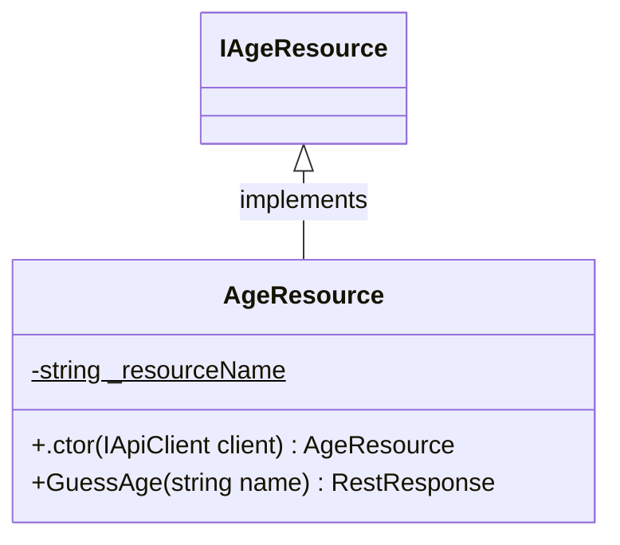

<div id="AgeResponse-class-diagram"></div>

##### `AgeResponse` class diagram

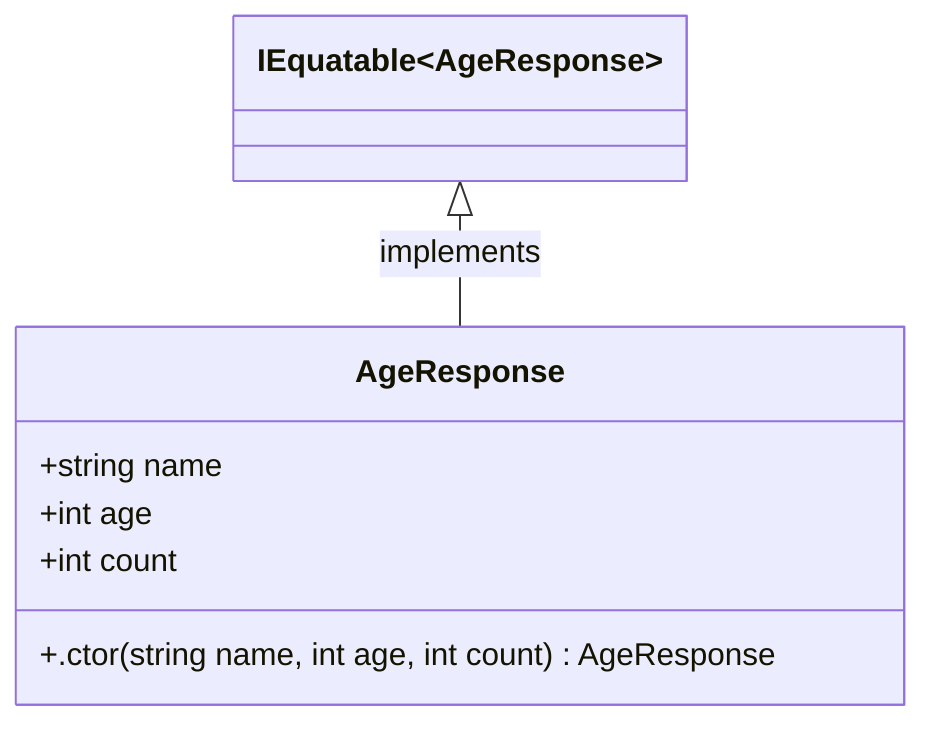

<div id="IAgeResource-class-diagram"></div>

##### `IAgeResource` class diagram

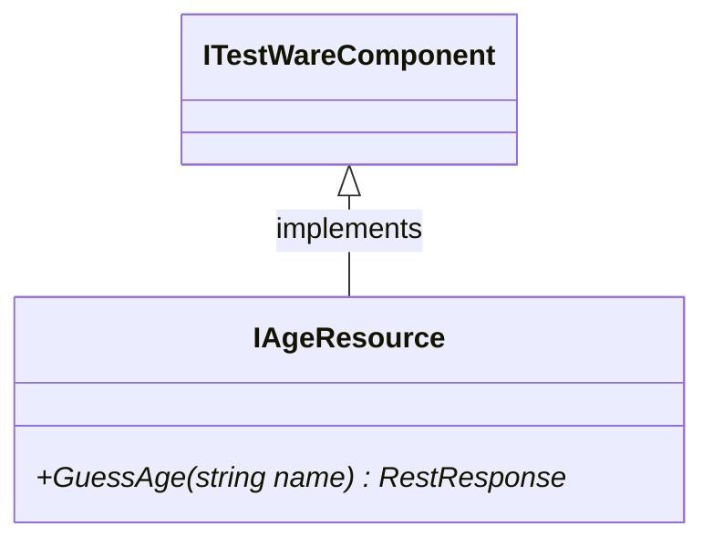

<div id="Hook-class-diagram"></div>

##### `Hook` class diagram

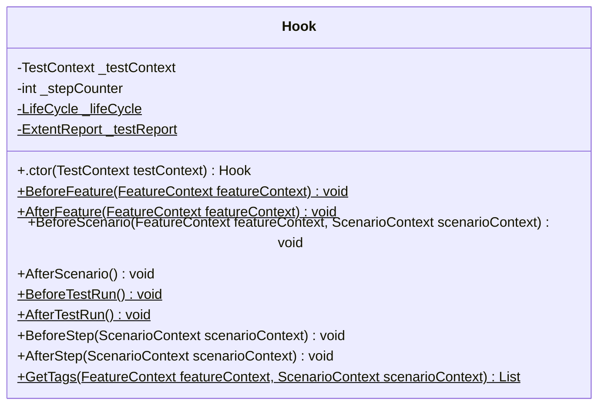

<div id="LastResponse-class-diagram"></div>

##### `LastResponse` class diagram

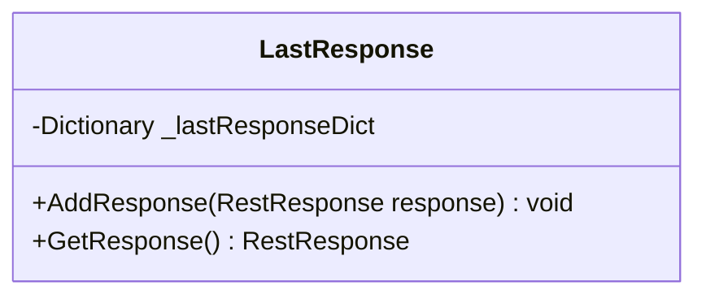

<div id="LifeCycle-class-diagram"></div>

##### `LifeCycle` class diagram

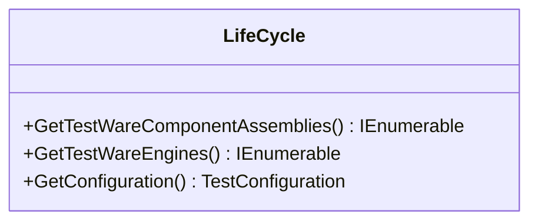

<div id="DeriveResource-class-diagram"></div>

##### `DeriveResource` class diagram

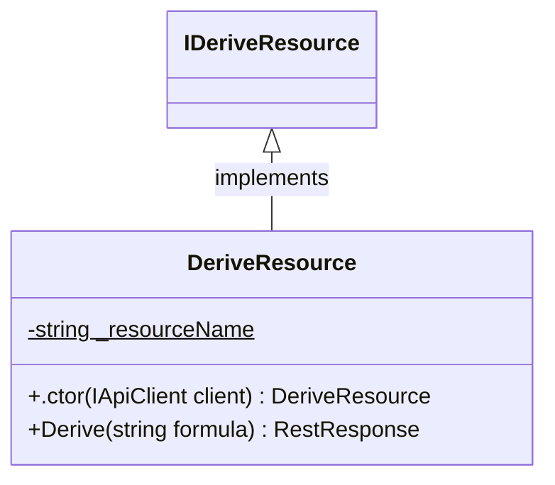

<div id="DeriveResponse-class-diagram"></div>

##### `DeriveResponse` class diagram

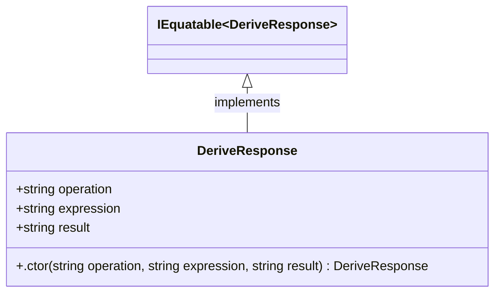

<div id="IDeriveResource-class-diagram"></div>

##### `IDeriveResource` class diagram


<div id="FactorResource-class-diagram"></div>

##### `FactorResource` class diagram

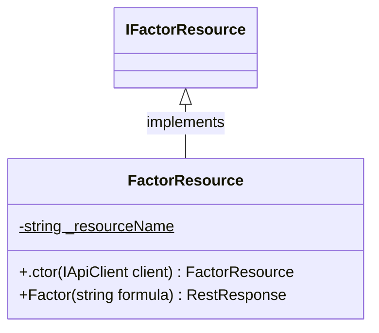

<div id="FactorResponse-class-diagram"></div>

##### `FactorResponse` class diagram

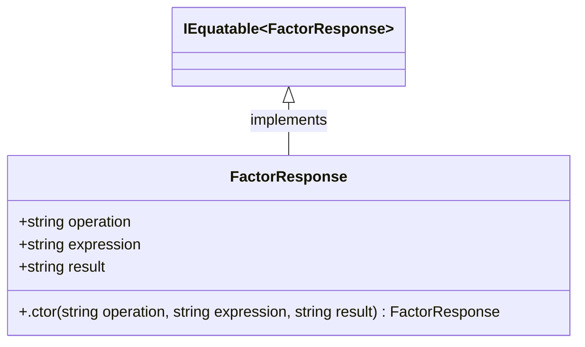

<div id="IFactorResource-class-diagram"></div>

##### `IFactorResource` class diagram


<div id="IIntegrateResource-class-diagram"></div>

##### `IIntegrateResource` class diagram

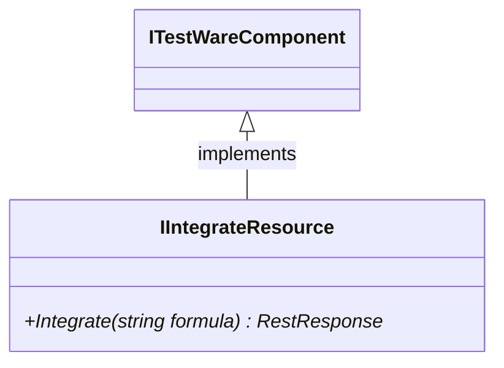

<div id="IntegrateResource-class-diagram"></div>

##### `IntegrateResource` class diagram

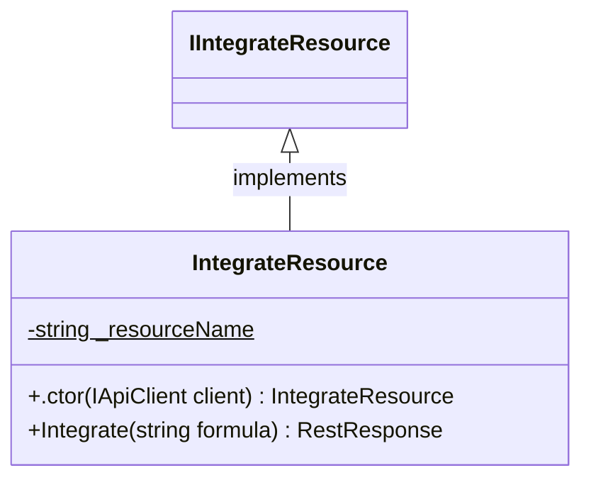

<div id="IntegrateResponse-class-diagram"></div>

##### `IntegrateResponse` class diagram

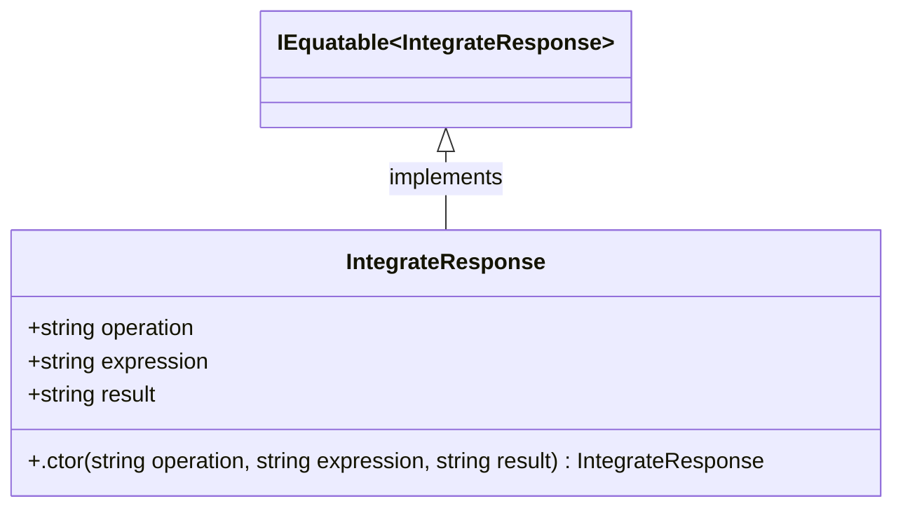

<div id="ISimplifyResource-class-diagram"></div>

##### `ISimplifyResource` class diagram

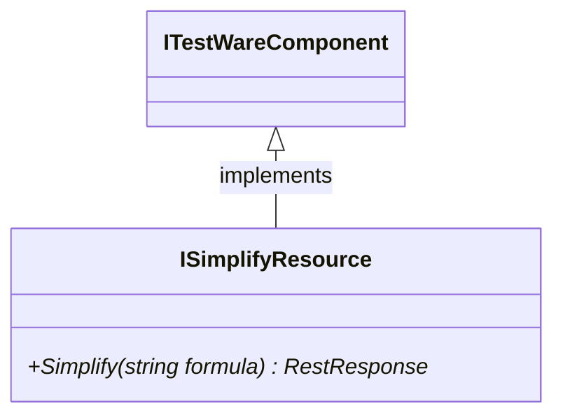

<div id="SimplifyResource-class-diagram"></div>

##### `SimplifyResource` class diagram


<div id="SimplifyResponse-class-diagram"></div>

##### `SimplifyResponse` class diagram

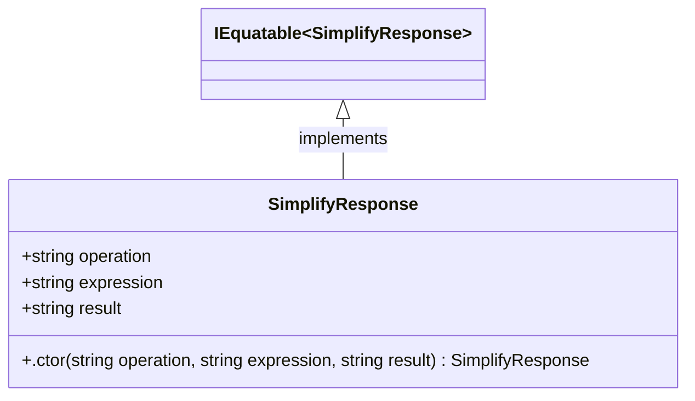

<div id="ISineResource-class-diagram"></div>

##### `ISineResource` class diagram

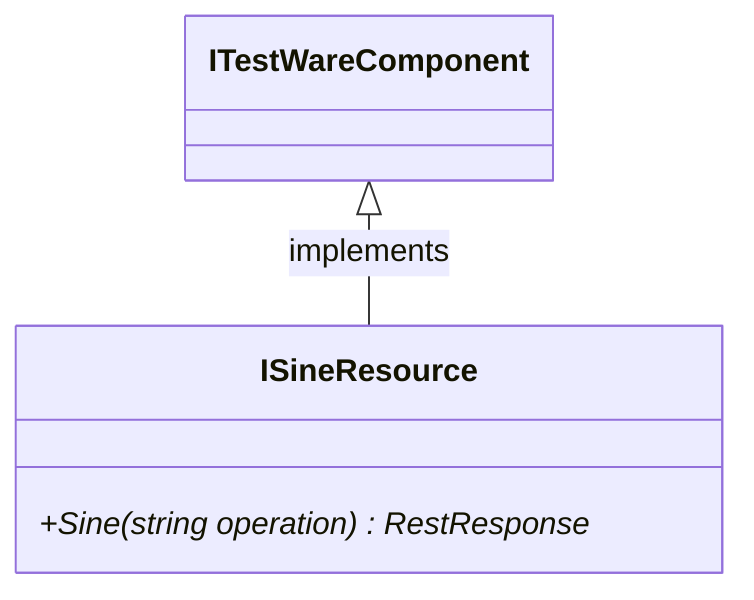

<div id="SineResource-class-diagram"></div>

##### `SineResource` class diagram

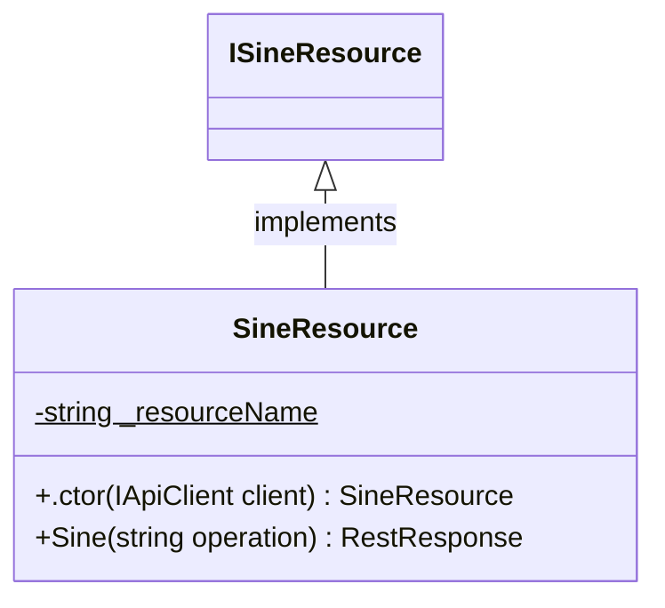

<div id="SineResponse-class-diagram"></div>

##### `SineResponse` class diagram

```mermaid
classDiagram
IEquatable~SineResponse~ <|-- SineResponse : implements
class SineResponse{
    +string operation
    +string expression
    +string result
    +string error
    +.ctor(string operation, string expression, string result, string error) SineResponse
}

```

<div id="AgeSteps-class-diagram"></div>

##### `AgeSteps` class diagram

```mermaid
classDiagram
class AgeSteps{
    -LastResponse _lastResponse
    -IAgeResource _ageResource
    +.ctor(LastResponse lastResponse) AgeSteps
    +GivenACalculatedAgeForName(string name) void
    +WhenTheFormulaIsSimplifiedOn(string formula, string api) void
    +ThenAgeAndExpresionShouldBeTheSame() void
}

```

<div id="ApiCodeSteps-class-diagram"></div>

##### `ApiCodeSteps` class diagram

```mermaid
classDiagram
class ApiCodeSteps{
    -LastResponse _lastResponse
    +.ctor(LastResponse lastResponse) ApiCodeSteps
    +ThenTheSimplifiedResponseStatusCodeIs(int code) void
    +ThenFactorResponseStatusShouldBe(int code) void
    +ThenDeriveResponseStatusShouldBe(int code) void
    +ThenIntegrateResponseStatusShouldBe(int code) void
    +ThenSineResponseStatusShouldBe(int code) void
    +ThenUnexpectedResponseStatusShouldBe(int code) void
    +ValidateReturnCode(RestResponse response, int expectedCode) void
}

```

<div id="CalculationSteps-class-diagram"></div>

##### `CalculationSteps` class diagram

```mermaid
classDiagram
class CalculationSteps{
    -ISimplifyResource _simplifyResource
    -IFactorResource _factorResource
    -IDeriveResource _deriveResource
    -IIntegrateResource _integrateResource
    -ISineResource _sineResource
    -IUnkownResource _unkownResource
    -LastResponse _lastResponse
    +.ctor(LastResponse lastResponse) CalculationSteps
    +WhenTheFormulaIsSimplified(string formula) void
    +ThenTheExpectedResultIs(string result) void
    +WhenTheFormilaIsFactorized(string formula) void
    +ThenFactorResponseResultIs(string result) void
    +WhenTheFormilaIsDerived(string formula) void
    +ThenDeriveResponseResultIs(string result) void
    +WhenTheFormilaIsIntegrated(string formula) void
    +ThenIntegrateResponseResultIs(string result) void
    +WhenTheOperationSineIsInvokedWith(string operation) void
    +ThenSineResponseResultIs(string result) void
    +ThenSineResponseErrorIs(string error) void
    +WhenUnexistendEndpointIsCalled() void
    +ThenUnexpectedResponseErrorIs(string error) void
}

```

<div id="IUnkownResource-class-diagram"></div>

##### `IUnkownResource` class diagram

```mermaid
classDiagram
ITestWareComponent <|-- IUnkownResource : implements
class IUnkownResource{
    +Operate()* RestResponse<UnkownResponse>
}

```

<div id="UnkownResource-class-diagram"></div>

##### `UnkownResource` class diagram

```mermaid
classDiagram
IUnkownResource <|-- UnkownResource : implements
class UnkownResource{
    -string _resourceName$
    +.ctor(IApiClient client) UnkownResource
    +Operate() RestResponse<UnkownResponse>
}

```

<div id="UnkownResponse-class-diagram"></div>

##### `UnkownResponse` class diagram

```mermaid
classDiagram
IEquatable~UnkownResponse~ <|-- UnkownResponse : implements
class UnkownResponse{
    +string error
    +.ctor(string error) UnkownResponse
}

```

<div id="CartPage-class-diagram"></div>

##### `CartPage` class diagram

```mermaid
classDiagram
ICartPage <|-- CartPage : implements
class CartPage{
    +IWebElement OpenCartIcon
    +IList<IWebElement> CartItemList
    +IList<IWebElement> RemoveItemButtonList
    +IWebElement DeleteItemButton
    +IWebElement ContinueShoppingButton
    +.ctor(IAppiumDriver driver) CartPage
    +OpenCart() void
    +ClickContinueShoppingButton() void
    +RemoveItemFromCartByButton(string productName) void
    +RemoveItemFromCartByDragging(string productName) void
    +CheckItemExistsAtCart(string productName) void
    +CheckItemDoesNotExistAtCart(string productName) void
    +GetCartItemIndex(string productName) int
}

```

<div id="ICartPage-class-diagram"></div>

##### `ICartPage` class diagram

```mermaid
classDiagram
ITestWareComponent <|-- ICartPage : implements
class ICartPage{
    +OpenCart()* void
    +ClickContinueShoppingButton()* void
    +RemoveItemFromCartByButton(string productName)* void
    +RemoveItemFromCartByDragging(string productName)* void
    +CheckItemExistsAtCart(string productName)* void
    +CheckItemDoesNotExistAtCart(string productName)* void
}

```

<div id="ILoginPage-class-diagram"></div>

##### `ILoginPage` class diagram

```mermaid
classDiagram
ITestWareComponent <|-- ILoginPage : implements
class ILoginPage{
    +SendUsername(string userName)* void
    +SendPassword(string password)* void
    +ClickLoginButton()* void
}

```

<div id="LoginPage-class-diagram"></div>

##### `LoginPage` class diagram

```mermaid
classDiagram
ILoginPage <|-- LoginPage : implements
class LoginPage{
    +IWebElement UsernameTextBox
    +IWebElement PasswordTextBox
    +IWebElement LoginButton
    +.ctor(IAppiumDriver driver) LoginPage
    +SendUsername(string userName) void
    +SendPassword(string password) void
    +ClickLoginButton() void
}

```

<div id="IMenuPage-class-diagram"></div>

##### `IMenuPage` class diagram

```mermaid
classDiagram
ITestWareComponent <|-- IMenuPage : implements
class IMenuPage{
    +CheckMenuIsVisible()* void
    +OpenMenu()* void
    +ClickLogoutButton()* void
}

```

<div id="MenuPage-class-diagram"></div>

##### `MenuPage` class diagram

```mermaid
classDiagram
IMenuPage <|-- MenuPage : implements
class MenuPage{
    +IWebElement OpenMenuIcon
    +IWebElement LogoutButton
    +.ctor(IAppiumDriver driver) MenuPage
    +CheckMenuIsVisible() void
    +OpenMenu() void
    +ClickLogoutButton() void
}

```

<div id="Hook-class-diagram"></div>

##### `Hook` class diagram

```mermaid
classDiagram
class Hook{
    -TestContext _testContext
    -int _stepCounter
    -LifeCycle _lifeCycle$
    -ExtentReport _testReport$
    +.ctor(TestContext testContext) Hook
    +BeforeFeature(FeatureContext featureContext)$ void
    +AfterFeature(FeatureContext featureContext)$ void
    +BeforeScenario(FeatureContext featureContext, ScenarioContext scenarioContext) void
    +AfterScenario() void
    +BeforeTestRun()$ void
    +AfterTestRun()$ void
    +BeforeStep(ScenarioContext scenarioContext) void
    +AfterStep(ScenarioContext scenarioContext) void
    +GetTags(FeatureContext featureContext, ScenarioContext scenarioContext)$ List<string>
}

```

<div id="LifeCycle-class-diagram"></div>

##### `LifeCycle` class diagram

```mermaid
classDiagram
class LifeCycle{
    +GetTestWareComponentAssemblies() IEnumerable<Assembly>
    +GetTestWareEngines() IEnumerable<IEngineManager>
    +GetConfiguration() TestConfiguration
}

```

<div id="IProductPage-class-diagram"></div>

##### `IProductPage` class diagram

```mermaid
classDiagram
ITestWareComponent <|-- IProductPage : implements
class IProductPage{
    +ClickViewToggle()* void
    +AddProductToCartByButton(string productName)* void
    +AddProductToCartByDragging(string productName)* void
}

```

<div id="ProductPage-class-diagram"></div>

##### `ProductPage` class diagram

```mermaid
classDiagram
IProductPage <|-- ProductPage : implements
class ProductPage{
    +IWebElement ViewToggle
    +IList<IWebElement> AddToCartButtonList
    +IList<IWebElement> DragToCartButtonList
    +.ctor(IAppiumDriver driver) ProductPage
    +ClickViewToggle() void
    +AddProductToCartByButton(string productName) void
    +AddProductToCartByDragging(string productName) void
    +GetProductListIndex(string productName) int
}

```

<div id="CartSteps-class-diagram"></div>

##### `CartSteps` class diagram

```mermaid
classDiagram
class CartSteps{
    -ICartPage cartPage
    +.ctor() CartSteps
    +WhenTheUserRemovesProductFromCartByDragging(string productName) void
    +ThenCartContainsProduct(string productName) void
    +ThenCartDoesNotContainProduct(string productName) void
    +UserOpensCart() void
    +WhenTheUserRemovesProductFromCartClickingAddButton(string productName) void
}

```

<div id="LoginSteps-class-diagram"></div>

##### `LoginSteps` class diagram

```mermaid
classDiagram
class LoginSteps{
    -ILoginPage loginPage
    -IMenuPage menuPage
    +.ctor() LoginSteps
    +LoginOnSwagLabs(string username, string password) void
    +UserCanLogin() void
}

```

<div id="ProductSteps-class-diagram"></div>

##### `ProductSteps` class diagram

```mermaid
classDiagram
class ProductSteps{
    -IProductPage productPage
    +.ctor() ProductSteps
    +GivenTheUserClickOnToggleView_Products() void
    +WhenTheUserAddProductToCartClickingAddButton(string productName) void
    +WhenTheUserAddProductToCartByDragging(string productName) void
}

```

<div id="ChatPage-class-diagram"></div>

##### `ChatPage` class diagram

```mermaid
classDiagram
IChatPage <|-- ChatPage : implements
class ChatPage{
    +IList<IWebElement> ChatMessages
    +IWebElement SendMessageInput
    +.ctor(IBrowserDriver driver) ChatPage
    +CheckMessage(string userId, string message) void
    +SendMessage(string message) void
}

```

<div id="IChatPage-class-diagram"></div>

##### `IChatPage` class diagram

```mermaid
classDiagram
ITestWareComponent <|-- IChatPage : implements
class IChatPage{
    +CheckMessage(string userId, string message)* void
    +SendMessage(string message)* void
}

```

<div id="CreateChatPage-class-diagram"></div>

##### `CreateChatPage` class diagram

```mermaid
classDiagram
ICreateChatPage <|-- CreateChatPage : implements
class CreateChatPage{
    +IWebElement UserIdInput
    +IWebElement LoginTermsOfUseCheckbox
    +IWebElement SubmitButton
    +.ctor(IBrowserDriver driver) CreateChatPage
    +SetUserId(string userId) void
    +AcceptTermsOfUse() void
    +ClickSubmitButton() void
    +GetChatUrl() string
}

```

<div id="ICreateChatPage-class-diagram"></div>

##### `ICreateChatPage` class diagram

```mermaid
classDiagram
ITestWareComponent <|-- ICreateChatPage : implements
class ICreateChatPage{
    +SetUserId(string userId)* void
    +AcceptTermsOfUse()* void
    +ClickSubmitButton()* void
    +GetChatUrl()* string
}

```

<div id="IInventoryPage-class-diagram"></div>

##### `IInventoryPage` class diagram

```mermaid
classDiagram
ITestWareComponent <|-- IInventoryPage : implements
class IInventoryPage{
    +CheckUserIsAtInventory()* void
}

```

<div id="InventoryPage-class-diagram"></div>

##### `InventoryPage` class diagram

```mermaid
classDiagram
IInventoryPage <|-- InventoryPage : implements
class InventoryPage{
    -string InventoryUrl$
    +.ctor(IBrowserDriver driver) InventoryPage
    +CheckUserIsAtInventory() void
}

```

<div id="ILoginPage-class-diagram"></div>

##### `ILoginPage` class diagram

```mermaid
classDiagram
ITestWareComponent <|-- ILoginPage : implements
class ILoginPage{
    +EnterUserName(string name)* void
    +EnterUserPassword(string password)* void
    +ClickLoginButton()* void
    +CheckUserIsAtLoginpage()* void
}

```

<div id="LoginPage-class-diagram"></div>

##### `LoginPage` class diagram

```mermaid
classDiagram
ILoginPage <|-- LoginPage : implements
class LoginPage{
    -string LoginUrl$
    +IWebElement UserIdTextBox
    +IWebElement UserPasswordTextBox
    +IWebElement LoginButton
    +.ctor(IBrowserDriver driver) LoginPage
    +EnterUserName(string name) void
    +ConfirmLogoutPopup() void
    +EnterUserPassword(string password) void
    +ClickLoginButton() void
    +CheckUserIsAtLoginpage() void
}

```

<div id="IMenuPage-class-diagram"></div>

##### `IMenuPage` class diagram

```mermaid
classDiagram
ITestWareComponent <|-- IMenuPage : implements
class IMenuPage{
    +ClickLogoutButton()* void
    +ClickOpenMenuButton()* void
}

```

<div id="MenuPage-class-diagram"></div>

##### `MenuPage` class diagram

```mermaid
classDiagram
IMenuPage <|-- MenuPage : implements
class MenuPage{
    +IWebElement OpenMenuButton
    +IWebElement LogoutButton
    +.ctor(IBrowserDriver driver) MenuPage
    +ClickOpenMenuButton() void
    +ClickLogoutButton() void
}

```

<div id="InventorySteps-class-diagram"></div>

##### `InventorySteps` class diagram

```mermaid
classDiagram
class InventorySteps{
    -IInventoryPage inventoryPage
    +.ctor() InventorySteps
    +ThenTheUserCanLogin() void
}

```

<div id="LoginSteps-class-diagram"></div>

##### `LoginSteps` class diagram

```mermaid
classDiagram
class LoginSteps{
    -ILoginPage loginPage
    +.ctor() LoginSteps
    +GivenTheUserEntersUsername(string userName) void
    +GivenTheUserEntersValidPassword(string password) void
    +GivenUserIsLogedWithIntoSwagLabs(string userName, string password) void
    +WhenTheUserClicksSubmit() void
    +UserIsAtLoginPage() void
}

```

<div id="MenuSteps-class-diagram"></div>

##### `MenuSteps` class diagram

```mermaid
classDiagram
class MenuSteps{
    -IMenuPage menuPage
    +.ctor() MenuSteps
    +WhenTheUserClicksLogoutButton() void
}

```

<div id="MultiplePageSteps-class-diagram"></div>

##### `MultiplePageSteps` class diagram

```mermaid
classDiagram
class MultiplePageSteps{
    -IEnumerable<ILoginPage> loginPages
    -IEnumerable<IInventoryPage> inventoryPages
    +.ctor(FeatureContext featureContext, ScenarioContext scenarioContext) MultiplePageSteps
    +GivenTheUserEntersUsernameOnAll(string userName) void
    +GivenTheUserEntersValidPasswordOnAll(string password) void
    +WhenTheUserClicksSubmitOnAll() void
    +ThenTheUserCanLoginOnAll() void
    +WhenTheUserClicksLogoutButtonOn(string browser)$ void
    +ThenTheUserIsAtLoginPageOn(string browser)$ void
}

```

<div id="HomePage-class-diagram"></div>

##### `HomePage` class diagram

```mermaid
classDiagram
IHomePage <|-- HomePage : implements
class HomePage{
    -string HomeUrl$
    +IWebElement CreateChatButton
    +.ctor(IBrowserDriver driver) HomePage
    +ClickCreateChat() void
    +NavigateTo(string url) void
}

```

<div id="IHomePage-class-diagram"></div>

##### `IHomePage` class diagram

```mermaid
classDiagram
ITestWareComponent <|-- IHomePage : implements
class IHomePage{
    +ClickCreateChat()* void
    +NavigateTo(string url)* void
}

```

<div id="ChatSteps-class-diagram"></div>

##### `ChatSteps` class diagram

```mermaid
classDiagram
class ChatSteps{
    -IEnumerable<ICreateChatPage> createChatPages
    -IEnumerable<IChatPage> chatPages
    +.ctor(FeatureContext featureContext, ScenarioContext scenarioContext) ChatSteps
    +GivenTheCreatesANewChatSessionOn(string user, string browser) void
    +WhenTheJoinsChatSessionOn(string user, string browser) void
    +ThenTheMessageFromAppearsOn(string message, string fromUser, string browser) void
    +ThenTheMessageFromAppearsOnAllBrowsers(string message, string userFrom) void
    +WhenTheUserSendsMessageOn(string message, string browser) void
}

```

<div id="Hook-class-diagram"></div>

##### `Hook` class diagram

```mermaid
classDiagram
class Hook{
    -TestContext _testContext
    -int _stepCounter
    -LifeCycle _lifeCycle$
    -ExtentReport _testReport$
    +.ctor(TestContext testContext) Hook
    +BeforeFeature(FeatureContext featureContext)$ void
    +AfterFeature(FeatureContext featureContext)$ void
    +BeforeScenario(FeatureContext featureContext, ScenarioContext scenarioContext) void
    +AfterScenario() void
    +BeforeTestRun()$ void
    +AfterTestRun()$ void
    +BeforeStep(ScenarioContext scenarioContext) void
    +AfterStep(ScenarioContext scenarioContext) void
    +GetTags(FeatureContext featureContext, ScenarioContext scenarioContext)$ List<string>
}

```

<div id="LifeCycle-class-diagram"></div>

##### `LifeCycle` class diagram

```mermaid
classDiagram
class LifeCycle{
    +GetTestWareComponentAssemblies() IEnumerable<Assembly>
    +GetTestWareEngines() IEnumerable<IEngineManager>
    +GetConfiguration() TestConfiguration
}

```

<div id="Hook-class-diagram"></div>

##### `Hook` class diagram

```mermaid
classDiagram
class Hook{
    -TestContext _testContext
    -int _stepCounter
    -LifeCycle _lifeCycle$
    -ExtentReport _testReport$
    +.ctor(TestContext testContext) Hook
    +BeforeFeature(FeatureContext featureContext)$ void
    +AfterFeature(FeatureContext featureContext)$ void
    +BeforeScenario(FeatureContext featureContext, ScenarioContext scenarioContext) void
    +AfterScenario() void
    +BeforeTestRun()$ void
    +AfterTestRun()$ void
    +BeforeStep(ScenarioContext scenarioContext) void
    +AfterStep(ScenarioContext scenarioContext) void
    +GetTags(FeatureContext featureContext, ScenarioContext scenarioContext)$ List<string>
}

```

<div id="LifeCycle-class-diagram"></div>

##### `LifeCycle` class diagram

```mermaid
classDiagram
class LifeCycle{
    +GetTestWareComponentAssemblies() IEnumerable<Assembly>
    +GetTestWareEngines() IEnumerable<IEngineManager>
    +GetConfiguration() TestConfiguration
}

```

<div id="INotepadPage-class-diagram"></div>

##### `INotepadPage` class diagram

```mermaid
classDiagram
ITestWareComponent <|-- INotepadPage : implements
class INotepadPage{
    +WriteText(string textToWrite)* void
    +CheckText(string textToVerify)* void
    +DeleteCharacters(int charsToDelete)* void
}

```

<div id="NotepadPage-class-diagram"></div>

##### `NotepadPage` class diagram

```mermaid
classDiagram
INotepadPage <|-- NotepadPage : implements
class NotepadPage{
    +IWebElement TextField
    +.ctor(IWindowsDriver driver) NotepadPage
    +CheckText(string textToVerify) void
    +DeleteCharacters(int charsToDelete) void
    +WriteText(string textToWrite) void
}

```

<div id="CalculatorPage-class-diagram"></div>

##### `CalculatorPage` class diagram

```mermaid
classDiagram
ICalculatorPage <|-- CalculatorPage : implements
class CalculatorPage{
    +IWebElement EqualsButton
    +IWebElement AdditionButton
    +IWebElement MinusButton
    +IWebElement MultiplyButton
    +IWebElement DivideButton
    +IWebElement ResultTextField
    +.ctor(IWindowsDriver driver) CalculatorPage
    +ClickEqualsButton() void
    +ClickAddButton() void
    +ClickMinusButton() void
    +ClickMultiplyButton() void
    +ClickDivideButton() void
    +ClickNumberButton(string number) void
    +CheckResultIs(string expectedResult) void
}

```

<div id="ICalculatorPage-class-diagram"></div>

##### `ICalculatorPage` class diagram

```mermaid
classDiagram
ITestWareComponent <|-- ICalculatorPage : implements
class ICalculatorPage{
    +ClickEqualsButton()* void
    +ClickAddButton()* void
    +ClickMinusButton()* void
    +ClickMultiplyButton()* void
    +ClickDivideButton()* void
    +ClickNumberButton(string number)* void
    +CheckResultIs(string expectedResult)* void
}

```

<div id="CalculatorSteps-class-diagram"></div>

##### `CalculatorSteps` class diagram

```mermaid
classDiagram
class CalculatorSteps{
    -ICalculatorPage calculatorPage
    +.ctor() CalculatorSteps
    +SelectNumber(string number) void
    +SelectOperation(string operationType) void
    +ClickEqualsButton() void
    +ThenTheResultShouldBe(string result) void
}

```

<div id="NotepadSteps-class-diagram"></div>

##### `NotepadSteps` class diagram

```mermaid
classDiagram
class NotepadSteps{
    -INotepadPage _notepadPage
    +.ctor() NotepadSteps
    +GivenUserWrites(string textToWrite) void
    +WhenUserDeletesCharacters(int charsToDelete) void
    +ThenFileTextIs(string testToVerify) void
}

```

<div id="AutomationSummary-class-diagram"></div>

##### `AutomationSummary` class diagram

```mermaid
classDiagram
class AutomationSummary{
    -ExecutableItem _testRun
    +ExecutableItem TestRun
    +.ctor(string id) AutomationSummary
    +StopExecution() void
    +StartTestSuite(string id) void
    +StopTestSuite() void
    +BuildSuitePath() string
    +StartTestCase(string id) void
    +StopTestCase() void
    +BuildTestPath() string
    +StartTestStep(string id) void
    +StopTestStep() void
    +BuildStepPath() string
    +GetCurrentStepId() string
}

```

<div id="ExecutableItem-class-diagram"></div>

##### `ExecutableItem` class diagram

```mermaid
classDiagram
class ExecutableItem{
    -string _id
    -string _defaultKey$
    -string _currentKey
    -Dictionary<string, ExecutableItem> _subItems
    +string Id
    +.ctor(string id) ExecutableItem
    +StartExecution() void
    +StopExecution() void
    +AddItem(string id) ExecutableItem
    +GetCurrentItem() ExecutableItem
}

```

<div id="Configuration-class-diagram"></div>

##### `Configuration` class diagram

```mermaid
classDiagram
class Configuration{
    +string Tag
    +IEnumerable<JsonObject> Capabilities
}

```

<div id="ConfigurationManager-class-diagram"></div>

##### `ConfigurationManager` class diagram

```mermaid
classDiagram
class ConfigurationManager{
    +ReadConfigurationFile(string filePath)$ TestConfiguration
    +GetValidConfiguration<TEnum>(IEnumerable<string> tags)$ TEnum
    +GetCapabilities<T>(TestConfiguration testConfiguration, string configName)$ IEnumerable<T>
}

```

<div id="DependencyInfo-class-diagram"></div>

##### `DependencyInfo` class diagram

```mermaid
classDiagram
class DependencyInfo{
    +object Instance
    +Type InstanceType
    +string Name
    +.ctor(string name, object instance, Type instanceType) DependencyInfo
}

```

<div id="TestConfiguration-class-diagram"></div>

##### `TestConfiguration` class diagram

```mermaid
classDiagram
class TestConfiguration{
    +IEnumerable<Configuration> Configurations
    +string TestResultPath
}

```

<div id="AutomationLifeCycleBase-class-diagram"></div>

##### `AutomationLifeCycleBase` class diagram

```mermaid
classDiagram
IAutomationLifeCycle <|-- AutomationLifeCycleBase : implements
class AutomationLifeCycleBase{
    -AutomationSummary _summary
    -TestConfiguration _configuration
    +IEnumerable<IEngineManager> Engines
    +TestConfiguration TestConfiguration
    +AutomationSummary Summary
    +GetTestWareComponentAssemblies()* IEnumerable<Assembly>
    +GetTestWareEngines()* IEnumerable<IEngineManager>
    +GetConfiguration()* TestConfiguration
    +BeginTestExecution(string id) void
    +BeginTestExecution() void
    +BeginTestSuite(string id) void
    +BeginTestCase(string id, IEnumerable<string> tags) void
    +BeginTestStep(string id) void
    +EndTestStep() void
    +EndTestCase() void
    +EndTestSuite() void
    +EndTestExecution() void
    +CreateTestResultsDirectory(string path, string name) void
    +GetCurrentTestResultsDirectory() string
    +GetStepEvidences() IEnumerable<string>
    +GetCurrentSuitetResultsDirectory() string
    +GetCurrentResultsDirectory() string
    +GetResultsDirectory(string relativePath) string
    +ResultPathValidation(string path) string
}

```

<div id="ContainerManager-class-diagram"></div>

##### `ContainerManager` class diagram

```mermaid
classDiagram
class ContainerManager{
    -ContainerBuilder _builder$
    -List<Assembly> _assemblies$
    -List<DependencyInfo> _dependencies$
    -Dictionary<string, ILifetimeScope> _scopes$
    +IContainer Container$
    +RegisterTestwareComponents(IEnumerable<Assembly> assemblies)$ void
    +GetTestWareComponent<T>()$ T
    +GetTestWareComponent<T>(string name)$ T
    +GetTestWareComponents<T>(IEnumerable<string> names)$ IEnumerable<T>
    +RegisterTestwareComponents()$ void
    +ExistsType(Type type)$ bool
    +RegisterType<T>(string name, T instance)$ void
    +BuildContainer()$ void
    +DisposeContainer()$ void
    +RegisterInstances()$ void
    +GetNameFromInstance<T>(T instance)$ string
}

```

<div id="EngineManagerBase-class-diagram"></div>

##### `EngineManagerBase` class diagram

```mermaid
classDiagram
class EngineManagerBase{
}

```

<div id="IAutomationLifeCycle-class-diagram"></div>

##### `IAutomationLifeCycle` class diagram

```mermaid
classDiagram
class IAutomationLifeCycle{
    +BeginTestExecution(string id)* void
    +EndTestExecution()* void
    +BeginTestSuite(string id)* void
    +EndTestSuite()* void
    +BeginTestCase(string id, IEnumerable<string> tags)* void
    +EndTestCase()* void
    +BeginTestStep(string id)* void
    +EndTestStep()* void
}

```

<div id="IEngineManager-class-diagram"></div>

##### `IEngineManager` class diagram

```mermaid
classDiagram
ITestWareComponent <|-- IEngineManager : implements
class IEngineManager{
    +GetEngineName()* string
    +Initialize(IEnumerable<string> tags, TestConfiguration testConfiguration)* void
    +Destroy()* void
    +CollectEvidence(string destinationPath, string evidenceName)* string
}

```

<div id="ITestWareComponent-class-diagram"></div>

##### `ITestWareComponent` class diagram

```mermaid
classDiagram
class ITestWareComponent{
}

```

<div id="RetryPolicies-class-diagram"></div>

##### `RetryPolicies` class diagram

```mermaid
classDiagram
class RetryPolicies{
    +ExecuteActionWithRetries(Action action)$ void
    +ExecuteActionWithRetries(Action action, int numberOfRetries)$ void
    +ExecuteActionWithRetries(Action action, int numberOfRetries, TimeSpan retryAttemp)$ void
    +ExecuteActionWithTimeout(Action action, int timeoutInMinutes)$ void
    +ExecuteActionWithTimeout(Action action, int timeoutInMinutes, Action actionIfException)$ void
    +ExecuteActionWithTimeout(Action action, int timeoutInMinutes, Action actionIfException, Action actionIfCatch)$ void
    +ExecuteActionDuringPeriod(Action action, int periodInMinutes)$ void
}

```

<div id="ExtentReport-class-diagram"></div>

##### `ExtentReport` class diagram

```mermaid
classDiagram
class ExtentReport{
    -ExtentHtmlReporter _htmlReporter$
    -ExtentReports _extentReport$
    -ExtentTest _extentStep$
    -ExtentTest _extentTest$
    -ExtentTest _extentFeature$
    +.ctor(string reportFolderPath) ExtentReport
    +CreateTestReportFile() void
    +CreateFeature(string name, IEnumerable<string> tags) void
    +CreateTestCase(string name, string description, IEnumerable<string> tags) void
    +CreateStep(string name, string description) void
    +AddScreenshotToStep(string screenshotPath) void
    +SetTestcaseOutcome(UnitTestOutcome testOutcome) void
}

```

<div id="Capabilities-class-diagram"></div>

##### `Capabilities` class diagram

```mermaid
classDiagram
class Capabilities{
    +string Name
    +string BaseUrl
    +int Timeout
}

```

<div id="ApiClient-class-diagram"></div>

##### `ApiClient` class diagram

```mermaid
classDiagram
IApiClient <|-- ApiClient : implements
class ApiClient{
    -Queue<RestResponse> responseQueue
    +.ctor() ApiClient
    +.ctor(HttpMessageHandler handler) ApiClient
    +.ctor(RestClientOptions options) ApiClient
    +.ctor(Uri baseUrl) ApiClient
    +.ctor(string baseUrl) ApiClient
    +.ctor(HttpClient httpClient, RestClientOptions options = null) ApiClient
    +EnqueueResponse(RestResponse response) void
    +ClearResponseQueue() void
    +GetRestResponses() IEnumerable<RestResponse>
}

```

<div id="ClientFactory-class-diagram"></div>

##### `ClientFactory` class diagram

```mermaid
classDiagram
class ClientFactory{
    +Create(Capabilities capabilities)$ IApiClient
}

```

<div id="ConfigurationTags-class-diagram"></div>

##### `ConfigurationTags` class diagram

```mermaid
classDiagram
class ConfigurationTags{
    -none$
    -api$
    -multiapi$
}

```

<div id="IApiClient-class-diagram"></div>

##### `IApiClient` class diagram

```mermaid
classDiagram
class IApiClient{
    +EnqueueResponse(RestResponse response)* void
    +ClearResponseQueue()* void
    +GetRestResponses()* IEnumerable<RestResponse>
}

```

<div id="ApiResource-class-diagram"></div>

##### `ApiResource` class diagram

```mermaid
classDiagram
class ApiResource{
    +string ResourceName
    +.ctor(IApiClient client) ApiResource
}

```

<div id="ResourceBase-class-diagram"></div>

##### `ResourceBase` class diagram

```mermaid
classDiagram
class ResourceBase{
    +IApiClient Client
    +.ctor() ResourceBase
    +ExecuteRequest<T>(RestRequest request) RestResponse<T>
}

```

<div id="RestSharpManager-class-diagram"></div>

##### `RestSharpManager` class diagram

```mermaid
classDiagram
IEngineManager <|-- RestSharpManager : implements
class RestSharpManager{
    -string _name$
    +RegisterSingle(IEnumerable<string> tags, TestConfiguration testConfiguration)$ void
    +RegisterMultiple(IEnumerable<string> tags, TestConfiguration testConfiguration)$ void
    +Initialize(IEnumerable<string> tags, TestConfiguration testConfiguration) void
    +Destroy() void
    +CollectEvidence(string destinationPath, string evidenceName) string
    +GetEngineName() string
}

```

<div id="AppiumManager-class-diagram"></div>

##### `AppiumManager` class diagram

```mermaid
classDiagram
IEngineManager <|-- AppiumManager : implements
class AppiumManager{
    -string _name$
    +Initialize(IEnumerable<string> tags, TestConfiguration testConfiguration) void
    +Destroy() void
    +CollectEvidence(string destinationPath, string evidenceName) string
    +GetEngineName() string
}

```

<div id="Capabilities-class-diagram"></div>

##### `Capabilities` class diagram

```mermaid
classDiagram
class Capabilities{
    +string Name
    +string AppiumUrl
    +string ApkUrl
    +string AppPath
    +string DeviceName
    +int CommandTimeOutInMinutes
    +string PlatformName
    +string PlatformVersion
    +IEnumerable<CapabilityOption<object>> Options
    +GetPlatform() SupportedPlatforms
}

```

<div id="CapabilityOption&lt;T&gt;-class-diagram"></div>

##### `CapabilityOption<T>` class diagram

```mermaid
classDiagram
class CapabilityOption<T>{
    +string Name
    +T Value
}

```

<div id="ByFactory-class-diagram"></div>

##### `ByFactory` class diagram

```mermaid
classDiagram
class ByFactory{
    +From(FindsByAttribute attribute)$ By
}

```

<div id="FindsByAttribute-class-diagram"></div>

##### `FindsByAttribute` class diagram

```mermaid
classDiagram
class FindsByAttribute{
    +How How
    +By Finder
}

```

<div id="How-class-diagram"></div>

##### `How` class diagram

```mermaid
classDiagram
class How{
    -Id$
    -Name$
    -TagName$
    -ClassName$
    -CssSelector$
    -LinkText$
    -PartialLinkText$
    -XPath$
    -Custom$
    -AccessibilityId$
}

```

<div id="PageFactory-class-diagram"></div>

##### `PageFactory` class diagram

```mermaid
classDiagram
class PageFactory{
}

```

<div id="AndroidDriver-class-diagram"></div>

##### `AndroidDriver` class diagram

```mermaid
classDiagram
IAppiumDriver <|-- AndroidDriver : implements
class AndroidDriver{
    +.ctor(DriverOptions driverOptions) AndroidDriver
    +.ctor(ICommandExecutor commandExecutor, DriverOptions driverOptions) AndroidDriver
    +.ctor(DriverOptions driverOptions, TimeSpan commandTimeout) AndroidDriver
    +.ctor(AppiumServiceBuilder builder, DriverOptions driverOptions) AndroidDriver
    +.ctor(Uri remoteAddress, DriverOptions driverOptions) AndroidDriver
    +.ctor(AppiumLocalService service, DriverOptions driverOptions) AndroidDriver
    +.ctor(AppiumServiceBuilder builder, DriverOptions driverOptions, TimeSpan commandTimeout) AndroidDriver
    +.ctor(Uri remoteAddress, DriverOptions driverOptions, TimeSpan commandTimeout) AndroidDriver
    +.ctor(AppiumLocalService service, DriverOptions driverOptions, TimeSpan commandTimeout) AndroidDriver
}

```

<div id="AppiumDriverFactory-class-diagram"></div>

##### `AppiumDriverFactory` class diagram

```mermaid
classDiagram
class AppiumDriverFactory{
    +Create(Capabilities capabilities)$ IAppiumDriver
    +CreateAndroidDriver(Capabilities capabilities)$ AndroidDriver
    +CreateIOSDriver(Capabilities capabilities)$ IOSDriver
}

```

<div id="ConfigurationTags-class-diagram"></div>

##### `ConfigurationTags` class diagram

```mermaid
classDiagram
class ConfigurationTags{
    -none$
    -appiumdriver$
}

```

<div id="IAppiumDriver-class-diagram"></div>

##### `IAppiumDriver` class diagram

```mermaid
classDiagram
IWebDriver <|-- IAppiumDriver : implements
class IAppiumDriver{
}

```

<div id="IOSDriver-class-diagram"></div>

##### `IOSDriver` class diagram

```mermaid
classDiagram
IAppiumDriver <|-- IOSDriver : implements
class IOSDriver{
    +.ctor(DriverOptions driverOptions) IOSDriver
    +.ctor(ICommandExecutor commandExecutor, DriverOptions driverOptions) IOSDriver
    +.ctor(DriverOptions driverOptions, TimeSpan commandTimeout) IOSDriver
    +.ctor(AppiumServiceBuilder builder, DriverOptions driverOptions) IOSDriver
    +.ctor(Uri remoteAddress, DriverOptions driverOptions) IOSDriver
    +.ctor(AppiumLocalService service, DriverOptions driverOptions) IOSDriver
    +.ctor(AppiumServiceBuilder builder, DriverOptions driverOptions, TimeSpan commandTimeout) IOSDriver
    +.ctor(Uri remoteAddress, DriverOptions driverOptions, TimeSpan commandTimeout) IOSDriver
    +.ctor(AppiumLocalService service, DriverOptions driverOptions, TimeSpan commandTimeout) IOSDriver
}

```

<div id="SupportedPlatforms-class-diagram"></div>

##### `SupportedPlatforms` class diagram

```mermaid
classDiagram
class SupportedPlatforms{
    -Invalid$
    -Android$
    -IOS$
}

```

<div id="MobilePage-class-diagram"></div>

##### `MobilePage` class diagram

```mermaid
classDiagram
class MobilePage{
    +.ctor(IAppiumDriver driver) MobilePage
    +SwipeElementToLeft(IWebElement element) void
    +SwipeElementToRight(IWebElement element) void
    +DragFromElementAToElementB(IWebElement elementA, IWebElement elementB) void
    +SwipeFromLocationAToLocationB(Point pointA, Point pointB) void
    +DragFromLocationAToLocationB(Point pointA, Point pointB) void
}

```

<div id="Capabilities-class-diagram"></div>

##### `Capabilities` class diagram

```mermaid
classDiagram
class Capabilities{
    +string Name
    +string Path
    +string Driver
    +int CommandTimeOutInMinutes
    +IEnumerable<string> Arguments
    +GetDriver() SupportedBrowsers
}

```

<div id="AbstractFindsByAttribute-class-diagram"></div>

##### `AbstractFindsByAttribute` class diagram

```mermaid
classDiagram
IComparable <|-- AbstractFindsByAttribute : implements
class AbstractFindsByAttribute{
    +By Finder*
    +int Priority
    +operator ==(AbstractFindsByAttribute one, AbstractFindsByAttribute two)$ bool
    +operator !=(AbstractFindsByAttribute one, AbstractFindsByAttribute two)$ bool
    +operator >(AbstractFindsByAttribute one, AbstractFindsByAttribute two)$ bool
    +operator >=(AbstractFindsByAttribute one, AbstractFindsByAttribute two)$ bool
    +operator <=(AbstractFindsByAttribute one, AbstractFindsByAttribute two)$ bool
    +operator <(AbstractFindsByAttribute one, AbstractFindsByAttribute two)$ bool
    +CompareTo(object obj) int
    +Equals(object obj) bool
    +GetHashCode() int
}

```

<div id="ByAll-class-diagram"></div>

##### `ByAll` class diagram

```mermaid
classDiagram
class ByAll{
    -By[] bys
    +.ctor(params By[] bys) ByAll
    +FindElement(ISearchContext context) IWebElement
    +FindElements(ISearchContext context) ReadOnlyCollection<IWebElement>
    +ToString() string
}

```

<div id="ByChained-class-diagram"></div>

##### `ByChained` class diagram

```mermaid
classDiagram
class ByChained{
    -By[] bys
    +.ctor(params By[] bys) ByChained
    +FindElement(ISearchContext context) IWebElement
    +FindElements(ISearchContext context) ReadOnlyCollection<IWebElement>
    +ToString() string
}

```

<div id="ByFactory-class-diagram"></div>

##### `ByFactory` class diagram

```mermaid
classDiagram
class ByFactory{
    +From(FindsByAttribute attribute)$ By
}

```

<div id="ByIdOrName-class-diagram"></div>

##### `ByIdOrName` class diagram

```mermaid
classDiagram
class ByIdOrName{
    -string elementIdentifier
    -By idFinder
    -By nameFinder
    +.ctor(string elementIdentifier) ByIdOrName
    +FindElement(ISearchContext context) IWebElement
    +FindElements(ISearchContext context) ReadOnlyCollection<IWebElement>
    +ToString() string
}

```

<div id="CacheLookupAttribute-class-diagram"></div>

##### `CacheLookupAttribute` class diagram

```mermaid
classDiagram
class CacheLookupAttribute{
}

```

<div id="DefaultElementLocator-class-diagram"></div>

##### `DefaultElementLocator` class diagram

```mermaid
classDiagram
IElementLocator <|-- DefaultElementLocator : implements
class DefaultElementLocator{
    +ISearchContext SearchContext
    +.ctor(ISearchContext searchContext) DefaultElementLocator
    +LocateElement(IEnumerable<By> bys) IWebElement
    +LocateElements(IEnumerable<By> bys) ReadOnlyCollection<IWebElement>
}

```

<div id="DefaultPageObjectMemberDecorator-class-diagram"></div>

##### `DefaultPageObjectMemberDecorator` class diagram

```mermaid
classDiagram
IPageObjectMemberDecorator <|-- DefaultPageObjectMemberDecorator : implements
class DefaultPageObjectMemberDecorator{
    -List<IMemberBuilder> _memberBuilders$
    +Decorate(MemberInfo member, IElementLocator locator) object?
    +CreateObject(Type memberType, IElementLocator locator, IEnumerable<By> bys, bool cache) object
    +ShouldCacheLookup(MemberInfo member)$ bool
    +CreateLocatorList(MemberInfo member)$ ReadOnlyCollection<By>
}

```

<div id="ExpectedConditions-class-diagram"></div>

##### `ExpectedConditions` class diagram

```mermaid
classDiagram
class ExpectedConditions{
    +.ctor() ExpectedConditions
    +TitleIs(string title)$ Func<IWebDriver, bool>
    +TitleContains(string title)$ Func<IWebDriver, bool>
    +UrlToBe(string url)$ Func<IWebDriver, bool>
    +UrlContains(string fraction)$ Func<IWebDriver, bool>
    +UrlMatches(string regex)$ Func<IWebDriver, bool>
    +ElementExists(By locator)$ Func<IWebDriver, IWebElement>
    +ElementIsVisible(By locator)$ Func<IWebDriver, IWebElement>
    +VisibilityOfAllElementsLocatedBy(By locator)$ Func<IWebDriver, ReadOnlyCollection<IWebElement>>
    +VisibilityOfAllElementsLocatedBy(ReadOnlyCollection<IWebElement> elements)$ Func<IWebDriver, ReadOnlyCollection<IWebElement>>
    +PresenceOfAllElementsLocatedBy(By locator)$ Func<IWebDriver, ReadOnlyCollection<IWebElement>>
    +TextToBePresentInElement(IWebElement element, string text)$ Func<IWebDriver, bool>
    +TextToBePresentInElementLocated(By locator, string text)$ Func<IWebDriver, bool>
    +TextToBePresentInElementValue(IWebElement element, string text)$ Func<IWebDriver, bool>
    +TextToBePresentInElementValue(By locator, string text)$ Func<IWebDriver, bool>
    +FrameToBeAvailableAndSwitchToIt(string frameLocator)$ Func<IWebDriver, IWebDriver>
    +FrameToBeAvailableAndSwitchToIt(By locator)$ Func<IWebDriver, IWebDriver>
    +InvisibilityOfElementLocated(By locator)$ Func<IWebDriver, bool>
    +InvisibilityOfElementWithText(By locator, string text)$ Func<IWebDriver, bool>
    +ElementToBeClickable(By locator)$ Func<IWebDriver, IWebElement>
    +ElementToBeClickable(IWebElement element)$ Func<IWebDriver, IWebElement>
    +StalenessOf(IWebElement element)$ Func<IWebDriver, bool>
    +ElementToBeSelected(IWebElement element)$ Func<IWebDriver, bool>
    +ElementToBeSelected(IWebElement element, bool selected)$ Func<IWebDriver, bool>
    +ElementToBeSelected(By locator)$ Func<IWebDriver, bool>
    +ElementSelectionStateToBe(IWebElement element, bool selected)$ Func<IWebDriver, bool>
    +ElementSelectionStateToBe(By locator, bool selected)$ Func<IWebDriver, bool>
    +AlertIsPresent()$ Func<IWebDriver, IAlert>
    +AlertState(bool state)$ Func<IWebDriver, bool>
    +ElementIfVisible(IWebElement element)$ IWebElement
}

```

<div id="FindsByAllAttribute-class-diagram"></div>

##### `FindsByAllAttribute` class diagram

```mermaid
classDiagram
class FindsByAllAttribute{
}

```

<div id="FindsByAttribute-class-diagram"></div>

##### `FindsByAttribute` class diagram

```mermaid
classDiagram
class FindsByAttribute{
    -By? finder
    +How How
    +string? Using
    +Type? CustomFinderType
    +By Finder
    +.ctor() FindsByAttribute
    +.ctor(How how, string @using) FindsByAttribute
}

```

<div id="FindsBySequenceAttribute-class-diagram"></div>

##### `FindsBySequenceAttribute` class diagram

```mermaid
classDiagram
class FindsBySequenceAttribute{
}

```

<div id="How-class-diagram"></div>

##### `How` class diagram

```mermaid
classDiagram
class How{
    -Id$
    -Name$
    -TagName$
    -ClassName$
    -CssSelector$
    -LinkText$
    -PartialLinkText$
    -XPath$
    -Custom$
}

```

<div id="IElementLocator-class-diagram"></div>

##### `IElementLocator` class diagram

```mermaid
classDiagram
class IElementLocator{
    +ISearchContext SearchContext*
    +LocateElement(IEnumerable<By> bys)* IWebElement
    +LocateElements(IEnumerable<By> bys)* ReadOnlyCollection<IWebElement>
}

```

<div id="IPageObjectMemberDecorator-class-diagram"></div>

##### `IPageObjectMemberDecorator` class diagram

```mermaid
classDiagram
class IPageObjectMemberDecorator{
    +Decorate(MemberInfo member, IElementLocator locator)* object?
}

```

<div id="PageFactory-class-diagram"></div>

##### `PageFactory` class diagram

```mermaid
classDiagram
class PageFactory{
    +.ctor() PageFactory
    +InitElements<T>(IWebDriver driver)$ T
    +InitElements<T>(IElementLocator locator)$ T
    +InitElements(ISearchContext driver, object page)$ void
    +InitElements(ISearchContext driver, object page, IPageObjectMemberDecorator decorator)$ void
    +InitElements(object page, IElementLocator locator)$ void
    +InitElements(object page, IElementLocator locator, IPageObjectMemberDecorator decorator)$ void
}

```

<div id="RetryingElementLocator-class-diagram"></div>

##### `RetryingElementLocator` class diagram

```mermaid
classDiagram
IElementLocator <|-- RetryingElementLocator : implements
class RetryingElementLocator{
    -TimeSpan DefaultTimeout$
    -TimeSpan DefaultPollingInterval$
    -TimeSpan timeout
    -TimeSpan pollingInterval
    +ISearchContext SearchContext
    +.ctor(ISearchContext searchContext) RetryingElementLocator
    +.ctor(ISearchContext searchContext, TimeSpan timeout) RetryingElementLocator
    +.ctor(ISearchContext searchContext, TimeSpan timeout, TimeSpan pollingInterval) RetryingElementLocator
    +LocateElement(IEnumerable<By> bys) IWebElement
    +LocateElements(IEnumerable<By> bys) ReadOnlyCollection<IWebElement>
}

```

<div id="WebDriverObjectProxy-class-diagram"></div>

##### `WebDriverObjectProxy` class diagram

```mermaid
classDiagram
class WebDriverObjectProxy{
    +IElementLocator Locator
    +IEnumerable<By> Bys
    +bool Cache
    +.ctor(IElementLocator locator, IEnumerable<By> bys, bool cache) WebDriverObjectProxy
}

```

<div id="WebElementEnumerable-class-diagram"></div>

##### `WebElementEnumerable` class diagram

```mermaid
classDiagram
class WebElementEnumerable{
    +Select<TElement, TResult>(IList<TElement> webElements, Func<TElement, TResult> selector)$ IEnumerable<TResult>
    +Where<TElement>(IList<TElement> webElements, Func<TElement, bool> selector)$ IEnumerable<TElement>
    +ToList<TElement>(IList<TElement> webElements)$ List<TElement>
    +ToArray<TElement>(IList<TElement> webElements)$ TElement[]
    +ToEnumerable<T>(IList<T> enumerable)$ IEnumerable<T>
}

```

<div id="WebElementListProxy-class-diagram"></div>

##### `WebElementListProxy` class diagram

```mermaid
classDiagram
IList~IWebElement~ <|-- WebElementListProxy : implements
class WebElementListProxy{
    -IList<IWebElement>? _items
    +IList<IWebElement> Items
    +IWebElement this[int index]
    +int Count
    +bool IsReadOnly
    +.ctor(IElementLocator locator, IEnumerable<By> bys, bool cache) WebElementListProxy
    +Add(IWebElement item) void
    +Clear() void
    +Contains(IWebElement item) bool
    +CopyTo(IWebElement[] array, int arrayIndex) void
    +GetEnumerator() IEnumerator<IWebElement>
    +IndexOf(IWebElement item) int
    +Insert(int index, IWebElement item) void
    +Remove(IWebElement item) bool
    +RemoveAt(int index) void
    +GetEnumerator() IEnumerator
}

```

<div id="WebElementProxy-class-diagram"></div>

##### `WebElementProxy` class diagram

```mermaid
classDiagram
IWrapsElement <|-- WebElementProxy : implements
IWebElement <|-- WebElementProxy : implements
ILocatable <|-- WebElementProxy : implements
IFindsElement <|-- WebElementProxy : implements
class WebElementProxy{
    -IWebElement? cachedElement
    +IWebElement WrappedElement
    +string TagName
    +string Text
    +bool Enabled
    +bool Selected
    +Point Location
    +Size Size
    +bool Displayed
    +Point LocationOnScreenOnceScrolledIntoView
    +ICoordinates Coordinates
    +.ctor(IElementLocator locator, IEnumerable<By> bys, bool cache) WebElementProxy
    +Clear() void
    +Click() void
    +FindElement(By by) IWebElement
    +FindElements(By by) ReadOnlyCollection<IWebElement>
    +GetAttribute(string attributeName) string
    +GetCssValue(string propertyName) string
    +GetProperty(string propertyName) string
    +SendKeys(string text) void
    +Submit() void
    +GetHashCode() int
    +Equals(object? obj) bool
    +FindElement(string mechanism, string value) IWebElement
    +FindElements(string mechanism, string value) ReadOnlyCollection<IWebElement>
    +GetDomAttribute(string attributeName) string
    +GetDomProperty(string propertyName) string
    +GetShadowRoot() ISearchContext
}

```

<div id="WrapsElementFactory-class-diagram"></div>

##### `WrapsElementFactory` class diagram

```mermaid
classDiagram
class WrapsElementFactory{
    +Wrap<T>(IWebElement webElement)$ T
    +Wrap(Type wrapsElementType, IWebElement webElement)$ object
}

```

<div id="WrapsElementListProxy&lt;T&gt;-class-diagram"></div>

##### `WrapsElementListProxy<T>` class diagram

```mermaid
classDiagram
IList~T~ <|-- WrapsElementListProxy<T> : implements
class WrapsElementListProxy<T>{
    -IList<T>? _items
    +IList<T> Items
    +T this[int index]
    +int Count
    +bool IsReadOnly
    +ElementListProxy(IElementLocator locator, IEnumerable<By> bys, bool cache) void
    +Add(T item) void
    +Clear() void
    +Contains(T item) bool
    +CopyTo(T[] array, int arrayIndex) void
    +GetEnumerator() IEnumerator<T>
    +IndexOf(T item) int
    +Insert(int index, T item) void
    +Remove(T item) bool
    +RemoveAt(int index) void
    +GetEnumerator() IEnumerator
}

```

<div id="BrowserFactory-class-diagram"></div>

##### `BrowserFactory` class diagram

```mermaid
classDiagram
class BrowserFactory{
    +Create(Capabilities capabilities)$ IBrowserDriver
    +CreateChromeDriver(Capabilities capabilities)$ IBrowserDriver
    +CreateFirefoxDriver(Capabilities capabilities)$ IBrowserDriver
    +CreateInternetExplorerDriver(Capabilities capabilities)$ IBrowserDriver
    +CreateEdgeDriver(Capabilities capabilities)$ IBrowserDriver
}

```

<div id="ChromeDriver-class-diagram"></div>

##### `ChromeDriver` class diagram

```mermaid
classDiagram
IBrowserDriver <|-- ChromeDriver : implements
class ChromeDriver{
    +.ctor(ChromeOptions options) ChromeDriver
    +.ctor(ChromeDriverService service) ChromeDriver
    +.ctor(string chromeDriverDirectory) ChromeDriver
    +.ctor(string chromeDriverDirectory, ChromeOptions options) ChromeDriver
    +.ctor(ChromeDriverService service, ChromeOptions options) ChromeDriver
    +.ctor(string chromeDriverDirectory, ChromeOptions options, TimeSpan commandTimeout) ChromeDriver
    +.ctor(ChromeDriverService service, ChromeOptions options, TimeSpan commandTimeout) ChromeDriver
}

```

<div id="ConfigurationTags-class-diagram"></div>

##### `ConfigurationTags` class diagram

```mermaid
classDiagram
class ConfigurationTags{
    -none$
    -webdriver$
    -multiwebdriver$
}

```

<div id="EdgeDriver-class-diagram"></div>

##### `EdgeDriver` class diagram

```mermaid
classDiagram
IBrowserDriver <|-- EdgeDriver : implements
class EdgeDriver{
    +.ctor(EdgeOptions options) EdgeDriver
    +.ctor(EdgeDriverService service) EdgeDriver
    +.ctor(string edgeDriverDirectory) EdgeDriver
    +.ctor(string edgeDriverDirectory, EdgeOptions options) EdgeDriver
    +.ctor(EdgeDriverService service, EdgeOptions options) EdgeDriver
    +.ctor(string edgeDriverDirectory, EdgeOptions options, TimeSpan commandTimeout) EdgeDriver
    +.ctor(EdgeDriverService service, EdgeOptions options, TimeSpan commandTimeout) EdgeDriver
}

```

<div id="FirefoxDriver-class-diagram"></div>

##### `FirefoxDriver` class diagram

```mermaid
classDiagram
IBrowserDriver <|-- FirefoxDriver : implements
class FirefoxDriver{
    +.ctor(FirefoxOptions options) FirefoxDriver
    +.ctor(FirefoxDriverService service) FirefoxDriver
    +.ctor(string geckoDriverDirectory) FirefoxDriver
    +.ctor(string geckoDriverDirectory, FirefoxOptions options) FirefoxDriver
    +.ctor(FirefoxDriverService service, FirefoxOptions options) FirefoxDriver
    +.ctor(string geckoDriverDirectory, FirefoxOptions options, TimeSpan commandTimeout) FirefoxDriver
    +.ctor(FirefoxDriverService service, FirefoxOptions options, TimeSpan commandTimeout) FirefoxDriver
}

```

<div id="IBrowserDriver-class-diagram"></div>

##### `IBrowserDriver` class diagram

```mermaid
classDiagram
IWebDriver <|-- IBrowserDriver : implements
class IBrowserDriver{
}

```

<div id="InternetExplorerDriver-class-diagram"></div>

##### `InternetExplorerDriver` class diagram

```mermaid
classDiagram
IBrowserDriver <|-- InternetExplorerDriver : implements
class InternetExplorerDriver{
    +.ctor(InternetExplorerOptions options) InternetExplorerDriver
    +.ctor(InternetExplorerDriverService service) InternetExplorerDriver
    +.ctor(string internetExplorerDriverServerDirectory) InternetExplorerDriver
    +.ctor(string internetExplorerDriverServerDirectory, InternetExplorerOptions options) InternetExplorerDriver
    +.ctor(InternetExplorerDriverService service, InternetExplorerOptions options) InternetExplorerDriver
    +.ctor(string internetExplorerDriverServerDirectory, InternetExplorerOptions options, TimeSpan commandTimeout) InternetExplorerDriver
    +.ctor(InternetExplorerDriverService service, InternetExplorerOptions options, TimeSpan commandTimeout) InternetExplorerDriver
}

```

<div id="SupportedBrowsers-class-diagram"></div>

##### `SupportedBrowsers` class diagram

```mermaid
classDiagram
class SupportedBrowsers{
    -Invalid$
    -Chrome$
    -Firefox$
    -InternetExplorer$
    -Edge$
}

```

<div id="IMemberBuilder-class-diagram"></div>

##### `IMemberBuilder` class diagram

```mermaid
classDiagram
class IMemberBuilder{
    +CreateObject(Type memberType, IElementLocator locator, IEnumerable<By> bys, bool cache, out object createdObject)* bool
}

```

<div id="WebElementBuilder-class-diagram"></div>

##### `WebElementBuilder` class diagram

```mermaid
classDiagram
IMemberBuilder <|-- WebElementBuilder : implements
class WebElementBuilder{
    +CreateObject(Type memberType, IElementLocator locator, IEnumerable<By> bys, bool cache, out object createdObject) bool
}

```

<div id="WebElementListBuilder-class-diagram"></div>

##### `WebElementListBuilder` class diagram

```mermaid
classDiagram
IMemberBuilder <|-- WebElementListBuilder : implements
class WebElementListBuilder{
    +CreateObject(Type memberType, IElementLocator locator, IEnumerable<By> bys, bool cache, out object createdObject) bool
}

```

<div id="WrappedElementBuilder-class-diagram"></div>

##### `WrappedElementBuilder` class diagram

```mermaid
classDiagram
IMemberBuilder <|-- WrappedElementBuilder : implements
class WrappedElementBuilder{
    +CreateObject(Type memberType, IElementLocator locator, IEnumerable<By> bys, bool cache, out object createdObject) bool
}

```

<div id="WrappedElementListBuilder-class-diagram"></div>

##### `WrappedElementListBuilder` class diagram

```mermaid
classDiagram
IMemberBuilder <|-- WrappedElementListBuilder : implements
class WrappedElementListBuilder{
    +CreateObject(Type memberType, IElementLocator locator, IEnumerable<By> bys, bool cache, out object createdObject) bool
}

```

<div id="PageBase-class-diagram"></div>

##### `PageBase` class diagram

```mermaid
classDiagram
class PageBase{
    -int TimeToWait$
    -int NumberOfRetries$
    -TimeSpan RetryAttemp
    +IWebDriver Driver
    +ClickElement(IWebElement element) void
    +ClickInnerElement(IWebElement element) void
    +DoubleClickElement(IWebElement element) void
    +SendKeysElement(IWebElement element, string text) void
    +SendKeysElement(IWebElement element, string text, int timeToWait) void
    +ClearElementText(IWebElement element) void
    +ClearElementText(IWebElement element, int timeToWait) void
    +WaitUntilElementIsClickable(IWebElement element) void
    +WaitUntilElementIsClickable(IWebElement element, int timeToWait) void
    +WaitUntilElementIsVisible(By locator) void
    +WaitUntilElementIsVisible(By locator, int timeToWait) void
    +WaitUntilElementNotVisible(By locator, int secondsToWait) void
    +ExecuteActionWithDelay(Action action, int secondsToDelayAction)$ void
}

```

<div id="WebPage-class-diagram"></div>

##### `WebPage` class diagram

```mermaid
classDiagram
class WebPage{
    +string Url
    +.ctor(IBrowserDriver driver) WebPage
    +NavigateToUrl() void
    +AcceptDialog() string
    +AcceptDialog(int timeToWait) string
}

```

<div id="SeleniumManager-class-diagram"></div>

##### `SeleniumManager` class diagram

```mermaid
classDiagram
IEngineManager <|-- SeleniumManager : implements
class SeleniumManager{
    -string _name$
    +RegisterSingle(IEnumerable<string> tags, TestConfiguration testConfiguration)$ void
    +RegisterMultiple(IEnumerable<string> tags, TestConfiguration testConfiguration)$ void
    +Initialize(IEnumerable<string> tags, TestConfiguration testConfiguration) void
    +Destroy() void
    +CollectEvidence(string destinationPath, string evidenceName) string
    +GetEngineName() string
}

```

<div id="Capabilities-class-diagram"></div>

##### `Capabilities` class diagram

```mermaid
classDiagram
class Capabilities{
    +string Name
    +string ApplicationPath
    +string ApplicationId
    +string ApplicationName
    +string ApplicationClassName
    +string WinAppDriverUrl
    +int CommandTimeOutInMinutes
}

```

<div id="ConfigurationTags-class-diagram"></div>

##### `ConfigurationTags` class diagram

```mermaid
classDiagram
class ConfigurationTags{
    -none$
    -winappdriver$
}

```

<div id="IWindowsDriver-class-diagram"></div>

##### `IWindowsDriver` class diagram

```mermaid
classDiagram
IWebDriver <|-- IWindowsDriver : implements
class IWindowsDriver{
}

```

<div id="WindowsDriver-class-diagram"></div>

##### `WindowsDriver` class diagram

```mermaid
classDiagram
IWindowsDriver <|-- WindowsDriver : implements
class WindowsDriver{
    +.ctor(AppiumOptions AppiumOptions) WindowsDriver
    +.ctor(AppiumOptions AppiumOptions, TimeSpan commandTimeout) WindowsDriver
    +.ctor(AppiumServiceBuilder builder, AppiumOptions AppiumOptions) WindowsDriver
    +.ctor(Uri remoteAddress, AppiumOptions AppiumOptions) WindowsDriver
    +.ctor(AppiumLocalService service, AppiumOptions AppiumOptions) WindowsDriver
    +.ctor(AppiumServiceBuilder builder, AppiumOptions AppiumOptions, TimeSpan commandTimeout) WindowsDriver
    +.ctor(Uri remoteAddress, AppiumOptions AppiumOptions, TimeSpan commandTimeout) WindowsDriver
    +.ctor(AppiumLocalService service, AppiumOptions AppiumOptions, TimeSpan commandTimeout) WindowsDriver
}

```

<div id="WindowsDriverFactory-class-diagram"></div>

##### `WindowsDriverFactory` class diagram

```mermaid
classDiagram
class WindowsDriverFactory{
    -int _waitForApplicationToOpen$
    -int _retriesWaitForApplication$
    -IWindowsDriver _rootDriver$
    +CreateRootWinAppDriverSession(Capabilities capabilities)$ IWindowsDriver
    +LaunchApplication(Capabilities capabilities)$ void
    +AttachToApplication(Capabilities capabilities)$ IWindowsDriver
}

```

<div id="WinAppDriverPage-class-diagram"></div>

##### `WinAppDriverPage` class diagram

```mermaid
classDiagram
class WinAppDriverPage{
    +.ctor(IWindowsDriver driver) WinAppDriverPage
}

```

<div id="WinAppDriverManager-class-diagram"></div>

##### `WinAppDriverManager` class diagram

```mermaid
classDiagram
IEngineManager <|-- WinAppDriverManager : implements
class WinAppDriverManager{
    -string _name$
    +Initialize(IEnumerable<string> tags, TestConfiguration testConfiguration) void
    +CollectEvidence(string destinationPath, string evidenceName) string
    +Destroy() void
    +GetEngineName() string
}

```

*This file is maintained by a bot.*

<!-- markdownlint-restore -->
